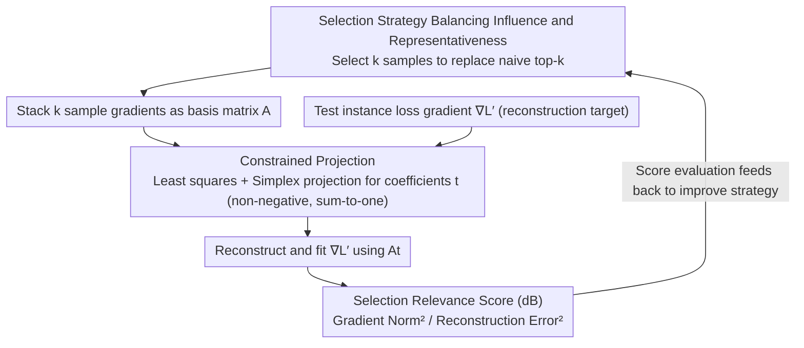

# Compact Example-Based Explanations for Language Models

**Conference**: ACL 2026 Findings  
**arXiv**: [2601.03786](https://arxiv.org/abs/2601.03786)  
**Code**: None  
**Area**: LLM Pre-training  
**Keywords**: Training Data Influence, Example-based Explanation, Selection Relevance, Gradient Reconstruction, Redundancy Elimination

## TL;DR

This paper proposes Selection Relevance Score, a re-training-free metric to evaluate the quality of training sample subsets as example-based explanations. It demonstrates that the common "select highest influence" strategy is often inferior to random selection and further introduces a new strategy that balances influence and representativeness.

## Background & Motivation

**Background**: Training data influence estimation methods (e.g., influence functions) can quantify the contribution of each training document to model output, serving as a promising information source for example-based explanations. However, humans cannot process thousands of documents; in practice, only a few training samples can be selected as explanations.

**Limitations of Prior Work**: (1) The default strategy of selecting the top-$k$ highest-influence samples often picks global outliers (such as mislabeled data) that are not necessarily the most relevant to the current test instance; (2) Samples with the highest influence are highly redundant, leading to diminishing returns from strict selection; (3) Existing evaluations either operate in the embedding space (whereas ranking occurs in the gradient space), rely on class labels (inapplicable to generative tasks), or require re-training (infeasible for LLMs).

**Key Challenge**: Influence estimation methods generate independent influence scores for each training sample, but using them as explanations requires considering complementarity and redundancy—a good set of explanatory samples should collectively cover key aspects of the model's decision.

**Goal**: (1) Propose a re-training-free metric to evaluate selection quality; (2) Reveal the deficiencies of common selection strategies; (3) Design better selection strategies.

**Key Insight**: Treat example-based explanation as a gradient reconstruction task—good explanatory samples should be able to reconstruct the gradient of the test instance through a linear combination of their own gradients.

**Core Idea**: Selection Relevance = The ability of the gradients of selected samples to reconstruct the test instance's gradient. A high-quality set of explanations should maximize reconstruction accuracy.

## Method

### Overall Architecture

The paper addresses the problem of "which training samples should be presented to humans to effectively explain a specific model prediction." It formalizes this selection quality evaluation as a gradient reconstruction problem: given the loss gradient $\nabla\mathcal{L}'$ of a test instance and the gradients of $k$ selected training samples (forming a matrix $A$), it asks whether a linear combination $\hat{\nabla\mathcal{L}}' = At$ of these $k$ sample gradients can reconstruct the test gradient. The accuracy of this reconstruction indicates how well the group of samples explains the model decision. The workflow treats the test gradient as the target and the candidate explanation set as the basis, using reconstruction accuracy to evaluate and improve selection strategies.

### Key Designs

**1. Selection Relevance Score: Evaluating explanation quality holistically by reconstructing test gradients**

Influence estimation provides independent scores for each sample, yet a good explanation set requires synergy—samples should be complementary. The authors define the score globally for a set:

$$\xi^{SR} = \frac{\mathbb{E}[\|G(\omega)\|^2]}{\mathbb{E}[\|G(\omega) - At_\omega\|^2]}$$

This expresses the ratio of the expected squared gradient norm to the expected squared reconstruction error in dB. A score $>0$ dB indicates the selected samples provide useful information, while $<0$ dB suggests they perform worse than a zero-vector baseline. This quantifies explanatory power while naturally accounting for sample combinations.

**2. Constrained Projection: Adding semantic constraints to coefficients for interpretable explanations**

Unconstrained least squares may yield negative coefficients, implying that some "explanatory" samples contradict the prediction—violating the intent of an explanation. The authors impose two constraints on $t$: non-negativity (preventing irrelevant samples from canceling each other out) and normalization $\sum t = 1$ (allowing coefficients to represent relative importance). By projecting the least squares solution onto the unit simplex, the reconstruction achieves semantic validity alongside numerical fitting.

**3. Balanced Selection Strategy: Replacing naive "Top-k" selection**

Highest-influence samples are often global outliers (e.g., noisy data) and are highly redundant. Selecting strictly by top-$k$ leads to diminishing returns. The new strategy considers both influence scores and the diversity/representativeness of samples to avoid dominance by a few outliers or redundant information. Experiments confirm that while naive top-$k$ often underperforms random selection at low budgets, this balanced strategy consistently yields superior explanation sets.

### Loss & Training

This work does not involve model training. The Selection Relevance Score is computed analytically (least squares + simplex projection) without gradient updates. Validation is performed by correlating the score with fine-tuning performance.

## Key Experimental Results

### Main Results

**Selection Relevance Scores for different selection strategies (dB, higher is better)**

| Selection Strategy | k=1 | k=5 | k=10 | k=25 |
|----------|-----|-----|------|------|
| Random Selection | Baseline | Baseline | Baseline | Baseline |
| Top-k (Highest Influence) | < Random | < Random | ≈ Random | > Random |
| Balanced Strategy (Ours) | > Random | > Random | > Random | > Random |

### Ablation Study

| Influence Estimation Method | Performance with Top-k | Performance with Balanced Strategy |
|---------------|------------------|------------------|
| Influence Function | Poor (many global outliers) | Significant Improvement |
| TracIn | Moderate | Improvement |
| TRAK | Good | Further Improvement |

### Key Findings

- The Top-k selection strategy often performs worse than random selection at low budgets ($k \leq 10$) due to global outliers and redundancy.
- Selection Relevance Scores correlate highly with fine-tuning validation metrics, proving the score's effectiveness as a proxy metric.
- Different influence estimation methods vary in selection quality: TRAK is more suitable for selection tasks than standard Influence Functions.
- The balanced strategy outperforms both Top-k and random selection across all budget sizes and estimation methods.

## Highlights & Insights

- Identifies an overlooked issue: the quality of example-based explanations depends heavily on the selection strategy, not just the accuracy of influence estimation.
- The finding that "Top-k is worse than random" challenges a default assumption in the field.
- The Selection Relevance Score provides the first re-training-free, task-agnostic tool for evaluating selection quality.

## Limitations & Future Work

- Gradient reconstruction as a proxy for explanation quality may not fully capture subjective human needs.
- Constrained projection (non-negative + normalized) might exclude some numerically effective reconstruction solutions.
- Gradient computation remains expensive for extremely large-scale LLMs.
- Currently validated on classification; effectiveness in purely generative tasks requires further confirmation.

## Related Work & Insights

- **vs. Bhatt et al. (2021)**: They reduce redundancy via additive objectives for diversity and influence but may still favor outliers; this paper proposes representativeness as an alternative.
- **vs. Bae et al. (2022)**: Proposed the concept of pred-conditioned influence; the metric in this paper is highly compatible with those views.
- **vs. Influence Functions**: The global outlier issue of influence functions is particularly salient in selection tasks, which this paper confirms quantitatively.

## Rating

- Novelty: ⭐⭐⭐⭐ The gradient reconstruction perspective and Selection Relevance Score are novel evaluation tools.
- Experimental Thoroughness: ⭐⭐⭐⭐ Systematic evaluation across multiple influence methods, selection strategies, and budgets.
- Writing Quality: ⭐⭐⭐⭐⭐ Rigorous formalization, clear motivation, and in-depth analysis.
- Value: ⭐⭐⭐⭐ Provides important evaluation tools and practical recommendations for the field of example-based explanations.

<!-- RELATED:START -->

## Related Papers

- [\[ICML 2025\] Machine Learning from Explanations](../../ICML2025/llm_pretraining/machine_learning_from_explanations.md)
- [\[ACL 2026\] SCRIPT: A Subcharacter Compositional Representation Injection Module for Korean Pre-Trained Language Models](script_a_subcharacter_compositional_representation_injection_module_for_korean_p.md)
- [\[NeurIPS 2025\] Learning in Compact Spaces with Approximately Normalized Transformer](../../NeurIPS2025/llm_pretraining/learning_in_compact_spaces_with_approximately_normalized_transformer.md)
- [\[ACL 2026\] Fine-tuning vs. In-context Learning in Large Language Models: A Formal Language Learning Perspective](fine-tuning_vs_in-context_learning_in_large_language_models_a_formal_language_le.md)
- [\[ICLR 2026\] Soft-Masked Diffusion Language Models](../../ICLR2026/llm_pretraining/soft-masked_diffusion_language_models.md)

<!-- RELATED:END -->
