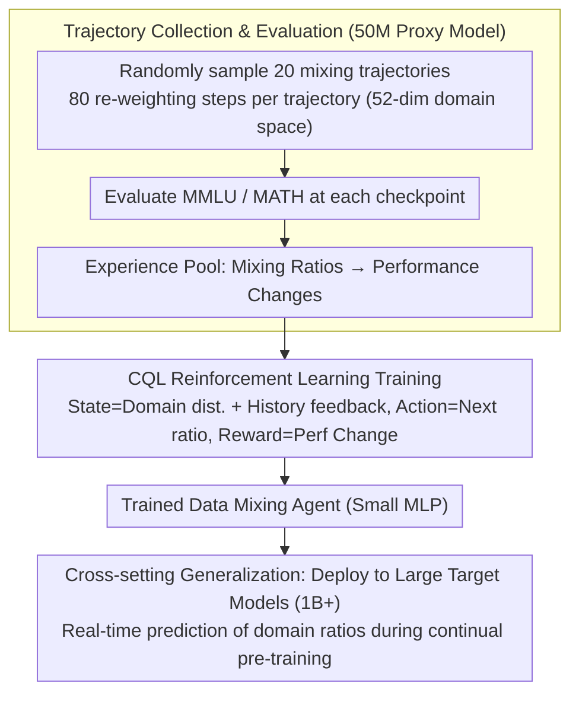

# Data Mixing Agent: Learning to Re-weight Domains for Continual Pre-training

**Conference**: ACL 2026  
**arXiv**: [2507.15640](https://arxiv.org/abs/2507.15640)  
**Code**: None  
**Area**: Reinforcement Learning  
**Keywords**: Data Mixing, Domain Re-weighting, Continual Pre-training, Reinforcement Learning, Catastrophic Forgetting

## TL;DR

This paper proposes Data Mixing Agent, the first model-based end-to-end domain re-weighting framework. By training a small agent using CQL reinforcement learning on extensive data mixing trajectories, it learns generalizable data mixing heuristics. It balances performance between source and target domains in mathematical reasoning continual pre-training and generalizes to unseen source domains, target models, and domain spaces.

## Background & Motivation

**Background**: While Large Language Models (LLMs) gain general capabilities through large-scale pre-training, they still require enhancement via continual pre-training in knowledge-intensive domains (e.g., mathematics, code). However, direct training on target domain data leads to catastrophic forgetting.

**Limitations of Prior Work**: (1) Common solutions involve mixing source and target domain data, but determining the mixing ratios typically relies on manual heuristics or empirical findings; (2) The heuristic space for data mixing is vast (different domains, ratios, schedules), making manual exploration extremely inefficient; (3) Existing methods (e.g., DoReMi, DSIR) are based on specific assumptions and have limited generalization.

**Key Challenge**: Optimal data mixing strategies are high-dimensional, dynamic, and task-dependent, yet manual heuristics can only cover a tiny fraction of the strategy space. A large number of potentially effective heuristics remain undiscovered and unutilized.

**Goal**: To train a small agent model that learns generalizable domain re-weighting heuristics from extensive data mixing trajectories, automatically adjusting data mixing ratios during continual pre-training.

**Key Insight**: First, randomly sample a large number of data mixing trajectories on a small proxy model to collect environmental feedback (benchmark performance). Then, use offline reinforcement learning to train an agent to map trajectory states to optimal mixing ratios.

**Core Idea**: Data mixing heuristics can be parameterized as a small agent, learned from trajectory data via RL. The learned heuristics demonstrate cross-model and cross-domain generalization capabilities.

## Method

### Overall Architecture

The paper addresses a long-standing problem in continual pre-training: training on a target domain (e.g., math) triggers catastrophic forgetting, necessitating the inclusion of source domain data, yet the ratios and dynamic schedules have long relied on manual heuristics. The authors propose parameterizing these mixing heuristics as a small agent that learns from data. The process involves three steps: first, randomly sampling many data mixing trajectories on a 50M-parameter proxy model, evaluating on MMLU and MATH at each step to build an experience pool of "mixing ratio $\to$ performance change"; second, training a data mixing agent using offline RL (CQL) on these trajectories to map the current state to the next optimal domain distribution; finally, deploying this trained agent directly into the continual pre-training of large target models, where it predicts the next ratio in real-time at each re-weighting step.

### Key Designs

**1. Trajectory Collection and Evaluation Environment: Using cheap small models for trial-and-error to accumulate supervision signals linking mixing strategies to performance.**

It is prohibitively expensive for an agent to learn which domain distributions balance performance by repeatedly testing ratios on large models. The authors conduct exploration on a 50M proxy model: sampling 20 data mixing trajectories with 80 re-weighting steps each, evaluating MMLU and MATH at every checkpoint within a 52-dimensional domain space (DCLM general data + Dolmino math data). Small model training is inexpensive, allowing for broad exploration of the strategy space, where step-by-step benchmark feedback serves as the supervision signal connecting "mixing strategy" to "final performance," preparing the experience pool for offline RL.

**2. CQL Reinforcement Learning Training: Modeling dynamic weighting as sequential decision-making and using Conservative Q-Learning to avoid over-optimism toward unseen ratios.**

Since the collected offline trajectories are fixed and cannot interact further with the environment, standard online RL tends to overestimate the value of actions outside the dataset. The authors model the problem as a Markov Decision Process: the state is the current domain distribution plus historical feedback, the action is the next domain distribution, and the reward is the change in benchmark performance. Training utilizes Conservative Q-Learning (CQL), which adds a conservative regularization term to the standard Q-learning objective to specifically penalize Q-value estimates for actions not in the dataset. This allows efficient learning from pre-collected trajectories while preventing the agent from trusting aggressive, untested ratios.

**3. Generalization Across Settings: Treating learned knowledge as "general weighting intuition" rather than "model-specific overfitted parameters."**

If the agent truly learns universal knowledge about which domain distributions help balance performance, it should be effective beyond its training setup. The authors train the agent only on a 50M model in the math domain and then deploy it as-is to entirely different scenarios: larger target models (1B+), different source domains (General $\to$ Science / Code, etc.), and even different domain space partitions. Successful migration across these settings proves that the agent captures scale- and domain-invariant mixing heuristics rather than merely memorizing optimal solutions for a specific configuration.

### Loss & Training

CQL Loss = Standard Q-learning Loss + Conservative Regularization Term (penalizing high Q-value estimates for out-of-distribution actions). The agent is a small MLP that inputs the current state and outputs a continuous domain distribution.

## Key Experimental Results

### Main Results

**Continual Pre-training for Mathematical Reasoning (Balancing MMLU and MATH Performance)**

| Method | MMLU Retention | MATH Gain | Overall |
|------|-----------|----------|------|
| Uniform Mixing | Medium | Medium | Baseline |
| DoReMi | Good | Good | Improved |
| Manual Heuristics | Variable | Variable | Experience-dependent |
| **Ours** | **Best** | **Best** | **Best** |

### Ablation Study

| Generalization Test | Effect | Description |
|----------|------|------|
| Unseen Source Domains | Effective | Heuristics transfer across domains |
| Different Target Model Sizes | Effective | Successful 50M $\to$ 1B+ transfer |
| Unseen Domain Spaces | Effective | Still effective with different domain categorizations |
| Code Generation Domain | Effective | Adaptation across different target domains |

### Key Findings

- Data Mixing Agent outperforms all baseline methods in balancing source and target domain performance.
- The heuristics learned by the agent align closely with human intuition—e.g., scientific domain data helps MMLU.
- The agent achieves better model performance using less source domain data—indicating the learning of more efficient data utilization strategies.
- Strategies learned from a 50M model transfer directly to 1B+ models, suggesting that data mixing heuristics are scale-invariant.

## Highlights & Insights

- First to demonstrate that data mixing heuristics can be parameterized and learned via RL.
- The generalization capability across settings is impressive—strategies learned on tiny models apply to large models.
- The agent's learned strategies are interpretable and align with human intuition, increasing reliability.

## Limitations & Future Work

- The trajectory collection phase still incurs significant computational costs (20 trajectories $\times$ 80 steps $\times$ evaluation).
- The conservatism of CQL might limit the agent's exploration of more aggressive mixing strategies.
- The evaluation environment uses simplified benchmarks (MMLU/MATH), which may not fully capture real-world performance.
- Domain space partitioning depends on external classifiers; classification quality affects agent learning.

## Related Work & Insights

- **vs DoReMi**: DoReMi optimizes domain weights based on gradients, while Data Mixing Agent learns heuristics end-to-end.
- **vs Manual Tuning**: Manual methods cover only a tiny fraction of the strategy space; the agent automatically explores and utilizes a vast number of heuristics.
- **vs Online Methods**: Online methods require repeated training of large models, whereas the agent can be deployed multiple times after a single learning phase.

## Rating

- Novelty: ⭐⭐⭐⭐⭐ First model-based end-to-end data mixing method via RL.
- Experimental Thoroughness: ⭐⭐⭐⭐ Multiple generalization tests and ablation analyses, though benchmarks are limited.
- Writing Quality: ⭐⭐⭐⭐ Clear motivation and systematic methodology.
- Value: ⭐⭐⭐⭐ Provides an automated tool for data engineering in large-scale pre-training.

<!-- RELATED:START -->

## Related Papers

- [\[ACL 2025\] Improving Continual Pre-training Through Seamless Data Packing](../../ACL2025/llm_pretraining/improving_continual_pre-training_through_seamless_data_packing.md)
- [\[ICLR 2026\] Predicting Training Re-evaluation Curves Enables Effective Data Curriculums](../../ICLR2026/llm_pretraining/predicting_training_re-evaluation_curves_enables_effective_data_curriculums_for_.md)
- [\[ACL 2026\] FOREVER: Forgetting Curve-Inspired Memory Replay for Language Model Continual Learning](forever_forgetting_curve-inspired_memory_replay_for_language_model_continual_lea.md)
- [\[ACL 2025\] Towards Effective and Efficient Continual Pre-training of Large Language Models](../../ACL2025/llm_pretraining/towards_effective_and_efficient_continual_pre-training_of_large_language_models.md)
- [\[ACL 2025\] Velocitune: A Velocity-based Dynamic Domain Reweighting Method for Continual Pre-training](../../ACL2025/llm_pretraining/velocitune_a_velocity-based_dynamic_domain_reweighting_method_for_continual_pre-.md)

<!-- RELATED:END -->
