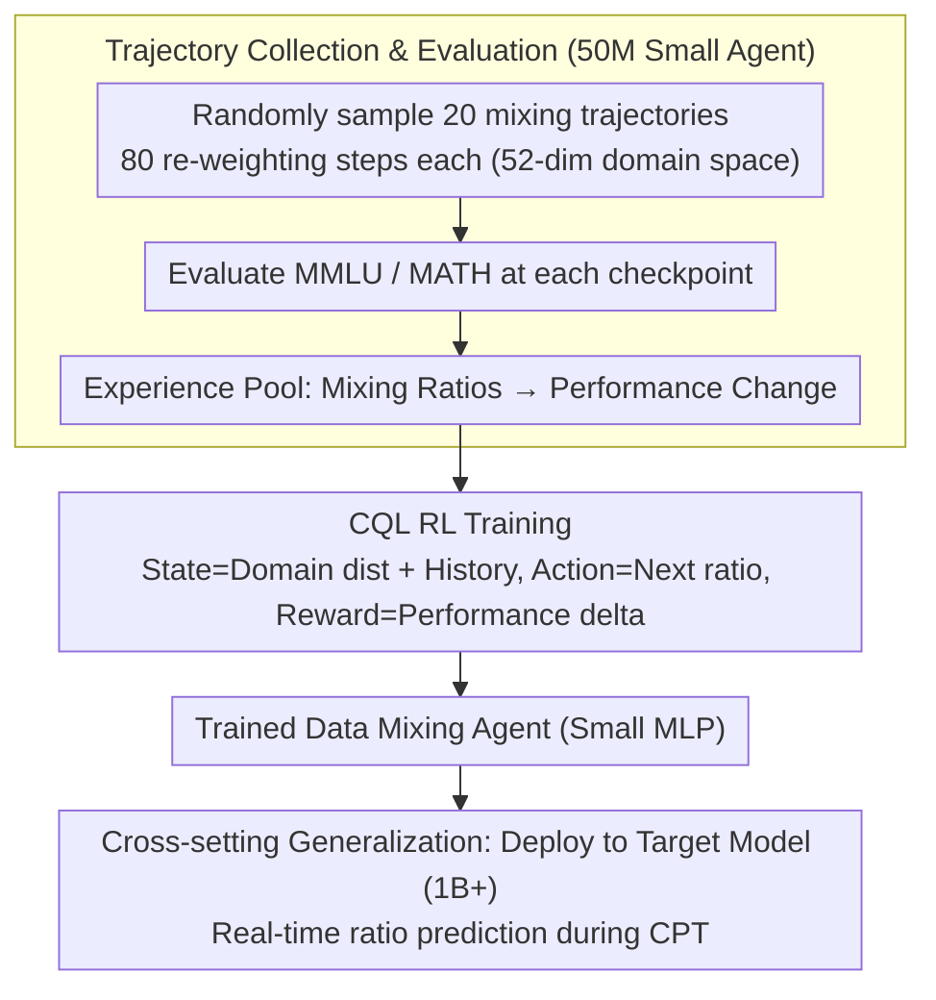

# Data Mixing Agent: Learning to Re-weight Domains for Continual Pre-training

**Conference**: ACL 2026  
**arXiv**: [2507.15640](https://arxiv.org/abs/2507.15640)  
**Code**: None  
**Area**: Reinforcement Learning  
**Keywords**: Data Mixing, Domain Re-weighting, Continual Pre-training, Reinforcement Learning, Catastrophic Forgetting

## TL;DR

This paper proposes Data Mixing Agent, the first model-based end-to-end domain re-weighting framework. By training a small agent using CQL reinforcement learning on extensive data mixing trajectories, it learns generalizable data mixing heuristics. It effectively balances source and target domain performance during continual pre-training for mathematical reasoning and generalizes to unseen source domains, target models, and domain spaces.

## Background & Motivation

**Background**: Although large language models acquire general capabilities through large-scale pre-training, they still require continual pre-training (CPT) to enhance performance in knowledge-intensive domains (e.g., mathematics, code). However, training directly on target domain data leads to catastrophic forgetting.

**Limitations of Prior Work**: (1) Common solutions involve mixing source and target domain data, but determining the mixing ratios usually relies on hand-crafted heuristics or empirical findings; (2) The space for data mixing heuristics is vast (different domains, ratios, and schedules), making manual exploration extremely inefficient; (3) Existing methods (e.g., DoReMi, DSIR) are based on specific assumptions and offer limited generalization.

**Key Challenge**: The optimal data mixing strategy is high-dimensional, dynamic, and task-dependent, yet manual heuristics cover only a tiny fraction of the strategy space. A large number of potentially effective heuristics remain undiscovered and unutilized.

**Goal**: To train a small agent model that learns generalizable domain re-weighting heuristics from massive data mixing trajectories, automatically adjusting mixing ratios during continual pre-training.

**Key Insight**: First, a large number of data mixing trajectories are randomly sampled on a small agent model to collect environmental feedback (benchmark performance). Then, offline reinforcement learning is used to train the agent to map trajectory states to optimal mixing ratios.

**Core Idea**: Data mixing heuristics can be parameterized as a small agent, learned from trajectory data via RL. The learned heuristics demonstrate cross-model and cross-domain generalization capabilities.

## Method

### Overall Architecture

The paper addresses a long-standing problem in continual pre-training: training on a target domain (e.g., mathematics) triggers catastrophic forgetting, necessitating the inclusion of source domain data. However, determining "how much to mix and how to adjust dynamically" has long relied on manual heuristics. The authors' approach is to parameterize this mixing heuristic as a small agent that learns from data. The overall framework follows three steps: first, randomly sample a large number of data mixing trajectories on a 50M parameter small agent model, evaluating on MMLU and MATH to accumulate experience on "how specific mixing ratios lead to performance changes"; second, train the data mixing agent using offline reinforcement learning (CQL) on these trajectories to learn the mapping from current states to the optimal domain distribution for the next step; finally, deploy the trained agent directly into the continual pre-training of the actual large target model, where it predicts domain ratios in real-time at each re-weighting step.

### Key Designs

**1. Trajectory Collection & Evaluation Environment: Using inexpensive small models for trial-and-error to generate supervision signals linking mixing strategies to performance.**

For the agent to learn "which domain distributions balance performance," repeatedly testing different ratios on large models is cost-prohibitive. The authors perform exploration on a 50M small agent model: sampling 20 data mixing trajectories with 80 re-weighting steps each, evaluating MMLU and MATH at every checkpoint within a 52-dimensional domain space (DCLM general data + Dolmino math data). Small model training is inexpensive, allowing for extensive exploration of the strategy space. The benchmark feedback at each step serves as a supervision signal correlating "mixing strategies" with "final performance," preparing the experience pool for subsequent offline RL.

**2. CQL Reinforcement Learning Training: Modeling dynamic weighting as sequential decision-making and using Conservative Q-Learning to avoid over-optimism toward unseen ratios.**

The collected data consists of fixed offline trajectories, preventing further interaction with the environment. Standard online RL tends to assign inflated values to out-of-distribution actions. The authors model the problem as a Markov Decision Process: the state is the current domain distribution plus historical environmental feedback, the action is the next domain distribution, and the reward is the change in benchmark performance. Training utilizes Conservative Q-Learning (CQL), which adds a conservative regularization term to the standard Q-learning objective. This specifically penalizes Q-value estimates for actions outside the dataset, preventing the agent from blindly trusting aggressive, untested ratios. This allows for efficient learning from pre-collected trajectories without being misled by coverage gaps in the offline data.

**3. Cross-setting Generalization: Treating learned knowledge as "universal weighting intuition" rather than "model-specific overfit parameters."**

If the agent truly learns universal knowledge about "which domain distributions help balance performance," the strategy should remain effective outside the training setup. The authors train the agent only on the 50M model in the math domain and then deploy it as-is to completely different scenarios: larger target models (1B+), different source domains (General → Science / Code, etc.), and even different domain space partitions. The ability to migrate across these settings confirms that the agent has captured scale- and domain-invariant mixing heuristics rather than merely memorizing the optimal solution for a specific configuration.

### Loss & Training

CQL Loss = Standard Q-learning Loss + Conservative Regularization Term (penalizing high Q-value estimates for actions outside the dataset). The agent is a small MLP that inputs the current state and outputs a continuous domain distribution.

## Key Experimental Results

### Main Results

**Continual Pre-training for Mathematical Reasoning (Balancing MMLU and MATH performance)**

| Method | MMLU Retention | MATH Gain | Overall |
|------|-----------|----------|------|
| Uniform Mixing | Moderate | Moderate | Baseline |
| DoReMi | Good | Good | Improved |
| Manual Heuristics | Variable | Variable | Experience-dependent |
| **Data Mixing Agent** | **Best** | **Best** | **Best** |

### Ablation Study

| Generalization Test | Effect | Description |
|----------|------|------|
| Unseen Source Domain | Effective | Heuristic transfers across domains |
| Different Target Model Sizes | Effective | 50M → 1B+ migration successful |
| Unseen Domain Space | Effective | Effective across different domain classifications |
| Code Generation Domain | Effective | Adaptation across target domains |

### Key Findings

- Data Mixing Agent outperforms all baseline methods in balancing source and target domain performance.
- The heuristics learned by the agent are highly consistent with human intuition—for instance, data from the science domain helps MMLU.
- The agent achieves better model performance using less source domain data, indicating it has learned more efficient data utilization strategies.
- Strategies learned from a 50M model can be directly transferred to 1B+ models, suggesting that data mixing heuristics are scale-invariant.

## Highlights & Insights

- First to demonstrate that data mixing heuristics can be parameterized and learned through RL.
- The cross-setting generalization capability is impressive—strategies learned on extremely small models apply to large models.
- The strategies learned by the agent are interpretable and aligned with human intuition, increasing reliability.

## Limitations & Future Work

- The trajectory collection phase still incurs considerable computational costs (20 trajectories × 80 steps × evaluation).
- The conservatism of CQL might limit the agent's ability to explore more aggressive mixing strategies.
- The evaluation environment uses simplified benchmarks (MMLU/MATH), which may not fully capture real-world performance.
- Domain space partitioning relies on external classifiers; the quality of classification impacts agent learning.

## Related Work & Insights

- **vs DoReMi**: While DoReMi is based on gradient optimization of domain weights, Data Mixing Agent learns heuristics end-to-end.
- **vs Manual Tuning**: Manual methods can only cover a tiny strategy space, whereas the agent can automatically explore and utilize a vast range of heuristics.
- **vs Online Methods**: Online methods require repeated training of large models, whereas the agent can be deployed multiple times after a single learning phase.

## Rating

- Novelty: ⭐⭐⭐⭐⭐ First model-based end-to-end data mixing method using RL to learn heuristics.
- Experimental Thoroughness: ⭐⭐⭐⭐ Multiple generalization tests and ablation analyses, though benchmarks are limited.
- Writing Quality: ⭐⭐⭐⭐ Clear motivation and systematic methodology.
- Value: ⭐⭐⭐⭐ Provides an automated tool for data engineering in large-scale pre-training.

<!-- RELATED:START -->

## Related Papers

- [\[ACL 2025\] Improving Continual Pre-training Through Seamless Data Packing](../../ACL2025/llm_pretraining/improving_continual_pre-training_through_seamless_data_packing.md)
- [\[ACL 2026\] FOREVER: Forgetting Curve-Inspired Memory Replay for Language Model Continual Learning](forever_forgetting_curve-inspired_memory_replay_for_language_model_continual_lea.md)
- [\[ICLR 2026\] Predicting Training Re-evaluation Curves Enables Effective Data Curriculums](../../ICLR2026/llm_pretraining/predicting_training_re-evaluation_curves_enables_effective_data_curriculums_for_.md)
- [\[ACL 2025\] Towards Effective and Efficient Continual Pre-training of Large Language Models](../../ACL2025/llm_pretraining/towards_effective_and_efficient_continual_pre-training_of_large_language_models.md)
- [\[ACL 2025\] Velocitune: A Velocity-based Dynamic Domain Reweighting Method for Continual Pre-training](../../ACL2025/llm_pretraining/velocitune_a_velocity-based_dynamic_domain_reweighting_method_for_continual_pre-.md)

<!-- RELATED:END -->
