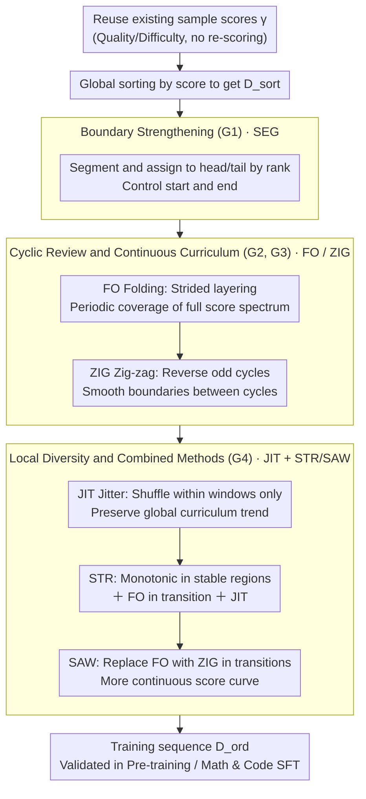

# Demystifying Data Organization for Enhanced LLM Training

**Conference**: ACL2026  
**arXiv**: [2605.30334](https://arxiv.org/abs/2605.30334)  
**Code**: None  
**Area**: LLM Pre-training / Data Organization  
**Keywords**: Data Ordering, Curriculum Learning, Pre-training Efficiency, STR, SAW

## TL;DR
This paper systematically investigates the impact of "sample appearance order" in LLM training. By reusing existing sample-level quality/difficulty scores, it proposes four data organization principles: boundary strengthening, cyclic review, continuous curriculum, and local diversity. The proposed STR and SAW strategies consistently improve performance in both pre-training and SFT.

## Background & Motivation
**Background**: Data-centric work for LLMs typically focuses on acquisition, deduplication, filtering, mixing, synthesis, and selection. Many pipelines already calculate quality, difficulty, educational value, or learnability scores for each sample to decide "which samples enter the training set."

**Limitations of Prior Work**: These scores are often used only for one-time filtering, while the training order itself is treated as a simple random shuffle or a naive curriculum. For the single-pass or few-epoch training paradigms common in current LLMs, sample order directly affects the optimization trajectory: early samples determine how the model enters the training state, late samples determine the final capability region, and abrupt distribution changes in the middle cause forgetting or optimization oscillation.

**Key Challenge**: Data selection answers "what to train," while data organization answers "in what order to train." The former has been extensively researched, while the latter is often neglected. Given a fixed token budget, incorrect ordering can lead to significantly different learning outcomes for the same dataset.

**Goal**: The authors aim to extend sample-level scores from "filtering tools" to "ordering signals," summarize generalizable data organization principles, and propose ordering strategies with near-zero extra computational cost for general pre-training, Math SFT, and Code SFT.

**Key Insight**: Instead of redesigning data scorers, this paper reuses scores already calculated by data efficiency methods. The focus is shifted to the ordering function $f_o$: given data and scores, how to construct a training sequence that enables a stable start, presents high-value samples at the end, avoids catastrophic forgetting, and prevents local homogenization.

**Core Idea**: Change only the sample permutation without altering the data scale. Ensure the training sequence satisfies high end-of-training value, periodic review, attribute continuity, and local diversity simultaneously.

## Method
The paper decomposes data work into three stages: scoring, selection, and organization. A scoring function $g$ generates a score vector $\gamma$ for each sample. A selection function $f_s$ chooses a training subset via ratio or top-$K$. The data organization function $f_o$ does not change the number of samples but constructs a permutation $\pi$ based on $\gamma$, resulting in $\mathcal{D}_{ord}=[x_{\pi(1)},x_{\pi(2)},\dots,x_{\pi(K)}]$. While ordinary Curriculum Learning merely sorts samples in ascending order of scores, this work explores finer structural ordering.

### Overall Architecture
The pipeline reuses existing data selection scores, designs multiple ordering operators around the training sequence, and validates them on FineWeb-Edu, QuRatedPajama, DeepMath-103K, and OpenCodeInstruct. The authors summarize their findings into four guidelines, validated individually via SEG, FO, ZIG, and JIT, and combined into two main methods: STR and SAW.

STR and SAW are the final recommended strategies. STR combines G1, G2, and G4: maintaining global score trends, applying folding review in local transition regions, and adding local diversity. SAW builds on STR by adding G3, replacing folding in transition regions with Zig-zag to make the score curve more continuous.

### Key Designs

**1. Boundary Strengthening (G1) & SEG: Designing the start and end of the sequence independently**

Samples seen at the end of training directly determine the model's final capability region. If the tail contains only low-quality or low-difficulty samples, model progress stagnates during the critical final phase. SEG addresses this by discretizing sorted data into segments and assigning them to different training stages based on score rank. Optimal configurations differ between paradigms: "low-score start, high-score end" is best for pre-training, while high-score data at both start and end is superior for SFT. Notably, placing high-score samples only at the start yields minimal gain because it delays low-score samples to the end, confirming that the end is more critical than the beginning.

**2. Cyclic Review & Continuous Curriculum (G2, G3): Countering forgetting with periodic lookbacks and stabilizing the optimizer with continuous transitions**

Naive curriculum moves from easy to hard, which often results in a PPL rebound for low-score samples once the model reaches the high-score phase—basic knowledge is forgotten. FO (folding) slices sorted data into multiple folding layers using a stride, ensuring each cycle covers the full score spectrum. This allows the model to periodically re-encounter early basic samples, causing PPL to drop again as simple data re-appears. However, cycle transitions create new problems: FO exhibits gradient norm spikes at cycle boundaries. ZIG builds on FO by reversing odd cycles, turning the score trajectory into a continuous triangular-wave-like curve, smoothing attribute cliffs at boundaries and stabilizing training dynamics. These correspond to "must review" (G2) and "avoid abrupt changes during review" (G3).

**3. Local Diversity (G4) & JIT, plus Combined Methods STR/SAW: Shuffling local windows while preserving global curriculum trends**

Strict ordering leads to adjacent samples having highly similar scores, making mini-batches homogeneous and reducing gradient diversity. JIT divides sorted data into windows or buckets and shuffles only within these local windows. The relative order between buckets (global curriculum) is preserved, but local heterogeneity is restored. Perturbation analysis shows this helps the model converge to flatter minima and become less sensitive to weight noise. The recommended STR combines G1, G2, and G4 (monotonic trends in stable regions, FO in transitions, plus JIT); SAW adds G3 by replacing FO with ZIG to ensure continuous score curves between regions.

### Loss & Training
The paper does not propose a new model loss but focuses on training data sequence strategies. The training objective follows standard language modeling for pre-training or task-specific objectives for SFT. Experiments use Mistral architecture for pre-training and Qwen3 weights for SFT on FineWeb-Edu, QuRatedPajama, DeepMath-103K, and OpenCodeInstruct. Strategies are compared against Random shuffle, CL, DELT, and single-principle strategies, with scaling-up tested at 50B tokens.

## Key Experimental Results

### Main Results
| Strategy | FineWeb-Edu Avg. | DeepMath Avg. | OpenCode Avg. | Description |
|----------|------------------|---------------|---------------|-------------|
| Random   | 37.09            | 1.30          | 55.37         | Random baseline |
| CL       | 37.61            | 1.78          | 58.30         | Naive curriculum, helpful but unstable |
| DELT     | 37.35            | 2.42          | 59.70         | Review-based baseline, strong on SFT |
| STR      | 38.65            | 2.48          | 60.83         | Combined boundary, review, diversity; best for Code SFT |
| SAW      | 38.78            | 2.53          | 60.48         | Added continuity; best for Pre-training/Math SFT |

### Ablation Study
| Configuration | FineWeb-Edu | QuRatedPajama | DeepMath | OpenCodeInstruct | Description |
|---------------|-------------|---------------|----------|------------------|-------------|
| CL            | 37.61       | 36.12         | 1.78     | 58.30            | Naive sorting |
| CL (JIT)      | 38.20       | 36.46         | 1.78     | 59.50            | JIT improves pre-training and Code SFT |
| FO            | 38.12       | 36.62         | 2.42     | 60.90            | Cyclic review significantly stronger than CL |
| FO (JIT)      | 38.25       | 36.85         | 2.74     | 60.96            | JIT further improves Math SFT |
| ZIG           | 38.29       | 36.74         | 2.69     | 60.11            | Continuous transition mitigates FO cliffs |
| ZIG (JIT)     | 38.32       | 36.88         | 2.76     | 61.34            | Most stable single-principle; best for OpenCode |

### Key Findings
- Data order is a first-order factor in single/few-pass training. Changing only the order (not the set) improves FineWeb-Edu average from 37.09 (Random) to 38.78 (SAW).
- The end is more critical than the beginning. SEG experiments show that finishing with high-score data consistently brings gains; starting with high-score data provides little benefit as it pushes low-quality data to the end.
- Cyclic review mitigates forgetting. FO-3's PPL curve drops again when simple data is re-introduced in the second cycle, whereas CL shows PPL rebound for low-score samples in the latter half.
- Continuity affects optimization stability. FO causes gradient norm spikes at cycle boundaries; ZIG reduces these via reversed odd cycles.
- Scaling-up supports extensibility. In 50B-token pre-training, results for Random at 160M to 1.7B were 40.52 to 47.72, while SAW achieved 43.10 to 50.11, showing that ordering benefits do not vanish with scale.

## Highlights & Insights
- Data scores should not serve only for filtering. Since scoring is expensive, reusing the same scores to organize training involves negligible marginal cost.
- The philosophy of STR/SAW is more transferable than the specific algorithms. Any existing data pipeline outputting sample scores can implement high-score endings, cyclic review, and local jittering.
- "Local diversity" is often overlooked in curriculum learning. Overly organized curricula can homogenize local batch gradients; JIT restores the benefits of randomness without breaking the global trend.
- Comparing pre-training and SFT within the same organization framework provides more practical value than small-scale curriculum benchmarks.

## Limitations & Future Work
- Methods rely on pre-existing sample-level scores. If scores are low-quality or irrelevant, STR/SAW may organize "incorrect" signals more precisely without real benefit.
- Experiments primarily cover language data. Evaluation in other modalities, such as multimodal pre-training or speech data, is needed.
- Large-scale results include scaling law extrapolations. While extrapolation for GPT-3 and Llama 3.1 levels is provided, these are not empirical results from full training of those models.
- Ordering strategies may be tightly coupled with optimizers, batching, and data mixing ratios. Future work could investigate online adaptive ordering instead of offline generation.

## Related Work & Insights
- **vs Curriculum Learning**: CL typically sorts from easy to hard. This paper argues such monotonic order causes forgetting of basics and that terminal low-quality data harms final performance.
- **vs DELT**: DELT utilizes the review idea of folding learning. This work systematizes it into G2 and adds continuity and local diversity for STR/SAW.
- **vs Data Selection**: Selection changes the sample set, while organization changes only the permutation. Organization can be layered atop pipelines like SemDeDup or FineWeb-Edu.
- **vs Data Mixing**: Mixing focuses on proportions of sources; organization focuses on temporal order within a selected set. Their combination is a key direction for future training recipes.

## Rating
- Novelty: ⭐⭐⭐⭐☆ Practical problem framing; systematization of principles is clear; individual techniques are known but their combination into an LLM recipe is highly valuable.
- Experimental Thoroughness: ⭐⭐⭐⭐⭐ Covers pre-training, Math/Code SFT, various corpora, and scaling-up with detailed ablations.
- Writing Quality: ⭐⭐⭐⭐☆ Complete structure, though tables are dense and some notations may be challenging for non-specialists.
- Value: ⭐⭐⭐⭐⭐ Directly applicable to real LLM training pipelines with low-cost improvements to existing data engineering.

<!-- RELATED:START -->

## Related Papers

- [\[ICLR 2026\] Common Corpus: The Largest Collection of Ethical Data for LLM Pre-Training](../../ICLR2026/llm_pretraining/common_corpus_ethical_data_for_llm_pretraining.md)
- [\[AAAI 2026\] ELSPR: Evaluator LLM Training Data Self-Purification on Non-Transitive Preferences](../../AAAI2026/llm_pretraining/elspr_evaluator_llm_training_data_self-purification_on_non-transitive_preference.md)
- [\[ICLR 2026\] Scaling with Collapse: Efficient and Predictable Training of LLM Families](../../ICLR2026/llm_pretraining/scaling_with_collapse_efficient_and_predictable_training_of_llm_families.md)
- [\[ICML 2026\] Data Difficulty and the Generalization--Extrapolation Tradeoff in LLM Fine-Tuning](../../ICML2026/llm_pretraining/data_difficulty_and_the_generalization--extrapolation_tradeoff_in_llm_fine-tunin.md)
- [\[ICLR 2026\] Token-level Data Selection for Safe LLM Fine-tuning](../../ICLR2026/llm_pretraining/token-level_data_selection_for_safe_llm_fine-tuning.md)

<!-- RELATED:END -->
