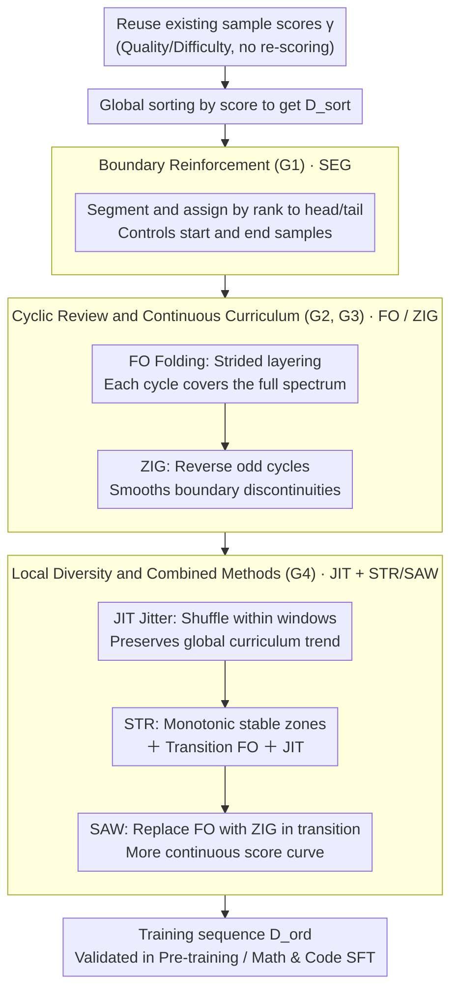

# Demystifying Data Organization for Enhanced LLM Training

**Conference**: ACL2026  
**arXiv**: [2605.30334](https://arxiv.org/abs/2605.30334)  
**Code**: None  
**Area**: LLM Pre-training / Data Organization  
**Keywords**: Data Ordering, Curriculum Learning, Pre-training Efficiency, STR, SAW

## TL;DR
This paper systematically investigates the impact of "sample appearance order" in LLM training. By reusing existing sample-level quality/difficulty scores, it proposes four data organization principles: boundary reinforcement, cyclic review, continuous curriculum, and local diversity. The proposed STR and SAW strategies consistently enhance performance in both pre-training and SFT.

## Background & Motivation
**Background**: LLM data engineering typically focuses on collection, deduplication, filtering, mixing, synthesis, and selection. Many pipelines already compute scores for quality, difficulty, educational value, or learnability for each sample to decide "which samples enter the training set."

**Limitations of Prior Work**: These scores are often used only for one-time filtering, while the training order is simply treated as random shuffling or naive curriculum. For common one-epoch or few-epoch LLM training paradigms, sample order directly affects the optimization trajectory: early samples determine how the model enters the training state, late samples determine which capability region the model anchors in, and abrupt distribution changes in the middle can lead to forgetting or optimization oscillations.

**Key Challenge**: Data selection answers "what to train," while data organization answers "in what order to train." The former has been extensively studied, while the latter is often neglected. Under a fixed token budget, incorrect ordering can lead to significantly different learning outcomes for the same dataset.

**Goal**: The authors aim to extend sample-level scores from "filtering tools" to "ordering signals," summarize generalizable data organization principles, and propose ordering strategies with negligible additional computational cost, covering general pre-training, mathematical SFT, and code SFT.

**Key Insight**: Rather than redesigning data scorers, the paper reuses existing scores from data efficiency methods. This focuses the problem on the ordering function $f_o$: given data and scores, how should one construct a training sequence such that the model starts stably, sees high-value samples at the end, avoids catastrophic forgetting, and prevents local homogenization.

**Core Idea**: Change only the sample arrangement without altering data scale. The training sequence is designed to simultaneously satisfy high value at the end, periodic review, attribute continuity, and local diversity.

## Method
The paper decomposes data work into three stages: scoring, selection, and organization. The scoring function $g$ produces a score vector $\gamma$ for each sample; the selection function $f_s$ selects a training subset by ratio or top-$K$; the data organization function $f_o$ constructs a permutation $\pi$ based on $\gamma$ to yield $\mathcal{D}_{ord}=[x_{\pi(1)},x_{\pi(2)},\dots,x_{\pi(K)}]$ without changing sample counts. While conventional Curriculum Learning simply sorts samples by score, this work explores finer structural ordering.

### Overall Architecture
The pipeline reuses existing data selection scores, designs multiple ordering operators around training sequences, and validates them on FineWeb-Edu, QuRatedPajama, DeepMath-103K, and OpenCodeInstruct. The authors summarize their findings into four guidances, validating individual principles with SEG, FO, ZIG, and JIT before combining them into STR and SAW.

STR and SAW are the final recommended strategies. STR combines G1, G2, and G4: maintaining a global score trend, performing folding review in transition regions, and incorporating local diversity. SAW adds G3 to STR, replacing folding in transition regions with zig-zagging to make the score curve more continuous.

### Key Designs

**1. Boundary Reinforcement (G1) and SEG: Treating the beginning and end of the sequence as separately designable regions**

Samples seen at the end of training directly determine the final capability region of the model. If the tail consists only of low-quality or low-difficulty samples, performance stagnates during the critical closing stage. SEG addresses this by discretizing sorted data into segments and assigning them based on rank. Experiments show that optimal configurations differ by paradigm: for pre-training, "low-score start, high-score end" is best; for SFT, providing high-score data at both ends is superior. Notably, placing high-score samples only at the beginning yields minimal gain because it delays low-score samples to the end, confirming that "the end is more critical than the beginning."

**2. Cyclic Review and Continuous Curriculum (G2, G3): Countering forgetting with periodic look-backs and stabilizing optimization with smooth transitions**

Naive curriculum moves from easy to hard, which seems logical but causes PPL rebound on low-score samples once the model reaches the high-score phase—foundational knowledge is forgotten. FO (folding) slices sorted data into folding layers with a stride, ensuring each cycle covers the full score spectrum. The PPL curve drops again as the model re-encounters simple data. However, cycle transitions introduce new issues: FO exhibits gradient norm spikes at boundaries. ZIG improves FO by reversing odd cycles, turning the score trajectory into a continuous triangle-wave-like curve, smoothing attribute cliffs and stabilizing training dynamics. These correspond to "must review" (G2) and "avoid abrupt changes during review" (G3).

**3. Local Diversity (G4) and JIT, plus Combined Methods STR/SAW: Shuffling local windows while preserving global trends**

Strict ordering results in adjacent samples having highly similar scores, leading to high homogeneity within a mini-batch and reduced gradient diversity. JIT divides sorted data into windows or buckets and shuffles only within these local windows. This preserves the relative order between buckets (global curriculum) while restoring local heterogeneity. Perturbation analysis shows this helps the model converge to flatter minima and makes it less sensitive to weight noise. The final recommended methods are combinations: STR integrates G1, G2, and G4; SAW goes further by using ZIG instead of FO in transition regions to further smooth the score curve.

### Loss & Training
The paper does not propose a new loss function but rather a strategy for training data sequencing. The training objectives follow standard language modeling for pre-training or task-specific objectives for SFT. In pre-training, a Mistral architecture is used, while SFT uses Qwen3 official weights. Datasets include FineWeb-Edu, QuRatedPajama, DeepMath-103K, and OpenCodeInstruct. The authors compare random ordering, CL, DELT, and their single/combined strategies, including scaling-up up to 50B tokens.

## Key Experimental Results

### Main Results

| Strategy | FineWeb-Edu Avg. | DeepMath Avg. | OpenCode Avg. | Description |
| :--- | :--- | :--- | :--- | :--- |
| Random | 37.09 | 1.30 | 55.37 | Random ordering baseline |
| CL | 37.61 | 1.78 | 58.30 | Naive ascending curriculum, gains but unstable |
| DELT | 37.35 | 2.42 | 59.70 | Review-based baseline, strong in SFT |
| STR | 38.65 | 2.48 | 60.83 | Combined boundary/review/diversity, best for Code SFT |
| SAW | 38.78 | 2.53 | 60.48 | Adds continuity, best for Pre-training and Math SFT |

### Ablation Study

| Configuration | FineWeb-Edu | QuRatedPajama | DeepMath | OpenCodeInstruct | Description |
| :--- | :--- | :--- | :--- | :--- | :--- |
| CL | 37.61 | 36.12 | 1.78 | 58.30 | Naive sorting |
| CL (JIT) | 38.20 | 36.46 | 1.78 | 59.50 | Local jitter improves PT and Code SFT |
| FO | 38.12 | 36.62 | 2.42 | 60.90 | Cyclic review significantly better than CL |
| FO (JIT) | 38.25 | 36.85 | 2.74 | 60.96 | JIT further boosts Math SFT |
| ZIG | 38.29 | 36.74 | 2.69 | 60.11 | Continuous transition mitigates FO spikes |
| ZIG (JIT) | 38.32 | 36.88 | 2.76 | 61.34 | Most stable single principle combo, best OpenCode |

### Key Findings
- Data order is a first-order factor in single/few-epoch training. Merely changing the order without changing the data pool can raise FineWeb-Edu averages from 37.09 (Random) to 38.78 (SAW).
- The end is more critical than the beginning. SEG experiments show that ending pre-training with high-score data consistently leads to gains. Using high-score data only at the beginning is less effective as it defers poor data to the end.
- Cyclic review mitigates forgetting. The PPL curve for FO-3 drops again when simple data is re-introduced in the second cycle, whereas CL PPL rebounds on low-score samples in the latter half.
- Continuity affects optimization stability. FO shows gradient norm spikes at cycle boundaries; ZIG reduces these abrupt attribute shifts via odd-cycle reversal.
- Scaling-up results support extensibility. In 50B-token pre-training, gains for STR and SAW over Random persist as model size increases from 160M to 1.7B.

## Highlights & Insights
- The most important takeaway is that data scores should not only serve filtering. Since scoring is expensive, utilizing the same scores to organize training order has negligible marginal cost.
- The philosophy of STR/SAW is more transferable than the specific algorithms. Any existing data selection pipeline that outputs sample-level scores can implement high-score endings, cyclic review, and local jitter.
- "Local diversity" is a frequently overlooked aspect of curriculum learning. A perfectly sorted curriculum might seem logical but homogenizes local batch gradients; JIT recovers the benefits of randomness without breaking the global trend.
- Comparing pre-training and SFT within the same organization framework provides more practical reference than validating on small academic curriculum benchmarks.

## Limitations & Future Work
- Methods rely on existing sample-level scores. If score quality is low or irrelevant to the target task, STR/SAW may organize "refined" noise without yielding real gains.
- Experiments primarily cover language data. Evaluation on other modalities (multimodal, speech, or code-text hybrids) is required.
- While the paper provides test loss extrapolation for larger models (GPT-3, Llama 2/3.1 scales), these are not empirical results from full training of those specific models.
- Ordering strategies may be tightly coupled with optimizers, batching, and mixing ratios. Future work could investigate online adaptive ordering rather than one-time offline sequence generation.

## Related Work & Insights
- **vs Curriculum Learning**: CL usually sorts from easy to hard. This work points out that monotonic ordering leads to forgetting of foundational samples and that terminal low-quality data harms final performance.
- **vs DELT**: DELT incorporates review through folding; this work systematizes it into G2 and further adds continuity and local diversity for STR/SAW.
- **vs Data Selection**: Data selection changes the sample set; data organization changes only the permutation. It can be layered atop pipelines like SemDeDup or FineWeb-Edu.
- **vs Data Mixing**: Data mixing focuses on ratios between sources; data organization focuses on chronological order within a selected set. Combining the two is a promising direction for future training recipes.

## Rating
- Novelty: ⭐⭐⭐⭐☆ Practical problem framing; principles are clearly systematized. Individual tricks aren't entirely new, but the combined LLM training recipe is highly valuable.
- Experimental Thoroughness: ⭐⭐⭐⭐⭐ Covers general PT, Math SFT, Code SFT across various corpora and scales with detailed ablations.
- Writing Quality: ⭐⭐⭐⭐☆ Complete structure, though tables are dense and some notation may be heavy for those outside data engineering.
- Value: ⭐⭐⭐⭐⭐ Highly instructive for real-world LLM training pipelines, particularly for low-cost improvements to existing data engineering.

<!-- RELATED:START -->

## Related Papers

- [\[ICLR 2026\] Common Corpus: The Largest Collection of Ethical Data for LLM Pre-Training](../../ICLR2026/llm_pretraining/common_corpus_the_largest_collection_of_ethical_data_for_llm_pre-training.md)
- [\[AAAI 2026\] ELSPR: Evaluator LLM Training Data Self-Purification on Non-Transitive Preferences](../../AAAI2026/llm_pretraining/elspr_evaluator_llm_training_data_self-purification_on_non-transitive_preference.md)
- [\[ICLR 2026\] Scaling with Collapse: Efficient and Predictable Training of LLM Families](../../ICLR2026/llm_pretraining/scaling_with_collapse_efficient_and_predictable_training_of_llm_families.md)
- [\[ICML 2026\] Data Difficulty and the Generalization--Extrapolation Tradeoff in LLM Fine-Tuning](../../ICML2026/llm_pretraining/data_difficulty_and_the_generalization--extrapolation_tradeoff_in_llm_fine-tunin.md)
- [\[ICLR 2026\] Token-level Data Selection for Safe LLM Fine-tuning](../../ICLR2026/llm_pretraining/token-level_data_selection_for_safe_llm_fine-tuning.md)

<!-- RELATED:END -->
