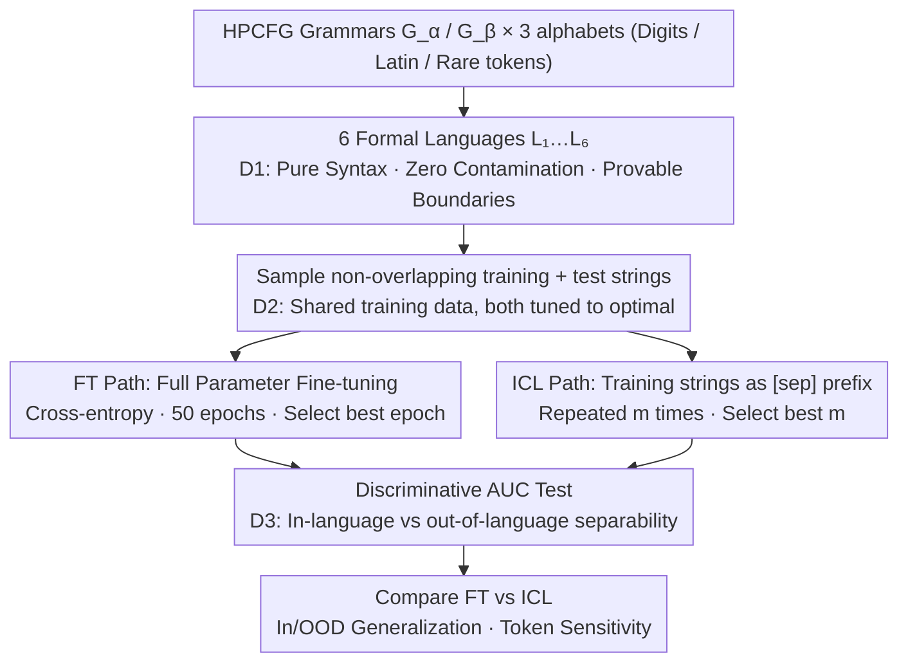

# Fine-tuning vs. In-context Learning in Large Language Models: A Formal Language Learning Perspective

**Conference**: ACL 2026  
**arXiv**: [2604.23267](https://arxiv.org/abs/2604.23267)  
**Code**: https://github.com/bishwamittra/formallm  
**Area**: LLM Evaluation / ICL vs SFT / Inductive Bias  
**Keywords**: Formal Languages, Fine-tuning, In-context Learning, Discriminative Evaluation, Probabilistic Context-Free Grammar

## TL;DR
The authors utilize Probabilistic Hierarchical Context-Free Grammar (HPCFG) to construct a set of "contamination-free, bounded, and precisely samplable" formal languages as controlled testbeds. They propose the "Discriminative AUC Test" as a unified metric to systematically compare FT and ICL across 18 LLMs from 6 families on 6 languages. The study finds that FT consistently outperforms ICL in-distribution, but both perform equally on out-of-distribution data; ICL shares a similar inductive bias with FT but exhibits significantly higher sensitivity to specific tokens.

## Background & Motivation

**Background**: Fine-tuning (FT) and In-context Learning (ICL) represent the two most fundamental "learning paradigms" for LLMs—the former modifies parameters like a closed-book exam, while the latter relies on prompts like an open-book exam. Which paradigm better "acquires a language" and whether their inductive biases are consistent remain unresolved questions in the community.

**Limitations of Prior Work**: Previous studies (e.g., Mosbach 2023, Brown 2020) have yielded contradictory conclusions, with some favoring FT and others ICL. The authors attribute this to three experimental design flaws: unclear task boundaries (inability to precisely define "in-distribution" and "out-of-distribution" in natural language), unfair resource allocation (e.g., comparing 1-epoch FT with optimized ICL), and incomparable evaluation metrics (generation loss is biased by model priors and prompt formats).

**Key Challenge**: Natural language data inherently suffers from "data contamination" and "fuzzy task boundaries." LLMs may have encountered test data during pre-training, and the division between in-distribution and out-of-distribution often relies on intuition. This makes a "fair comparison between FT and ICL" nearly impossible using natural language.

**Goal**: (i) Design a learning task that is contamination-free, precisely controllable, and has clear linguistic boundaries; (ii) propose a language proficiency metric that is comparable across paradigms; (iii) systematically answer four research questions (RQs) across 18 LLMs regarding proficiency, inductive bias, distribution generalization, and token sensitivity.

**Key Insight**: The authors leverage formal language theory. HPCFG possesses four ideal properties for a controlled laboratory: recursive structure (simulating natural language), pure syntax with zero semantics, precise samplability, and zero contamination.

**Core Idea**: Replace natural language benchmarks with purely syntactic formal languages generated by HPCFG. Instead of generation loss, use the AUC of "discriminating in-language vs. out-of-language strings" to eliminate incomparability caused by model priors and prompt variations.

## Method

### Overall Architecture
The methodology decomposes the vague problem of "fairly comparing FT and ICL" into three desiderata (D1: clean task specification, D2: equal resources, D3: comparable metrics). These are implemented through a controlled pipeline: "Language Generation → Dual Paradigm Learning → Unified Measurement":
(1) **Formal Language Generation (D1)**: Using two sets of HPCFG ($G_\alpha, G_\beta$) combined with three alphabets (digits / Latin / under-trained tokens) to form 6 languages $\{L_i\}_{i=1}^6$. Non-overlapping training strings ($n_{\text{train}}\in\{1,2,4,\dots,1024\}$) and test strings ($n_{\text{test}}=1024$) are sampled.
(2) **Two Learning Paradigms (D2)**: FT minimizes cross-entropy $\mathtt{loss}_M(D) = -\frac{1}{n}\sum_{s\in D}\frac{1}{|s|}\sum_{i=1}^{|s|} \log P_M(s_i \mid s_{[1,i-1]})$ over 50 epochs. ICL concatenates training strings into a prefix using `[sep]`, with example repetitions $m\in\{1,2,4,8,16\}$. Both use the same training strings and are compared after tuning to their respective optimal epoch/repetition counts to ensure resource equality.
(3) **Discriminative AUC Test (D3)**: Both in-language strings $L$ and out-of-language strings $\mathsf{T}(L)$ (constructed via edits or randomization) are fed to the LLM. Generation losses are recorded, and a linear classifier calculates $\mathtt{auc}_M(L, \mathsf{T}(L))$. A higher score indicates higher proficiency, comparable across models and paradigms.

### Key Designs

**1. Three Desiderata (D1/D2/D3) Framework: Formalizing the "Fair Comparison"**

Prior contradictions stem from a lack of a rigorous definition for "fair comparison." The authors establish three standards: D1 requires clean task specification (pure syntax, zero semantic prompts), D2 requires resource equality (same training data, optimized hyperparameters), and D3 requires comparable metrics. Each precisely targets a flaw in NL benchmarks: fuzzy boundaries (D1), arbitrary epoch/resource selection (D2), and generation loss corrupted by priors (D3). This framework allows identifying where previous works failed; for instance, Mosbach 2023 satisfied D1 and D2 but violated D3.

**2. HPCFG Formal Language as a Controlled Testbed: Replacing NL with Provable Syntax**

In natural language, the boundary between in-distribution and out-of-distribution is intuitive and flawed due to pre-training exposure. HPCFG (Probabilistic Hierarchical Context-Free Grammar) recursively expands production rules from a start symbol $S$ to an alphabet $\mathbf{T}$. A string's generation probability is the product of production probabilities (e.g., $P(s)=0.5^{23}$), providing a formal criterion for membership: $P_L(s)>0$. OOD languages are generated by modifying rules, where distance $\mathtt{dist}(L_1, L_1^{(\ell)})$ increases monotonically with the number of modified rules $\ell$. By varying the alphabet $\mathbf{T}\subset\mathbf{V}$ (digits vs. rare tokens), syntax and token frequency variables are isolated.

**3. Discriminative AUC Test: Replacing Generation Loss with the Ability to Reject Invalid Strings**

Generation loss is incomparable because it is influenced by pre-training priors and sensitive to prompt formats. The discriminative test instead asks whether the model's loss for in-language strings is systematically lower than for out-of-language strings. This binary classification task yields $\mathtt{auc}_M(L, \mathsf{T}(L)) \in [0,1]$. Because the same LLM scores locally within the same prompt format, priors and format biases are canceled out, allowing direct comparison across 18 models and two paradigms. This mirrors testing non-native speakers: their ability to reject grammatical errors reveals their true linguistic prior better than pure generation.

### Loss & Training
FT uses standard cross-entropy for full-parameter fine-tuning over 50 epochs. ICL concatenates examples into a prefix with repetitions $m\in\{1,2,4,8,16\}$, selecting the optimal $m^*$. The study covers 18 models from 6 families (Mistral, Llama-2/3, Qwen, Gemma, Pythia, Opt) ranging from 0.5B to 13B parameters, with 3 seeds per experiment.

## Key Experimental Results

### Main Results

Family-level average AUC on language $L_1$ with 32 ICL examples (within context limits) vs. FT:

| Model Family | FT Avg AUC | ICL Avg AUC | Gap (FT−ICL) |
|--------------|------------|--------------|---------------|
| Llama-2      | 0.93       | 0.77         | +0.16         |
| Qwen         | 0.92       | 0.78         | +0.14         |
| Mistral      | 0.91       | 0.78         | +0.13         |
| Opt          | 0.91       | 0.64         | +0.27         |
| Gemma        | 0.90       | 0.69         | +0.21         |
| Pythia       | 0.90       | 0.61         | +0.29         |
| Llama-3      | 0.88       | 0.59         | +0.29         |

After 512 training strings, all FT models achieve AUC > 0.99; ICL performance varies significantly across families given the same data.

### Ablation Study

| Configuration | Key Metric | Description |
|---------------|------------|-------------|
| FT @ in-distribution $L_1$ | AUC > 0.99 | Almost perfect discrimination |
| FT @ OOD $L_1^{(5)}$ | Near Random | Generalization collapses after 5 rule changes |
| ICL @ in-distribution $L_1$ | AUC 0.59–0.78 | Large family variance; worst is near random |
| ICL @ OOD $L_1^{(1)}$ | Similar to FT | FT advantage vanishes on OOD |
| ICL repeated samples $m>1$ | AUC decreases | Repetition crowds context; diversity is better |
| ICL on rare tokens ($L_3$) | Large AUC drop | Highly sensitive to token frequency |
| FT on rare tokens ($L_3$) | Stable AUC | Parameter updates compensate for rare tokens |

### Key Findings
- **FT Converges Consistently, ICL Varies by Family**: All 18 LLMs converge to AUC > 0.99 with FT. ICL AUC ranges from 0.59 (Llama-3.1-8B) to 0.78+ (Qwen-2.5-7B/Mistral-7B). Scaling does not strictly improve ICL (Mistral-7B > Mistral-12B, Llama-2-7B > Llama-3.1-8B).
- **FT Advantage Vanishes on OOD**: While FT is nearly perfect in-distribution, it only generalizes to very close OOD sets ($L_1^{(1)}$) and fails thereafter. ICL exhibits similar OOD behavior, suggesting "FT is stronger" is primarily an in-distribution phenomenon.
- **Diverging Inductive Biases**: Pearson correlation of generation losses between FT and ICL decreases as training data increases, indicating they learn the language similarly at a surface level but diverge in deeper patterns.
- **ICL Sensitivity to Tokens**: Changing the alphabet without changing the grammar barely affects FT but drastically impacts ICL. This suggests ICL performance is heavily dependent on the exposure of specific tokens during pre-training.

## Highlights & Insights
- **Formalizing "Fair Comparison" into Desiderata**: The D1/D2/D3 protocol identifies the root causes of prior contradictions. This "problem reduction to protocol design" approach is highly rigorous.
- **Discriminative AUC as a Comparable Metric**: By removing priors and format biases, AUC provides the first objective answer to "which is stronger." This ranking-based metric is transferable to any cross-architecture comparison.
- **HPCFG as a "Model Organism" for LLMs**: The study rediscover the value of formal languages—precision, no contamination, and calculable distance—addressing fundamental flaws in natural language benchmarks.
- **OOD Implications**: The common assumption that "deeper training leads to better generalization" only holds in-distribution. In OOD scenarios, ICL, which preserves pre-training knowledge, becomes just as viable as FT.

## Limitations & Future Work
- Only covers Context-Free Grammars (CFG); regular and context-sensitive languages are not tested.
- Scaling limited to 13B due to FT costs; whether ICL overtakes FT at >13B remains open, though the authors argue FT also scales.
- Only full fine-tuning was tested, excluding PEFT (e.g., LoRA) and instruction-tuned models.
- The deep mechanism for ICL variance across families (e.g., why Llama-3.1 is worse than Llama-2) remains partially unexplained beyond token sensitivity.

## Related Work & Insights
- **vs. Mosbach et al. (2023)**: Mosbach used MNLI (violating D1) and only generative metrics (violating D3), concluding FT > ICL on OOD. **Ours** finds they perform equally on OOD when D1 and D3 are satisfied.
- **vs. Allen-Zhu & Li (2023, Physics of LMs)**: That work used HPCFG for FT only; **Ours** applies it to paradigm comparison.
- **vs. Kallini et al. (2024)**: Previous works used generative cross-entropy; **Ours** proves discriminative AUC is more robust for comparison.
- **Insights**: (a) Cross-paradigm comparisons should utilize ranking-based metrics (AUC/accuracy) over absolute values (loss). (b) Protocol design (desiderata) should precede experimentation. (c) Formal languages can be used to evaluate reasoning, tool use, and regression in LLMs.

## Rating
- **Novelty**: ⭐⭐⭐⭐ Establishes a formal, falsifiable protocol and comparable metrics for an age-old problem.
- **Experimental Thoroughness**: ⭐⭐⭐⭐⭐ High scale and systematic coverage across 18 models and multiple language variations.
- **Writing Quality**: ⭐⭐⭐⭐ Logical chain is very clear, though HPCFG concepts may be steep for some.
- **Value**: ⭐⭐⭐⭐ Provides a credible bottom-line for the FT vs. ICL debate; the AUC tool is widely applicable.

<!-- RELATED:START -->

## Related Papers

- [\[NeurIPS 2025\] Retrospective In-Context Learning for Temporal Credit Assignment with Large Language Models](../../NeurIPS2025/llm_pretraining/ricl_temporal_credit.md)
- [\[ACL 2026\] FOREVER: Forgetting Curve-Inspired Memory Replay for Language Model Continual Learning](forever_forgetting_curve-inspired_memory_replay_for_language_model_continual_lea.md)
- [\[ICLR 2026\] Pre-training LLM without Learning Rate Decay Enhances Supervised Fine-Tuning](../../ICLR2026/llm_pretraining/pre-training_llm_without_learning_rate_decay_enhances_supervised_fine-tuning.md)
- [\[ACL 2025\] Data Whisperer: Efficient Data Selection for Task-Specific LLM Fine-Tuning via Few-Shot In-Context Learning](../../ACL2025/llm_pretraining/data_whisperer_data_selection.md)
- [\[ACL 2026\] Compact Example-Based Explanations for Language Models](compact_example-based_explanations_for_language_models.md)

<!-- RELATED:END -->
