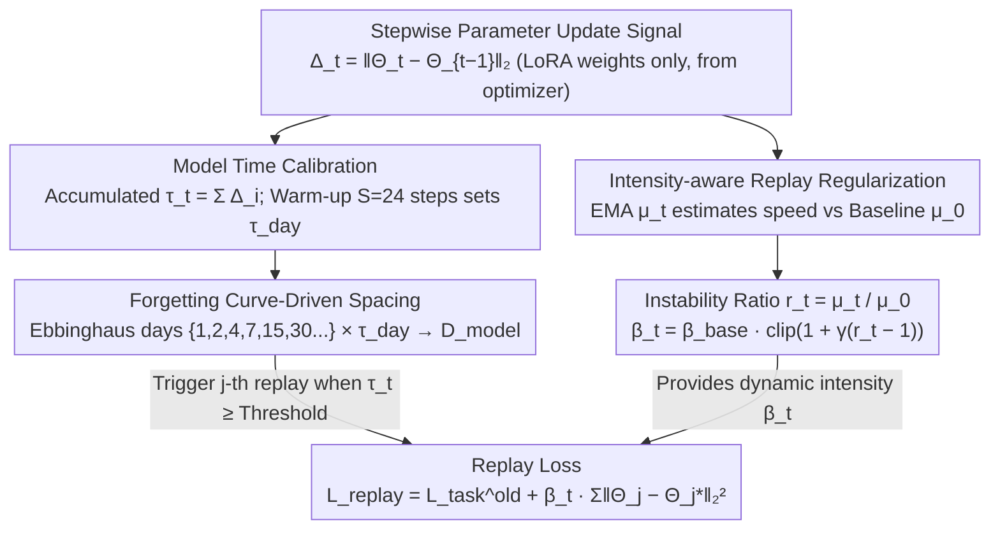

# FOREVER: Forgetting Curve-Inspired Memory Replay for Language Model Continual Learning

**Conference**: ACL 2026  
**arXiv**: [2601.03938](https://arxiv.org/abs/2601.03938)  
**Code**: https://github.com/WoodScene/FOREVER  
**Area**: Continual Learning / LLM / Memory Replay  
**Keywords**: Forgetting Curve, Model Time, Parameter Update Dynamics, Spaced Repetition, Catastrophic Forgetting

## TL;DR
The authors realign the "spaced repetition" concept of the Ebbinghaus forgetting curve from "training steps" to "model time" (accumulated parameter update norm $\Delta_t = \|\Theta_t - \Theta_{t-1}\|_2$). Specifically, cumulative model time $\tau_t$ determines **when to replay**, while the instability ratio $r_t$ (current update intensity $\mu_t$ vs. baseline $\mu_0$) adaptively controls **how to replay** (regularization strength). The method consistently outperforms SOTA across 3 CL benchmarks and 4 backbones (0.6B–13B), achieving OP +1.2% and BWT +0.9% over the strongest baseline VBM.

## Background & Motivation

**Background**: The primary objective of LLM Continual Learning (CL) is to learn new tasks sequentially without catastrophic forgetting of previous tasks. Replay-based methods, which periodically replay a small buffer of old samples, have become mainstream due to their simplicity and effectiveness. Their design centers on two core questions: **when to replay** and **how strongly to replay**.

**Limitations of Prior Work**: (a) Existing replay schedules are mostly hand-crafted heuristics, such as uniform intervals, fixed weights, or step-based Ebbinghaus intervals. (b) Even recent Ebbinghaus-inspired works (Zhong 2024, VBM 2025) assume that "training steps = time." However, identical step counts under different learning rates or batch sizes can lead to model changes differing by orders of magnitude—the same "7 days" may correspond to entirely different model states. (c) Replay intensity is typically fixed at $\beta$, failing to respond to whether the model is in a phase of "rapid change" or "stable convergence."

**Key Challenge**: The human forgetting curve is a function of "days passed." The true measure for models should not be calendar time but "how far the model has moved in the parameter space." Strictly aligning human time to model time has not been previously explored. Furthermore, replay intensity should be coupled with the current instability of the model, yet existing methods treat "when" and "how" as separate issues.

**Goal**: (i) Define a model-centric "time" for LLMs that is decoupled from optimization hyperparameters; (ii) map Ebbinghaus intervals using this time to determine when to replay; (iii) use the same update dynamics signal to drive the regularization strength (how to replay); (iv) validate across multiple backbones (0.6B–13B) and benchmarks.

**Key Insight**: The authors identify a conceptual mismatch between "human days" and "model days." They note that parameter update norm $\Delta_t$ directly quantifies "how far the model has traveled." This signal can be accumulated to measure "model time" and smoothed via EMA to estimate the "current moving speed of the model"—one signal answering two questions.

**Core Idea**: Replace step counts with accumulated parameter updates $\tau_t = \sum_i \Delta_i$ as model time. Use the instability ratio $r_t$ between recent update intensity $\mu_t$ and baseline $\mu_0$ to adaptively adjust regularization strength, unifying "when and how" under a single update dynamics signal.

## Method

### Overall Architecture
FOREVER deconstructs replay into two tightly coupled components that share the same signal (parameter update magnitude):
**(1) When to Replay — Forgetting Curve-inspired Replay Scheduler**: The accumulated parameter updates within a warm-up window of $S$ steps (where $S=24$) is defined as a "virtual model day" $\tau_{\text{day}}$. Human days from the Ebbinghaus curve $\mathcal{D}_{\text{human}}=\{1,2,4,7,15,30,...\}$ are mapped to $\mathcal{D}_{\text{model}}=\{d\cdot\tau_{\text{day}} \mid d\in\mathcal{D}_{\text{human}}\}$. Training tracks $\tau_t$ and triggers the $j$-th replay when $\tau_t \geq \mathcal{D}_{\text{model}}^{(j)}$. $\tau$ is reset at the start of each task.
**(2) How to Replay — Intensity-aware Replay Regularization**: An instability ratio $r_t = \mu_t/\mu_0$ is constructed using the baseline intensity $\mu_0 = \frac{1}{S}\sum_{t=1}^S \Delta_t$ and EMA $\mu_t = (1-\lambda)\mu_{t-1} + \lambda \Delta_t$. The replay regularization strength is $\beta_t = \beta_{\text{base}} \cdot \text{clip}(1 + \gamma(r_t - 1), g_{\min}, g_{\max})$. The final replay loss is $\mathcal{L}_{\text{replay}} = \mathcal{L}_{\text{task}}^{(\text{old})} + \beta_t \sum_j \|\Theta_j - \Theta_j^\star\|_2^2$, where $\Theta^\star$ is a snapshot from the end of the previous task. These two branches use the accumulation and EMA of $\Delta_t$ respectively, diverging from the same signal and merging at the replay loss.

### Key Designs

**1. Model Time Calibration: Measuring "how far the model moved" via accumulated parameter update norms instead of training steps.**

Identical step counts at lr=1e-4 and lr=1e-5 may correspond to entirely different model states. Locking replay frequency to steps forces tasks with different learning rates to "review at the same pace," leading to mismatch—a flaw in previous step-based Ebbinghaus methods (e.g., VBM). FOREVER uses the stepwise parameter update $\Delta_t = \|\Theta_t - \Theta_{t-1}\|_2$ (calculated only for trainable LoRA weights and retrieved directly from the optimizer) and accumulates it into model time $\tau_t = \sum_{i=1}^t \Delta_i$. This directly reflects the total distance traveled in parameter space and is more robust to learning rates and batch sizes than step counts. By using the accumulated updates of the first $S$ steps (set to 24) as the model-specific "virtual day" $\tau_{\text{day}} = \sum_{i=1}^S \Delta_i$, human Ebbinghaus days are converted to the model time axis. Replays are triggered when $\tau_t \geq \mathcal{D}_{\text{model}}^{(j)}$. Essentially, reviewing based on "how much the model has actually changed" is the correct application of Ebbinghaus's theory.

**2. Forgetting Curve-Driven Spaced Repetition: Aligning "dense-to-sparse" replay with the rapid-then-slow decay of human memory.**

The human forgetting curve exhibits rapid initial decay followed by slower decay. In training, this corresponds to large parameter changes in the early stages requiring frequent review, whereas late-stage stability allows for longer intervals. FOREVER adopts standard Ebbinghaus intervals $\{1,2,4,7,15,30,...\}$ as $\mathcal{D}_{\text{human}}$, mapped via $\tau_{\text{day}}$ to model-time thresholds. To prove that the structure (rather than a specific magic sequence) is what matters, the authors compared five schedules: Standard Ebbinghaus, Exponential $\{1,2,4,8,16,...\}$ Polynomial $\{1,4,9,16,...\}$ Uniform $\{2,4,6,8,...\}$ and Decreasing $\{15,7,4,2,1\}$. Results indicate that any increasing interval outperformed uniform or decreasing ones. Standard Ebbinghaus was slightly better than other parametric forms (OP 42.5 vs. Exponential 42.3 vs. Polynomial 41.5 vs. Uniform 40.9 vs. Decreasing 37.2). This demonstrates that FOREVER's success stems from dense-to-sparse structural alignment rather than over-fitted heuristics.

**3. Intensity-aware Replay Regularization: Allowing a single update signal to decide both when and how much to replay.**

A fixed replay intensity $\beta$ cannot respond to whether the model is undergoing volatile changes or stable convergence. FOREVER reuses $\Delta_t$: while it is accumulated for timing, its EMA $\mu_t = (1-\lambda)\mu_{t-1} + \lambda \Delta_t$ estimates current "velocity." Comparing this to the warm-up baseline $\mu_0$ yields the instability ratio $r_t = \mu_t/\mu_0$. The intensity is adjusted as $\beta_t = \beta_{\text{base}} \cdot \text{clip}(1 + \gamma(r_t - 1), g_{\min}, g_{\max})$; when $r_t>1$ (more aggressive), $\beta_t$ increases to strengthen constraints against forgetting; when $r_t<1$, $\beta_t$ shrinks to allow new task learning. This dynamic intensity is applied to an $L_2$ anchoring term:

$$\mathcal{L}_{\text{replay}} = \mathcal{L}_{\text{task}}^{(\text{old})} + \beta_t \sum_j \|\Theta_j - \Theta_j^\star\|_2^2$$

where $\Theta^\star$ is the snapshot from the end of the previous task. Using one $\Delta_t$ for both $\tau_t$ (timing) and $\mu_t$ (intensity) is the core of this elegant design, reducing independent hyperparameters compared to methods like SAPT or SSR.

### Loss & Training
The framework is LoRA-based for all baselines. Warm-up window $S=24$, EMA smoothing $\lambda=0.05$, $\beta_{\text{base}}=10^{-3}$, and clip range $[0.5, 3.0]$. The memory buffer stores 2% of original training data per task. All experiments report the average of 3 seeds.

## Key Experimental Results

### Main Results: Three CL Benchmarks (Qwen3-0.6B Backbone)

| Method | Standard CL OP↑ | BWT↑ | Long Sequence OP↑ | BWT↑ | SuperNI OP↑ | BWT↑ |
|------|----------------|------|-------------------|------|-------------|------|
| Fine-tuning (No CL) | 47.2 | -12.6 | 36.0 | -17.5 | 8.2 | -27.4 |
| EWC | 51.0 | -10.3 | 44.8 | -13.8 | 32.9 | -18.6 |
| O-LoRA | 59.4 | -7.9 | 54.1 | -12.4 | 23.7 | -17.5 |
| MixReplay | 65.8 | -8.0 | 65.1 | -11.4 | 34.6 | -14.1 |
| Fixed-interval Replay | 65.1 | -9.2 | 64.5 | -10.9 | 34.7 | -14.5 |
| SAPT | 68.8 | -6.9 | 67.2 | -8.8 | 38.5 | -6.2 |
| SSR | 68.4 | -7.1 | 67.5 | -9.0 | 40.1 | -5.4 |
| AIMMerging | 71.9 | -5.0 | 67.9 | -6.3 | 41.0 | -3.4 |
| VBM (step-based Ebbinghaus) | 71.5 | -5.2 | 68.1 | -6.1 | 41.3 | -3.7 |
| **FOREVER (Ours)** | **72.9** | **-4.7** | **69.4** | **-5.0** | **42.1** | **-2.9** |
| MTL (Upper Bound) | 77.4 | — | 77.8 | — | 48.2 | — |

The trends are consistent across backbones (Qwen3-0.6B/4B, LLaMA3.1-8B, LLaMA2-13B). On LLaMA3.1-8B vs. VBM: OP 49.0 → 50.6 (+1.6), BWT -2.9 → -2.1 (+0.8).

### Ablation Study (SuperNI, task order 7)

| Category | Variant | OP↑ | BWT↑ |
|------|------|-----|------|
| **Full** | FOREVER | 42.5 | -2.8 |
| Scheduler (§3.2.1) | + Fixed-interval (FIR) | 40.1 | -5.2 |
| | + Reversed Replay (RR) | 37.2 | -7.8 |
| | + End-only Replay (ER) | 40.9 | -6.9 |
| Time Calibration (§3.2.2) | + Step-based (STC) | 41.3 | -3.9 |
| Regularization (§3.2.3) | − IAR | 39.9 | -4.4 |
| | + EWC-style PIR | 42.7 | -3.0 |
| | + IAR & PIR | 42.8 | -2.6 |

### Key Findings
- **Model-centric time is more critical than step-based timing**: Switching calibration from update-dynamics to steps (STC) causes OP to drop from 42.5 to 41.3 (-1.2) and BWT from -2.8 to -3.9. This proves model time is fundamentally superior.
- **Increasing-spacing is the essence of Ebbinghaus**: Standard (42.5) ≈ Exponential (42.3) > Polynomial (41.5) > Uniform (40.9) ≫ Decreasing (37.2). The "dense-to-sparse" structure is what matters. Reversed Replay (RR) results in a collapse (OP 37.2), confirming that violating the forgetting curve causes disaster.
- **End-only Replay is inferior to distributed spacing**: OP 40.9 vs 42.5 proves that "spaced repetition" itself is important, not just the total amount of replay.
- **IAR is as effective as EWC-style PIR but cheaper**: Removing IAR drops OP to 39.9. Adding EWC-style Parameter Importance Regularization (PIR) only yields a marginal +0.2 gain but requires expensive importance estimation. Update intensity is a zero-cost equivalent signal.
- **IAR + PIR shows negligible gain (+0.1)**: Suggests both capture the same underlying "training instability" signal, providing a theoretical explanation for why PIR becomes redundant.
- **Visualization confirms non-uniform model time mapping**: $\Delta_t$ is large early and small late in each task. The same "7-day" Ebbinghaus threshold span varies between 140–180 steps across tasks, proving step-based scheduling is inherently mismatched.

## Highlights & Insights
- **Design Elegance**: Using a single signal ($\Delta_t$) to drive two separate decisions (when via $\tau_t$ and how via $\mu_t$) is parsimonious and interpretable. This "unified driver" approach is applicable to any exploration-exploitation or scheduling scenario.
- **Engineering Cognitive Science for LLMs**: Converting "human days" into "model days" $\tau_{\text{day}}$ makes the Ebbinghaus heuristic falsifiable for LLMs. This correction of conceptual mismatch is a profound contribution beyond just adding modules.
- **Zero Overhead**: Since $\Delta_t$ is retrieved from the optimizer, there is no extra forward/backward pass. FOREVER can be a drop-in scheduler for any replay-based CL method.
- **Defense-oriented Ablation**: The inclusion of FIR/RR/ER and STC addresses almost all potential design skepticism, which is a hallmark of high-quality methodology papers.

## Limitations & Future Work
- **Parameter update magnitude is an indirect proxy**: Cumulative updates may not directly map to semantic forgetting; future work could combine this with direct task diagnostics.
- **Ebbinghaus intervals are a preset prior**: While effective, they are manually specified. Learned or meta-learned schedules could be explored.
- **Scope limited to NLU and LoRA**: Performance in multimodal CL, full fine-tuning, or RLHF scenarios remains unverified.
- **Memory buffer fixed at 2%**: The relationship between buffer size and FOREVER gains was not systematically swept.
- **Empirical clip boundaries**: The range $[0.5, 3.0]$ for $\beta_t$ might require tuning for much larger models or varied tasks.

## Related Work & Insights
- **vs. VBM (Kang 2025)**: Both use Ebbinghaus spacing, but VBM uses steps. FOREVER’s OP +1.2 gain proves model time is the more reliable metric.
- **vs. EWC (Kirkpatrick 2017)**: FOREVER’s IAR achieves similar effects (42.7 vs 42.8) without calculating parameter importance, providing a cheaper alternative.
- **vs. SAPT / SSR / Recurrent-KIF**: These are replay methods with hand-crafted schedules; FOREVER's unified dynamics signal consistently outperforms them.
- **Insight**: Any mechanism relying on "time" (lr schedules, curriculum learning) should consider recalibration via update dynamics instead of step counts.

## Rating
- Novelty: ⭐⭐⭐⭐ Upgrading Ebbinghaus from step-based to model-time-based is a key insight; unified "when+how" design is elegant.
- Experimental Thoroughness: ⭐⭐⭐⭐⭐ Extensive benchmarks, backbones, and ablation cases.
- Writing Quality: ⭐⭐⭐⭐ Strong narrative on the conceptual mismatch (human vs. model days).
- Value: ⭐⭐⭐⭐ Low-overhead drop-in scheduler with potential for long-cycle continuous training (RLHF/Instruction Tuning).

<!-- RELATED:START -->

## Related Papers

- [\[ACL 2026\] Data Mixing Agent: Learning to Re-weight Domains for Continual Pre-training](data_mixing_agent_learning_to_re-weight_domains_for_continual_pre-training.md)
- [\[ACL 2026\] Working Memory Constraints Scaffold Learning in Transformers under Data Scarcity](working_memory_constraints_scaffold_learning_in_transformers_under_data_scarcity.md)
- [\[ACL 2026\] Fine-tuning vs. In-context Learning in Large Language Models: A Formal Language Learning Perspective](fine-tuning_vs_in-context_learning_in_large_language_models_a_formal_language_le.md)
- [\[ACL 2026\] KoCo: Conditioning Language Model Pre-training on Knowledge Coordinates](koco_conditioning_language_model_pre-training_on_knowledge_coordinates.md)
- [\[ACL 2025\] Towards Effective and Efficient Continual Pre-training of Large Language Models](../../ACL2025/llm_pretraining/towards_effective_and_efficient_continual_pre-training_of_large_language_models.md)

<!-- RELATED:END -->
