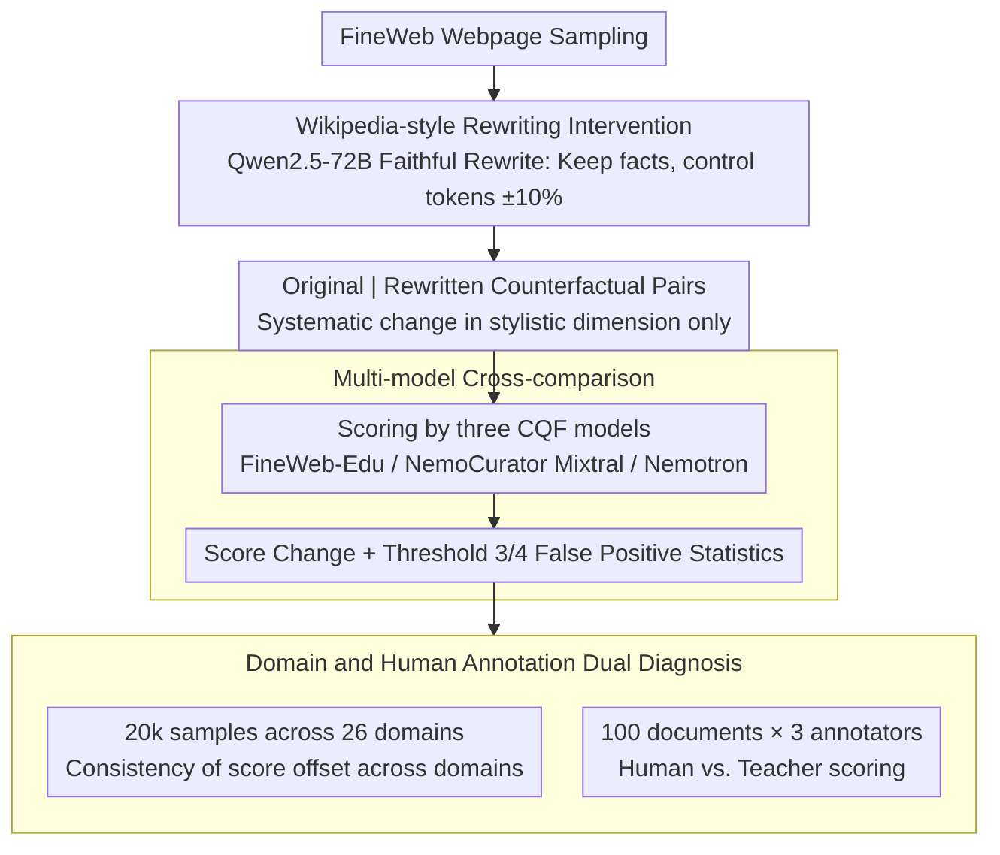

# Is a Document Educational or Just Wikipedia-Style? -- Pitfalls of Classifier-Based Quality Filtering

**Conference**: ACL2026  
**arXiv**: [2605.23721](https://arxiv.org/abs/2305.23721)  
**Code**: https://github.com/mklimasz/cqf-pitfalls  
**Area**: LLM Pre-training / Data Quality Filtering  
**Keywords**: Pre-training corpus, quality filtering, educational classifier, data bias, Wikipedia-style rewriting  

## TL;DR
This paper discovers that Classifier-based Quality Filtering (CQF) mistakenly equates "Wikipedia-style writing" with "higher educational value." Simple rewriting allows low-quality web pages to bypass pre-training data filtering thresholds, causing approximately 7% of samples in FineWeb-Edu to flip their filtering decisions.

## Background & Motivation
**Background**: Modern LLM pre-training corpus construction increasingly relies on quality filtering. Beyond heuristic rules such as language identification, deduplication, and character ratios, datasets like FineWeb-Edu, DCLM, and Nemotron-CC have begun using Classifier-based Quality Filtering (CQF). This involves small classifiers scoring web pages for "educational value" to determine their inclusion in the pre-training corpus.

**Limitations of Prior Work**: While CQF appears to be a scalable quality judge, it essentially mimics the scoring preferences of an LLM teacher. If the teacher confuses writing style, layout habits, or domain distribution with educational value, the student classifier inherits these biases.

**Key Challenge**: The massive scale of pre-training corpora makes manual verification nearly impossible. The more one relies on automated filtering, the more critical it becomes for the filter to identify genuine content quality rather than superficial "textbook-like" or "encyclopedic" styles. Otherwise, low-quality content can bypass filters simply by changing its presentation.

**Goal**: The authors aim to examine whether CQF models are truly judging the educational value of text or simply favoring Wikipedia-style organization and linguistic patterns.

**Key Insight**: The paper designs a direct intervention experiment: keeping original facts largely unchanged while rewriting web pages into a Wikipedia style, then comparing CQF scores and filtering decisions before and after the rewrite.

**Core Idea**: If merely changing the style significantly increases CQF scores, then "educational classifiers" utilize stylistic shortcuts and cannot be equated with true data quality judgment.

## Method

### Overall Architecture
The paper does not propose a new training algorithm but performs a diagnostic experiment on CQF. The process consists of two steps: first, randomly sampling web pages from FineWeb and using Qwen2.5-72B-Instruct to rewrite them into Wikipedia-style text (requiring preservation of facts, entities, dates, and approximate token counts); second, feeding both original and rewritten texts into multiple CQF models to compare score changes, threshold flips, and domain distribution biases.

The authors further perform two supplementary analyses: first, using an Nvidia domain classifier to categorize text into 26 domains to check if score shifts are consistent across domains; second, having three human annotators score 100 documents according to the original FineWeb-Edu educational prompt to determine if the bias stems from the student classifier or the teacher LLM labels themselves.

### Key Designs

**1. Wikipedia-style Rewriting Intervention: Constructing counterfactual samples with modified style and fixed facts**

To answer whether CQF evaluates content or style, the cleanest method is to fix the content of a webpage while changing its presentation. The authors use Qwen2.5-72B-Instruct to rewrite FineWeb pages into a format similar to Wikipedia entries. The prompt explicitly forbids introducing new facts, requires retaining original dates, locations, and entities, and constrains token counts within $\pm 10\%$ of the original. Thus, the only systematic change is the "encyclopedic tone." If CQF scores rise significantly, it indicates the classifier relies on stylistic shortcuts.

**2. Multi-model Cross-comparison: Ensuring conclusions are not specific to the FineWeb-Edu classifier**

Bias in a single model might be accidental. Therefore, the authors compare three mainstream CQF models: FineWeb-Edu, NemoCurator Mixtral, and NemoCurator Nemotron. All three are lightweight classifiers built on BERT-scale embedding models (like Snowflake-Arctic-Embed-M) designed for large-scale filtering. If three independently trained models show consistent score inflation under the same intervention, the problem likely resides in the "educational filtering paradigm" itself or their shared teacher labeling preferences.

**3. Domain and Human Annotation Dual Diagnosis: Locating whether bias is cross-domain and teacher-derived**

To clarify the source of bias, the authors perform two layers of diagnosis. At the domain level, they use an Nvidia domain classifier to sort text into 26 domains, sampling 20,000 instances per domain to compare original and rewritten score distributions. Consistent inflation across all domains would indicate a paradigm-level systematic bias. At the supervision level, they select 100 documents with large score gaps for human annotation using the FineWeb-Edu educational rubric. If human scores are systematically lower than the LLM teacher's, it points to a "source illness": the bias inherited by CQF stems from the teacher being overly optimistic.

### Loss & Training
This paper does not train new models; it focuses on evaluation protocols. CQF scores typically range from 0 to 5, with common thresholds at 3 or 4. The Wikipedia rewriting prompt emphasizes "modifying form, not adding facts," while the educational scoring prompt follows the FineWeb-Edu 5-point additive standard. Human annotators use the same prompt to facilitate comparison between LLM teacher and human judgment.

## Key Experimental Results

### Main Results

| CQF Model | Original Avg. Score | Wikipedia-style Avg. Score | Score Change | Interpretation |
|-----------|---------------------|----------------------------|--------------|----------------|
| FineWeb-Edu | 1.19 | 1.49 | +0.30 | Most robust on average, but false positives at high thresholds remain significant |
| NemoCurator Mixtral | 1.17 | 1.60 | +0.43 | Largest score inflation from stylistic rewriting |
| NemoCurator Nemotron | 1.18 | 1.59 | +0.41 | Similar to Mixtral, showing clear preference for encyclopedic expression |

### Ablation Study

| Analysis Item | Data / Setting | Key Results | Meaning |
|---------------|----------------|-------------|---------|
| Threshold 3 False Positives | Samples with original score $\leq 2$, filtered at threshold 3 after rewrite | >7% for NemoCurator Mixtral, ~5% for Nemotron, ~6% for FineWeb-Edu would pass | Low-quality content can cross filtering thresholds via style changes |
| Threshold 4 False Positives | Stricter threshold 4 | ~1% for FineWeb-Edu still pass | Increasing thresholds cannot fully eliminate stylistic loopholes |
| Domain Sensitivity | 26 domains, 20k samples/domain | Rewritten text avg score > original in all domains | Stylistic bias is consistent across domains |
| Human Educational Labels | 100 docs, 3 annotators | Humans average 0.77 points lower than Llama 3.1 70B teacher | Bias likely stems from the teacher's labels, not just the student classifier |

### Key Findings
- Wikipedia-style rewriting yields systematic score inflation across all three CQF models, indicating "educational" scores are heavily confounded by stylistic preferences.
- While FineWeb-Edu has the smallest average score gap, it still admits approximately 6% of originally low-scoring samples at practical thresholds; this suggests average robustness does not imply decision robustness.
- Domain analysis shows CQF prefers certain domains. If downstream models require data from low-preference domains, fixed thresholds may systematically weaken domain coverage.
- Human scores are ~0.77 points lower than the LLM teacher, suggesting that "overly optimistic teacher labeling" is the upstream source of CQF bias.

## Highlights & Insights
- The experimental design is simple but incisive: by altering style without changing facts, the flipped filtering decisions strongly prove the classifier has learned superficial shortcuts.
- It links data poisoning risks with data filtering bias. Malicious content does not necessarily need complex attacks; simply packaging it in an "encyclopedic" format may increase its probability of entering the pre-training corpus.
- The insight for pre-training corpus construction is that quality filtering should not rely on a single CQF score; it should combine content consistency, source reputation, domain quotas, and adversarial stylistic perturbation tests.
- This work reminds evaluators that LLM-as-teacher labeling prompts require auditing; student model biases may just be amplified versions of teacher biases.
- A deeper insight is that filters need to remain stable under "faithful rewriting" rather than automatically treating formatting, heading hierarchies, and encyclopedic tone as evidence of high quality.

## Limitations & Future Work
- The authors acknowledge that automated rewriting introduces noise; the exact percentages are approximations of the problem scale rather than precise estimates of bypass rates on the real internet.
- The experiment primarily investigates Wikipedia-style rewriting and does not systematically explore other styles, such as textbook-style, Q&A, academic abstracts, or malicious SEO-style text.
- The paper does not use the falsely admitted data to actually pre-train downstream models; hence, the final impact of these CQF loopholes on model capability, safety, or bias is not yet quantified.
- Human annotation scale is limited to 100 documents—sufficient to suggest teacher bias but insufficient to establish a complete human quality standard.

## Related Work & Insights
- **vs FineWeb-Edu**: FineWeb-Edu distills LLM labels into lightweight CQF models for large-scale filtering; this paper points out it may misidentify Wikipedia-style writing as high educational value.
- **vs Nemotron-CC / Nemotron-CLIMB**: The Nemotron series emphasizes quality and domain mixing; the domain sensitivity results here suggest CQF scores should be audited alongside domain ratios.
- **vs Traditional Heuristic Filtering**: Heuristics like language ID and perplexity are transparent but coarse; CQF is flexible but opaque. Future work may require a combination of both with adversarial robustness checks.
- **Inspiration for Future Research**: "Style invariance" test sets could be constructed, requiring quality filters to remain stable under faithful rewrites and sensitive only to genuine changes in content quality.

## Rating
- **Novelty**: ⭐⭐⭐⭐☆ Problem framing is very clear, intervention design is persuasive; method is more diagnostic than algorithmic.
- **Experimental Thoroughness**: ⭐⭐⭐⭐☆ Covers three CQF models, 100k samples, 26 domains, and human annotation; lacks downstream impact verification.
- **Writing Quality**: ⭐⭐⭐⭐☆ Concise and direct; conclusions are clear, though some key percentages are in text and could be more fully tabulated.
- **Value**: ⭐⭐⭐⭐⭐ Highly relevant for pre-training data filtering, data poisoning defense, and LLM teacher labeling audits.

<!-- RELATED:START -->

## Related Papers

- [\[ICCV 2025\] ConstStyle: Robust Domain Generalization with Unified Style Transformation](../../ICCV2025/llm_pretraining/conststyle_robust_domain_generalization_with_unified_style_transformation.md)
- [\[AAAI 2026\] Perspective from a Broader Context: Can Room Style Knowledge Help Visual Floorplan Localization?](../../AAAI2026/llm_pretraining/perspective_from_a_broader_context_can_room_style_knowledge_help_visual_floorpla.md)
- [\[ACL 2025\] CritiQ: Mining Data Quality Criteria from Human Preferences](../../ACL2025/llm_pretraining/critiq_mining_data_quality_criteria_from_human_preferences.md)
- [\[AAAI 2026\] Beyond Cosine Similarity: Magnitude-Aware CLIP for No-Reference Image Quality Assessment](../../AAAI2026/llm_pretraining/beyond_cosine_similarity_magnitude-aware_clip_for_no-reference_image_quality_ass.md)
- [\[NeurIPS 2025\] Predict Training Data Quality via Its Geometry in Metric Space](../../NeurIPS2025/llm_pretraining/predict_training_data_quality_via_its_geometry_in_metric_space.md)

<!-- RELATED:END -->
