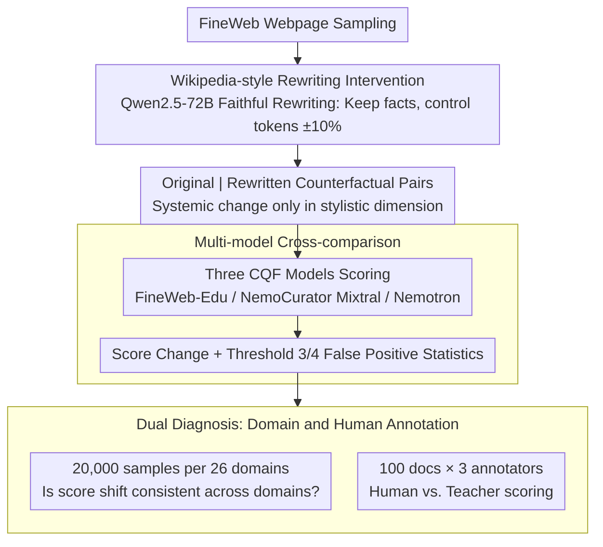

# Is a Document Educational or Just Wikipedia-Style? -- Pitfalls of Classifier-Based Quality Filtering

**Conference**: ACL2026  
**arXiv**: [2605.23721](https://arxiv.org/abs/2605.23721)  
**Code**: https://github.com/mklimasz/cqf-pitfalls  
**Area**: LLM Pre-training / Data Quality Filtering  
**Keywords**: Pre-training corpus, quality filtering, educational classifier, data bias, Wikipedia-style rewriting  

## TL;DR
This paper discovers that Classifier-based Quality Filtering (CQF) mistakenly equates "Wikipedia-style writing" with "higher educational value." Simple rewriting allows low-quality web pages to bypass pre-training data filtering thresholds; approximately 7% of samples in FineWeb-Edu flip their filtering decisions as a result.

## Background & Motivation
**Background**: Modern LLM pre-training corpus construction increasingly relies on quality filtering. Beyond heuristic rules like language identification, deduplication, and character ratios, datasets such as FineWeb-Edu, DCLM, and Nemotron-CC have begun using Classifier-based Quality Filtering (CQF), where small classifiers assign "educational value" scores to web pages to determine their inclusion in the pre-training corpus.

**Limitations of Prior Work**: While CQF appears to be a scalable quality judge, it essentially mimics the scoring preferences of an LLM teacher. If the teacher mistakes writing style, formatting habits, or domain distribution for educational value, the student classifier inherits these biases.

**Key Challenge**: The scale of pre-training corpora is massive, making manual verification nearly impossible. The more specialized automatic filtering becomes, the more it needs to identify true content quality rather than superficial "textbook/encyclopedia" styles. Otherwise, low-quality content can bypass filters simply by changing its writing style.

**Goal**: The authors aim to test a specific question: are CQF models judging whether text has educational value, or are they preferring Wikipedia-like organization and linguistic style?

**Key Insight**: The paper designs a direct intervention experiment: keep the original facts largely unchanged while rewriting web pages into a Wikipedia style, then compare the CQF scores and filtering decisions before and after the rewrite.

**Core Idea**: If merely changing the style significantly increases CQF scores, then "educational classifiers" possess stylistic shortcuts and cannot be directly equated to true data quality judges.

## Method

### Overall Architecture
Instead of proposing a new training algorithm, the paper conducts a diagnostic experiment targeted at CQF. The process consists of two steps: first, randomly sampling web pages from FineWeb and using Qwen2.5-72B-Instruct to rewrite them into Wikipedia-style text (requiring facts, entities, dates, and token counts to remain consistent); second, inputting the original and rewritten texts into multiple CQF models to compare score changes, threshold flips, and domain distribution biases.

The authors further perform two supplementary analyses: first, using the Nvidia domain classifier to categorize text into 26 domains to check if score shifts are consistent across domains; second, having three human annotators score 100 documents according to the original FineWeb-Edu educational prompt to determine if the bias stems from the student classifier or the teacher LLM labels themselves.

### Key Designs

**1. Wikipedia-style Rewriting Intervention: Constructing counterfactual samples with style changes only**

To answer whether CQF evaluates content or style, the cleanest method is to fix the content of a webpage and only change its presentation. The authors use Qwen2.5-72B-Instruct to rewrite FineWeb pages into a format similar to Wikipedia entries. The prompt explicitly forbids introducing new facts, requires preserving original dates, locations, and entities, and controls the token count within $\pm 10\%$ of the original. Thus, the only systemic change is the "encyclopedic tone." If CQF scores rise significantly, it indicates the classifier relies on stylistic shortcuts.

**2. Multi-model Cross-comparison: Ensuring conclusions are not specific to one model**

Bias in a single model might be accidental. Therefore, the authors compare three mainstream CQF models: FineWeb-Edu, NemoCurator Mixtral, and NemoCurator Nemotron. All three are built on BERT-scale embedding models like Snowflake-Arctic-Embed-M, designed as lightweight classifiers for large-scale filtering. Consistency across three independently trained models suggests the issue is rooted in the "educational filtering paradigm" or shared teacher labeling preferences.

**3. Dual Diagnosis: Identifying domain invariance and teacher bias**

To isolate the source of bias, the authors perform two layers of diagnosis. At the domain level, they use the Nvidia domain classifier to categorize text into 26 domains, sampling 20,000 instances per domain. Consistent score inflation across all domains would indicate a systemic paradigm-level bias. At the supervision level, they select 100 documents with large score deltas and have three annotators re-score them using the FineWeb-Edu educational rubric. If human scores are systematically lower than the LLM teacher, it points to the upstream "pathology": CQF inherits bias from an overly optimistic teacher, which the student then amplifies.

### Loss & Training
This work does not train new models but defines an evaluation protocol. CQF scores typically range from 0 to 5, with common thresholds at 3 or 4. The Wikipedia rewriting prompt emphasizes "change format, not facts," and the educational scoring prompt follows the FineWeb-Edu 5-point additive standard. Human annotation uses the same prompt for direct comparison with the LLM teacher.

## Key Experimental Results

### Main Results

| CQF Model | Original Avg Score | Wikipedia-style Avg Score | Score Change | Interpretation |
|-----------|--------------------|---------------------------|--------------|----------------|
| FineWeb-Edu | 1.19 | 1.49 | +0.30 | Most robust on average, but false positives at high thresholds remain evident |
| NemoCurator Mixtral | 1.17 | 1.60 | +0.43 | Largest score inflation from stylistic rewriting |
| NemoCurator Nemotron | 1.18 | 1.59 | +0.41 | Similar to Mixtral, clearly prefers encyclopedic expression |

### Ablation Study

| Analysis Item | Data / Setting | Key Results | Implications |
|---------------|----------------|-------------|--------------|
| Threshold 3 False Positives | Samples with original score $\leq 2$ | Over 7% for NemoCurator Mixtral, ~5% for Nemotron, ~6% for FineWeb-Edu pass after rewriting | Low-quality content can bypass common thresholds via stylistic rewriting |
| Threshold 4 False Positives | Stricter threshold 4 | ~1% for FineWeb-Edu still fails to be filtered | Increasing the threshold does not fully eliminate stylistic loopholes |
| Domain Sensitivity | 26 domains, 20k samples each | Rewritten text scores higher across all domains | Stylistic bias is consistent across domains |
| Human Educational Labeling | 100 docs, 3 annotators | Humans average 0.77 points lower than Llama 3.1 70B teacher | Bias likely stems from the teacher's labels, not just the student classifier |

### Key Findings
- Wikipedia-style rewriting has a systemic score-boosting effect on all three CQF models, indicating that "educational" scores are heavily confounded by stylistic preferences.
- While FineWeb-Edu shows the smallest average score difference, it still admits about 6% of originally low-scoring samples at a threshold of 3, reminding us that average robustness does not equal decision robustness.
- Domain analysis shows CQF prefers certain domains. Fixed thresholds might systematically disadvantage domains with low latent preference.
- Human scores are ~0.77 points lower than the LLM teacher, suggesting that "overly optimistic teacher labels" are the primary source of CQF bias.

## Highlights & Insights
- The experimental design is simple but strikes the core issue: by isolating style from facts, the authors provide strong evidence of the classifiers learning "surface shortcuts."
- It connects data poisoning risks with filtering bias. Malicious content does not require complex attacks; simply packaging it in an "encyclopedic" format can increase its probability of entering the pre-training corpus.
- For pre-training corpus construction: quality filtering should not rely solely on a single CQF score. It should combine content consistency, source reputation, domain quotas, and adversarial style perturbation tests.
- This work alerts evaluators that LLM-as-teacher prompts require auditing; student model bias may just be an amplified version of teacher bias.
- A deeper insight is that filters need to remain stable under "faithful rewriting" rather than automatically treating standard formatting, header hierarchies, and encyclopedic tone as evidence of high quality.

## Limitations & Future Work
- The authors acknowledge that automatic rewriting introduces noise; the exact percentages are approximations of the problem scale rather than precise estimates of bypass rates on the real internet.
- The experiments primarily investigate Wikipedia-style rewriting without systematically exploring other styles, such as textbook, Q&A, academic abstracts, or malicious SEO text.
- The paper does not use the bypassed data to actually pre-train downstream models, thus it cannot quantify the final impact of these CQF loopholes on model capabilities, safety, or bias.
- The manual annotation scale is only 100 documents, which is enough to suggest teacher bias but insufficient to establish a comprehensive human quality standard.

## Related Work & Insights
- **vs. FineWeb-Edu**: FineWeb-Edu distills LLM labels into lightweight CQF models for large-scale filtering; this paper points out it may mistake Wikipedia-style writing for high educational value.
- **vs. Nemotron-CC / Nemotron-CLIMB**: The Nemotron series emphasizes data quality and domain mixing; this paper's domain sensitivity results suggest CQF scores should be audited alongside domain ratios.
- **vs. Traditional Heuristic Filtering**: Rules like language ID and perplexity are transparent but coarse, while CQF is flexible but opaque. Future work may require a combination of both with added adversarial robustness checks.
- **Insights for Future Research**: A "style invariance" test set could be constructed, requiring quality filters to remain stable under faithful rewriting and sensitive only to actual content quality changes.

## Rating
- Novelty: ⭐⭐⭐⭐☆ The problem angle is very clear, and the intervention design is persuasive; the method is a diagnostic experiment rather than a complex algorithm.
- Experimental Thoroughness: ⭐⭐⭐⭐☆ Covers three CQF models, 100k samples, 26 domains, and human annotation; lacks downstream pre-training impact validation.
- Writing Quality: ⭐⭐⭐⭐☆ Short and direct with clear conclusions; some key percentages are in the text and could be more completely tabulated.
- Value: ⭐⭐⭐⭐⭐ Highly relevant for pre-training data filtering, data poisoning defense, and LLM teacher annotation auditing.

<!-- RELATED:START -->

## Related Papers

- [\[ICCV 2025\] ConstStyle: Robust Domain Generalization with Unified Style Transformation](../../ICCV2025/llm_pretraining/conststyle_robust_domain_generalization_with_unified_style_transformation.md)
- [\[AAAI 2026\] Perspective from a Broader Context: Can Room Style Knowledge Help Visual Floorplan Localization?](../../AAAI2026/llm_pretraining/perspective_from_a_broader_context_can_room_style_knowledge_help_visual_floorpla.md)
- [\[ICLR 2026\] GneissWeb: Preparing High Quality Data for LLMs at Scale](../../ICLR2026/llm_pretraining/gneissweb_preparing_high_quality_data_for_llms_at_scale.md)
- [\[ICLR 2026\] Scaling Laws Revisited: Modeling the Role of Data Quality in Language Model Pretraining](../../ICLR2026/llm_pretraining/scaling_laws_revisited_modeling_the_role_of_data_quality_in_language_model_pretr.md)
- [\[ACL 2025\] SCAR: Data Selection via Style Consistency-Aware Response Ranking for Efficient Instruction-Tuning](../../ACL2025/llm_pretraining/scar_style_consistency_data_selection.md)

<!-- RELATED:END -->
