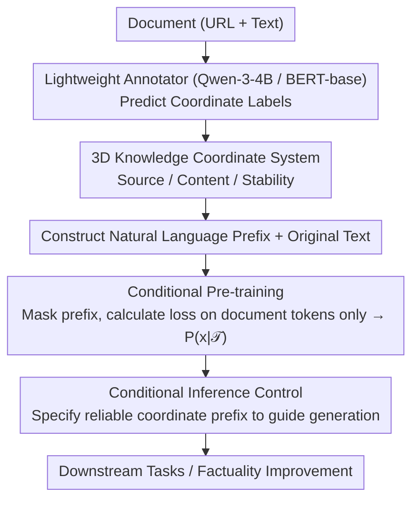

# KoCo: Conditioning Language Model Pre-training on Knowledge Coordinates

**Conference**: ACL 2026  
**arXiv**: [2604.12397](https://arxiv.org/abs/2604.12397)  
**Code**: None  
**Area**: LLM Safety / Pre-training  
**Keywords**: Knowledge Coordinates, Conditional Pre-training, Hallucination Mitigation, Data Contextualization, Pre-training Acceleration

## TL;DR

Ours proposes Knowledge Coordinate (KoCo) conditioning for pre-training, which maps each document to a three-dimensional semantic coordinate (Source, Content, Stability). These coordinates are injected into pre-training as text prefixes, providing the model with explicit context-awareness. This approach improves performance across 10 downstream tasks, accelerates convergence by approximately 30%, and effectively mitigates hallucinations.

## Background & Motivation

**Background**: Standard LLM pre-training treats the corpus as a flat sequence of tokens, undifferentiatedly optimizing the negative log-likelihood of the next token—regardless of whether it originates from a peer-reviewed theorem or a trivial social forum post. This stands in sharp contrast to human learning, where readers naturally contextualize information based on its source and role.

**Limitations of Prior Work**: Recent improvement attempts fall into two categories. Metadata-aware pre-training (e.g., MeCo) identifies sources via URL prefixes, but URLs are too fine-grained, rely on prior mappings, and lack objectivity. Data selection methods (e.g., ASK-LLM) use classifiers to filter high-quality data in a binary manner—retaining high-quality data while discarding the rest. Unlike these methods, humans do not directly "delete" poor-quality information; instead, they contextualize it according to its source and nature.

**Key Challenge**: Existing methods either provide superficial contextual signals (URLs) or directly discard "low-quality" data rather than helping the model understand its limitations. A more structured way is required to allow models to perceive the position of each document in the knowledge space.

**Goal**: Design a simple and effective pre-training method that provides an objective knowledge coordinate description for each document, enabling the model to acquire human-like context-awareness during the pre-training stage.

**Key Insight**: Inspired by the DIKW (Data-Information-Knowledge-Wisdom) hierarchy, each document is mapped into a three-dimensional semantic space—Source, Content, and Stability. These are injected into pre-training as natural language prefixes, allowing the model to distinguish between "evergreen physical theorems" and "transient social opinions."

## Method

### Overall Architecture

KoCo transforms the standard pre-training objective from $P(x)$ to a conditional distribution $P(x|\mathcal{T})$, where $\mathcal{T} = (s, c, t)$ is a triplet of knowledge coordinates for the document. The workflow is as follows: (1) Use a lightweight language model (Qwen-3-4B) as an annotator to predict three-dimensional coordinate labels based on the document's URL and text; (2) concatenate labels into a natural language prefix (e.g., "Source: Academic; Content: Reference; Stability: Evergreen") and prepend it to the original text; (3) calculate loss only on document tokens during pre-training (masking the prefix part). The training objective is:

$$\mathcal{L}_{\text{KoCo}} = -\sum_{i=1}^{n} \log P_\theta(x_i | x_{<i}, \mathcal{T})$$

### Key Designs

**1. 3D Knowledge Coordinate System: Positioning documents in knowledge space with objective, topic-agnostic meta-descriptions**

Standard pre-training treats all tokens equally, but humans first judge where a text comes from and its nature. KoCo explicates this judgment into three orthogonal dimensions: **Source** (10 categories like Academic/Media/Community/Personal), **Content** (11 categories like Instructional/Pedagogical/Discussion/Opinion), and **Stability** (4 levels of temporal stability: Ephemeral/Decaying/Long-term/Evergreen). Unlike superficial signals like URLs, these dimensions characterize the essential attributes of information, enabling the model to distinguish "evergreen physical theorems" from "transient social viewpoints." Over 99.5% of documents in the DCLM corpus were successfully mapped to this system, and ablation studies confirm that these three dimensions capture complementary information.

**2. Conditional Inference Control: Integrating controllable signals into pre-training that are typically reserved for the alignment stage**

Since coordinates are injected as prefixes during pre-training, they can conversely be used to guide model behavior during inference. Specific prefixes were designed for different tasks, such as {Source: Media; Content: Discussion} for Social IQA and {Source: Academic; Content: Pedagogical} for LogiQA. More crucially, for factuality control, specifying a reliable source prefix (e.g., {Source: Publication; Content: Instructional; Stability: Long-term}) resulted in a 3.78% improvement on TruthfulQA. This means users can actively suppress unreliable outputs by specifying appropriate knowledge coordinates during inference—a controllability that KoCo shifts from the alignment stage up to pre-training.

**3. Annotator Independence Verification: Proving gains stem from coordinate conditioning itself, not knowledge distillation from a large annotator**

A natural concern is whether KoCo's improvements are merely distilled knowledge from the Qwen-3-4B annotator. To exclude this, a BERT-base model with only 110M parameters was used as an alternative annotator—significantly smaller than the 0.6B model being pre-trained—trained on only 50K labeled samples. If the gains were from distillation, the effect should have dropped significantly with a weaker annotator. However, experimental results showed both annotators yielded comparable performance, confirming that the gains come from the "conditioning mechanism" rather than knowledge distillation.

### Loss & Training

During pre-training, loss is calculated only on document tokens, while prefix tokens are masked. Continual pre-training was performed on a MeCo 1.6B checkpoint using a 100GB subset of the DCLM corpus. When pre-training from scratch, KoCo demonstrated approximately 30% convergence acceleration on both 0.3B and 0.6B models.

## Key Experimental Results

### Main Results

Continual pre-training on the MeCo 1.6B checkpoint, evaluated across 10 downstream tasks:

| Method | COPA | ARC-e | ARC-c | CSQA | IFEval | OBQA | PIQA | SIQA | LogiQA | TruQA | Average |
|------|------|-------|-------|------|--------|------|------|------|--------|-------|------|
| MeCo (URL Prefix) | 82.0 | 75.4 | 44.4 | 64.0 | 20.0 | 50.8 | 73.0 | 52.9 | 25.5 | 36.3 | 52.42 |
| Standard Continual | 82.0 | 74.6 | 42.8 | 59.5 | 22.2 | 49.6 | 72.9 | 52.7 | 24.9 | 35.2 | 51.64 |
| Data Selection | 82.0 | 75.0 | 44.6 | 63.3 | 22.4 | 49.0 | 74.0 | 52.6 | 25.2 | 35.5 | 52.36 |
| **Ours (KoCo)** | **83.0** | **77.4** | 44.1 | 61.8 | **25.5** | **51.2** | **74.8** | **53.4** | **26.9** | **36.6** | **53.48** |

### Ablation Study

| Setting | ARC-e | ARC-c | OBQA | PIQA | Average |
|------|-------|-------|------|------|------|
| w/o Source | 76.2 | 44.1 | 50.2 | 73.7 | 53.43 |
| w/o Content | 76.6 | 43.6 | 51.2 | 74.1 | 53.46 |
| w/o Stability | 76.7 | 43.1 | 51.0 | 73.8 | 53.32 |
| KoCo (Full) | 77.4 | 44.1 | 51.2 | 74.8 | **53.48** |

### Key Findings

- KoCo uses the same data as MeCo (DCLM corpus) and significantly improves performance without additional data, with an average increase of 1.06%.
- Standard continual pre-training actually decreased MeCo checkpoint performance, and data selection only performed comparably—indicating that simple data manipulation is insufficient and structured conditional signals are necessary.
- Conditional inference improved TruthfulQA by 3.78%, far exceeding other tasks—suggesting the model learned the correlation between source reliability and factuality.
- Using unreliable source prefixes (e.g., Personal/x.com + Opinion + Ephemeral) dropped TruthfulQA scores to 34.75%, while reliable source prefixes increased them to 40.39%.
- PCA visualization showed that the KoCo-trained model clearly separates factual and opinionated statements in its representation space.

## Highlights & Insights

- **Cognitively Inspired Design**: The 3D knowledge coordinates simulate the human cognitive process of "knowing the source and nature of information." The concept is simple yet effective.
- **New Path for Hallucination Mitigation**: By teaching the model to distinguish between reliable and unreliable sources during pre-training, it provides a fundamental method for reducing hallucinations rather than post-training fixes.
- **Bridging Pre-training and Alignment**: KoCo moves control signals from the alignment stage to pre-training, suggesting that some alignment goals can be shifted upstream to simplify downstream fine-tuning.
- **No Discarding of Low-Quality Data**: Unlike data selection methods, KoCo retains all data but labels its properties, allowing the model to learn from all data while understanding its context.

## Limitations & Future Work

- Experimental scale was limited to 0.3B-1.6B models; effectiveness on larger models remains to be verified.
- Annotator accuracy (approx. 75-83% consistency with commercial models) contains noise, potentially limiting coordinate precision.
- The 3D coordinate system is handcrafted; it is unclear if more dimensions or automatically discovered coordinates would be superior.
- The 30% pre-training acceleration was only verified on small models trained from scratch and requires confirmation in large-scale settings.
- Conditional inference requires manual selection of appropriate coordinate prefixes; automated selection mechanisms need further research.

## Related Work & Insights

- **vs MeCo (URL Prefix)**: MeCo uses URLs as source identifiers, which are too fine-grained and rely on priors; KoCo uses structured 3D coordinates, providing more objective and informative conditional signals.
- **vs Data Selection**: Data selection uses a binary "keep/discard" strategy; KoCo retains all data but labels attributes, teaching the model to understand different qualities of information in context.
- **vs RLHF/SFT Alignment**: KoCo introduces controllability into the pre-training stage, offering a new approach for "upstream alignment."

## Rating

- Novelty: ⭐⭐⭐⭐ The concept of knowledge coordinates is novel, the 3D classification system is well-designed, and the cognitive motivation is persuasive.
- Experimental Thoroughness: ⭐⭐⭐⭐ Evaluations on 10 downstream tasks, training from scratch, ablation studies, and annotator independence tests are comprehensive, though model scale is small.
- Writing Quality: ⭐⭐⭐⭐⭐ Clear motivation, concise methodology, and deep analysis, particularly the discussion on complementarity and limitations.
- Value: ⭐⭐⭐⭐ The method is simple and reproducible, providing practical guidance for pre-training data utilization and hallucination mitigation.

<!-- RELATED:START -->

## Related Papers

- [\[ICML 2025\] Metadata Conditioning Accelerates Language Model Pre-training](../../ICML2025/llm_pretraining/metadata_conditioning_accelerates_language_model_pre-training.md)
- [\[ACL 2026\] FOREVER: Forgetting Curve-Inspired Memory Replay for Language Model Continual Learning](forever_forgetting_curve-inspired_memory_replay_for_language_model_continual_lea.md)
- [\[ACL 2026\] Data Mixing Agent: Learning to Re-weight Domains for Continual Pre-training](data_mixing_agent_learning_to_re-weight_domains_for_continual_pre-training.md)
- [\[ACL 2026\] Fine-tuning vs. In-context Learning in Large Language Models: A Formal Language Learning Perspective](fine-tuning_vs_in-context_learning_in_large_language_models_a_formal_language_le.md)
- [\[ICML 2026\] FlexRank: Nested Low-Rank Knowledge Decomposition for Adaptive Model Deployment](../../ICML2026/llm_pretraining/flexrank_nested_low-rank_knowledge_decomposition_for_adaptive_model_deployment.md)

<!-- RELATED:END -->
