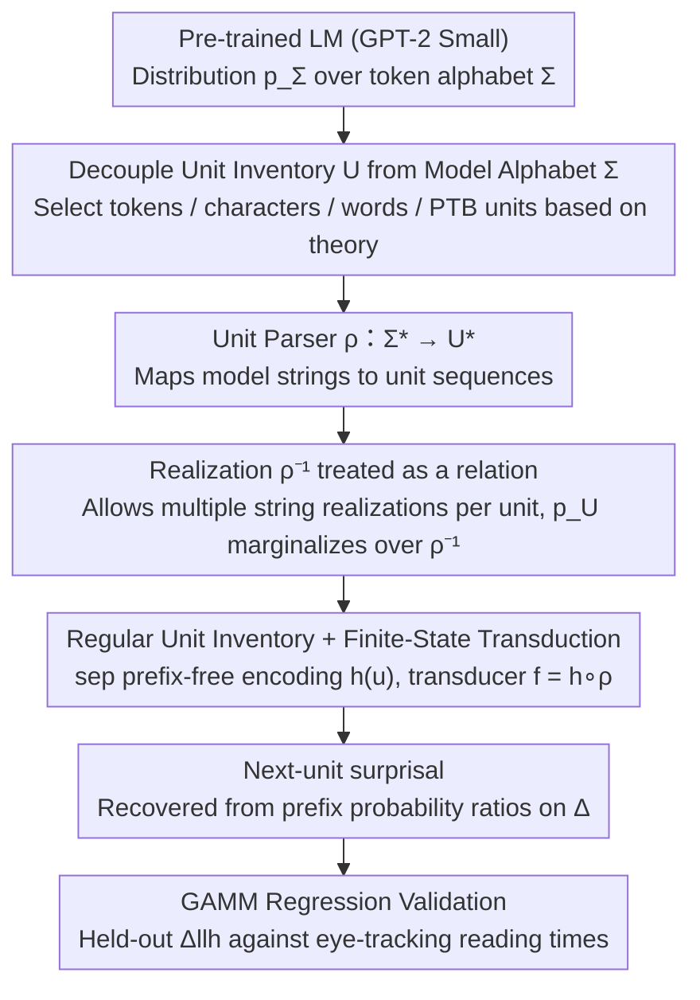

# On the Proper Treatment of Units in Surprisal Theory

**Conference**: ACL2026  
**arXiv**: [2604.28147](https://arxiv.org/abs/2604.28147)  
**Code**: https://github.com/samuki/units-surprisal  
**Area**: LLM Pre-training / Psycholinguistics / LM Evaluation  
**Keywords**: Surprisal theory, unit inventory, finite-state transduction, eye-tracking reading time, GPT-2

## TL;DR
This paper points out that the choice of the "next unit" in surprisal theory has historically been implicitly determined by pre-trained language model tokenizers. It proposes a finite-state transduction framework that explicitly decouples model tokens, linguistic units, and experimental Regions of Interest (ROI), demonstrating on MECO eye-tracking data that different unit inventories fundamentally alter how surprisal predicts reading time.

## Background & Motivation
**Background**: Surprisal theory uses $-\log p(u_t \mid u_{<t})$ to explain the processing load in human language comprehension: the less predictable a linguistic unit is, the more difficult it is to process, resulting in longer reading times. Early studies often involved training custom PCFGs, n-grams, or small language models, allowing the model's base alphabet to be set according to the words, PTB tokens, or other linguistic units required for the experiment.

**Limitations of Prior Work**: Since the popularization of large-scale pre-trained language models (PLMs), researchers usually inherit BPE/token alphabets from models like GPT-2 or LLaMA. The issue is that model tokens do not equate to linguistic words, morphemes, or phonemes, and they do not necessarily align with ROI boundaries in eye-tracking experiments. Consequently, many papers must post-hoc sum token surprisals into word surprisals or handle boundaries using rules like leading/trailing whitespace, which conflates the "scientific choice of analytical units" with "engineering details of model tokenization."

**Key Challenge**: Surprisal theory requires a definition of units $U$ in human comprehension, whereas pre-trained LMs provide a probability distribution over a model alphabet $\Sigma$. When these are inconsistent, treating $\Sigma$ as $U$ mistakes a tokenizer implementation for a psycholinguistic hypothesis. Conversely, using simple whitespace rules for conversion produces inconsistencies in context-dependent scenarios like punctuation, abbreviations, numbers, and sentence-initial words.

**Goal**: The authors aim to solve three sub-problems: first, to formalize the distinction between model alphabets, experimental unit inventories, and ROIs; second, to provide a general computational method for obtaining arbitrary unit-level surprisal from token-level LMs; and third, to use real eye-tracking data to show that unit selection affects not only numerical values but also the regression observations, control variables, and significance interpretations.

**Key Insight**: The paper starts from a simple but vital observation: tokenization should be an implementation detail, not a scientific primitive. Specifically, researchers should first select units based on theoretical questions and then map the language model to this unit inventory, rather than being constrained by the tokenizer.

**Core Idea**: Represent the unit parser $\rho: \Sigma^* \to U^*$ as a composable finite-state transducer and calculate next-unit surprisal on any reasonable unit inventory via a pushforward / transduced language model.

## Method
The methodology of this paper does not involve training a new model but rather establishes a formalized and executable "unit processing protocol" for surprisal analysis. Its core action is viewing a pre-trained LM as a distribution $p_\Sigma$ defined over the model alphabet $\Sigma$, using a unit parser $\rho$ to map strings in $\Sigma$ to researcher-defined unit sequences $U^*$, and finally redefining next-unit probability and surprisal over $U$.

### Overall Architecture
The overall process can be divided into four steps.

First, the researcher selects a unit inventory $U$. This $U$ can be GPT-2 tokens, characters, whitespace-separated words, PTB-style contextual words, or even finer phonemes or coarser discourse units. Crucially, $U$ is a scientific modeling choice, not automatically determined by the LM tokenizer.

Second, define the unit parser $\rho: \Sigma^* \to U^*$. Given a string in the model alphabet, $\rho$ outputs a sequence of units. For cases with potential ambiguity like Chinese word segmentation, the paper first provides a general form for a stochastic parser; for computational feasibility in the main body, $\rho$ is assumed to be a deterministic total function.

Third, push $p_\Sigma$ to the unit space. Ideally, the probability of a unit sequence $\mathbf{u}$ is $p_U(\mathbf{u}) = \sum_{\boldsymbol{\sigma} \in \rho^{-1}(\mathbf{u})} p_\Sigma(\boldsymbol{\sigma})$. This step reveals a key point: the realization $\rho^{-1}$ is generally a relation rather than a function, as a single unit may have multiple string realizations.

Fourth, calculate next-unit surprisal using the transduced LM. The authors map each unit to a base string followed by a separator `sep`, making $h(u)=\xi\,\text{sep}$ a prefix-free encoding. Then, let $f=h\circ\rho$ be a finite-state transducer that converts $\Sigma^*$ into a finite alphabet $\Delta^*$ including `sep`. Thus, the unit probability can be recovered via the ratio of prefix probabilities on $\Delta$: $p_U(u\mid\mathbf{u}) = \overrightarrow{p}_\Delta(h(\mathbf{u})h(u)) / \overrightarrow{p}_\Delta(h(\mathbf{u}))$.

### Key Designs

**1. Decoupling Unit Inventory $U$ and Model Alphabet $\Sigma$: Allocating experimental units and model tokens to their respective places**

Previous work often defaulted to tokens as the analytical unit or performed post-processing to aggregate token surprisal into word surprisal. Consequently, BPE compression rules, whitespace attribution, and punctuation handling directly seeped into psycholinguistic conclusions. This paper allows the language model $p_\Sigma$ to provide probabilities on $\Sigma^*$ as usual but defines the target events of surprisal on $U^*$, connected by the unit parser $\rho$. Consequently, words, characters, PTB tokens, morphemes, and even ROI-aligned units can be valid analytical objects, while the tokenizer is relegated to a purely computational role.

**2. Treating realization as a relation rather than a function: Fixing the issue of forcing the same word into different units across contexts**

Existing methods often assume $\rho^{-1}$ is a monoid homomorphism that partitions the alphabet into boundary and continuation symbols, leading to unit inconsistency: a sentence-initial `Hale` might be realized as `bosHale`, while `Hale` after a space is `\u2423Hale`. If realization must be a function, these are forced to be different units. This paper allows one unit to associate with multiple string realizations, so `Hale` remains the same unit regardless of position. This relation form matches the intuition that a linguistic unit's identity should not be determined by whether it follows a space or starts a sentence, and it consistently handles context-dependent punctuation in cases like `1,000`, `end, he said`, `don't`, or `cat's`.

**3. Implementation via regular unit inventories and FSTs: Mapping potentially infinite surface forms back to a finite alphabet**

The set of surface forms in natural language can be infinite, making it impractical to include every word in an LM alphabet. However, many phonological, morphological, and tokenization rules can be expressed via regular constraints. Thus, the paper assumes units are a regular language ($U\subseteq\Xi^*$) over some finite alphabet $\Xi$. By appending a `sep` to each unit to obtain a prefix-free encoding $h(u)$, a finite transducer $f=h\circ\rho$ converts model strings into `sep`-annotated strings. Calculation reuses existing transduced LM algorithms, marginalizing over all source strings mapped to the target output to recover unit probabilities. This design connects theoretical flexibility with engineering feasibility.

### Loss & Training
The paper does not train new neural language models. The source LM in experiments is GPT-2 Small. Token inventory surprisals are read directly. Other inventories estimate contextual surprisal by composing the corresponding transducer with GPT-2.

For human reading time modeling, the paper uses a log-normal generalized additive mixed model (GAMM). The baseline model includes unit length, unigram surprisal, and their first two spillover positions. The target model adds contextual surprisal and its first two spillovers to the baseline. The predictive contribution is measured by the improvement in held-out log-likelihood $\Delta_{\text{llh}}$, where a positive value indicates that contextual surprisal explains additional variance in reading time after controlling for length and unigram frequency.

Unigram surprisal is also estimated from the same LM distribution rather than external frequency resources. The authors sample text from GPT-2, pass the samples through the transducer to the target unit space, and estimate marginal next-unit probability at unit boundaries. This ensures the frequency control and contextual surprisal come from the same distribution, avoiding issues where resources like Speer conflate punctuation forms.

## Key Experimental Results

### Main Results
The paper evaluates four types of unit inventories on the MECO English eye-tracking corpus: GPT-2 tokens, characters, acontextual words, and PTB-style contextual words. Acontextual words are further subdivided by leading vs. trailing whitespace attribution. Data comes from raw fixations of 46 readers on 12 Wikipedia short passages. Reading time metrics include first fixation (FF), gaze duration (GD), and total reading time (TRT). Evaluation uses 12-fold leave-one-out cross-validation by trial, with 1000 trial-level bootstrap iterations for confidence intervals.

| Unit Inventory | FF $\Delta_{\text{llh}}$ | GD $\Delta_{\text{llh}}$ | TRT $\Delta_{\text{llh}}$ | Conclusion |
|----------------|--------------------------|--------------------------|---------------------------|------------|
| Characters | 0.11, p=0.145 | 0.09, p=0.185 | 0.10, p=0.171 | Not significant for any metric |
| GPT-2 tokens | 0.55*, p=0.013 | 1.52**, p<0.001 | 2.56**, p<0.001 | Stable gains for token surprisal |
| Acontextual words (leading) | 0.28, p=0.065 | 1.41**, p<0.001 | 3.00**, p<0.001 | Not significant for early; significant for late |
| Acontextual words (trailing) | 0.63**, p=0.004 | 1.68**, p<0.001 | 2.91**, p<0.001 | Significant for all three metrics |
| Contextual words | 0.81**, p=0.003 | 2.13**, p<0.001 | 3.24**, p<0.001 | PTB-style units significant for all three |

The values in the table represent per-observation held-out log-likelihood improvement (unit: $10^{-3}$ nats). The authors emphasize that because different inventories involve different numbers of observations, granularities, length controls, and unigram surprisals, these absolute values cannot be used to rank "which unit is best." They primarily indicate whether contextual surprisal provides additional predictive power relative to the baseline within each inventory.

### Ablation Study
There is no traditional neural network ablation. The closest is the variation of unit inventories, whitespace attribution, and transducer complexity to see how the same GPT-2 Small generates different regression problems.

| Configuration | Key Metrics | Description |
|---------------|-------------|-------------|
| GPT-2 tokens | 2,478 units; 40,589 observations | Uses native tokens; closest to LM implementation, weakest linguistic interpretation |
| Acontextual leading | 2,095 units; 39,290 observations; 212.8 symbols/s | Whitespace attributed to following word; fast FST; FF not significant |
| Acontextual trailing | 2,095 units; 39,767 observations; 203.6 symbols/s | Whitespace attributed to preceding word; FF/GD/TRT all significant |
| Contextual words | 2,264 units; 33,472 observations; 12.0 symbols/s | PTB-style rules are more linguistic; FST is much larger and 10x slower |
| Characters | 13,226 units; 48,834 observations | Finest granularity; many chars not fixated individually; no significant metrics |

### Key Findings
- Word-like inventories significantly improve held-out log-likelihood for gaze duration and total reading time, indicating contextual surprisal explains late-stage reading time variance after controlling for length, unigram surprisal, and spillover.
- $\Delta_{\text{llh}}$ for characters is small and non-significant. This is not necessarily because character surprisal lacks cognitive meaning, but because eye-tracking fixations rarely fall naturally onto individual character units; statistical problems deform when units and ROI observations do not match.
- Leading/trailing whitespace is not a trivial implementation detail. Acontextual leading is non-significant for first fixation, while trailing is significant, showing that delimiter attribution changes unit length, spillover controls, and fixation attribution.
- Contextual words provide results most consistent with "linguistic units" but suffer from high computational overhead: throughput is only 12.0 symbols/s compared to ~200 symbols/s for acontextual FSTs.
- The fundamental conclusion is not that "PTB tokens are best," but that unit selection must be reported and justified as part of the experimental design. Different units induce different data frames, and cross-unit comparisons cannot be made based solely on $\Delta_{\text{llh}}$ magnitude.

## Highlights & Insights
- The paper elevates what is often treated as "preprocessing" to a theoretical modeling choice: what exactly is $u_t$ in surprisal? This perspective is valuable as many controversies in LLM psycholinguistics stem from implicit mismatches between units and ROIs.
- The notion of "realization as a relation" is a small but critical formal correction. It elegantly explains why sentence-initial words, whitespace, punctuation, and internal numeric symbols cannot be resolved by fixed boundary partitions.
- Using `sep` for prefix-free unit encoding is the key to computational feasibility. It explicitly incorporates the event of "a unit ending" into the probability calculation rather than simply summing character/token surprisals.
- The experimental design does not attempt to prove one unit is absolutely superior but demonstrates how unit choice alters observations, control variables, and significance. This cautious interpretation is more suitable for a methodological paper than mere metric-chasing.
- This framework is transferable to many NLP/cognitive modeling scenarios: phoneme-level EEG/MEG surprisal, morpheme-level reading, sentence/discourse ROIs, or LM interpretability analysis under different tokenizations.

## Limitations & Future Work
- The empirical scope is narrow: experiments are limited to English MECO, GPT-2 Small, and GAMMs. The concept of a "word" varies significantly across languages; morphologically rich languages or non-space-delimited systems might require different parsers and validations.
- The current framework assumes the unit parser is deterministic and representable by rational/finite-state transducers. Truly ambiguous segmentation or unit conversions requiring context-free structures are outside the scope.
- Computational costs remain significant. Estimating contextual and unigram surprisals for contextual words requires marginalizing over many source strings, necessitating beam search or parallel sampling.
- Dependence on raw fixation data. Many public reading time datasets are pre-aggregated by word and cannot be re-allocated; self-paced reading data is naturally tied to display units.
- While ROI is clarified conceptually, experiments focus on word/character/token granularities. Future work could directly validate discourse units, clause-level ROIs, or parafoveal preview windows.

## Related Work & Insights
- **vs. Oh and Schuler (2024) / Pimentel and Meister (2024)**: These works provide formalisms for word-level surprisal from tokens but rely on whitespace/boundary partitions and functional realization. This paper notes that this causes unit inconsistency and proposes a relation + transducer framework to unify leading/trailing and contextual segmentation.
- **vs. Nair and Resnik (2023) / Beinborn and Pinter (2023)**: These studies focus on the cognitive plausibility of subword tokenization, often analyzing model tokens. This paper does not dismiss token-level analysis but emphasizes that tokens are merely one optional inventory, suitable for studying the model itself but not as a default for human processing units.
- **vs. Wilcox et al. (2023), Shain et al. (2024), Goodkind and Bicknell (2018)**: These works validate the predictive power of surprisal. This paper's contribution is not a new linking function but the addition of theoretical constraints regarding unit selection and ROI compatibility before the linking pipeline.
- **vs. Snæbjarnarson et al. (2026) / Vieira et al. (2025)**: This paper adopts transduced LMs and token-to-character conversion tools for unit-level surprisal in psycholinguistics. The insight is that finite-state methods can serve as a "probability interface" between LLMs and linguistic units.
- **Insight for future research**: When conducting surprisal analysis, researchers should explicitly report unit inventory, ROI definitions, whitespace/punctuation attribution, unigram surprisal sources, and whether they are comparing across units. Otherwise, results from the same model may be irreproducible due to differing preprocessing rules.

## Rating
- Novelty: ⭐⭐⭐⭐☆ The paper does not propose a new LM, but correctly identifies tokenizer/unit issues as core modeling choices in surprisal theory.
- Experimental Thoroughness: ⭐⭐⭐⭐☆ Covers multiple unit inventories, three eye-tracking metrics, and rigorous cross-validation; limited by the focus on English MECO + GPT-2 Small.
- Writing Quality: ⭐⭐⭐⭐⭐ Well-structured argument, moving steadily from unit inconsistency to finite-state solutions and eye-tracking experiments.
- Value: ⭐⭐⭐⭐⭐ Highly recommended as a methodological reference for any work using LLM surprisal for psycholinguistics or cognitive modeling.

<!-- RELATED:START -->

## Related Papers

- [\[NeurIPS 2025\] Alternating Gradient Flows: A Theory of Feature Learning in Two-layer Neural Networks](../../NeurIPS2025/llm_pretraining/alternating_gradient_flows_a_theory_of_feature_learning_in_two-layer_neural_netw.md)
- [\[ACL 2026\] Demystifying Data Organization for Enhanced LLM Training](demystifying_data_organization_for_enhanced_llm_training.md)
- [\[ACL 2026\] Is a Document Educational or Just Wikipedia-Style? -- Pitfalls of Classifier-Based Quality Filtering](is_a_document_educational_or_just_wikipedia-style_--_pitfalls_of_classifier-base.md)
- [\[ACL 2026\] SCRIPT: A Subcharacter Compositional Representation Injection Module for Korean Pre-Trained Language Models](script_a_subcharacter_compositional_representation_injection_module_for_korean_p.md)
- [\[ACL 2026\] Toward Consistent World Models with Multi-Token Prediction and Latent Semantic Enhancement](toward_consistent_world_models_with_multi-token_prediction_and_latent_semantic_e.md)

<!-- RELATED:END -->
