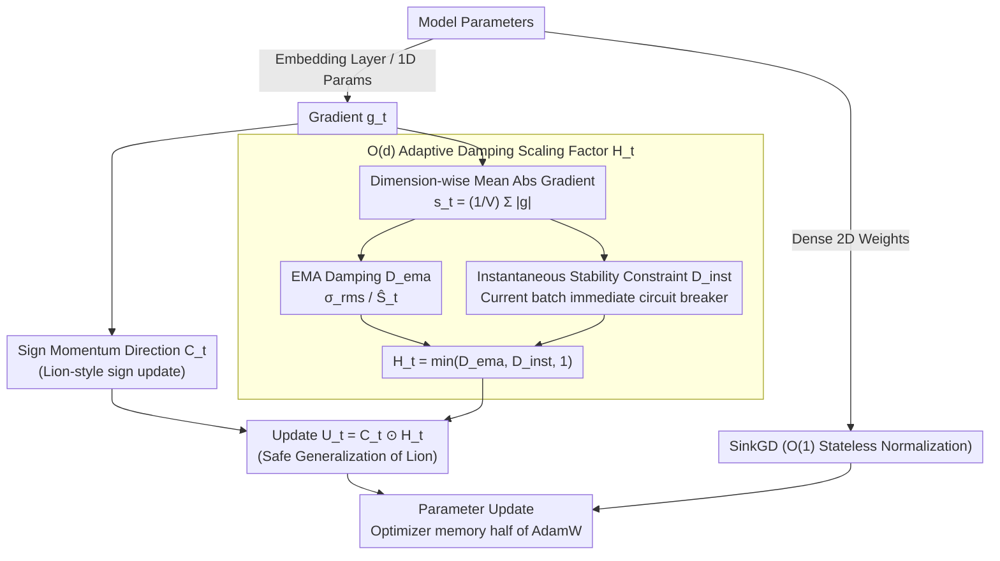

# SAGE: Sign-Adaptive Gradient for Memory-Efficient LLM Optimization

**Conference**: ACL 2026 Findings  
**arXiv**: [2604.07663](https://arxiv.org/abs/2604.07663)  
**Code**: [GitHub](https://github.com/naubull2/SAGE-optimizer)  
**Area**: LLM Pre-training  
**Keywords**: Optimizer, Memory Efficiency, Embedding Layer, Sign Optimization, Adaptive Scaling

## TL;DR

This paper proposes the SAGE optimizer, which addresses the "embedding layer dilemma" where lightweight optimizers fail on embedding layers by employing a Lion-style sign update direction and an $O(d)$ memory-overhead adaptive damping scaling factor. SAGE achieves new SOTA perplexity on Llama models (up to 1.3B) with significantly lower optimizer memory.

## Background & Motivation

**Background**: AdamW is the standard optimizer for LLM pre-training, but its two full-sized momentum states ($O(Vd)$) consume memory equivalent to twice the model size, serving as a critical memory bottleneck. Lightweight optimizers such as Lion (single momentum) and SinkGD (stateless normalization) have made progress.

**Limitations of Prior Work**: Lightweight optimizers perform well on dense layers but fail on the embedding layer. Embedding layer gradients exhibit sparsity and high variance due to the Zipfian distribution of token frequencies, which stateless methods cannot handle effectively. Consequently, methods like SinkGD adopt a hybrid design—falling back to AdamW for the embedding layer—which partially offsets memory savings.

**Key Challenge**: The embedding layer is the largest consumer of optimizer state memory ($V > 100,000$), yet it is precisely where lightweight optimizers fail. Achieving true memory efficiency requires conquering the embedding layer.

**Goal**: Design a lightweight optimizer that can successfully replace AdamW for handling embedding layers.

**Key Insight**: Lion's update magnitude is a static 1.0 (identical for every dimension), lacking control over high-variance dimensions. Designing a bounded adaptive scaling factor to selectively damp high-variance dimensions could achieve stability while maintaining memory efficiency.

**Core Idea**: SAGE = Lion's sign direction + a new $O(d)$ adaptive damping scaling factor $\mathbf{H}_t$. This scaling factor is based on the EMA of absolute gradient values ($L_1$ norm), is theoretically bounded by $\|\mathbf{H}_t\|_\infty \leq 1.0$, applies stronger damping to high-variance dimensions, and degrades to Lion's 1.0 for quiet dimensions.

## Method

### Overall Architecture

A hybrid optimizer structure is adopted: SAGE ($O(Vd) + O(d)$ states) is used for the embedding layer and 1D parameters (bias/norm), while SinkGD ($O(1)$ state) is used for dense 2D weights. Compared to the SinkGD+AdamW hybrid, this reduces the optimizer state memory of the embedding layer by approximately 50%. A single-step update of SAGE involves a small pipeline: one path compresses the gradient into a sign momentum direction, while the other computes a dimension-wise damping factor; the two are multiplied for the final update.

### Key Designs

**1. $O(d)$ Adaptive Damping Scaling Factor $\mathbf{H}_t$: Using a $d$-dimensional vector to "brake" high-variance dimensions**

Lion uses a static update magnitude of 1.0 for every dimension, offering no control over embedding layer dimensions with extremely high gradient variance due to Zipfian frequencies, which causes its failure. SAGE compresses the $V \times d$ gradient information into a $d$-dimensional statistic: for the embedding layer, it first calculates the mean absolute gradient for each dimension $j$ as $(\mathbf{s}_t)_j = \frac{1}{V} \sum_{i=1}^V |g_{t,ij}|$, then applies EMA to get $\hat{\mathbf{S}}_t$, using the layer's RMS as a reference threshold $\sigma_{rms}$. The final damping factor is:

$$(\mathbf{H}_t)_j = \min\!\left(\frac{\sigma_{rms}}{(\hat{\mathbf{S}}_t)_j},\ 1\right).$$

Thus, "quiet" dimensions ($\hat{S}_j < \sigma_{rms}$) have a ratio greater than 1, which is clipped back to 1, reverting to pure Lion behavior. "Noisy" dimensions ($\hat{S}_j > \sigma_{rms}$) are suppressed to $<1$, selectively weakening the update magnitude. Crucially, this achieves dimension-wise adaptation with only $O(d)$ states instead of $O(Vd)$, making memory overhead negligible; the bound $\|\mathbf{H}_t\|_\infty \leq 1$ ensures it is never more aggressive than Lion, leading to theoretically provable convergence.

**2. Instantaneous Stability Constraint: Adding an immediate circuit breaker to EMA**

EMA is a lagged metric. When a batch suddenly generates a gradient spike, damping based on historical means cannot react in time, potentially causing instantaneous instability. To address this, SAGE complements the EMA damping $\mathbf{D}_t^{ema}$ with an instantaneous damping $\mathbf{D}_t^{inst}$ calculated from current batch statistics, taking the minimum of the three: $(\mathbf{H}_t)_j = \min(\mathbf{D}_t^{ema}, \mathbf{D}_t^{inst}, 1)$. This layers an immediate protection similar to Adaptive Gradient Clipping (AGC) on top of adaptive scaling—historical damping handles long-term calibration, while instantaneous damping serves as a fallback for sudden spikes to prevent catastrophic divergence.

**3. Adaptive Generalization of Lion: SAGE as a "Safe Upgrade" of Lion**

The difference between SAGE and Lion can be expressed cleanly: Lion's update is $\hat{\mathbf{U}}_t^{Lion} = \mathbf{C}_t \odot \mathbf{1}$, while SAGE's update is $\hat{\mathbf{U}}_t^{SAGE} = \mathbf{C}_t \odot \mathbf{H}_t$. When $\mathbf{H}_t$ is fixed at all ones, SAGE reverts to Lion, making Lion a special case. Since $\|\mathbf{H}_t\|_\infty \leq 1$, every step SAGE takes is no larger than Lion's, representing a safe generalization that is "only more conservative, never more aggressive." This property yields a practical dividend: safer update directions allow for a higher learning rate than Lion, which in turn results in faster and better convergence—the primary source of SAGE's performance gains.

### Loss & Training

Decoupled weight decay (AdamW style) is utilized. SAGE maintains one $O(Vd)$ momentum state and one $O(d)$ adaptive state, with total memory usage being only half that of AdamW.

## Key Experimental Results

### Main Results (Test Perplexity)

| Method | 270M PPL | Memory | 1.3B PPL | Memory |
|------|----------|------|----------|------|
| AdamW | 37.35 | 2.1GB | 27.81 | 9.8GB |
| Lion | 30.24 | 1.0GB | 28.37 | 4.9GB |
| SinkGD-Hybrid | 34.30 | 0.9GB | 28.71 | 1.9GB |
| **SAGE-Hybrid** | **29.95** | **0.5GB** | **24.33** | **0.9GB** |

### Ablation Study

| Configuration | PPL (270M) | Note |
|------|-----------|------|
| SAGE-Hybrid | 29.95 | Full method |
| SinkGD-Pure | 192.7 | Stateless method fails on embedding layer |
| SAGE-Pure | 116.0 | SAGE alone for all layers is suboptimal |
| Lion-Hybrid | 32.10 | Replacing AdamW with Lion for embedding layer |

### Key Findings
- SAGE-Hybrid achieves the lowest perplexity across all model sizes, with memory usage at approximately 10% of AdamW.
- SinkGD-Pure validates the existence of the embedding layer dilemma—pure stateless optimizers fail catastrophically on the embedding layer.
- The boundedness of SAGE allows for higher learning rates than Lion, which is crucial for performance improvement.
- The hybrid design (SAGE for embedding + SinkGD for dense) is the optimal combination.

## Highlights & Insights
- **Diagnosis of the "embedding layer dilemma"** is precise: identifying gradient sparsity and high variance as the root causes of lightweight optimizer failure enables a targeted solution.
- **Design of $O(d)$ adaptive scaling** is extremely memory-efficient: compressing $V \times d$ gradient information into $d$-dimensional mean absolute values and tracking it with $d$-dimensional EMA adds almost no memory overhead.
- **Generalization perspective from Lion to SAGE** is elegant: SAGE is a strictly safe generalization of Lion, offering both theoretical guarantees and intuitive explanation.

## Limitations & Future Work
- Experiments were only conducted up to 1.3B parameters; performance on larger models (7B+) is not verified.
- SAGE was only tested on the Llama architecture; effectiveness on other architectures (e.g., Mixture of Experts) is unknown.
- The number of pre-training tokens and the dataset size are relatively small (RedPajama subset), requiring validation in large-scale pre-training.
- No systematic comparison with other low-rank methods such as GaLore or APOLLO (though APOLLO results were poor).

## Related Work & Insights
- **vs AdamW**: Large improvement in memory efficiency (~10× smaller optimizer states) while achieving superior perplexity.
- **vs Lion**: SAGE is an adaptive generalization of Lion, allowing higher learning rates through bounded damping.
- **vs SinkGD**: SinkGD requires a fallback to AdamW for the embedding layer; SAGE replaces this fallback.

## Rating
- Novelty: ⭐⭐⭐⭐ Precise diagnosis of the embedding layer dilemma and an $O(d)$ adaptive scaling solution.
- Experimental Thoroughness: ⭐⭐⭐ Model sizes are relatively small, lacking larger-scale verification.
- Writing Quality: ⭐⭐⭐⭐⭐ Clear motivation derivation and rigorous theoretical analysis.
- Value: ⭐⭐⭐⭐ Provides a practical optimizer solution for memory-constrained LLM training.

<!-- RELATED:START -->

## Related Papers

- [\[ICLR 2026\] Scaling with Collapse: Efficient and Predictable Training of LLM Families](../../ICLR2026/llm_pretraining/scaling_with_collapse_efficient_and_predictable_training_of_llm_families.md)
- [\[ACL 2025\] AsyncLM: Efficient and Adaptive Async Pre-training of Language Models](../../ACL2025/llm_pretraining/asynclm_efficient_and_adaptive_async_pre-training_of_language_models.md)
- [\[ACL 2026\] Working Memory Constraints Scaffold Learning in Transformers under Data Scarcity](working_memory_constraints_scaffold_learning_in_transformers_under_data_scarcity.md)
- [\[ICML 2026\] SPARe: Stacked Parallelism with Adaptive Reordering for Fault-Tolerant LLM Pretraining Systems with 100k+ GPUs](../../ICML2026/llm_pretraining/spare_stacked_parallelism_with_adaptive_reordering_for_fault-tolerant_llm_pretra.md)
- [\[NeurIPS 2025\] Vocabulary Customization for Efficient Domain-Specific LLM Deployment](../../NeurIPS2025/llm_pretraining/vocabulary_customization_for_efficient_domain-specific_llm_deployment.md)

<!-- RELATED:END -->
