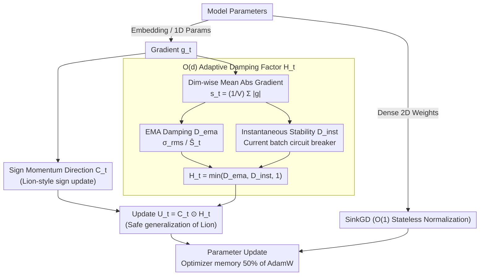

# SAGE: Sign-Adaptive Gradient for Memory-Efficient LLM Optimization

**Conference**: ACL 2026 Findings  
**arXiv**: [2604.07663](https://arxiv.org/abs/2604.07663)  
**Code**: [GitHub](https://github.com/naubull2/SAGE-optimizer)  
**Area**: LLM Pre-training  
**Keywords**: Optimizer, Memory-efficiency, Embedding layer, Sign optimization, Adaptive scaling

## TL;DR

Ours proposes the SAGE optimizer, which addresses the "embedding layer dilemma" where lightweight optimizers fail on embedding layers. By combining a Lion-style sign update direction with an $O(d)$ memory overhead adaptive damping scaling factor, SAGE achieves new SOTA perplexity on Llama models (up to 1.3B) with significantly lower optimizer memory.

## Background & Motivation

**Background**: AdamW is the standard optimizer for LLM pre-training, but its two full-sized momentum states ($O(Vd)$) consume memory equivalent to twice the model size, acting as a critical memory bottleneck. Lightweight optimizers like Lion (single momentum) and SinkGD (stateless normalization) have made progress.

**Limitations of Prior Work**: Lightweight optimizers perform well on dense layers but fail on embedding layers. Embedding gradients exhibit sparsity and high variance due to the Zipfian distribution of token frequencies, which stateless methods cannot handle effectively. Consequently, methods like SinkGD adopt a hybrid design—falling back to AdamW for embedding layers—which partially offsets memory savings.

**Key Challenge**: The embedding layer is the largest consumer of optimizer state memory ($V > 100,000$), yet it is precisely where lightweight optimizers underperform. True memory efficiency requires a solution that succeeds at the embedding layer.

**Goal**: To design a lightweight optimizer capable of successfully replacing AdamW for embedding layer optimization.

**Key Insight**: Lion's update magnitude is a static 1.0 for every dimension, lacking control over high-variance dimensions. If a bounded adaptive scaling factor can be designed to selectively damp high-variance dimensions, stability can be gained while maintaining memory efficiency.

**Core Idea**: SAGE = Lion's sign direction + a new $O(d)$ adaptive damping scaling factor $\mathbf{H}_t$. This scaling factor is based on the EMA of absolute gradient values ($L_1$ norm). It is theoretically bounded by $\|\mathbf{H}_t\|_\infty \leq 1.0$, applying stronger damping to high-variance dimensions and reverting to Lion's 1.0 for stable dimensions.

## Method

### Overall Architecture

A hybrid optimizer structure is adopted: SAGE ($O(Vd) + O(d)$ states) is used for embedding layers and 1D parameters (bias/norm), while SinkGD ($O(1)$ states) is used for dense 2D weights. Compared to the SinkGD+AdamW hybrid, this reduces the optimizer state memory of the embedding layer by approximately 50%. A single SAGE update functions as a small pipeline: one path compresses gradients into a sign momentum direction, while the other computes the dimension-wise damping factor. Their product forms the final update.

### Key Designs

**1. $O(d)$ Adaptive Damping Factor $\mathbf{H}_t$: Using a $d$-dimensional vector to "brake" high-variance dimensions**

Lion uses a static update magnitude of 1.0 for every dimension, providing no control over embedding layer dimensions with extreme gradient variance due to Zipfian frequencies. SAGE compresses the $V \times d$ gradient information into a $d$-dimensional statistic: for the embedding layer, it first computes the mean absolute gradient for each dimension $j$ as $(\mathbf{s}_t)_j = \frac{1}{V} \sum_{i=1}^V |g_{t,ij}|$, applies an EMA to obtain $\hat{\mathbf{S}}_t$, and uses the layer's RMS as a reference threshold $\sigma_{rms}$. The final damping factor is:

$$(\mathbf{H}_t)_j = \min\!\left(\frac{\sigma_{rms}}{(\hat{\mathbf{S}}_t)_j},\ 1\right).$$

"Quiet" dimensions ($\hat{S}_j < \sigma_{rms}$) are clipped to 1, reverting to the original Lion behavior, while "noisy" dimensions ($\hat{S}_j > \sigma_{rms}$) are suppressed. Crucially, this achieves dimension-wise adaptivity using $O(d)$ states instead of $O(Vd)$, making memory overhead negligible. Furthermore, the bound $\|\mathbf{H}_t\|_\infty \leq 1$ ensures it is never more aggressive than Lion, which is theoretically conducive to convergence.

**2. Instantaneous Stability Constraint: Applying a circuit breaker to the EMA**

EMA is a lagging indicator. If a batch produces a sudden gradient spike, the historical average-based damping may not react fast enough, potentially causing instability. SAGE introduces an instantaneous damping factor $\mathbf{D}_t^{inst}$ based on the current batch statistics alongside the EMA damping $\mathbf{D}_t^{ema}$, taking the minimum of the three: $(\mathbf{H}_t)_j = \min(\mathbf{D}_t^{ema}, \mathbf{D}_t^{inst}, 1)$. This acts as an immediate protection layer similar to Adaptive Gradient Clipping (AGC), where historical damping handles long-term calibration and instantaneous damping prevents divergence from sudden spikes.

**3. Adaptive Generalization of Lion: SAGE as a "Safe Upgrade" of Lion**

The difference between SAGE and Lion can be expressed cleanly: Lion's update is $\hat{\mathbf{U}}_t^{Lion} = \mathbf{C}_t \odot \mathbf{1}$, whereas SAGE's update is $\hat{\mathbf{U}}_t^{SAGE} = \mathbf{C}_t \odot \mathbf{H}_t$. When $\mathbf{H}_t$ is fixed to all ones, SAGE reverts to Lion, making Lion a special case. Since $\|\mathbf{H}_t\|_\infty \leq 1$, SAGE is always more conservative than Lion. This property allows for higher learning rates than Lion, leading to faster and better convergence.

### Loss & Training

Ours utilizes decoupled weight decay (AdamW-style). SAGE maintains one $O(Vd)$ momentum state plus one $O(d)$ adaptive state, resulting in total memory that is roughly half of AdamW's for those layers.

## Key Experimental Results

### Main Results (Test Perplexity)

| Method | 270M PPL | Memory | 1.3B PPL | Memory |
|------|----------|------|----------|------|
| AdamW | 37.35 | 2.1GB | 27.81 | 9.8GB |
| Lion | 30.24 | 1.0GB | 28.37 | 4.9GB |
| SinkGD-Hybrid | 34.30 | 0.9GB | 28.71 | 1.9GB |
| **SAGE-Hybrid** | **29.95** | **0.5GB** | **24.33** | **0.9GB** |

### Ablation Study

| Configuration | PPL (270M) | Description |
|------|-----------|------|
| SAGE-Hybrid | 29.95 | Full Method |
| SinkGD-Pure | 192.7 | Stateless method fails on embedding layer |
| SAGE-Pure | 116.0 | SAGE alone for all layers is suboptimal |
| Lion-Hybrid | 32.10 | Replacing embedding AdamW with Lion |

### Key Findings
- SAGE-Hybrid achieves the lowest perplexity across all model sizes, with memory consumption at ~10% of AdamW.
- SinkGD-Pure confirms the "embedding layer dilemma"—purely stateless optimizers fail catastrophically on the embedding layer.
- The boundedness of SAGE allowing for higher learning rates is the key driver of performance gains.
- The hybrid design (SAGE for embedding + SinkGD for dense) is the optimal combination.

## Highlights & Insights
- **Accurate diagnosis of the "embedding layer dilemma"**: Identifying sparsity and high variance in embedding gradients as the root causes of failure for lightweight optimizers led to a targeted solution.
- **Extremely memory-efficient $O(d)$ adaptive scaling**: Compressing $V \times d$ gradient information into $d$-dimensional absolute means tracked via EMA adds almost zero memory overhead.
- **Elegant generalization from Lion to SAGE**: SAGE serves as a strictly safer generalization of Lion, backed by both theoretical guarantees and intuitive reasoning.

## Limitations & Future Work
- Experiments are limited to 1.3B parameters; effectiveness on larger models (7B+) remains unverified.
- SAGE was only tested on the Llama architecture; performance on others (e.g., Mixture of Experts) is unknown.
- The number of pre-training tokens and datasets are relatively small (using RedPajama subsets); large-scale pre-training requires further validation.
- No systematic comparison with other low-rank methods like GaLore or APOLLO (though APOLLO results are noted as poor).

## Related Work & Insights
- **vs AdamW**: Significant jump in memory efficiency (~10× smaller optimizer states) while achieving better perplexity.
- **vs Lion**: SAGE provides an adaptive generalization, allowing for higher learning rates through bounded damping.
- **vs SinkGD**: While SinkGD requires a fallback to AdamW for embedding layers, SAGE replaces this fallback more efficiently.

## Rating
- Novelty: ⭐⭐⭐⭐ The diagnosis of the embedding layer dilemma and the $O(d)$ adaptive scaling solution are highly novel.
- Experimental Thoroughness: ⭐⭐⭐ Model sizes are relatively small, lacking larger-scale verification.
- Writing Quality: ⭐⭐⭐⭐⭐ Clear motivation and rigorous theoretical analysis.
- Value: ⭐⭐⭐⭐ Provides a practical optimizer solution for memory-constrained LLM training.

<!-- RELATED:START -->

## Related Papers

- [\[ICML 2026\] POET-X: Memory-efficient LLM Training by Scaling Orthogonal Transformation](../../ICML2026/llm_pretraining/poet-x_memory-efficient_llm_training_by_scaling_orthogonal_transformation.md)
- [\[ACL 2026\] Working Memory Constraints Scaffold Learning in Transformers under Data Scarcity](working_memory_constraints_scaffold_learning_in_transformers_under_data_scarcity.md)
- [\[ACL 2025\] AsyncLM: Efficient and Adaptive Async Pre-training of Language Models](../../ACL2025/llm_pretraining/asynclm_efficient_and_adaptive_async_pre-training_of_language_models.md)
- [\[ICLR 2026\] Scaling with Collapse: Efficient and Predictable Training of LLM Families](../../ICLR2026/llm_pretraining/scaling_with_collapse_efficient_and_predictable_training_of_llm_families.md)
- [\[ICLR 2026\] Beyond URLs: Metadata Diversity and Position for Efficient LLM Pretraining](../../ICLR2026/llm_pretraining/beyond_urls_metadata_diversity_and_position_for_efficient_llm_pretraining.md)

<!-- RELATED:END -->
