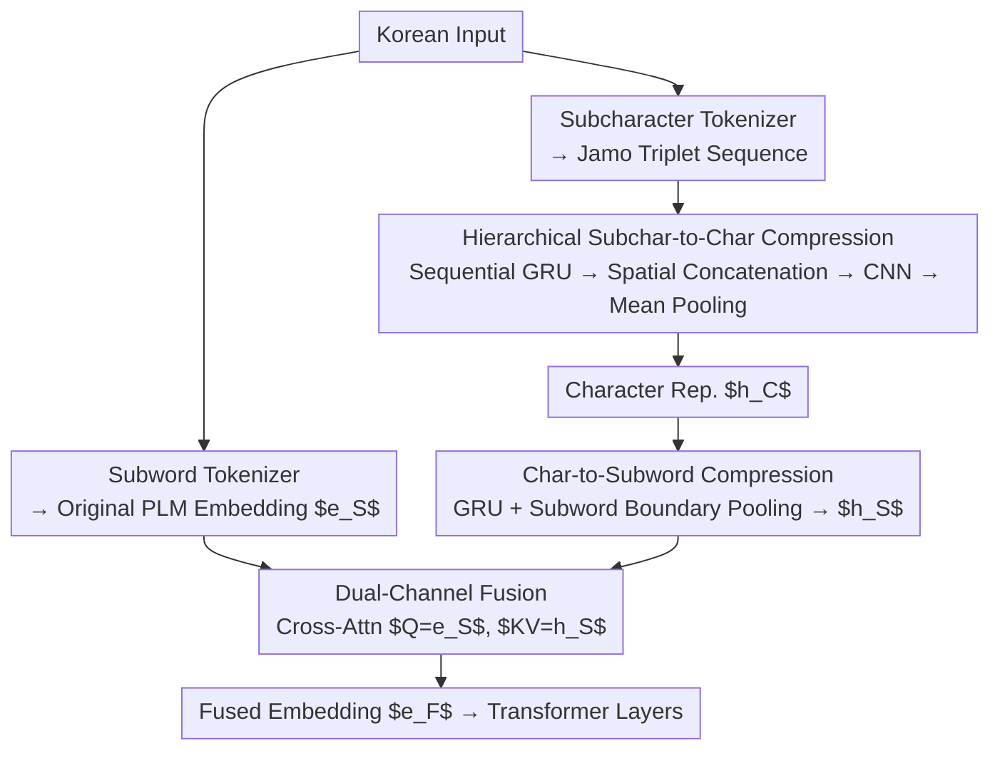

# SCRIPT: A Subcharacter Compositional Representation Injection Module for Korean Pre-Trained Language Models

**Conference**: ACL 2026 Findings  
**arXiv**: [2604.12377](https://arxiv.org/abs/2604.12377)  
**Code**: [GitHub](https://github.com/SungHo3268/SCRIPT)  
**Area**: LLM Pre-training / Korean NLP  
**Keywords**: Subcharacter compositional representation, Korean Pre-trained Language Models, Hangul structural modeling, Morpho-phonological changes, Plug-and-play module

## TL;DR

Ours proposes SCRIPT, a model-agnostic plug-and-play module that injects Hangul subcharacter (Jamo) compositional knowledge into the embedding layers of existing subword-level PLMs using a dual-channel strategy. It achieves consistent improvements across Korean NLU/NLG tasks without re-pretraining and enables the embedding space to better capture grammatical regularities and semantic variations.

## Background & Motivation

**Background**: Most mainstream Korean PLMs (including advanced LLMs like HyperCLOVA X and EXAONE) rely on subword tokenization. While subword modeling excels at capturing lexical semantics from large-scale corpora, its granularity is insufficient to reflect the internal compositional structure of Hangul.

**Limitations of Prior Work**: (1) Korean is a morphologically rich agglutinative language where numerous morpho-phonological changes occur at the subcharacter (Jamo) level—corpus analysis shows 92.75% of morphological modifications are subcharacter-level; (2) Existing subword PLMs are insensitive to fine-grained morphosyntactic variations (e.g., tense inflection, phonological assimilation); (3) A few Jamo-based language models (e.g., KOMBO) are robust to morphological changes but perform poorly on downstream tasks due to weak semantic representations and high computational costs.

**Key Challenge**: Subword-level modeling excels in semantics but ignores structure, while subcharacter-level modeling captures structure but sacrifices semantics—the two are complementary but difficult to reconcile.

**Goal**: Design a lightweight module to inject subcharacter compositional knowledge into existing subword-level PLMs, gaining the advantages of both without architectural modifications or additional pre-training.

**Key Insight**: Utilize the three fundamental principles of Hangul creation (composition rules, spatial arrangement, and sequential rules) to guide the hierarchical compression from subcharacters to subwords, rather than using generic attention or linear pooling.

**Core Idea**: Attach a dual-channel module to the PLM embedding layer—one channel compresses Jamo sequences into structure-aware subword representations, while the other preserves original pre-trained embeddings, fusing both via cross-attention.

## Method

### Overall Architecture

SCRIPT is attached to the embedding layer of a PLM. Given a Korean input, two parallel tokenization paths are used: (1) a subword tokenizer generates the original PLM subword sequence; (2) a subcharacter tokenizer generates fine-grained Jamo sequences for SCRIPT processing. SCRIPT compresses the Jamo sequence into subword-level representations, which are fused with original PLM embeddings before being fed into Transformer layers.

### Key Designs

**1. Hierarchical Subcharacter-to-Character Compression (Stage 1): Guiding neural networks with Hangul composition rules**

If generic attention or linear pooling is used to compress Jamo triplets (Initial, Medial, Final consonants/vowels) into characters, the inherent structural priors of Hangul are washed away—ablation experiments show these generic methods are 1.8–4.6 percentage points (pp) lower than principle-based methods. SCRIPT therefore encodes three Hangul principles directly into the architecture: first, use a GRU to encode the Jamo writing order according to Sequential Rules (Principle 3: Initial → Medial → Final); then, according to Spatial Arrangement Rules (Principle 2), concatenate the fused Initial+Medial representation with the Final representation vertically as $\mathbf{h}_R = [\mathbf{h}_{I+V}; \mathbf{h}_F] \in \mathbb{R}^{2 \times N/3 \times D}$; subsequently, use a CNN to capture relative positions between subcharacters, and finally apply mean pooling to obtain the character representation $\mathbf{h}_C$. This pipeline essentially treats linguistic rules of Hangul composition as inductive biases, ensuring the compression preserves structural composition rather than just blending symbols.

**2. Character-to-Subword Compression (Stage 2): Aligning granularity at subword boundaries**

Character representations must be aligned with the original PLM subword sequence, but direct averaging or summation can lead to training instability. SCRIPT uses another GRU layer to encode the sequential order of characters within a subword, and then selects the last character representation at each subword boundary as the representative for that subword:

$$\mathbf{h}_S = \text{Pooling}(\text{GRU}(\mathbf{h}_C)) \in \mathbb{R}^{N' \times D}.$$

Using a GRU to condense sequential information before selecting boundary representations provides a cleaner interface for fusion compared to naive summation, stabilizing the convergence of character-level information into subword granularity.

**3. Dual-Channel Fusion: Allowing PLM embeddings to actively "select" required structural information**

SCRIPT produces structure-aware representations while original PLM embeddings provide semantic-rich representations; they must be merged without mutual dilution. SCRIPT employs a cross-attention layer, taking the original PLM embedding $\mathbf{e}_S$ as Query and SCRIPT output $\mathbf{h}_S$ as Key/Value: $\mathbf{e}_F = \text{CrossAttn}(Q=\mathbf{e}_S, KV=\mathbf{h}_S)$. Ablations show this outperforms simple summation or concatenation because cross-attention allows PLM embeddings to dynamically decide how much structural information to absorb at each position, achieving a "semantics-first, structure-supplemented" fusion.

### Loss & Training

SCRIPT is trained only during the fine-tuning stage using standard task-specific loss functions. It requires no additional pre-training and is plug-and-play. Base models include BERT_base, KoGPT2_base, KoGPT3-1.2B, and EXAONE-2.4B.

## Key Experimental Results

### Main Results

**Korean NLU Tasks (9 Benchmarks)**

| Model | KorNLI | KorSTS | NSMC | PAWS-X | KoBEST Avg. |
|------|--------|--------|------|--------|-------------|
| BERT_base | 75.85 | 76.72 | 88.96 | 72.38 | 64.22 |
| BERT_base + SCRIPT | 76.49 | 77.68 | 88.96 | 73.68 | 65.14 |
| KoGPT3-1.2B | 80.11 | 76.14 | 90.51 | 77.40 | 81.62 |
| KoGPT3-1.2B + SCRIPT | 80.39 | 79.60 | 90.53 | 79.95 | 82.17 |
| EXAONE-2.4B | 83.99 | 85.08 | 90.04 | 85.24 | 89.57 |
| EXAONE-2.4B + SCRIPT | **85.77** | **85.27** | **90.89** | **85.90** | **90.40** |

**Korean NLG Task (KoCommonGen)**

| Model | BLEU-4 | ROUGE-2 | ROUGE-L | METEOR |
|------|--------|---------|---------|--------|
| KoGPT2_base | 10.33 | 44.24 | 54.50 | 40.05 |
| KoGPT2_base + SCRIPT | 15.57 | 47.42 | 60.00 | 42.53 |
| EXAONE-2.4B | 28.41 | 62.25 | 64.84 | 54.84 |
| EXAONE-2.4B + SCRIPT | **31.80** | **71.03** | **72.16** | **61.27** |

### Ablation Study

**SCRIPT Architecture Ablation (KoBEST Avg., based on KoGPT2_base)**

| Configuration | Avg. Accuracy |
|------|----------|
| SCRIPT (Jamo + Principles + CrossAttn) | **73.85** |
| Stroke instead of Jamo | 72.36 |
| Linear compression instead of Principles | 69.30 |
| Attention compression instead of Principles | 72.01 |
| Summation instead of CrossAttn | 72.28 |
| Subword granularity (non-Jamo) | 67.92 |

### Key Findings

- SCRIPT is consistently effective across all base models and task types, proving its model-agnostic nature.
- The largest improvement (>3.2 pp) is observed in the Korean Grammar Error Correction task (Kor-Learner), as this task involves significant subcharacter-level changes in particles and endings.
- Improvements in NLG tasks are more significant than in NLU tasks—likely because Sequential Composition of Hangul naturally fits autoregressive decoding.
- Embedding space analysis shows SCRIPT increases the cosine similarity of morphologically related word pairs from 0.71 to 0.80 (+11%).

## Highlights & Insights

- The corpus statistical analysis revealing that 92.75% of morphological changes occur at the subcharacter level provides a strong linguistic motive for the method.
- The plug-and-play design is highly practical—no re-pretraining is required, allowing for immediate enhancement of any Korean PLM.
- Principle-driven architecture design (rather than generic attention) underscores the importance of domain knowledge in model design.

## Limitations & Future Work

- Currently verified up to 2.4B parameters; effectiveness on larger models (7B+) is unknown.
- The design is tightly coupled with Hangul characteristics, limiting its applicability to other languages.
- Cross-attention increases the inference cost of the embedding layer, particularly for long sequences.
- Comparison with the latest 7B+ Korean LLMs has not yet been conducted.

## Related Work & Insights

- **vs KOMBO**: KOMBO also models Jamo composition but requires training from scratch and only supports encoder architectures; SCRIPT is plug-and-play.
- **vs Multi-granularity Representations**: Prior works switch between Jamo and subwords rather than using structural fusion; SCRIPT achieves true integration via a dual-channel strategy.
- **vs char2subword**: Similar modules only perform simple character-to-subword mapping without utilizing Hangul compositional principles.

## Rating

- Novelty: ⭐⭐⭐⭐ Ingenious integration of linguistics and deep learning by encoding Hangul composition principles into the architecture.
- Experimental Thoroughness: ⭐⭐⭐⭐⭐ 4 base models × 9 NLU + multiple NLG tasks + detailed ablation + linguistic analysis.
- Writing Quality: ⭐⭐⭐⭐ Clear motivation chain with persuasive corpus statistics.
- Value: ⭐⭐⭐⭐ High practical value for the Korean NLP community; plug-and-play design lowers the barrier to entry.

<!-- RELATED:START -->

## Related Papers

- [\[ACL 2025\] LEANCODE: Understanding Models Better for Code Simplification of Pre-trained Large Language Models](../../ACL2025/llm_pretraining/leancode_understanding_models_better_for_code_simplification_of_pre-trained_larg.md)
- [\[ICCV 2025\] Dataset Ownership Verification for Pre-trained Masked Models](../../ICCV2025/llm_pretraining/dataset_ownership_verification_for_pre-trained_masked_models.md)
- [\[ACL 2026\] Compact Example-Based Explanations for Language Models](compact_example-based_explanations_for_language_models.md)
- [\[NeurIPS 2025\] How Does Sequence Modeling Architecture Influence Base Capabilities of Pre-trained Language Models?](../../NeurIPS2025/llm_pretraining/how_does_sequence_modeling_architecture_influence_base_capabilities_of_pre-train.md)
- [\[ACL 2025\] Chinese Grammatical Error Correction With Pre-trained Models and Linguistic Clues](../../ACL2025/llm_pretraining/chinese_grammatical_error_correction_with_pre-trained_models_and_linguistic_clue.md)

<!-- RELATED:END -->
