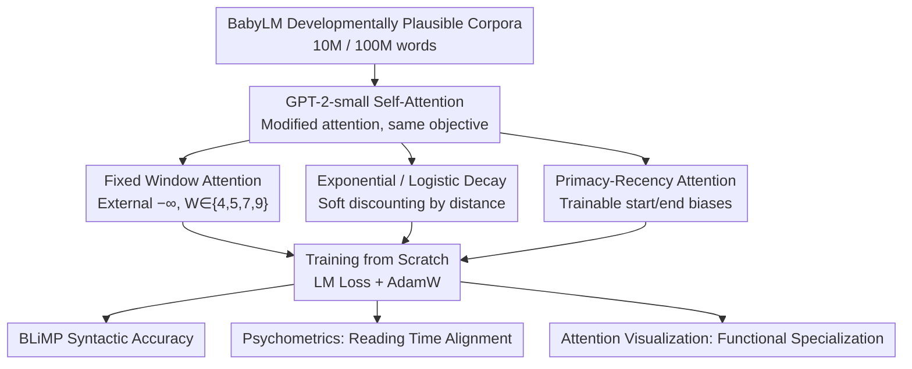

# Working Memory Constraints Scaffold Learning in Transformers under Data Scarcity

**Conference**: ACL 2026 Findings  
**arXiv**: [2604.20789](https://arxiv.org/abs/2604.20789)  
**Code**: None  
**Area**: Cognitive Modeling / LM Pre-training  
**Keywords**: Working Memory, Attention Constraints, Inductive Bias, Data Scarcity, Cognitive Alignment

## TL;DR

This paper integrates human working memory constraints (fixed window, exponential decay, logistic decay, primacy-recency effects) into the GPT-2 attention mechanism. By training from scratch on developmentally plausible small-scale corpora (10M/100M words), it finds that these constraints significantly improve syntactic accuracy and the predictability of human reading times under data scarcity, while promoting functional specialization of attention heads.

## Background & Motivation

**Background**: The self-attention mechanism of standard Transformers allows near-uniform access to all tokens within the context window, lacking intrinsic structural biases that reflect human cognitive limitations. While models like GPT-2 correlate well with human reading times and neural activity, this might be "in spite of" rather than "because of" their architecture.

**Limitations of Prior Work**: Existing work introducing cognitive constraints into Transformers either involves post-hoc modifications (e.g., applying decay biases to pre-trained models), context truncation during inference, or soft constraints (e.g., ALiBi). These methods do not allow constraints to shape representation learning from the start of training.

**Key Challenge**: The NLP field trends toward longer contexts and weaker inductive biases, yet human language processing is strongly constrained by limited working memory capacity—could such constraints actually aid learning?

**Goal**: (1) Systematically compare four cognitive-inspired attention constraints during training from scratch; (2) Evaluate their impact on syntactic ability and cognitive alignment in data-scarce scenarios.

**Key Insight**: By using developmentally plausible datasets from the BabyLM Challenge (10M/100M words) and training on a scale comparable to human language acquisition, the cognitive constraint hypothesis becomes more testable.

**Core Idea**: Hard cognitive constraints (especially fixed window attention) act as inductive biases that actively "scaffold" learning during data scarcity rather than hindering it.

## Method

### Overall Architecture

The paper investigates whether imposing human working memory limits on attention helps or hinders learning when training data is scarce. The approach is restrained: no changes to training objectives or new modules. It solely modifies the self-attention of GPT-2-small to implement four cognitive-inspired variants, training them from scratch on BabyLM corpora. Evaluation includes syntactic ability via BLiMP, psychometric alignment with human reading times, and attention visualization to observe functional specialization.

### Key Designs

**1. Fixed Window Attention: Imposing discrete capacity limits via a hard wall**

Standard self-attention allows uniform access across the window, unlike human cognition where working memory holds only a few chunks. This method restricts each token to attending only to the previous $W$ tokens. Positions outside the window are set to $-\infty$ before softmax, ensuring zero weight. Window sizes $W \in \{4, 5, 7, 9\}$ correspond to Cowan’s 4-chunk theory and Miller’s $7 \pm 2$ limit. Forcing the model into local contexts isolates how much can be learned from local dependencies. Unexpectedly, these local models perform well even on non-local phenomena like Binding and Argument Structure.

**2. Exponential / Logistic Decay: Softly modeling recency effects**

Unlike the hard cut-off of fixed windows, human memory decays gradually. These variants discount attention based on distance. Exponential decay mixes the original weight with a factor that decreases exponentially:

$$a'_{ij} = (1-\alpha)a_{ij} + \alpha e^{-|i-j| \cdot \lambda}$$

This creates a smooth, continuous decline. Logistic decay uses an S-curve, maintaining high accessibility for a certain distance before dropping sharply:

$$w_{ij} = 1/(1 + e^{k(d_{ij} - m)})$$

Exponential decay models "constant forgetting," while logistic decay models a "stable-then-cliff" pattern, closer to discrete capacity but differentiable.

**3. Primacy-Recency Attention: Trainable biases for sequence boundaries**

Human memory exhibits advantages for both the beginning (primacy) and end (recency) of lists. This design learns two parameters $w_{\text{primacy}}$ and $w_{\text{recency}}$ to control exponential decay biases at the start and end of sequences, allowing the model to determine the importance of boundary information.

### Loss & Training

Standard language modeling loss (next-token prediction). AdamW optimizer, lr=5e-5, trained for 5 epochs. All variants use identical hyperparameters.

## Key Experimental Results

### Main Results

**Average BLiMP Accuracy**

| Model | 10M Data | 100M Data |
|------|---------|----------|
| Baseline GPT-2 | ~61% | ~71% |
| Fixed Window 5 | **~68%** | ~72% |
| Exponential Decay | ~65% | ~71% |
| Logistic Decay | ~66% | ~72% |
| Primacy-Recency | ~63% | ~71% |

**Psychometric Alignment (ΔLog-Likelihood)**

| Model | 10M | 100M |
|------|-----|------|
| Baseline | ~3.2 | Higher |
| Fixed Window 7/9 | **~6.0** | Decreased |

### Key Findings

- **Constraints are most effective under data scarcity**: At 10M words, Fixed Window 5 outperforms the baseline by ~7%, while the gap narrows to 1-2% at 100M.
- Constrained models excel in Argument Structure; Fixed Window 5 nearly matches pre-trained GPT-2-large levels.
- **Counter-intuitive finding**: Highly local models (window of 5) perform well on non-local linguistic phenomena (e.g., Binding).
- Psychometric alignment decreases at 100M—all models (including baseline) align less with human processing as data increases, supporting the hypothesis that LM objectives do not asymptotically converge with human understanding.
- Attention visualization shows that constrained models develop functional specialization (e.g., subject-verb-object heads), whereas baseline attention remains diffuse.

## Highlights & Insights

- The core argument that "cognitive constraints are scaffolds, not obstacles" is powerful, challenging the trend for longer contexts in NLP.
- The success of fixed-window models on non-local tasks suggests that local constraints force the model to develop more explicit syntactic encodings.
- The finding that more data can reduce psychometric alignment provides new evidence for debates on whether LLMs truly "understand" language like humans.

## Limitations & Future Work

- Experiments were limited to GPT-2-small; scalability to larger models is unknown.
- Only verified on English; free-word-order or verb-final languages may differ.
- The implementation of working memory (fixed window) is far simpler than real cognitive systems.
- Certain phenomena like Island Effects remain unresolved, indicating architectural constraints cannot fix all linguistic gaps.

## Related Work & Insights

- **vs ALiBi**: ALiBi discourages but does not forbid long-distance attention; this work uses hard constraints to block it entirely.
- **vs De Varda & Marelli (2024)**: They apply post-hoc decay to pre-trained models; this work trains from scratch to let constraints shape learning.

## Rating

- Novelty: ⭐⭐⭐⭐ Interdisciplinary bridge between cognitive science and NLP is valuable.
- Experimental Thoroughness: ⭐⭐⭐⭐⭐ Multiple evaluations via BLiMP, psychometrics, visualization, and probing.
- Writing Quality: ⭐⭐⭐⭐⭐ Strong argumentation and honest discussion of limitations.
- Value: ⭐⭐⭐⭐ Significant implications for cognitive-inspired design and data-efficient learning.

<!-- RELATED:START -->

## Related Papers

- [\[ACL 2026\] FOREVER: Forgetting Curve-Inspired Memory Replay for Language Model Continual Learning](forever_forgetting_curve-inspired_memory_replay_for_language_model_continual_lea.md)
- [\[ACL 2026\] SAGE: Sign-Adaptive Gradient for Memory-Efficient LLM Optimization](sage_sign-adaptive_gradient_for_memory-efficient_llm_optimization.md)
- [\[ICLR 2026\] Pre-training under Infinite Compute](../../ICLR2026/llm_pretraining/pre-training_under_infinite_compute.md)
- [\[ICLR 2026\] Energy-Based Transformers are Scalable Learners and Thinkers](../../ICLR2026/llm_pretraining/energy-based_transformers_are_scalable_learners_and_thinkers.md)
- [\[NeurIPS 2025\] Memory Mosaics at Scale](../../NeurIPS2025/llm_pretraining/memory_mosaics_at_scale.md)

<!-- RELATED:END -->
