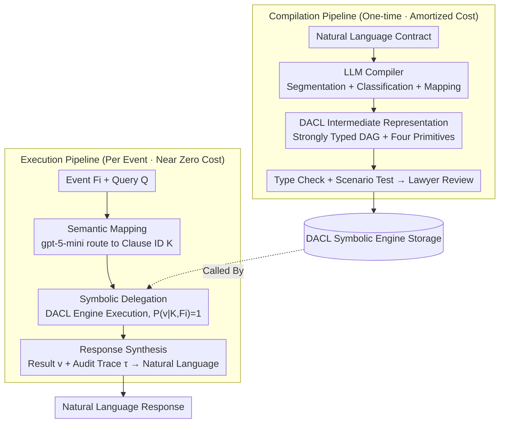

# Accurate Legal Reasoning at Scale: Neuro-Symbolic Offloading and Structural Auditability for Robust Legal Adjudication

**Conference**: ACL 2026  
**arXiv**: [2605.02472](https://arxiv.org/abs/2605.02472)  
**Code**: None (Industrial deployment system)  
**Area**: LLM Reasoning / Neuro-Symbolic  
**Keywords**: Neuro-Symbolic, Legal Reasoning, DACL, amortized intelligence, Auditability

## TL;DR
This paper proposes the Amortized Intelligence paradigm: treating the LLM as a "one-time compiler" to compile legal contracts into a deterministic Directed Acyclic Graph (DAG) intermediate representation called DACL. At runtime, a lightweight agent schedules a symbolic engine for execution, achieving 99.5% accuracy across 400 real-world contract events. Compared to large reasoning models like GPT-5.2/Claude/Gemini, accuracy on complex contracts jumps from 22-46% to 98%, while token consumption is reduced by 9.9x.

## Background & Motivation
**Background**: Legal AI has evolved from judgment prediction and contract review to LLM-driven automated execution of "computational legal clauses." These clauses are common in high-frequency, high-value operations such as logistics billing, energy procurement, taxation, and insurance, potentially generating thousands of executions monthly.

**Limitations of Prior Work**: Existing LLM solutions suffer from two fatal flaws in high-risk contract execution—**Reliability**: Chain-of-Thought (CoT) reasoning is often unfaithful to arithmetic, and identical inputs can produce different outputs, which is industrially unacceptable; **Economy**: Running LLM inference for every execution leads to costs that scale linearly with event volume. Benchmark experiments show top-tier LRMs like GPT-5.2, Claude 4.5 Sonnet, and Gemini 3 Pro collapse to 22-46% accuracy on structurally complex contracts (e.g., a Logistics Master Service Agreement with 76 decision states). These failures are not arithmetic errors but "structural failures"—calculating correctly but using the wrong variables.

**Key Challenge**: Legal execution requires "absolutely deterministic output + auditable traces + affordable costs," whereas general-purpose LLMs provide "probabilistic output + unfaithful CoT + costs linearly tied to traffic." Essentially, a "general reasoning engine" is being used for the wrong scenario—legal clauses, once signed, follow fixed logic and do not require re-understanding for every execution.

**Goal**: Split legal contract automation into "understanding" (difficult but one-time) and "execution" (high-frequency but simple) phases. Let the LLM handle the former and offload the latter to a deterministic symbolic engine.

**Key Insight**: The authors draw inspiration from compiler architecture—treating the LLM as a "front-end compiler" for translating contracts into an intermediate representation, and using a symbolic execution engine as the "back-end" runtime. This allows inference costs to be "amortized" over the first compilation, making subsequent executions nearly free.

**Core Idea**: Use a "DACL intermediate representation + neuro-symbolic agent" to completely offload probabilistic reasoning from runtime to compile-time, thereby achieving auditability, determinism, and economy simultaneously.

## Method

### Overall Architecture
The core mechanism is the decoupling of "understanding a contract" from "executing a billing event," organized via a compiler-like architecture: expensive and difficult understanding is performed once (compile-time), while cheap and high-frequency execution occurs repeatedly (runtime). It consists of two pipelines. The **compilation pipeline** is one-time: an LLM agent segments and classifies natural language contracts and generates a DAG titled DACL. This is followed by type checking, scenario testing, and human lawyer review before storage. The **execution pipeline** runs for every event: user events $F_i$ and queries $Q$ enter a neuro-symbolic agent, which uses gpt-5-mini for semantic routing to identify relevant clause IDs. It then calls the DACL symbolic engine for execution, yielding a result $v$ and an audit trace $\tau$, finally generating a natural language response. The critical boundary is that all business-critical logic is confined within the DACL symbolic engine, outside of probabilistic reasoning; the LLM never touches actual numerical calculations during runtime.

### Key Designs
**1. DACL Intermediate Representation and Four Clause Primitives: Using a strongly typed DAG to solidify contract logic into "same input, same output" programs.**

The biggest issue with LLMs calculating contracts at runtime is the lack of referential transparency—the same input may yield different results. DACL addresses this by translating contracts into a strongly typed DAG, where determinism is guaranteed by the structure itself. Variables in the graph are categorized into three types: External (runtime inputs, e.g., shipment weight), Const (contract constants with time validity windows), and Derived (intermediate calculation results). Logic is expressed through four recursive primitives tailored for recurring patterns in commercial contracts: **Procedure** is a sequential pipeline supporting early-stop conditions; **Logical Clause** uses first-order Boolean logic with short-circuit evaluation in declaration order to enforce priority; **Range Clause** maps continuous variables to discrete buckets, enforcing non-overlapping, strictly closed intervals and complete coverage at load time to prevent off-by-one errors; **Pricing Formula** is a sandboxed arithmetic expression allowing only a whitelist of functions (`ceil/floor/round/sqrt/exp/log`) and prohibiting arbitrary code execution for security.

These primitives are effective because they elevate patterns difficult for general logic programming into first-class citizens. Systems like Prolog are oriented toward theorem proving and struggle with mixed "arithmetic + time + range + condition" patterns; DACL builds these into the primitives. Consequently, the LLM only performs syntactic mapping during compilation without needing semantic reasoning. Each clause includes `validity_start_date / validity_end_date`, ensuring that contract amendments only require recompiling affected clauses.

**2. Amortized Intelligence: Amortizing "Understanding" to the first compilation to make subsequent executions nearly free.**

Business scenarios naturally exhibit asymmetry—a contract is signed once, but billing events based on it recur thousands of times. Baseline solutions ignore this, resulting in an $O(N)$ model: for every event $e_i$, the contract $C$ and facts $F_i$ are fed back into the LLM for a full reasoning cycle. This paper shifts to an $O(1)$ model: the LLM performs the "Contract → DACL" translation once (time-consuming but sparse). Subsequently, each event only runs an inexpensive gpt-5-mini for semantic routing followed by symbolic engine execution. The long-term amortized cost approaches the minimum value of "Routing LLM + Symbolic Execution." This standard software engineering trade-off—doing the expensive part once and the cheap part many times—is systematically applied to legal AI. The trade-off involves a higher fixed cost for initial compilation in exchange for a reduction in token consumption from 13.44M to 1.35M (a 9.9x difference) in a 400-event evaluation.

**3. Neuro-Symbolic Agent Three-Stage Scheduling: Ensuring the LLM performs only selection and expression, never actual calculation.**

A symbolic engine alone is insufficient; a mechanism is needed to map ambiguous natural language queries to the engine. This agent uses gpt-5-mini with the OpenAI Agents SDK for ReAct-style scheduling, but intentionally exposes only one tool: `evaluate_clauses_tool(K, F_i)`. Limiting the LLM's agency increases control in high-risk scenarios. Its workflow is strictly divided into three stages: **Semantic Mapping** $K = \mathcal{M}_{\theta_{small}}(Q, F_i)$ uses constrained semantic parsing to map the query to a set of clause IDs without executing logic; **Symbolic Delegation** $(v, \tau) = \Phi_{DACL}(K, F_i)$ hands selected clauses to the deterministic engine where $P(v|K, F_i) = 1$, producing zero stochasticity; **Response Synthesis** $y = \mathcal{S}_{\theta_{small}}(Q, v, \tau)$ packages the numerical result and audit trace into natural language.

The significance of this separation is that all numerical, conditional, and range-based judgments are handled by the symbolic engine. The LLM is responsible only for "selecting the clauses" and "explaining the result." This is the key to obtaining auditable, repeatable, and low-cost results—business-critical calculations never pass through probabilistic reasoning. Errors are confined to "wrong clause selection," which can be further mitigated with stricter tool input schemas, rather than arithmetic errors.

### Loss & Training
No new models were trained. Zero-shot LRM baselines (GPT-5.2 with reasoning_effort=none/medium, Claude 4.5 Sonnet with Extended Thinking, Gemini 3 Pro with thinking_level=high) and a gpt-5-mini orchestrated agent were used. All baselines were constrained to output a strict schema: a `reasoning` field (for auditing) and a `result` field (for auto-scoring).

## Key Experimental Results

### Main Results: Accuracy on 400 Events across Four Contract Categories (Excerpt)

| Contract | GPT-5.2 (none) | GPT-5.2 (med) | Claude Sonnet 4.5 | Gemini 3 Pro | DACL Agent |
|------|----------------|---------------|-------------------|--------------|------------|
| Health-PPO | 74% | 91% | 73% | 69% | **100%** |
| Energy-Sup | 100% | 99% | 100% | 91% | **100%** |
| Logistics-MSA | 22% | 46% | 45% | 30% | **98%** |
| Muni-IFB | 36% | 95% | 93% | 96% | **100%** |
| **Overall** | 58.0% | 82.8% | 77.8% | 71.5% | **100.0% (adj)** |

### Ablation Study: Error Type Analysis and Computational Cost

| Dimension | GPT-5.2 Medium Baseline | DACL Agent | Gain |
|------|---------------------|------------|---------|
| Total Token Consumption (400 events) | 13.44M | 1.35M | 9.9× ↓ |
| Logistics-MSA Avg Latency | ~164s | 26.8s | 6.1× ↓ |
| Variable Dependency Errors | 71% | ~0 (only 2 orchestrator errors) | — |
| Arithmetic Hallucination | <1 case/model | 0 | — |

### Key Findings
- **Reasoning Cliff**: GPT-5.2 is 100% accurate on Energy-Sup (1 decision state) but collapses to 46% on Logistics-MSA (76 decision states). This reveals that while LLMs can handle arithmetic depth (e.g., date lookups in Muni-IFB), they cannot handle "state width" (maintaining state across a wide decision tree).
- **Structural vs. Arithmetic Failures**: 71% of errors stem from Variable Dependency (VD), while <1% are from Arithmetic Hallucination (AH). Models possess "arithmetic primitives" for legal calculation but lack "structural fidelity"—applying the right algorithm to the wrong variables.
- **Controllable Errors in DACL**: The two errors for DACL Agent in Logistics-MSA were semantic routing failures by the orchestrator (gpt-5-mini), such as selecting the wrong clause. The symbolic engine itself is correct by construction.
- **Production Validation**: The system has been online for 12 months, processing approximately 1,000 billing events monthly covering 150+ commercial contracts.
- **Medium Reasoning vs. Width**: Enabling GPT-5.2's medium reasoning improved Muni-IFB (temporal logic) from 36% to 95%, but only improved Logistics-MSA from 22% to 46%. Long CoT aids sequence depth but fails at cross-branch state tracking.
- **Counter-Intuitive Latency Reduction**: DACL Agent averaged 26.8s on Logistics-MSA, significantly lower than the ~164s of GPT-5.2 Medium/Claude/Gemini. Offloading reasoning to a symbolic engine improves overall latency.

## Highlights & Insights
- **Paradigm Shift (Compile-time vs. Runtime)**: The most profound insight is redefining legal AI as a "compiler" rather than a "runtime interpreter." This boundary re-demarcation is a highly transferable concept for engineering high-reliability systems.
- **Error Anatomy**: By categorizing errors into VD/DH/AH, the authors quantifiably prove that LRM failures are due to "state tracking" rather than "inaccurate calculation." This suggests future LRM training should focus on long-horizon state tracking.
- **Minimalist Tool Design**: Restricting the agent to a single tool (`evaluate_clauses_tool`) limits the LLM's room for error, contrasting with the "more tools are better" narrative, providing better safety in high-risk deterministic scenarios.
- **Temporal Versioning**: The inclusion of `validity_start_date/end_date` in DACL allows for incremental recompilation, a critical engineering detail for scalability.

## Limitations & Future Work
- **Limitations**: (1) DACL supports arithmetic, first-order logic, and range mapping but lacks support for defeasible reasoning, open semantic standards (e.g., "reasonable care"), and higher-order logic; (2) Establishing the Gold Standard requires manual effort, limiting evaluation scale; (3) Traffic is synthetic, which may not cover all long-tail production error inputs; (4) Only tested on English commercial contracts.
- **Future Work**: Extending DACL to defeasible or probabilistic formalisms; developing tools for automated compilation error detection to reduce human review; applying the system to public law (taxes, social security) to improve "access to justice."

## Related Work & Insights
- **vs. Prolog-based ProSLM/SOLAR**: Unlike general logic systems, DACL uses specific primitives for arithmetic and temporal ranges tailored for industry needs. It uses a typed DAG rather than free logic programs, ensuring structural stability.
- **vs. LexGLUE/LegalBench**: While existing benchmarks focus on legal language understanding, this work focuses on deterministic output in high-risk execution scenarios—an underserved dimension.
- **vs. Program-of-Thoughts (PoT)**: While PoT uses LLMs to generate Python for one-off reasoning, this work solidifies the output into a reusable DAG with a type system and versioning—a comprehensive industrial engineering of the program-aided LM concept.

## Rating
- **Novelty**: ⭐⭐⭐⭐ The "Amortized Intelligence" paradigm redefines the boundary between LLMs and symbolic engines.
- **Experimental Thoroughness**: ⭐⭐⭐⭐ Covers various LRM families and real contracts with cost/latency analysis.
- **Writing Quality**: ⭐⭐⭐⭐⭐ Concepts like "Reasoning Cliff" are well-defined and insightful.
- **Value**: ⭐⭐⭐⭐⭐ A production-proven system that serves as a blueprint for using LLMs in deterministic business logic.

<!-- RELATED:START -->

## Related Papers

- [\[ACL 2026\] LegalDrill: Diagnosis-Driven Synthesis for Legal Reasoning in Small Language Models](legaldrill_diagnosis-driven_synthesis_for_legal_reasoning_in_small_language_mode.md)
- [\[ACL 2026\] LePREC: Reasoning as Classification over Structured Factors for Assessing Relevance of Legal Issues](leprec_reasoning_as_classification_over_structured_factors_for_assessing_relevan.md)
- [\[ICLR 2026\] LEXam: Benchmarking Legal Reasoning on 340 Law Exams](../../ICLR2026/llm_reasoning/lexam_benchmarking_legal_reasoning_on_340_law_exams.md)
- [\[ICLR 2026\] A Balanced Neuro-Symbolic Approach for Commonsense Abductive Logic](../../ICLR2026/llm_reasoning/a_balanced_neuro-symbolic_approach_for_commonsense_abductive_logic.md)
- [\[ICLR 2026\] VERICOT: Neuro-Symbolic Chain-of-Thought Validation via Logical Consistency Checks](../../ICLR2026/llm_reasoning/vericot_neuro-symbolic_chain-of-thought_validation_via_logical_consistency_check.md)

<!-- RELATED:END -->
