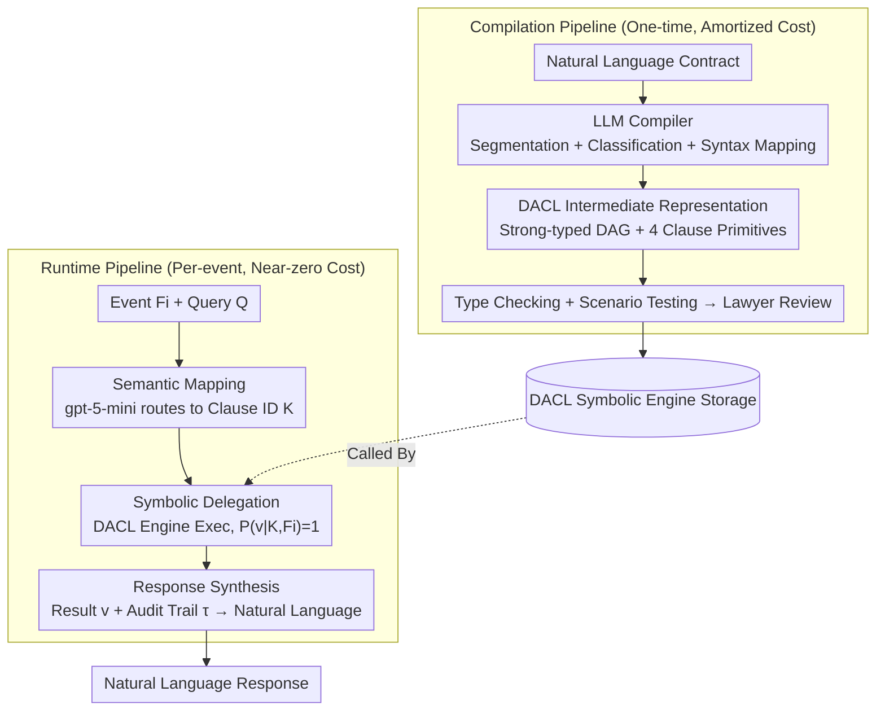

# Accurate Legal Reasoning at Scale: Neuro-Symbolic Offloading and Structural Auditability for Robust Legal Adjudication

**Conference**: ACL 2026  
**arXiv**: [2605.02472](https://arxiv.org/abs/2605.02472)  
**Code**: None (Industrial Deployment System)  
**Area**: LLM Reasoning / Neuro-Symbolic  
**Keywords**: Neuro-symbolic, Legal Reasoning, DACL, Amortized Intelligence, Auditability

## TL;DR
This paper proposes the Amortized Intelligence paradigm: treating the LLM as a "one-time compiler" to compile legal contracts into a deterministic Directed Acyclic Graph (DAG) intermediate representation called DACL. At runtime, a lightweight agent schedules a symbolic engine for execution. It achieves 99.5% accuracy across 400 real-world contract events. Compared to large reasoning models (LRMs) like GPT-5.2/Claude/Gemini—whose accuracy collapses from 22-46% on complex contracts—ours achieves 98% with a 9.9x reduction in token consumption.

## Background & Motivation
**Background**: Legal AI has evolved from judgment prediction and contract review to the automated execution of "computational legal clauses" driven by LLMs. These clauses are common in high-frequency, high-value operations such as logistics billing, energy procurement, taxation, and insurance, potentially generating thousands of repetitive executions monthly.

**Limitations of Prior Work**: Existing LLM solutions have two fatal flaws in high-risk contract execution scenarios—**Reliability**: CoT reasoning is often unfaithful to arithmetic, and identical inputs produce different outputs, which is industrially unacceptable; **Economy**: Running large model inference for every execution leads to costs that scale linearly with the volume of events. Benchmark experiments show that top LRMs like GPT-5.2, Claude 4.5 Sonnet, and Gemini 3 Pro experience an accuracy collapse to 22-46% on structurally complex contracts (e.g., a Logistics Master Service Agreement with 76 decision states). The failures are not arithmetic errors but "structural failures"—calculating correctly but using the wrong variables.

**Key Challenge**: Legal execution requires "absolutely deterministic output + auditable trails + affordable costs," whereas general LLMs provide "probabilistic output + unfaithful CoT + costs linearly tied to traffic." This is essentially a misuse of "general reasoning engines"—once a legal clause is signed, its logic is fixed; it does not need to be re-understood for every execution.

**Goal**: To decouple legal contract automation into two phases: "Understanding" (difficult but one-time) and "Execution" (high-frequency but simple). The LLM is responsible only for the former, while the latter is offloaded to a deterministic symbolic engine.

**Key Insight**: Borrowing from compiler architecture, the authors treat the LLM as a "frontend compiler" for translating contracts into an intermediate representation, and use a symbolic execution engine as the "backend" runtime. In this way, reasoning costs are "amortized" over the first compilation, making subsequent executions nearly free.

**Core Idea**: Use the "DACL intermediate representation + neuro-symbolic agent" to completely offload probabilistic reasoning from runtime to compile-time, thereby achieving auditability, determinism, and economy simultaneously.

## Method

### Overall Architecture
The core mechanism is to completely separate "understanding a contract" from "executing a billing event," organized via a compiler architecture: expensive and difficult understanding is done once (compile-time), while cheap and high-frequency execution is done numerous times (runtime). It consists of two pipelines. The **Compilation Pipeline** is one-time: an LLM agent segments and classifies the natural language contract, generating a DAG called DACL. This undergoes type checking and scenario testing before being stored after manual lawyer review. The **Runtime Pipeline** is executed for every event: user events $F_i$ along with query $Q$ enter a neuro-symbolic agent. The agent uses gpt-5-mini for semantic routing to identify relevant clause IDs, invokes the DACL symbolic engine for execution, obtains the result $v$ and audit trail $\tau$, and finally packages them into a natural language response. The critical boundary is that all business-critical logic is contained within the DACL symbolic engine, outside of probabilistic reasoning; the LLM never touches actual numerical calculations during runtime.

### Key Designs
**1. DACL Intermediate Representation and Four Clause Primitives: Using Strong-typed DAGs to Solidify Contract Logic into Output-Deterministic Programs**

The greatest drawback of LLMs calculating contracts directly at runtime is the lack of referential transparency—the same input may yield different results. DACL counters this by translating the contract into a strong-typed DAG, ensuring determinism through the structure itself. Variables in the graph are categorized into three types by source: External (runtime inputs, e.g., shipping weight), Const (contract constants with validity windows), and Derived (intermediate results). Logic is expressed using four recursive primitives targeting recurring patterns in commercial contracts: **Procedure** is a sequential pipeline supporting conditional early exit; **Logical Clause** is first-order Boolean logic with short-circuit evaluation by declaration order to enforce priority; **Range Clause** maps continuous variables to discrete buckets, enforcing non-overlapping intervals and full coverage at load time to prevent off-by-one errors; **Pricing Formula** is a sandboxed arithmetic expression white-listing only `ceil/floor/round/sqrt/exp/log` to ensure security by prohibiting arbitrary code execution.

**2. Amortized Intelligence: Amortizing "Understanding" to Initial Compilation for Near-Zero Execution Costs**

Business scenarios naturally possess an asymmetry—contracts are signed once, but billing events based on them repeat thousands of times. Baseline solutions fail to exploit this, resulting in an $O(N)$ model: for every event $e_i$, contract $C$ and facts $F_i$ are re-fed to the LLM for a full reasoning pass. Ours transforms this into an $O(1)$ model: the LLM performs the "Contract → DACL" translation only once (expensive but sparse). Subsequent events only require cheap gpt-5-mini semantic routing followed by symbolic engine invocation. The long-term amortized cost approaches the minimum value of "routing LLM + symbolic execution." This is a systematic application of the classic "do expensive things once, do cheap things often" trade-off from software engineering to legal AI.

**3. Three-Stage Scheduling of the Neuro-Symbolic Agent: LLMs Choose and Express, Never Directing a Single Calculation**

A symbolic engine alone is insufficient; a bridge is needed to map vague natural language queries to the engine. This agent implements ReAct-style scheduling via gpt-5-mini and the OpenAI Agents SDK, but deliberately exposes only a single tool: `evaluate_clauses_tool(K, F_i)`. Restricting its agency ensures controllability in high-risk scenarios. Its workflow is strictly divided: first, **Semantic Mapping** $K = \mathcal{M}_{\theta_{small}}(Q, F_i)$ maps the query to a set of clause IDs using constrained semantic parsing; second, **Symbolic Delegation** $(v, \tau) = \Phi_{DACL}(K, F_i)$ hands the selected clauses to the deterministic engine where $P(v|K, F_i) = 1$; third, **Response Synthesis** $y = \mathcal{S}_{\theta_{small}}(Q, v, \tau)$ translates the numerical results and audit trails back into natural language.

## Loss & Training
No new models were trained. Zero-shot LRM baselines (GPT-5.2 with `reasoning_effort=none/medium`, Claude 4.5 Sonnet with `Extended Thinking`, Gemini 3 Pro with `thinking_level=high`) and gpt-5-mini for the orchestration agent were used. All baselines were constrained to output a strict schema: a `reasoning` field (for auditing) and a `result` field (for automated scoring).

## Key Experimental Results

### Main Results: Accuracy Across 400 Events in Four Contract Categories (Excerpt)

| Contract | GPT-5.2 (none) | GPT-5.2 (med) | Claude Sonnet 4.5 | Gemini 3 Pro | DACL Agent |
|------|----------------|---------------|-------------------|--------------|------------|
| Health-PPO | 74% | 91% | 73% | 69% | **100%** |
| Energy-Sup | 100% | 99% | 100% | 91% | **100%** |
| Logistics-MSA | 22% | 46% | 45% | 30% | **98%** |
| Muni-IFB | 36% | 95% | 93% | 96% | **100%** |
| **Overall** | 58.0% | 82.8% | 77.8% | 71.5% | **100%** |

### Ablation Study: Error Type Analysis and Computational Cost

| Dimension | GPT-5.2 Medium Baseline | DACL Agent | Gain |
|------|---------------------|------------|---------|
| Total Token Consumption (400 events) | 13.44M | 1.35M | 9.9× ↓ |
| Average Latency (Logistics-MSA) | ~164s | 26.8s | 6.1× ↓ |
| Variable Dependency Errors | 71% | ~0 (only 2 orchestrator errors) | — |
| Arithmetic Hallucination | <1 event/model | 0 | — |

### Key Findings
- **"Reasoning Cliff"**: GPT-5.2 achieved 100% accuracy on Energy-Sup (1 decision state) but collapsed to 46% on Logistics-MSA (76 decision states), revealing that LLMs handle arithmetic depth well but struggle with state tracking across broad decision trees.
- **Errors are Structural, Not Arithmetic**: 71% of errors stem from Variable Dependency (VD), while <1% come from Arithmetic Hallucination (AH). Models possess "arithmetic primitives" for legal calculation but lack "structural fidelity"—applying the right algorithm to the wrong variables.
- **DACL Error Sources are More Controllable**: The two errors for the DACL Agent in Logistics-MSA were semantic routing failures by the orchestrator (gpt-5-mini), whereas the symbolic engine is error-free by construction.
- **Production Validation**: Successfully deployed for 12 months, processing approximately 1000 billing events monthly across over 150 commercial contracts.
- **Inadequacy of "Medium" Reasoning**: Enabling medium reasoning for GPT-5.2 significantly improved Muni-IFB accuracy (temporal logic) but only marginally improved Logistics-MSA accuracy, suggesting that long CoT compensates for depth but not for state tracking across multiple branches.
- **Counter-Intuitive Latency Reduction**: The DACL Agent's average latency (26.8s) was significantly lower than that of LRMs (~164s), as offloading reasoning to a symbolic engine improves overall speed.

## Highlights & Insights
- **Paradigm Shift from "Runtime Interpreter" to "Compiler"**: The most profound insight is redefining legal AI as a compiler—this ability to re-partition boundaries is the most portable idea for engineers.
- **Error Analysis Reveals LRM Deficiencies**: By categorizing errors into VD/DH/AH, the authors quantifiably prove that LRM failures are due to "state tracking," not mathematical inability. This directs future LRM training toward long-horizon state tracking.
- **Minimalist "Single Tool" Design**: The neuro-symbolic agent deliberately exposes only one tool to limit the LLM's agency, ensuring safety and reliability in high-risk deterministic scenarios.

## Limitations & Future Work
- **Ours**: (1) DACL primitives cover arithmetic and first-order logic but currently lack support for defeasible reasoning and open-ended semantic standards (e.g., "reasonable care"); (2) Scaling evaluations is limited by the need for manual Gold Standards; (3) Synthetic traffic may not fully cover long-tail production errors; (4) Testing was limited to English commercial contracts.
- **Future Directions**: Extending the DACL compilation target to defeasible/probabilistic formalisms (e.g., ProbLog); researching automated tools for detecting compilation errors to reduce the burden of human review.

## Related Work & Insights
- **vs. Prolog-based ProSLM/SOLAR**: While others use Prolog for legal reasoning, DACL's primitives are specifically designed for commercial contracts (arithmetic + time), making it more suitable for industrial requirements while ensuring structural stability through typed DAGs.
- **vs. Program-aided LM (PAL/PoT)**: While PAL generates Python code for single-pass reasoning, Ours solidifies the output into a repeatable DAG with a type system and versioning—representing a complete industrial engineering of the PAL concept.

## Rating
- **Novelty**: ⭐⭐⭐⭐ The Amortized Intelligence paradigm effectively re-partitions the responsibilities between LLMs and symbolic engines.
- **Experimental Thoroughness**: ⭐⭐⭐⭐ Covers various LRMs and real-world contracts with detailed error analysis, though it lacks an RAG-LRM baseline.
- **Writing Quality**: ⭐⭐⭐⭐⭐ Highly effective terminology like "Reasoning Cliff" and clear architectural articulation.
- **Value**: ⭐⭐⭐⭐⭐ A rare ACL paper with a production-proven system (12 months, 150+ contracts), providing direct value to teams implementing deterministic business logic with LLMs.

<!-- RELATED:START -->

## Related Papers

- [\[ACL 2026\] LegalDrill: Diagnosis-Driven Synthesis for Legal Reasoning in Small Language Models](legaldrill_diagnosis-driven_synthesis_for_legal_reasoning_in_small_language_mode.md)
- [\[ACL 2026\] LePREC: Reasoning as Classification over Structured Factors for Assessing Relevance of Legal Issues](leprec_reasoning_as_classification_over_structured_factors_for_assessing_relevan.md)
- [\[AAAI 2026\] NeSTR: A Neuro-Symbolic Abductive Framework for Temporal Reasoning in Large Language Models](../../AAAI2026/llm_reasoning/nestr_a_neuro-symbolic_abductive_framework_for_temporal_reasoning_in_large_langu.md)
- [\[ACL 2026\] Discovering a Shared Logical Subspace: Steering LLM Logical Reasoning via Alignment of Natural-Language and Symbolic Views](discovering_a_shared_logical_subspace_steering_llm_logical_reasoning_via_alignme.md)
- [\[AAAI 2026\] In-Token Rationality Optimization: Towards Accurate and Concise LLM Reasoning via Self-Feedback](../../AAAI2026/llm_reasoning/in-token_rationality_optimization_towards_accurate_and_concise_llm_reasoning_via.md)

<!-- RELATED:END -->
