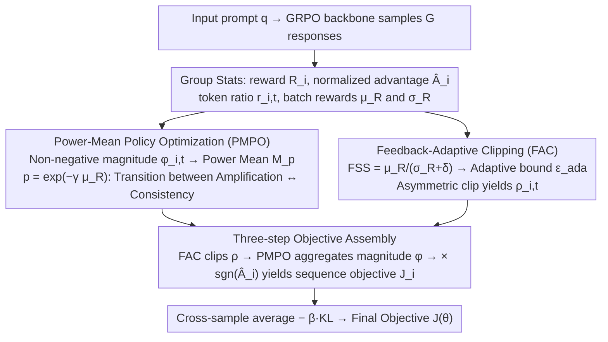

# Adapt to Thrive! Adaptive Power-Mean Policy Optimization for Improved LLM Reasoning

**Conference**: ACL 2026 Findings  
**arXiv**: [2605.04066](https://arxiv.org/abs/2605.04066)  
**Code**: Not yet public  
**Area**: LLM Reasoning / Reinforcement Learning  
**Keywords**: RLVR, GRPO, Power-Mean Objective, Adaptive Clipping, Mathematical Reasoning

## TL;DR
This paper proposes APMPO, which unifies the GRPO (arithmetic mean) and GMPO (geometric mean) objectives using a "power-mean" controlled by the current mean reward. Combined with an adaptive clip range based on reward stability, it allows RLVR training to dynamically switch between "amplifying rare high rewards" and "emphasizing consistency" across different stages, consistently outperforming GRPO/DAPO/GMPO on 9 mathematical, SQL, and multimodal reasoning benchmarks.

## Background & Motivation

**Background**: The current mainstream approach to improving LLM reasoning is Reinforcement Learning with Verifiable Rewards (RLVR). Within this, GRPO has become the de facto standard by using group-relative normalization for advantage estimation, thereby eliminating the value model. Variants such as DAPO and GMPO introduce asymmetric clipping and geometric mean objectives, respectively, on top of GRPO.

**Limitations of Prior Work**: Through a "pre-analysis" of GRPO and GMPO training curves (Figure 1), the authors identify two specific issues. First, the arithmetic mean objective of GRPO is extremely sensitive to high-reward outliers, rapidly amplifying single high-scoring trajectories in early stages, which leads to premature entropy collapse and locks the model into sub-optimal policies. Conversely, the geometric mean of GMPO is too conservative; a single low score can pull down the entire group's reward, making it nearly impossible to learn anything when correct paths are scarce early on. Second, all methods use a fixed clip threshold $\epsilon$ to limit policy updates, ignoring variations in the stability of reward distributions across different batches—stable batches are over-constrained, while noisy batches are allowed to cause detrimental updates.

**Key Challenge**: The mismatch between static objective functions and training dynamics. The same objective must "amplify rare positive signals" during the cold-start phase and "emphasize path consistency" during the convergence phase. These two requirements cannot be simultaneously met by any single extreme of GRPO or GMPO. The same logic applies to the clip range.

**Goal**: (1) Design an objective function that smoothly transitions between arithmetic and geometric means based on training progress; (2) Design a clipping mechanism that dynamically adjusts the trust region based on the statistical stability of rewards in each batch.

**Key Insight**: The authors observe that the arithmetic mean and geometric mean are special cases of the generalized power mean $M_p$ at $p=1$ and $p\to 0$, respectively. Thus, they use a continuously adjustable exponent $p$ to unify these extremes. Simultaneously, they view the "mean-to-variance ratio of batch rewards" as a proxy for policy reliability to drive the expansion and contraction of the clip range.

**Core Idea**: Use real-time performance $\mu_R$ to regulate the power-mean exponent $p=\exp(-\gamma\mu_R)$, allowing the objective to naturally transition from an "amplification type" to a "consistency type." Meanwhile, the Feedback Stability Score $\text{FSS}=\mu_R/(\sigma_R+\delta)$ adjusts the upper bound of the clip; stable reward signals allow for more aggressive updates.

## Method

### Overall Architecture
APMPO does not discard GRPO but follows its "group sampling + group-relative advantage" skeleton: for each prompt $q$, $G$ responses $\{o_i\}$ are sampled to calculate rewards $R_i$, normalized advantages $\hat{A}_i=(R_i-\mu_R)/(\sigma_R+\delta)$, and token-level importance ratios $r_{i,t}(\theta)$. The actual modifications lie in two orthogonal adaptive modules—PMPO governs "objective aggregation" and FAC governs the "clipping range," replacing the hard-coded arithmetic mean and fixed clip in GRPO. The final objective algorithm first uses PMPO to aggregate token-level "non-negative magnitudes" $\phi_{i,t}$ into a scalar per sequence, multiplies it by a direction control term $\text{sgn}(\hat{A}_i)$, averages across samples, and subtracts the KL penalty from the reference policy. Mechanism: allow the objective function to morph with training progress instead of using the same face from start to finish.

### Key Designs

**1. Power-Mean Policy Optimization (PMPO): Transitions the objective from "amplifying rare high rewards" to "emphasizing path consistency" via a sliding power mean.**

The arithmetic mean of GRPO is sensitivity to outliers, causing early amplification of single high-scoring traces and premature entropy collapse. GMPO's geometric mean is too conservative, making it hard to learn when correct paths are rare. PMPO places these two extremes on a continuous dial. Since the power mean requires non-negative values, it splits the token-level objective into a "non-negative magnitude" and a "direction":

$$\phi_{i,t}(\theta)=|\min(r_{i,t}\hat{A}_i,\ \rho_{i,t}\hat{A}_i)|,\qquad \text{Direction}=\text{sgn}(\hat{A}_i)$$

Then, it aggregates the magnitude using a power mean where the exponent $p$ decays exponentially with the batch mean reward $\mu_R\in[0,1]$:

$$M_p(\Phi_i)=\Big(\frac{1}{|o_i|}\sum_t \phi_{i,t}^{\,p}\Big)^{1/p},\qquad p=\exp(-\gamma\mu_R)$$

Ours proves in Appendix D that GRPO and GMPO are limit cases of the power mean as $p\to 1$ and $p\to 0$ respectively: $p\to 1$ yields the arithmetic mean (ideal for outlier amplification during exploration), and $p\to 0$ yields the geometric mean (ideal for consistency during consolidation). This encodes the exploration-consolidation trade-off directly into the objective.

**2. Feedback-Adaptive Clipping (FAC): Dynamically scales the clipping upper bound based on reward stability.**

Traditional PPO methods use a static $\epsilon$. FAC defines a Feedback Stability Score to quantify signal reliability:

$$\text{FSS}=\mu_R/(\sigma_R+\delta)$$

High mean and low variance imply high reliability. This score is mapped via $\tanh$ to an adaptive upper bound $\epsilon_{\text{ada}}=\epsilon_{\min}+(\epsilon_{\max}-\epsilon_{\min})\cdot\tanh(\text{FSS})$, using an asymmetric clip:

$$\rho_{i,t}=\text{clip}\big(r_{i,t},\ 1-\epsilon_{\text{low}},\ 1+\epsilon_{\text{ada}}\big)$$

The lower bound $\epsilon_{\text{low}}$ remains fixed to ensure negative advantages are always clipped decisively, while the adaptive upper bound allows for faster acceleration when signals are stable.

**3. Three-step Objective Assembly: Weaving magnitude, adaptive clipping, and direction semantics.**

To ensure PMPO and FAC work with PPO stability mechanisms, they are combined in order. Step 1: Calculate clipped ratio $\rho_{i,t}(\theta)$ using FAC. Step 2: Determine non-negative magnitude $\phi_{i,t}(\theta)$. Step 3: The per-sequence objective is $\mathcal{J}_i(\theta)=M_p(\Phi_i)\cdot\text{sgn}(\hat{A}_i)$. This decoupling satisfies the non-negativity constraint of the power mean while retaining the directional semantics of maximizing positive advantages and penalizing negative ones.

### Loss & Training
The complete objective is $\mathcal{J}(\theta)=\frac{1}{G}\sum_i \mathcal{J}_i(\theta) - \beta D_{KL}(\pi_\theta\|\pi_{\text{ref}})$. Training uses AdamW with a learning rate of $1\times10^{-6}$, batch size of 512, and 8 rollouts per prompt. Key hyperparameters: $\gamma=0.8$ (sensitivity of $p$ to $\mu_R$), $(\epsilon_{\min},\epsilon_{\max})=(0.2,0.4)$, $\epsilon_{\text{low}}=0.2$. Rewards are 0/1 binary rules.

## Key Experimental Results

### Main Results
Evaluated across Qwen2.5-Math-1.5B/3B and DeepSeek-R1-Distill-Qwen-1.5B on 6 math benchmarks + SQL + Multi-modal tasks.

| Model | Method | MATH500 | AIME24 P@1 | AMC23 P@1 | Olympiad | Avg P@1 |
|------|------|---------|-----------|-----------|----------|---------|
| Qwen2.5-Math-1.5B | GRPO | 75.2 | 13.3 | 52.5 | 39.0 | 37.1 |
| Qwen2.5-Math-1.5B | DAPO | 77.2 | 16.7 | 57.5 | 40.4 | 39.6 |
| Qwen2.5-Math-1.5B | GMPO | 76.6 | 13.3 | 55.0 | 38.7 | 39.0 |
| Qwen2.5-Math-1.5B | **APMPO** | **78.0** | **20.0** | **62.5** | **42.4** | **41.7** (+4.6) |
| Qwen2.5-3B | **APMPO** | **68.4** | **10.0** | **45.0** | **33.2** | **32.4** (+3.0) |
| DS-R1-Distill-1.5B | **APMPO** | **81.6** | **23.3** | **65.0** | **46.6** | **46.0** (+6.1) |

*(Note: Gain is relative to GRPO baseline)*.

### Ablation Study

| Configuration | Avg P@1 (Math) | Remark |
|------|---------------|------|
| Full APMPO | 41.7 | Complete PMPO + FAC |
| GRPO baseline | 37.1 | All adaptive modules removed |
| GRPO + FAC only | ~38.5 | Adaptive clipping alone provides moderate gains |
| GRPO + PMPO only | ~40.5 | Adaptive objective is the primary driver |
| FSS using $\mu_R$ only | Slight drop | Overly permissive without stability sensing |
| $p$ using linear decay | Slight drop | Exponential decay is more stable for transitions |

### Key Findings
- **Objective Adaptation** (PMPO) yields significantly higher gains than **Clipping Adaptation** (FAC), confirming that static objective functions are a major bottleneck in RLVR.
- APMPO maintains a healthier entropy decay rate—slower than GRPO and faster than GMPO—hitting the "exploration-convergence" sweet spot.
- The method is compute-efficient: batch-level $\mu_R$ and $\sigma_R$ statistics add negligible wall-clock time compared to GRPO.

## Highlights & Insights
- **Unified Objective Framework**: By treating GRPO and GMPO as limits of a power mean, the paper provides a clear "spectrum" for RLVR algorithm design.
- **Training Progress as a Signal**: Using $\mu_R$ to schedule $p$ makes the method self-correcting across different model sizes and task difficulties.
- **Reward Quality Awareness**: Defining trust regions via reward stability ($\mu_R/\sigma_R$) elegantly approximates policy reliability without requiring a costly critic or value model.

## Limitations & Future Work
- **Scale**: Evaluation focused on 1.5B/3B models; validation on 7B+ models is pending.
- **Verifiable Reward Dependency**: Relies on 0/1 outcome-based rewards; extension to noisy or non-verifiable rewards (e.g., in summarization) remains an open question.
- **Granularity**: The exponent $p$ is batch-level. Future work could explore per-prompt or per-token adaptive exponents to further unlock power-mean potential.

## Related Work & Insights
- **vs GRPO**: GRPO is a fixed $p=1$ limit. APMPO matches GRPO early on but收紧 to a GMPO style later, gaining ~3 points.
- **vs GMPO**: GMPO is the $p\to 0$ limit. APMPO avoids GMPO's "slow start" by actively amplifying outliers during the early discovery phase.
- **vs DAPO**: While DAPO also uses asymmetric clipping, APMPO's upper bound is data-driven, and its core innovation lies in the objective function rather than the sampling strategy.

## Rating
- Novelty: ⭐⭐⭐⭐ (Unified power-mean perspective is elegant)
- Experimental Thoroughness: ⭐⭐⭐⭐ (9 benchmarks across 3 model families)
- Writing Quality: ⭐⭐⭐⭐ (Balanced theory and intuition)
- Value: ⭐⭐⭐⭐ (Drop-in replacement for GRPO/GMPO with consistent gains)

<!-- RELATED:START -->

## Related Papers

- [\[ACL 2026\] Think Outside the Policy: In-Context Steered Policy Optimization](think_outside_the_policy_in-context_steered_policy_optimization.md)
- [\[ICLR 2026\] Temperature as a Meta-Policy: Adaptive Temperature in LLM Reinforcement Learning](../../ICLR2026/llm_reasoning/temperature_as_a_meta-policy_adaptive_temperature_in_llm_reinforcement_learning.md)
- [\[ICLR 2026\] Slow-Fast Policy Optimization: Reposition-Before-Update for LLM Reasoning](../../ICLR2026/llm_reasoning/slow-fast_policy_optimization_reposition-before-update_for_llm_reasoning.md)
- [\[ACL 2026\] Calibration-Aware Policy Optimization for Reasoning LLMs](calibration-aware_policy_optimization_for_reasoning_llms.md)
- [\[ICLR 2026\] Adaptive Social Learning via Mode Policy Optimization for Language Agents](../../ICLR2026/llm_reasoning/adaptive_social_learning_via_mode_policy_optimization_for_language_agents.md)

<!-- RELATED:END -->
