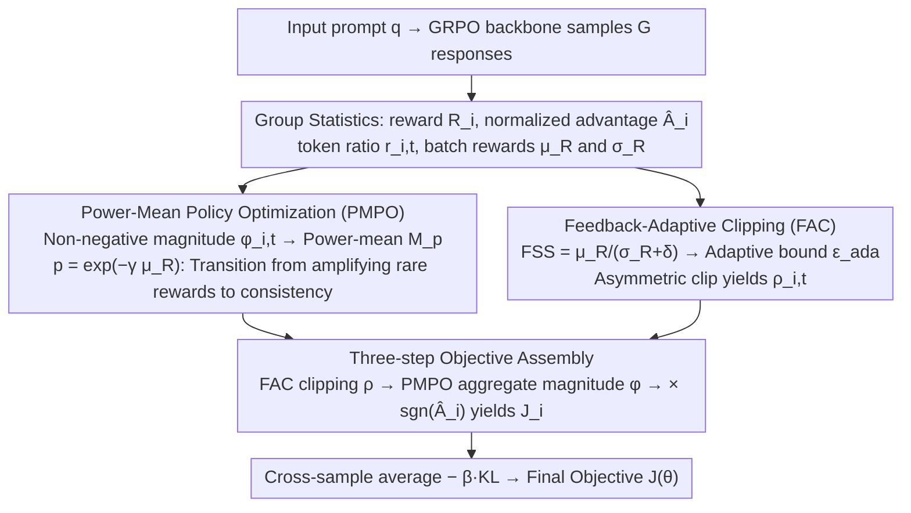

# Adapt to Thrive! Adaptive Power-Mean Policy Optimization for Improved LLM Reasoning

**Conference**: ACL 2026 Findings  
**arXiv**: [2605.04066](https://arxiv.org/abs/2605.04066)  
**Code**: Not yet public  
**Area**: LLM Reasoning / Reinforcement Learning  
**Keywords**: RLVR, GRPO, Power-Mean Objective, Adaptive Clipping, Mathematical Reasoning

## TL;DR
This paper proposes APMPO, which unifies GRPO (arithmetic mean) and GMPO (geometric mean) objectives using a "power-mean" controlled by the current mean reward. In conjunction with an adaptive clip range based on reward stability, APMPO allows RLVR training to dynamically switch between "amplifying rare high rewards" and "emphasizing consistency" across different stages, consistently outperforming GRPO, DAPO, and GMPO on 9 mathematical, SQL, and multimodal reasoning benchmarks.

## Background & Motivation

**Background**: The current mainstream approach for enhancing LLM reasoning is Reinforcement Learning with Verifiable Rewards (RLVR). Within this, GRPO has become the de facto standard by eliminating the value model through within-group normalized advantage estimation. Variants like DAPO and GMPO have introduced asymmetric clipping and geometric mean objectives, respectively, on top of GRPO.

**Limitations of Prior Work**: Through "pre-analysis" of GRPO and GMPO training curves (Fig. 1), the authors identify two specific issues. First, GRPO's arithmetic mean objective is extremely sensitive to high-reward outliers; in early stages, it rapidly amplifies single high-scoring trajectories, leading to premature entropy collapse and locking into suboptimal policies. Conversely, GMPO's geometric mean is too conservative, where a single low score can pull down the entire group reward, hindering learning when correct paths are scarce. Second, all methods use a fixed clip threshold $\epsilon$, ignoring the differences in reward distribution stability between batches—stable batches are overly restricted, while noisy batches are allowed to cause detrimental updates.

**Key Challenge**: The mismatch between static objective functions and training dynamics. The same objective must "amplify rare positive signals" during the cold start phase and "emphasize path consistency" during convergence—two requirements that neither GRPO nor GMPO can accommodate simultaneously. The same applies to the fixed clip range.

**Goal**: (1) Design an objective function capable of smoothly transitioning between arithmetic and geometric means based on training progress; (2) Design a clipping mechanism that dynamically adjusts the trust region based on the statistical stability of rewards in each batch.

**Key Insight**: The authors observe that the arithmetic mean and geometric mean are special cases of the generalized power-mean $M_p$ at $p=1$ and $p\to 0$, respectively. Thus, they incorporate both extremes into a single framework using a continuously adjustable exponent $p$. Simultaneously, the "mean-to-variance ratio of batch rewards" is viewed as a proxy for policy credibility, driving the expansion and contraction of the clip range.

**Core Idea**: Use sample performance $\mu_R$ to regulate the power-mean exponent $p=\exp(-\gamma\mu_R)$ in real-time, allowing the objective to transition naturally from "amplification type" to "consistency type." Meanwhile, the Feedback Stability Score $\text{FSS}=\mu_R/(\sigma_R+\delta)$ adjusts the upper bound of the clip; more stable reward signals permit more aggressive updates.

## Method

### Overall Architecture
APMPO does not discard GRPO but follows its "group sampling + within-group normalized advantage" framework: for each prompt $q$, $G$ responses $\{o_i\}$ are sampled to calculate rewards $R_i$, normalized advantages $\hat{A}_i=(R_i-\mu_R)/(\sigma_R+\delta)$, and token-level importance ratios $r_{i,t}(\theta)$. The actual modifications lie in two orthogonal adaptive modules—PMPO for "objective aggregation" and FAC for "clip range," replacing the fixed arithmetic mean and static clip in GRPO. The final objective algorithm: sequence-level token "non-negative magnitudes" $\phi_{i,t}$ are first aggregated via PMPO into a scalar, then multiplied by a direction control term $\text{sgn}(\hat{A}_i)$. After cross-sample averaging, a KL penalty against the reference policy is subtracted. Mechanism summary: Let the objective function itself deform with training progress rather than using the same form from start to finish.

### Key Designs

**1. Power-Mean Policy Optimization (PMPO): Transitions from "amplifying rare high rewards" to "emphasizing path consistency" via a sliding power-mean.**

Since the power-mean requires non-negative inputs, the token-level objective is first split into a "non-negative magnitude" and a "direction":

$$\phi_{i,t}(\theta)=|\min(r_{i,t}\hat{A}_i,\ \rho_{i,t}\hat{A}_i)|,\qquad \text{Direction}=\text{sgn}(\hat{A}_i)$$

Magnitudes are aggregated using the power-mean, where the exponent $p$ decays exponentially with the current batch's mean reward $\mu_R\in[0,1]$:

$$M_p(\Phi_i)=\Big(\frac{1}{|o_i|}\sum_t \phi_{i,t}^{\,p}\Big)^{1/p},\qquad p=\exp(-\gamma\mu_R)$$

Appendix D proves that GRPO and GMPO are limiting cases as $p\to 1$ and $p\to 0$, respectively. $p\to 1$ reduces to the arithmetic mean, which provides the outlier amplification needed during exploration; $p\to 0$ reduces to the geometric mean, providing the inconsistency penalty needed during consolidation. This single continuous exponent encodes the "exploration-consolidation" trade-off and ensures a smooth transition to avoid training instability.

**2. Feedback-Adaptive Clipping (FAC): Scales the clip upper bound with reward stability.**

FAC defines a Feedback Stability Score to quantify signal reliability:

$$\text{FSS}=\mu_R/(\sigma_R+\delta)$$

High mean and low variance indicate high reliability. $\text{FSS}$ is mapped via $\tanh$ to an adaptive upper bound $\epsilon_{\text{ada}}=\epsilon_{\min}+(\epsilon_{\max}-\epsilon_{\min})\cdot\tanh(\text{FSS})$, utilizing asymmetric clipping:

$$\rho_{i,t}=\text{clip}\big(r_{i,t},\ 1-\epsilon_{\text{low}},\ 1+\epsilon_{\text{ada}}\big)$$

The lower bound $\epsilon_{\text{low}}$ remains fixed while the upper bound $\epsilon_{\text{ada}}$ adapts. This mechanism rewards stable, high-mean batches while restricting noisy, low-mean batches.

**3. Three-step Objective Assembly: Weaving magnitude, adaptive clipping, and direction semantics.**

Step 1: Calculate the clipped importance ratio $\rho_{i,t}(\theta)$ using the FAC adaptive interval.  
Step 2: Calculate the token-level non-negative magnitude $\phi_{i,t}(\theta)=|\min(r_{i,t}\hat{A}_i,\ \rho_{i,t}\hat{A}_i)|$.  
Step 3: The sequence-level objective is $\mathcal{J}_i(\theta)=M_p(\Phi_i)\cdot\text{sgn}(\hat{A}_i)$. The batch average is then adjusted by the KL term $-\beta D_{KL}(\pi_\theta\|\pi_{\text{ref}})$.

### Loss & Training
The complete objective is $\mathcal{J}(\theta)=\frac{1}{G}\sum_i \mathcal{J}_i(\theta) - \beta D_{KL}(\pi_\theta\|\pi_{\text{ref}})$. Training uses AdamW, learning rate $1\times10^{-6}$, batch size 512, 8 rollouts per prompt, 400 steps, and temperature 1.0. Hyperparameters include $\gamma=0.8$, $(\epsilon_{\min},\epsilon_{\max})=(0.2,0.4)$, $\epsilon_{\text{low}}=0.2$, and $\beta=0.001$. Rewards are based on binary rule-based verification (0/1).

## Key Experimental Results

### Main Results
Evaluated on Qwen2.5-Math-1.5B/3B and DeepSeek-R1-Distill-Qwen-1.5B across mathematical (MATH500/AIME), SQL (Spider/BIRD), and multimodal (Geometry3K) benchmarks.

| Model | Method | MATH500 | AIME24 P@1 | AMC23 P@1 | Olympiad | Avg P@1 |
|------|------|---------|-----------|-----------|----------|---------|
| Qwen2.5-Math-1.5B | GRPO | 75.2 | 13.3 | 52.5 | 39.0 | 37.1 |
| Qwen2.5-Math-1.5B | DAPO | 77.2 | 16.7 | 57.5 | 40.4 | 39.6 |
| Qwen2.5-Math-1.5B | GMPO | 76.6 | 13.3 | 55.0 | 38.7 | 39.0 |
| Qwen2.5-Math-1.5B | **APMPO** | **78.0** | **20.0** | **62.5** | **42.4** | **41.7** (+2.1) |
| DS-R1-Distill-1.5B | GRPO | 75.4 | 13.3 | 57.5 | 43.2 | 39.9 |
| DS-R1-Distill-1.5B | **APMPO** | **81.6** | **23.3** | **65.0** | **46.6** | **46.0** (+3.2) |

### Ablation Study

| Configuration | Avg P@1 (Math) | Insight |
|------|---------------|------|
| Full APMPO | 41.7 | Complete PMPO + FAC model |
| GRPO baseline | 37.1 | Baseline without adaptations |
| GRPO + FAC only | 38–39 | Adaptive clipping alone provides gains |
| GRPO + PMPO only | ~40–41 | Adaptive objective is the primary driver |
| FSS with $\mu_R$ only | Slight drop | Lack of stability sensing leads to over-permissiveness |

### Key Findings
- The gain from the **adaptive objective** (PMPO) is significantly larger than that of the **adaptive clip** (FAC), confirming that "static objective functions" are a critical bottleneck in RLVR.
- APMPO maintains an entropy decay rate between GRPO (too fast) and GMPO (too slow), striking an optimal balance for exploration-convergence.
- Multi-model robustness: The same $\gamma=0.8$ successfully generalized across different model sizes and architectures.
- Zero computational overhead: Calculating $p$ and $\epsilon_{\text{ada}}$ requires only the batch-level statistics $\mu_R,\sigma_R$, keeping wall-clock time equal to GRPO.

## Highlights & Insights
- **Unified objective framework**: This is the first work to place GRPO and GMPO on a single continuous parameter spectrum, providing a clear theoretical "map" for RLVR algorithm design.
- **Progress-based switching**: Using $\mu_R$ instead of step count as a scheduling signal makes the method adaptive to training length and data difficulty.
- **Data-driven Trust Regions**: FAC's approach of letting $1/\sigma_R$ dictate update intensity bypasses the need for an additional critic/value model to judge update reliability.

## Limitations & Future Work
- The experiments were conducted on 1.5B/3B models; validation on 7B+ models is pending.
- Dependency on verifiable outcome-based rewards; the transferability to open-ended generation or tasks with noisy rewards remains an open question.
- The adaptive exponent $p$ currently operates at the batch level; exploring per-prompt or per-token granularity could further unlock the potential of the power-mean framework.

## Related Work & Insights
- **vs GRPO** (Shao et al. 2024): GRPO represents the $p=1$ limit of APMPO. APMPO matches GRPO early on but automatically tightens to a GMPO style later, yielding a 3-point average gain.
- **vs GMPO** (Zhao et al. 2025): GMPO represents the $p\to 0$ limit. APMPO avoids GMPO's "slow start" by actively amplifying outliers in the early phase.

## Rating
- Novelty: ⭐⭐⭐⭐ Unifying GRPO/GMPO via power-mean is theoretically elegant.
- Experimental Thoroughness: ⭐⭐⭐⭐ 9 benchmarks across multiple models.
- Writing Quality: ⭐⭐⭐⭐ Clear chain of logic from motivation to theory.
- Value: ⭐⭐⭐⭐ High utility as a drop-in replacement for GRPO variants.

<!-- RELATED:START -->

## Related Papers

- [\[ACL 2026\] Think Outside the Policy: In-Context Steered Policy Optimization](think_outside_the_policy_in-context_steered_policy_optimization.md)
- [\[ACL 2026\] Calibration-Aware Policy Optimization for Reasoning LLMs](calibration-aware_policy_optimization_for_reasoning_llms.md)
- [\[ICLR 2026\] Temperature as a Meta-Policy: Adaptive Temperature in LLM Reinforcement Learning](../../ICLR2026/llm_reasoning/temperature_as_a_meta-policy_adaptive_temperature_in_llm_reinforcement_learning.md)
- [\[ICLR 2026\] Slow-Fast Policy Optimization: Reposition-Before-Update for LLM Reasoning](../../ICLR2026/llm_reasoning/slow-fast_policy_optimization_reposition-before-update_for_llm_reasoning.md)
- [\[ICML 2026\] The Easy, the Hard, and the Learnable: Confidence and Difficulty-Adaptive Policy Optimization for LLM Reasoning](../../ICML2026/llm_reasoning/the_easy_the_hard_and_the_learnable_confidence_and_difficulty-adaptive_policy_op.md)

<!-- RELATED:END -->
