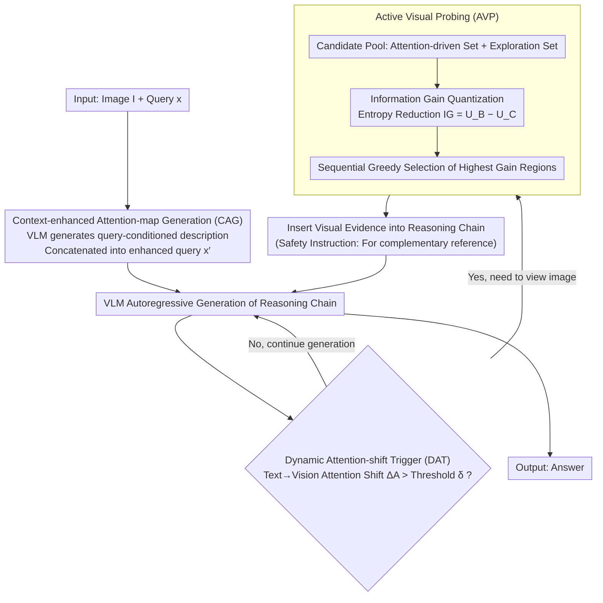

# AIM-CoT: Active Information-driven Multimodal Chain-of-Thought for Vision-Language Reasoning

**Conference**: ACL 2026  
**arXiv**: [2509.25699](https://arxiv.org/abs/2509.25699)  
**Code**: [GitHub](https://anonymous.4open.science/r/AIMCoT)  
**Area**: Vision-Language Reasoning / Multimodal CoT  
**Keywords**: Interleaved Multimodal Chain-of-Thought, Information Foraging Theory, Active Visual Probing, Dynamic Triggering, Visual Question Answering

## TL;DR

The AIM-CoT framework is proposed to address two core issues in Interleaved Multimodal Chain-of-Thought (I-MCoT)—"what to see" and "when to see"—through Information Foraging Theory-driven Active Visual Probing (AVP) and an attention-shift-based Dynamic Attention-shift Trigger (DAT).

## Background & Motivation

**Background**: Interleaved Multimodal Chain-of-Thought (I-MCoT) represents a significant paradigm shift in vision-language reasoning (e.g., VQA). This paradigm selects fine-grained visual evidence from input images and inserts it into the reasoning chain context as visual tokens, allowing the model to reference specific visual details during the reasoning process.

**Limitations of Prior Work**: Existing I-MCoT methods (e.g., ICoT) suffer from deficiencies regarding two core questions: (1) **"What to see"**: These methods rely on attention maps for visual region selection, but attention signals are unreliable. When there is a severe granularity imbalance between short text queries and information-dense images, attention peaks often fail to align with truly critical visual regions (over 75% of samples have an IoU below 50%). (2) **"When to see"**: They use static triggering strategies (e.g., inserting at newline characters), which fail to capture the model's dynamic need for visual evidence.

**Key Challenge**: Attention maps capture semantic correlation between tokens, but I-MCoT requires visual evidence that provides the maximum information gain for subsequent reasoning—semantic correlation does not equal informativeness.

**Goal**: To transform the reasoning process of VLMs from "passive, static perception" to "active, dynamic exploration," enabling the model to actively seek the most valuable visual cues like an information forager.

**Core Idea**: Drawing from Information Foraging Theory (IFT), this work replaces attention scores with information gain (entropy reduction) as the criterion for visual evidence selection and replaces fixed trigger conditions with attention shifts to determine the timing of evidence insertion.

## Method

### Overall Architecture

AIM-CoT is a training-free framework that operates on frozen VLMs following a "trigger-select-insert" paradigm. It consists of three synergistic components: (1) Context-enhanced Attention-map Generation (CAG) provides textual anchors for attention using a query-conditioned description to mitigate text-visual granularity imbalance; (2) Dynamic Attention-shift Trigger (DAT) monitors the shift in attention from text to vision during reasoning chain generation to determine "when to look at the image"; (3) Active Visual Probing (AVP) selects the most valuable visual evidence based on information gain once triggered and inserts it back into the reasoning chain. These three components respectively address the "when to see" and "what to see" problems.

### Key Designs

**1. Context-enhanced Attention-map Generation (CAG): Providing textual anchors for attention via query-conditioned descriptions**

All subsequent steps of I-MCoT depend on the attention map. However, original queries are often single sentences that fail to guide attention effectively across information-dense images, which is the root cause of inaccurate "what to see" decisions. Before the VQA process begins, CAG directs the VLM to generate an explanatory description $\mathcal{D}_{\mathrm{CAG}} = \mathrm{VLM}(I, x, \mathcal{P}_{\mathrm{CAG}})$ based on the query, which is then concatenated to form an enhanced query $x' = \mathrm{concat}(x, \mathcal{D}_{\mathrm{CAG}})$. This additional text provides semantic anchors for cross-attention, making the attention distribution more closely aligned with regions relevant to the question. Negative constraints are embedded in the prompt to suppress hallucinations during the description phase. This is not standard image captioning; its purpose is to provide more reliable textual context for the attention mechanism.

**2. Dynamic Attention-shift Trigger (DAT): Determining when to look at the image via attention "shifts" rather than fixed symbols**

Static triggers (e.g., inserting visual evidence at every newline) cannot perceive whether the model actually needs to look at the image at a given moment, which is a pain point for "when to see." DAT instead monitors the text $\to$ vision attention shift $\Delta A_{\mathrm{vision}}(t) = A_{\mathrm{vision}}(t) - A_{\mathrm{vision}}(t-1)$ at each step of autoregressive generation. Once the shift exceeds a threshold $\delta$, visual evidence selection is triggered. A "safety instruction" is also provided to ensure the model treats inserted evidence as "complementary reference" rather than a hard requirement, reducing noise interference. A dialectical insight here is that while the absolute value of attention is unreliable for selection, the **shift** in attention is a reliable diagnostic signal that "the model needs visual information right now." Thus, DAT and AVP divide tasks: one handles timing, and the other handles selection.

**3. Active Visual Probing (AVP): Selecting visual evidence via information gain instead of attention scores**

Once DAT determines "it's time to look," AVP answers the question of "what to see." Attention maps capture semantic relevance between tokens, whereas I-MCoT requires evidence that "reduces uncertainty in subsequent reasoning." These are not equivalent, and AVP fills this gap. Borrowing from Information Foraging Theory, it redefines "value" as information gain through three steps: first, it constructs a candidate pool by merging an attention-driven set $C_{\mathrm{attn}}$ (top-N high attention regions) with an exploration set $C_{\mathrm{exp}}$ (M uniformly sampled regions), the latter of which captures regions that attention might miss. Second, it quantifies information gain for each candidate $R_i$ by calculating the entropy reduction when added to the context: $\mathrm{IG}(\{R_i\}) = U_B - U_{C,i}$, where base uncertainty $U_B = H(Y|I,x,y_{<t})$ and conditional uncertainty $U_{C,i} = H(Y|I,x,y_{<t},R_i)$. Finally, it performs sequential greedy selection, picking the region with the highest gain in each round, updating the context, and re-evaluating remaining candidates. Greedy selection is used because it provides near-optimal guarantees for subset selection, and the step-by-step contraction process simulates the dynamic trajectory of a forager following cues.

### Loss & Training

AIM-CoT is a entirely training-free framework that runs directly on frozen VLMs. All components are implemented through carefully designed prompt templates and internal attention signals, requiring no parameter updates. Inference time overhead is maintained within 1.36$\times$ of the baseline.

## Key Experimental Results

### Main Results

| Backbone Model | Baseline | AIM-CoT | ICoT (Prev. SOTA) | Gain |
| :--- | :--- | :--- | :--- | :--- |
| Chameleon-7B | M3CoT (0-shot) | 31.4 | 29.8 | +5.4% |
| Chameleon-7B | LLaVA-W (0-shot) | 29.8 | 25.2 | +18.3% |
| Janus-Pro-7B | M3CoT (1-shot) | 41.5 | 39.4 | +5.3% |
| Qwen2-VL-7B | ScienceQA (1-shot) | 66.3 | 65.4 | +1.4% |
| Qwen2.5-VL-32B | M3CoT (1-shot) | 61.2 | 59.1 | +3.6% |
| Qwen2.5-VL-32B | LLaVA-W (1-shot) | 49.1 | 44.7 | +9.8% |

### Ablation Study

| Configuration | Key Metric | Description |
| :--- | :--- | :--- |
| Attention Coverage (IoU) | <50% for 75%+ | Severe misalignment between attention peaks and critical regions |
| Masking High-Attention Regions | Minor performance drop | High attention $\neq$ critical region |
| CAG Negative Constraints | Effectively suppresses hallucinations | Validates the necessity of a cautious description strategy |
| Safety Instructions | Effectively filters noise | Prevents visual evidence from introducing interference |
| Inference Time | $\leq$ 1.36$\times$ baseline | Deployment-friendly |

### Key Findings
- Regions selected by information gain differ significantly from those selected by attention peaks; the former effectively filters out high-attention but non-informative regions.
- Dynamic triggering outperforms static triggering (newlines) across all benchmarks, with the largest gains observed on LLaVA-W (open-ended QA).
- The exploration set (uniform sampling), though simple, provides critical regions overlooked by the attention-driven set.
- Consistent improvements are observed even on stronger backbone models (Qwen2.5-VL-32B), demonstrating the versatility of the method.

## Highlights & Insights
- **Elegant Introduction of Information Foraging Theory**: IFT provides a unified theoretical foundation for explaining both "what to see" and "when to see" problems.
- **Dialectical Understanding of Attention**: The realization that attention is unreliable for selection but its shift is reliable as a trigger signal is a sophisticated insight.
- **Training-free Design**: Based entirely on inference-time signals, it is plug-and-play for any frozen VLM, offering high practical utility.
- **Information Gain vs. Attention Comparative Analysis**: The work thoroughly demonstrates that semantic relevance $\neq$ information content, providing a new perspective for visual evidence selection.
- **Safety Instruction Mechanism**: By encouraging the model to "reference rather than rely on" inserted visual evidence, the risk of noise interference is effectively mitigated.

## Limitations & Future Work
- Quantifying information gain requires additional forward passes; while controlled within 1.36$\times$, there is still room for optimization in latency-sensitive scenarios.
- Candidate regions are based on fixed partitioning; adaptive regional division strategies have not been explored.
- Verification was primarily conducted on VQA tasks; generalization to other tasks like visual reasoning or chart understanding remains to be confirmed.
- The quality of CAG-generated descriptions is limited by the VLM's own capability; weaker models may generate low-quality descriptions.
- While threshold $\delta$ has an adaptive strategy, it may still require tuning for different datasets.

## Related Work & Insights
- **vs. ICoT**: ICoT uses attention-based selection and static triggering; AIM-CoT uses information gain-based selection and dynamic triggering, outperforming it across all settings.
- **vs. DDCoT/CCoT**: These methods generate text descriptions to aid reasoning but do not directly insert visual evidence. AIM-CoT utilizes descriptions for attention enhancement and incorporates direct visual evidence insertion.
- **vs. SCAFFOLD**: SCAFFOLD employs structured reasoning but handles visual evidence with less granularity. AIM-CoT’s information gain quantization provides a more principled basis for selection.

## Rating
- Novelty: ⭐⭐⭐⭐⭐ The IFT-driven visual evidence selection offers a fresh perspective, and using attention shift as a trigger signal is a profound insight.
- Experimental Thoroughness: ⭐⭐⭐⭐ Includes 4 backbone models, 3 benchmarks, and extensive ablation and reliability analyses.
- Writing Quality: ⭐⭐⭐⭐⭐ The logical chain from problem exposure to theoretical introduction to methodological design is complete and well-articulated.
- Value: ⭐⭐⭐⭐ Provides a new theoretical framework and a practical training-free solution for multimodal CoT.

<!-- RELATED:START -->

## Related Papers

- [\[ICLR 2026\] AIMCoT: Active Information-driven Multimodal Chain-of-Thought for Vision-Language Reasoning](../../ICLR2026/llm_reasoning/aimcot_active_information-driven_multimodal_chain-of-thought_for_vision-language.md)
- [\[ACL 2026\] LegalDrill: Diagnosis-Driven Synthesis for Legal Reasoning in Small Language Models](legaldrill_diagnosis-driven_synthesis_for_legal_reasoning_in_small_language_mode.md)
- [\[ACL 2026\] CoAct: Co-Active LLM Preference Learning with Human-AI Synergy](coact_co-active_llm_preference_learning_with_human-ai_synergy.md)
- [\[ACL 2026\] Chain-of-Thought as a Lens: Evaluating Structured Reasoning Alignment between Human Preferences and Large Language Models](chain-of-thought_as_a_lens_evaluating_structured_reasoning_alignment_between_hum.md)
- [\[ACL 2026\] Efficient Process Reward Modeling via Contrastive Mutual Information](efficient_process_reward_modeling_via_contrastive_mutual_information.md)

<!-- RELATED:END -->
