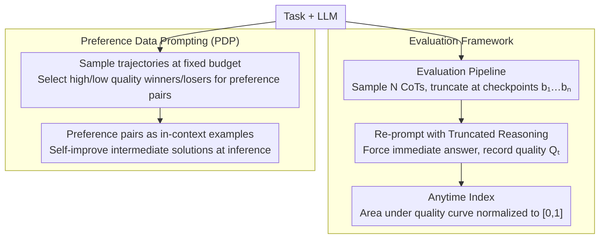

# Budget-Aware Anytime Reasoning with LLM-Synthesized Preference Data

**Conference**: ACL 2026 Findings  
**arXiv**: [2601.11038](https://arxiv.org/abs/2601.11038)  
**Code**: None  
**Area**: LLM Reasoning  
**Keywords**: Budget-aware reasoning, Anytime Index, Preference data prompting, Test-time scaling, Inference efficiency

## TL;DR

This paper proposes a budget-aware anytime reasoning framework and the Anytime Index metric to quantify the quality-efficiency trade-off of LLMs under limited token budgets. It further develops Preference Data Prompting (PDP), an inference-time self-improvement method based on LLM-synthesized preference data, which significantly enhances the quality of intermediate and final solutions in planning, mathematics, and science QA tasks.

## Background & Motivation

**Background**: LLMs have demonstrated strong reasoning capabilities through methods such as Chain-of-Thought (CoT) and Tree-of-Thoughts. Test-time scaling has emerged as a crucial approach for improving reasoning performance; however, existing methods typically assume unlimited computational resources and evaluate only the final answer quality.

**Limitations of Prior Work**: (1) Many practical scenarios face strict computational or latency budget constraints, where even a partial solution is more useful than no solution (e.g., an incomplete but feasible travel plan); (2) Existing methods lack a principled way to evaluate the trajectory of reasoning quality as token usage grows; (3) Budget-aware techniques (like BRPO) focus on "when to stop thinking" rather than "how to think better under constraints."

**Key Challenge**: Real-world reasoning tasks require producing optimal intermediate solutions within a finite budget, yet current evaluation and optimization frameworks focus solely on the final answer, neglecting the efficiency of the reasoning trajectory.

**Goal**: (1) Establish a framework and metrics to evaluate LLM reasoning efficiency across different token budgets; (2) Provide a method to improve budget-aware reasoning quality.

**Key Insight**: Borrowing the concept of anytime algorithms from classical AI, reasoning is viewed as a process of incremental quality improvement relative to the token budget.

**Core Idea**: Quantify reasoning efficiency by truncating reasoning trajectories and evaluating solution quality at various checkpoints. Utilize model-generated reasoning comparisons to construct preference data, which serves as few-shot examples to improve intermediate solution quality.

## Method

### Overall Architecture

The framework consists of two parts: (1) **Evaluation Framework**—sampling $N$ CoT trajectories for each task, truncating them at token budget checkpoints $b_1, b_2, \ldots, b_n$, and re-prompting the model to generate a final answer based on the truncated reasoning to calculate the Anytime Index; (2) **Preference Data Prompting (PDP)**—the model generates multiple reasoning trajectories at a fixed budget, identifies trajectory pairs leading to higher/lower quality intermediate solutions as preference pairs, and uses these as in-context examples during inference. The former purely evaluates without modifying the model, while the latter modifies prompts at inference time without parameter training.

### Key Designs

**1. Design Motivation for Evaluation Pipeline: Simulating real-world interruptions via "Truncated Reasoning + Re-prompting"**

To calculate the Anytime Index, one must obtain the "best current answer" at any given budget point. The pipeline samples $N$ complete CoT trajectories (up to 4096 tokens for NaturalPlan, 16384 for AIME/GPQA), truncates them at preset checkpoints, and re-prompts the model using the truncated reasoning as a prefix to force an immediate response. Quality is measured by task-specific metrics (constraint satisfaction for planning, accuracy for math/QA). This standardizes the real-world scenario of "forced stop" into a reproducible evaluation process.

**2. Mechanism of Anytime Index: Compressing the quality-budget trajectory into a [0,1] value**

Evaluations focusing only on final answers treat two models with the same final score as equal. However, one model might provide a usable solution at a small budget while another only catches up at the very end. The Anytime Index defines the optimal quality up to budget $b_t$ as $Q_t^* = \max_{i \leq t} Q_i$ (ensuring a monotonic curve) and uses the trapezoidal rule to calculate the area under the quality curve:

$$\text{AI} = \frac{\sum_{t=1}^{T-1} \frac{Q_t^* + Q_{t+1}^*}{2} \cdot (b_{t+1} - b_t)}{(b_T - b_1) \cdot Q_{\max}}$$

The value ranges from [0,1], where higher values indicate earlier convergence to high-quality solutions. This distinguishes "fast thinking" from "slow thinking" models even if their final performance is identical.

**3. Function of Preference Data Prompting (PDP): Self-improvement via model-synthesized preference pairs**

While techniques like BRPO manage "when to stop," PDP addresses "how to reason better under constraints." PDP enables the model to learn from its own reasoning comparisons: it samples multiple trajectories for the same task at a fixed budget, selects pairs leading to better/worse intermediate solutions (winner vs. loser), and feeds these back as in-context examples. PDP(+) uses only positive examples, while PDP uses both to provide contrastive information on budget-efficient reasoning paths. Since it relies on self-sampling and self-comparison, it is a plug-and-play method for any LLM without human supervision.

### Loss & Training

PDP is a pure inference-time method involving no model training. Preference data is automatically generated through multiple sampling passes and quality comparisons by the model itself.

## Key Experimental Results

### Main Results

**Grok-3 Results**

| Method | NaturalPlan Final | AIME Final | GPQA Final | Overall Final |
|--------|-------------------|------------|------------|---------------|
| Base   | 74.7              | 24.0       | 69.8       | 56.2          |
| LEAP   | 87.9              | 22.8       | 69.3       | 60.0          |
| PDP    | **90.2**          | **24.9**   | 69.7       | **61.6**      |

**Grok-3-mini Results**

| Method | NaturalPlan Final | AIME Final | GPQA Final | Overall Final |
|--------|-------------------|------------|------------|---------------|
| Base   | 81.5              | 80.6       | 99.3       | 87.1          |
| PDP    | **90.7**          | **100.0**  | 98.9       | **96.5**      |

### Ablation Study

- PDP consistently improves the Anytime Index (e.g., from 85.4 to 88.7 for Grok-3-mini).
- The improvement from PDP is more significant for reasoning-centric models (e.g., Grok-3-mini) compared to non-reasoning models.
- Using both positive and negative pairs (PDP) generally outperforms using only positive examples (PDP(+)), indicating the value of contrastive information.

### Key Findings

- Different model families exhibit distinct reasoning efficiency characteristics via the Anytime Index.
- Reasoning models (e.g., Grok-3-mini) produce high-quality solutions at earlier budget points, resulting in higher Anytime Index values.
- PDP shows consistent improvements across three different task types, verifying its generalizability.
- The Anytime Index reveals efficiency differences between models that are indistinguishable using only final accuracy.

## Highlights & Insights

- The Anytime Index serves as a vital complement to LLM reasoning evaluation, filling the gap in "quality trajectory" assessment.
- As an inference-only method, PDP improves the efficiency of various models without the need for training.
- The experiments cover multiple model families including Grok, GPT, and LLaMA, ensuring broad applicability of the conclusions.
- The concept of "anytime reasoning" is successfully transplanted from classical AI to the LLM domain.

## Limitations & Future Work

- PDP requires generating multiple trajectories at inference time to construct preference data, increasing overhead.
- The quality of preference data depends on the model's self-sampling diversity.
- The selection of checkpoints for the Anytime Index may influence evaluation results.
- Future work could explore using PDP-generated preference data for fine-tuning rather than just in-context learning.

## Related Work & Insights

- Complementary to BRPO: While BRPO focuses on when to stop, PDP focuses on how to reason better within the budget.
- Compared to self-improvement methods like LEAP, PDP is specifically designed for budget-constrained scenarios.
- The Anytime Index can serve as a standard evaluation tool for future research on reasoning efficiency.

## Rating

- Novelty: ⭐⭐⭐⭐ Innovative Anytime Index concept and practical PDP method.
- Experimental Thoroughness: ⭐⭐⭐⭐ Comprehensive evaluation across model families, tasks, and metrics.
- Writing Quality: ⭐⭐⭐⭐ Clearly defined framework and well-organized experimental presentation.

<!-- RELATED:START -->

## Related Papers

- [\[ACL 2026\] On the Step Length Confounding in LLM Reasoning Data Selection](on_the_step_length_confounding_in_llm_reasoning_data_selection.md)
- [\[ACL 2026\] CoAct: Co-Active LLM Preference Learning with Human-AI Synergy](coact_co-active_llm_preference_learning_with_human-ai_synergy.md)
- [\[ACL 2026\] Reliability-Aware Adaptive Self-Consistency for Efficient Sampling in LLM Reasoning](reliability-aware_adaptive_self-consistency_for_efficient_sampling_in_llm_reason.md)
- [\[ICLR 2026\] Plan and Budget: Effective and Efficient Test-Time Scaling on Reasoning LLMs](../../ICLR2026/llm_reasoning/plan_and_budget_effective_and_efficient_test-time_scaling_on_reasoning_large_lan.md)
- [\[ACL 2026\] SHAPE: Stage-aware Hierarchical Advantage via Potential Estimation for LLM Reasoning](shape_stage-aware_hierarchical_advantage_via_potential_estimation_for_llm_reason.md)

<!-- RELATED:END -->
