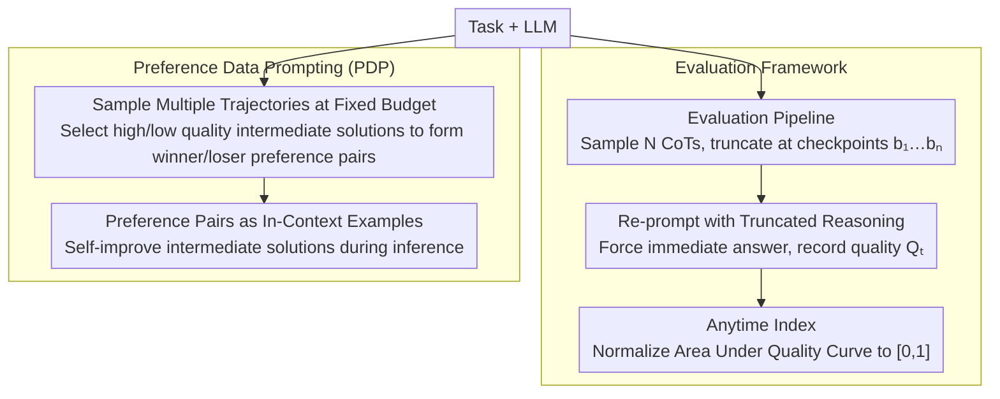

# Budget-Aware Anytime Reasoning with LLM-Synthesized Preference Data

**Conference**: ACL 2026 Findings  
**arXiv**: [2601.11038](https://arxiv.org/abs/2601.11038)  
**Code**: None  
**Area**: LLM Reasoning  
**Keywords**: Budget-aware reasoning, Anytime Index, Preference data prompting, Test-time scaling, Reasoning efficiency

## TL;DR

This paper proposes a budget-aware anytime reasoning framework and an Anytime Index metric to quantify the quality-efficiency trade-off of LLMs under limited token budgets. It also designs a reasoning-time self-improvement method (PDP) based on LLM-synthesized preference data, significantly improving the quality of intermediate and final solutions across planning, mathematics, and science QA tasks.

## Background & Motivation

**Background**: LLMs have demonstrated strong reasoning capabilities through methods such as Chain-of-Thought (CoT) and Tree-of-Thoughts. Test-time scaling has become an important means to improve reasoning performance, but existing methods usually assume unlimited computational resources and only evaluate final answer quality.

**Limitations of Prior Work**: (1) Many real-world scenarios face strict computational or latency budget constraints, where even a partial solution is more useful than none (e.g., an incomplete but feasible travel plan); (2) Existing methods lack a principled way to evaluate the trajectory of reasoning quality as token counts grow; (3) Budget-aware techniques (such as BRPO) focus on "when to stop thinking" but not "how to think better under constraints."

**Key Challenge**: Real-world reasoning tasks require producing optimal intermediate solutions within a finite budget, yet current evaluation and optimization frameworks focus solely on the final answer, ignoring the efficiency of the reasoning trajectory.

**Goal**: (1) Establish a framework and metrics for evaluating LLM reasoning efficiency across different token budgets; (2) Provide a method to enhance budget-aware reasoning quality.

**Key Insight**: Drawing from the concept of "anytime algorithms" in classical AI, reasoning is viewed as a process of increasing quality as the token budget increments.

**Core Idea**: Quantify reasoning efficiency by truncating reasoning trajectories and evaluating solution quality at various checkpoints, and utilize self-generated reasoning comparisons to construct preference data as in-context examples to improve intermediate solution quality.

## Method

### Overall Architecture

The framework consists of two parts: (1) **Evaluation Framework**—sampling $N$ CoT trajectories for each task, truncating them at a series of token budget checkpoints $b_1, b_2, \ldots, b_n$, and re-prompting the model to generate a final answer based on the truncated reasoning to calculate the Anytime Index; (2) **Preference Data Prompting (PDP)**—sampling multiple reasoning trajectories at a fixed budget, identifying trajectory pairs that lead to higher/lower quality intermediate solutions as preference pairs to be used as in-context examples during inference. The former involves only evaluation without modifying the model, while the latter modifies prompts at inference time; neither requires parameter training.

### Key Designs

**1. Evaluation Pipeline Design: Simulating early interruption in real scenarios via "truncated reasoning + re-prompting"**

To calculate the Anytime Index, one must first be able to obtain the "best current answer" at any arbitrary budget point. To this end, the pipeline samples $N$ complete CoT trajectories (up to 4096 tokens for NaturalPlan, 16384 tokens for AIME/GPQA), truncates the reasoning at preset checkpoints, and re-prompts the model using the truncated reasoning as a prefix to force an immediate answer. Quality is measured using task-specific metrics (constraint satisfaction rate for planning, accuracy for math/QA). This standardizes the real-world situation of being "stopped mid-reasoning and forced to submit" into a reproducible evaluation process.

**2. Anytime Index Metric: Compressing the "quality-vs-budget trajectory" into a single [0,1] value**

Evaluation focusing only on final answers treats two models with the same final score as equally good. However, one might provide a usable solution at a small budget while the other only catches up at the very end—this efficiency difference is completely hidden by conventional metrics. The Anytime Index defines the optimal quality up to budget $b_t$ as $Q_t^* = \max_{i \leq t} Q_i$ (to ensure a monotonic trajectory), and then uses the trapezoidal rule to calculate the area under the quality curve and normalizes it:

$$\text{AI} = \frac{\sum_{t=1}^{T-1} \frac{Q_t^* + Q_{t+1}^*}{2} \cdot (b_{t+1} - b_t)}{(b_T - b_1) \cdot Q_{\max}}$$

The value falls within $[0,1]$, where a higher value indicates that the model approaches high-quality solutions earlier. Thus, "fast thinking" and "slow thinking" models are distinguished even if they reach the same final result.

**3. Preference Data Prompting (PDP): Improving reasoning by using self-generated good/bad trajectory pairs as in-context examples**

Most budget-aware techniques (such as BRPO) focus on "when to stop thinking," but none address "how to reason better within constraints"—the quality of intermediate solutions is often ignored. PDP's approach is to let the model learn from its own reasoning comparisons: first, sample multiple trajectories for the same task at a fixed token budget, then identify trajectory pairs that lead to higher/lower quality intermediate solutions (winner vs loser), and finally feed these pairs as in-context examples during inference. PDP(+) only uses positive examples, while PDP uses both, utilizing contrastive information to inform the model which reasoning path is more budget-efficient. Since the process relies on self-sampling and self-comparison without human supervision, it can be applied plug-and-play to any LLM.

### Loss & Training

PDP is a pure inference-time method and does not involve model training. Preference data is automatically generated through multiple samplings and quality comparisons performed by the model itself.

## Key Experimental Results

### Main Results

**Grok-3 Results**

| Method | NaturalPlan Final | AIME Final | GPQA Final | Overall Final |
|------|-------------------|------------|------------|---------------|
| Base | 74.7 | 24.0 | 69.8 | 56.2 |
| LEAP | 87.9 | 22.8 | 69.3 | 60.0 |
| PDP | **90.2** | **24.9** | 69.7 | **61.6** |

**Grok-3-mini Results**

| Method | NaturalPlan Final | AIME Final | GPQA Final | Overall Final |
|------|-------------------|------------|------------|---------------|
| Base | 81.5 | 80.6 | 99.3 | 87.1 |
| PDP | **90.7** | **100.0** | 98.9 | **96.5** |

### Ablation Study

- PDP consistently improves the Anytime Index (e.g., Grok-3-mini increases from 85.4 to 88.7).
- The improvement of PDP is more significant on reasoning models (e.g., Grok-3-mini) than on non-reasoning models.
- Contrastive preference pairs (PDP) generally outperform positive-only examples (PDP(+)), indicating that negative examples provide valuable contrastive information.

### Key Findings

- Different model families exhibit distinct reasoning efficiency characteristics measured by the Anytime Index.
- Reasoning models (e.g., Grok-3-mini) produce high-quality solutions at earlier budget points, resulting in a higher Anytime Index.
- PDP brings consistent gains across three different task types, validating the method's generality.
- The Anytime Index reveals efficiency differences between models that are otherwise invisible through final accuracy alone.

## Highlights & Insights

- Anytime Index is a crucial supplement to LLM reasoning evaluation, filling the gap in "quality trajectory" assessment.
- As a pure inference-time method, PDP improves the reasoning efficiency of various models without the need for training.
- Experiments cover multiple model families (Grok, GPT, LLaMA), ensuring broad applicability of the conclusions.
- The concept of "anytime reasoning" is successfully migrated from classical AI to the LLM field.

## Limitations & Future Work

- PDP requires generating multiple extra trajectories at inference time to construct preference data, increasing computational overhead.
- The quality of preference data depends on the model's own sampling diversity.
- The checkpoint settings for the Anytime Index may influence evaluation results.
- Future work could explore using PDP preference data for fine-tuning rather than just in-context learning.

## Related Work & Insights

- Complementary to BRPO (Budget-Aware Reasoning Optimization): BRPO focuses on when to stop, while PDP focuses on how to reason better within constraints.
- Compared to self-improvement methods like LEAP, PDP is more specifically designed for budget-constrained scenarios.
- Anytime Index can serve as a standard evaluation tool for future research on reasoning efficiency.

## Rating

- Novelty: ⭐⭐⭐⭐ Innovative Anytime Index concept and practical PDP method.
- Experimental Thoroughness: ⭐⭐⭐⭐ Comprehensive evaluation across multiple model families, tasks, and metrics.
- Writing Quality: ⭐⭐⭐⭐ Clearly defined framework and well-organized experiments.

<!-- RELATED:START -->

## Related Papers

- [\[ACL 2026\] On the Step Length Confounding in LLM Reasoning Data Selection](on_the_step_length_confounding_in_llm_reasoning_data_selection.md)
- [\[ACL 2026\] CoAct: Co-Active LLM Preference Learning with Human-AI Synergy](coact_co-active_llm_preference_learning_with_human-ai_synergy.md)
- [\[ACL 2026\] Reliability-Aware Adaptive Self-Consistency for Efficient Sampling in LLM Reasoning](reliability-aware_adaptive_self-consistency_for_efficient_sampling_in_llm_reason.md)
- [\[ACL 2026\] SHAPE: Stage-aware Hierarchical Advantage via Potential Estimation for LLM Reasoning](shape_stage-aware_hierarchical_advantage_via_potential_estimation_for_llm_reason.md)
- [\[ICLR 2026\] Plan and Budget: Effective and Efficient Test-Time Scaling on Reasoning LLMs](../../ICLR2026/llm_reasoning/plan_and_budget_effective_and_efficient_test-time_scaling_on_reasoning_large_lan.md)

<!-- RELATED:END -->
