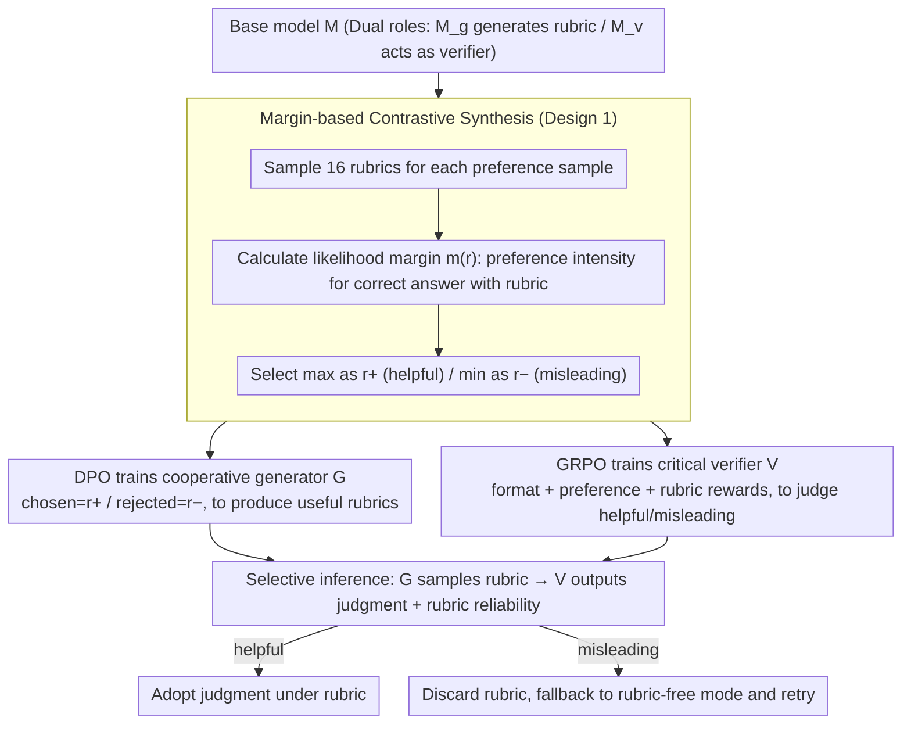

# C2: Scalable Rubric-Augmented Reward Modeling from Binary Preferences

**Conference**: ACL 2026  
**arXiv**: [2604.13618](https://arxiv.org/abs/2604.13618)  
**Code**: https://github.com/asahi-research/C2 (Available)  
**Area**: LLM Reasoning / RLHF / Reward Modeling  
**Keywords**: Reward Model, rubric, DPO, GRPO, Cooperative Communication

## TL;DR
Addressing the duality where "self-generated rubrics often mislead reward models," the authors use LM likelihood margins to automatically label 16 self-sampled rubrics as "helpful / misleading" pairs. They then train a cooperative rubric generator via DPO and a "critical" verifier via GRPO that assesses rubric trustworthiness before rendering a judgment. Using only binary preference data, C2 improves reasoning RM performance by up to 6.5 points on RM-Bench and increases the LC win rate of downstream DPO by 6 points. Furthermore, an 8B model using self-generated rubrics matches the performance of a scheme utilizing rubrics from a 4× larger model (Qwen3-32B).

## Background & Motivation

**Background**: Reward models (RM) are central to RLHF, yet scalar RMs are easily deceived by surface features such as length and format. Recent trends treat preference prediction as a reasoning task trained via GRPO (e.g., J1, Think-RM), requiring the RM to output `<analyze>` before a judgment. Another line of work is rubric-augmented verification—generating a scoring rubric first, then having the verifier evaluate according to it.

**Limitations of Prior Work**: Rubric-based methods rely on human-written or proprietary large model rubrics, which are costly and incompatible with existing binary preference corpora. A naive alternative is to let the base model self-generate rubrics, but experiments on RM-Bench Hard (Fig 2) reveal: (1) most self-generated rubrics lead to a confidence change near zero for the verifier, being nearly useless; (2) while high-quality rubrics improve Tulu3-8B accuracy by +8.2 and Qwen3-8B by +13.6, low-quality rubrics cause accuracy to drop to 39.6% / 49.3%, performing worse than having no rubric.

**Key Challenge**: Rubric quality is a double-edged sword—good rubrics offer significant gains, while poor ones cause even greater harm. Once a verifier is guided by a rubric, it often loses the capability to "reject a bad rubric" independently. This is a "cooperation failure" problem.

**Goal**: (1) Utilize the most common and inexpensive supervision signal—binary preferences—to train both the rubric generator and the verifier; (2) Enable the verifier to "critically" adopt rubrics—listening when they are helpful and ignoring them when they are harmful to fallback to rubric-free reasoning.

**Key Insight**: The authors draw from Grice’s Cooperative Principle—successful interpersonal communication does not rely on the speaker being "always reliable," but on the listener learning "who to trust" and the speaker learning "how to be useful." This dynamic is applied to the rubric $\leftrightarrow$ verifier relationship.

**Core Idea**: A base model self-samples $K=16$ rubrics, which are labeled as (helpful $r^+$, misleading $r^-$) pairs based on their impact on the verifier’s log-likelihood margin. DPO trains the generator to produce more $r^+$, and GRPO trains the verifier to both predict preferences and correctly identify if a rubric is helpful or misleading. During inference, the verifier adopts the rubric only if it is judged as helpful.

## Method

### Overall Architecture
Two components, $G_\phi$ (generator) and $V_\theta$ (verifier), are initialized from the same base model $M$. The pipeline consists of three steps:
1. **Contrastive Pair Synthesis**: Using $M$ in dual roles ($M_g$ as generator, $M_v$ as verifier), for each sample $(c=(x,y_A,y_B),l)$, the rubric-free margin $m_\emptyset = \log p_{M_v}(l|c) - \log p_{M_v}(\bar{l}|c)$ is calculated. 16 rubrics are sampled to calculate $m(r_k)$. $r^+$ is selected as the max from $\mathcal{R}^+ = \{r_k : m(r_k) > \max(0, m_\emptyset)\}$, and $r^-$ as the min from $\mathcal{R}^- = \{r_k : m(r_k) < \min(0, m_\emptyset)\}$. Samples are discarded if both sets are empty.
2. **Training**: DPO trains $G_\phi$ to prefer $r^+$ over $r^-$. GRPO trains $V_\theta$ on two tasks: rubric-free preference prediction ($\hat l$) and rubric-augmented prediction ($\hat l$ and $q\in\{\text{helpful}, \text{misleading}\}$). The reward comprises format $R_f$ + preference $R_p$ + rubric $R_r$ (augmented task only).
3. **Selective Inference**: For a given $c$, sample $r \sim G_\phi$, and let $V_\theta$ output $(\hat l, q)$. If $q=\text{helpful}$, $\hat l$ is used; otherwise, it falls back to rubric-free mode for a second attempt.

The rubric structure consists of a reasoning segment followed by a series of (criterion, yes/no question) pairs.

### Key Designs

**1. Margin-based Contrastive Synthesis: Automatically labeling rubrics as helpful/misleading using the verifier's own likelihood margin.**

Previous methods for rubric supervision relied on expensive GPT-5 scoring or unscalable human writing, often being incompatible with binary preference corpora. C2 internalizes the utility of a rubric as a verifier statistic: $m(r) = \log p_{M_v}(l|c,r) - \log p_{M_v}(\bar l|c,r)$, measuring the verifier's preference intensity for the correct answer given the rubric. A "helpful" rubric must push the judgment toward correctness—increasing the margin if $m_\emptyset>0$, or flipping it to positive if $m_\emptyset<0$. By sampling 16 rubrics per sample and picking the extremes for $r^+$ and $r^-$, labels are obtained without humans, noise-resistant, and reusable for any binary preference dataset.

**2. DPO Training for Cooperative Generator: Encouraging the generation of truly useful rubrics rather than just superficially plausible ones.**

SFT on "good" rubrics only teaches a model to imitate a decent-looking rubric, without learning to avoid harmful ones. Since rubrics are double-edged, C2 utilizes the synthesized $\{(c, r^+, r^-)\}$ for DPO training, where $r^+$ is the chosen and $r^-$ is the rejected. This contrastive signal simultaneously rewards helpful rubrics and penalizes misleading ones. Post-training, GPT-5 quality scores for rubrics improved from 2.11 $\rightarrow$ 2.66 (Tulu3-8B) and 3.15 $\rightarrow$ 3.52 (Qwen3-8B), nearing the performance of larger models like Tulu3-70B (2.85) and Qwen3-32B (3.62).

**3. Critical Verifier + Selective Inference (GRPO): Granting the verifier "veto power" to discard untrustworthy rubrics.**

Standard rubric methods force the verifier to follow the rubric, leading it into "traps" set by poor rubrics. C2 introduces a self-assessment layer: during GRPO training, both rubric-free and rubric-augmented tasks are mixed. Rewards are given for correct preference prediction and correct rubric reliability assessment ($q=\text{helpful/misleading}$), forcing the model to maintain base judgment capability while learning to discriminate rubric quality. During inference, if a rubric is judged as misleading, it is discarded, and the verifier retries in rubric-free mode. This greatly enhances robustness; when the ratio of good-to-bad rubrics drops from 9:1 to 1:9, a standard Reasoning RM's accuracy plummeted from 73% to 52%, while C2 only softened from 76% to 70%.

### Loss & Training
- **Data**: Synthesized contrastive pairs from 5k UltraFeedback samples (Tulu3-8B retained 4,903; Qwen3-8B retained 4,648), totaling 14k+ training samples including rubric-free and augmented.
- **GRPO**: lr 5e-7, batch 64, rollout=8, temperature=1.0 (Tulu3) / 0.6 (Qwen3), max prompt 8192 / response 2048, 1 epoch for C2.
- **DPO Generator**: lr 5e-7, $\beta=0.1$, 3 epochs, max seq 4096.
- **Reward Weights**: Grid searched for C2 as $(w_p, w_r, w_f) = (0.6, 0.3, 0.1)$.
- All experiments conducted on 8× A100 80GB.

## Key Experimental Results

### Main Results
Preference prediction accuracy (%), averaged over 3 seeds:

| Base | Method | RewardBench | RM-Bench | RewardBench2 | JudgeBench | Avg |
|------|------|------|------|------|------|------|
| Tulu3-8B | Base Model | 67.2 | 56.1 | 35.2 | 22.7 | 45.3 |
| Tulu3-8B | Reasoning RM (GRPO) | 73.7 | 64.9 | 45.6 | 35.8 | 55.0 |
| Tulu3-8B | + Self-Rubric | 70.8 | 64.2 | 40.8 | 35.2 | 52.8 |
| Tulu3-8B | + External-Rubric (32B) | 84.9 | 77.7 | 59.6 | 59.2 | 70.4 |
| Tulu3-8B | **C2 (Ours)** | **77.2** | **65.6** | **50.7** | **39.8** | **58.3** |
| Qwen3-8B | Reasoning RM | 89.8 | 81.3 | 67.6 | 60.1 | 74.7 |
| Qwen3-8B | + Self-Rubric | 90.8 | 81.3 | 69.4 | 60.8 | 75.6 |
| Qwen3-8B | + External-Rubric (32B) | 91.3 | 84.6 | 73.9 | 63.9 | 78.4 |
| Qwen3-8B | **C2 (Ours)** | **91.8** | **87.8** | 71.0 | 63.5 | **78.5** |

Downstream DPO + AlpacaEval 2.0 / Arena-Hard:

| Base | Method | AE2 WR | AE2 LC | AH WR |
|------|------|------|------|------|
| Tulu3-8B | DPO w/ Reasoning RM | 13.1 | 19.0 | 21.3 |
| Tulu3-8B | DPO w/ **C2** | **18.3** | **25.0** | **26.8** |
| Qwen3-8B | DPO w/ Reasoning RM | 41.2 | 38.2 | 71.8 |
| Qwen3-8B | DPO w/ **C2** | **44.0** | **40.9** | **74.6** |

### Ablation Study
Averaged across RB / RM-Bench / RewardBench2:

| Variant | Tulu3-8B Avg | Qwen3-8B Avg |
|------|------|------|
| C2 (Full) | **64.5** | **83.5** |
| w/o Cooperative Generator | 63.3 | 82.0 |
| w/o Critical Verifier | 62.7 | 81.2 |
| w/o Negative Rubrics | 60.9 | 80.7 |

Robustness under different rubric quality ratios (Tulu3-8B / Qwen3-8B):

| High:Low | Reasoning RM | C2 |
|------|------|------|
| 9:1 | 53% / 73% | 51% / 76% |
| 1:9 | 39% / 52% | 46% / 70% |

### Key Findings
- **Self-Rubrics degrade Reasoning RM** (Tulu3-8B 55.0 $\rightarrow$ 52.8), confirming that self-generated rubrics are, on average, ineffective or harmful without the C2 framework.
- **8B models match 32B levels via self-rubrics**: Qwen3-8B + C2 (78.5) $\approx$ Qwen3-8B + Qwen3-32B external rubrics (78.4), eliminating the need for a larger model as a rubric oracle.
- **Removing negative rubrics hurts the most** (Tulu3-8B -3.6, Qwen3-8B -2.8)—demonstrating that "learning to reject" is more critical than "learning to generate good rubrics."
- **Minimal ranking drift**: Fig 5 shows C2 remains stable even when input rubrics are mostly bad, whereas Reasoning RM collapses; this robustness is vital for deployment.
- **Superiority held under compute-matched settings**: C2 outperforms Reasoning RM even when the latter is given 2.5× the tokens through voting, indicating gains are architectural rather than just from extra computation.

## Highlights & Insights
- Using "the verifier's own likelihood margin" for rubric labeling is a clever self-supervision mechanism—avoiding human effort and large-model distillation, while internalizing rubric evaluation into the RM training loop.
- "Selective inference + retry" is an inexpensive yet effective engineering design, essentially turning the verifier into an ensemble of two policy modes (rubric-aware vs. rubric-free) based on rubric quality.
- The analogy of RM as "listener" and generator as "speaker" borrowed from cooperative communication principles is highly insightful, and potentially applicable to tool-use and retrieval-augmented generation.
- The ablation priority "negative rubrics > critical verifier > cooperative generator" provides a clear hierarchy for future implementations seeking resource efficiency.

## Limitations & Future Work
- Weak base models may struggle with critical verification: Fig 5 shows Tulu3-8B under a 9:1 ratio performs slightly worse than Reasoning RM, suggesting small models might unnecessarily reject rubrics.
- High inference cost: Rubric generation plus potential retries makes C2 roughly 2.3~2.4× slower (latency $\approx$ 4-5s/sample); high-traffic scenarios may require rubric caching or selective generation.
- Limited data scale (5k samples): Cross-domain generalization (e.g., code, math) is not yet fully validated; gains on math subsets were the smallest.
- Future directions: (1) hierarchical rubrics to reduce generator costs; (2) feeding retry signals back into RL to learn "early rejection"; (3) cross-model rubric migration.

## Related Work & Insights
- **vs. Reasoning RM (J1, Think-RM)**: Both use GRPO for verifier reasoning; Ours adds "explicit rubrics + selective adoption," introducing a critical layer that yields +3.3~3.5 points on average using the same data.
- **vs. Rubric as Reward (Gunjal 2025) / Checklists (Viswanathan 2025)**: These treat rubrics as reward signals but assume rubrics are correct. Ours explicitly handles rubric uncertainty.
- **vs. CARMO / Prometheus (Rubrics from larger LLM)**: Prior works depend on larger proprietary models for rubrics. Ours proves an 8B model can match 4× larger models via self-generation and contrastive training.

## Rating
- Novelty: ⭐⭐⭐⭐ The combination of cooperative communication, margin-based self-labeling, and selective inference is novel and elegant.
- Experimental Thoroughness: ⭐⭐⭐⭐⭐ Comprehensive evaluation across 4 RM benchmarks, downstream DPO, stress tests, and GPT-5 scoring.
- Writing Quality: ⭐⭐⭐⭐ Strong narrative arc in the motivation experiments and clear visual evidence in figures.
- Value: ⭐⭐⭐⭐ Provides a practical, open-source method to train high-quality RMs using only binary preference data, matching the performance of much larger external models.

<!-- RELATED:START -->

## Related Papers

- [\[ACL 2026\] Efficient Process Reward Modeling via Contrastive Mutual Information](efficient_process_reward_modeling_via_contrastive_mutual_information.md)
- [\[ICML 2026\] Reward Modeling from Natural Language Human Feedback](../../ICML2026/llm_reasoning/reward_modeling_from_natural_language_human_feedback.md)
- [\[ACL 2026\] Process Reward Models Meet Planning: Generating Precise and Scalable Datasets for Step-Level Rewards](process_reward_models_meet_planning_generating_precise_and_scalable_datasets_for.md)
- [\[ICLR 2026\] mR3: Multilingual Rubric-Agnostic Reward Reasoning Models](../../ICLR2026/llm_reasoning/mr3_multilingual_rubric-agnostic_reward_reasoning_models.md)
- [\[ICLR 2026\] Fixing the Broken Compass: Diagnosing and Improving Inference-Time Reward Modeling](../../ICLR2026/llm_reasoning/fixing_the_broken_compass_diagnosing_and_improving_inference-time_reward_modelin.md)

<!-- RELATED:END -->
