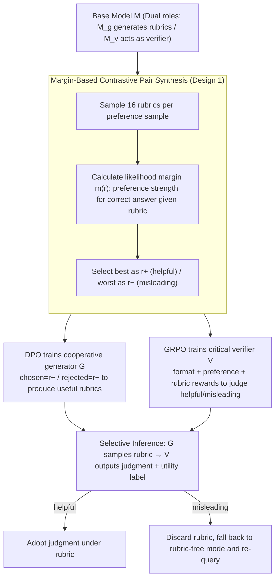

# C2: Scalable Rubric-Augmented Reward Modeling from Binary Preferences

**Conference**: ACL 2026  
**arXiv**: [2604.13618](https://arxiv.org/abs/2604.13618)  
**Code**: https://github.com/asahi-research/C2 (Available)  
**Area**: LLM Reasoning / RLHF / Reward Modeling  
**Keywords**: Reward Model, Rubric, DPO, GRPO, Cooperative Communication

## TL;DR
Addressing the double-edged sword where "self-generated rubrics often mislead reward models," the authors use language model (LM) likelihood margins to automatically label 16 self-sampled rubrics as "helpful/misleading" pairs. They then train a cooperative rubric generator via DPO and a "critical" verifier via GRPO, which assesses rubric reliability before making judgments. Using only binary preference data, C2 Improves reasoning RM performance by up to 6.5 points on RM-Bench and increases downstream DPO LC win rates by 6 points. Notably, an 8B model using self-generated rubrics matches the performance of using rubrics from a $4\times$ larger model (Qwen3-32B).

## Background & Motivation

**Background**: Reward models (RM) are central to RLHF, but scalar RMs are easily deceived by surface features (length, format). Recent trends involve treating preference prediction as a reasoning task trained via GRPO (e.g., J1, Think-RM), where the RM outputs an `<analyze>` block before its judgment. Another direction is rubric-augmented verification—generating scoring criteria first, then having a verifier evaluate based on those rubrics.

**Limitations of Prior Work**: Rubric-based methods rely on human-written or larger proprietary model-generated rubrics, which are costly and incompatible with existing binary preference corpora. A naive alternative is letting the base model self-generate rubrics, but experiments on RM-Bench hard (Fig 2) show: (1) most self-generated rubrics result in near-zero confidence changes for the verifier, being essentially useless; (2) while high-quality rubrics improve Tulu3-8B accuracy by +8.2 and Qwen3-8B by +13.6, low-quality rubrics cause performance to drop to 39.6% / 49.3%, performing worse than having no rubric.

**Key Challenge**: Rubric quality is a double-edged sword—good rubrics provide significant gains, while poor ones cause heavy damage; furthermore, once a verifier is conditioned on a rubric, it often loses the ability to "reject" a bad one. This is a "cooperation failure" problem.

**Goal**: (1) Train both the rubric generator and verifier using the most common and inexpensive supervision signal: binary preferences; (2) Enable the verifier to "critically" adopt rubrics—following good ones and ignoring bad ones to fall back to rubric-free reasoning.

**Key Insight**: The authors draw on Grice’s Cooperative Principle—successful human communication relies not on "speakers being always reliable," but on "listeners learning whom to trust and speakers learning how to be useful." This dynamic is applied to the rubric $\leftrightarrow$ verifier relationship.

**Core Idea**: A base model self-samples $K=16$ rubrics, which are labeled as (helpful $r^+$, misleading $r^-$) contrastive pairs based on their impact on the verifier's log-likelihood margin. DPO trains the generator to produce more $r^+$, while GRPO trains the verifier to both predict preferences and correctly identify rubrics as helpful/misleading. During inference, the verifier only adopts the rubric if it is judged as helpful.

## Method

### Overall Architecture
Two components, $G_\phi$ (generator) and $V_\theta$ (verifier), are initialized from the same base model $M$. The pipeline consists of three steps:
1. **Contrastive Pair Synthesis**: Using $M$ in dual roles ($M_g$ to generate rubrics, $M_v$ as a verifier), for each $(c=(x,y_A,y_B),l)$, the rubric-free margin $m_\emptyset = \log p_{M_v}(l|c) - \log p_{M_v}(\bar{l}|c)$ is calculated. 16 rubrics are sampled to calculate $m(r_k)$. $r^+$ is selected from $\mathcal{R}^+ = \{r_k : m(r_k) > \max(0, m_\emptyset)\}$ by taking the max; $r^-$ is selected from $\mathcal{R}^- = \{r_k : m(r_k) < \min(0, m_\emptyset)\}$ by taking the min.
2. **Training**: DPO trains $G_\phi$ to prefer $r^+$ over $r^-$. GRPO trains $V_\theta$ on two tasks: rubric-free prediction of $\hat{l}$ and rubric-augmented prediction of both $\hat{l}$ and $q \in \{\text{helpful}, \text{misleading}\}$. The reward consists of format $R_f$ + preference $R_p$ + rubric $R_r$ (augmented task only).
3. **Selective Inference**: Given $c$, sample $r \sim G_\phi$, and let $V_\theta$ output $(\hat{l}, q)$. If $q=\text{helpful}$, use $\hat{l}$; otherwise, revert to rubric-free mode and query again.

The rubric structure includes a reasoning segment and a series of (criterion, yes/no question) pairs.

### Key Designs

**1. Margin-based contrastive pair synthesis: Automatically labeling rubrics using the verifier's own likelihood margin.**

Previously, rubric supervision relied on expensive GPT-5 scoring or non-scalable human writing, often incompatible with binary preference corpora. C2 internalizes the utility of a rubric into the verifier's own statistics: $m(r) = \log p_{M_v}(l|c,r) - \log p_{M_v}(\bar{l}|c,r)$, measuring preference strength for the correct label given a rubric. A helpful rubric must push the verifier toward the correct answer—increasing the margin if $m_\emptyset > 0$, or flipping it to positive if $m_\emptyset < 0$. By sampling 16 rubrics, this method provides human-free, noise-resistant labels that reuse binary preference datasets.

**2. DPO training for cooperative generator: Encouraging rubrics that are truly useful to the verifier.**

Simply using SFT on valid rubrics teaches the model to "imitate a decent-looking rubric" but not to "avoid bad ones." Since rubrics are double-edged, DPO is used on the pairs $\{(c, r^+, r^-)\}$. Training with $r^+$ as chosen and $r^-$ as rejected rewards helpfulness and punishes harm. Post-training, GPT-5 scores for rubric quality improved from 2.11 $\rightarrow$ 2.66 (Tulu3-8B) and 3.15 $\rightarrow$ 3.52 (Qwen3-8B), approaching larger models like Tulu3-70B (2.85). Ablations show that removing negative rubrics (falling back to SFT) is the most detrimental variant, losing up to 3.6 points.

**3. Critical verifier + selective inference (GRPO): Giving the verifier the "right to reject" untrustworthy rubrics.**

Standard rubric methods force the verifier to follow the rubric, leading to failures when the rubric is poor. C2 adds a self-assessment step via GRPO by mixing rubric-free and rubric-augmented tasks. The verifier learns to maintain basic judgment while identifying helpful/misleading rubrics. During inference, if the verifier labels a rubric as misleading, it discards it and reverts to a rubric-free query. This robustness is evident: when the ratio of good-to-bad rubrics drops from 9:1 to 1:9, a standard Reasoning RM's accuracy crashes from 73% to 52%, while C2 only drops from 76% to 70%.

### Loss & Training
- **Data**: Contrastive pairs synthesized from 5k UltraFeedback samples, resulting in 14k+ training samples (rubric-free + augmented).
- **GRPO**: lr 5e-7, batch 64, rollout=8, temperature=1.0 (Tulu3) / 0.6 (Qwen3), max prompt 8192 / response 2048. C2 runs for 1 epoch.
- **DPO**: lr 5e-7, $\beta=0.1$, 3 epochs, max seq 4096.
- **Reward weights**: $(w_p, w_r, w_f) = (0.6, 0.3, 0.1)$ determined via grid search.
- **Compute**: Trained on 8$\times$ A100 80GB.

## Key Experimental Results

### Main Results
Preference prediction accuracy (%), averaged over 3 seeds:

| Base | Method | RewardBench | RM-Bench | RewardBench2 | JudgeBench | Avg |
|------|------|------|------|------|------|------|
| Tulu3-8B | Base Model | 67.2 | 56.1 | 35.2 | 22.7 | 45.3 |
| Tulu3-8B | Reasoning RM (GRPO) | 73.7 | 64.9 | 45.6 | 35.8 | 55.0 |
| Tulu3-8B | + Self-Rubric | 70.8 | 64.2 | 40.8 | 35.2 | 52.8 |
| Tulu3-8B | + External-Rubric (32B) | 84.9 | 77.7 | 59.6 | 59.2 | 70.4 |
| Tulu3-8B | **C2 (Ours)** | **77.2** | **65.6** | **50.7** | **39.8** | **58.3** |
| Qwen3-8B | Reasoning RM | 89.8 | 81.3 | 67.6 | 60.1 | 74.7 |
| Qwen3-8B | + Self-Rubric | 90.8 | 81.3 | 69.4 | 60.8 | 75.6 |
| Qwen3-8B | + External-Rubric (32B) | 91.3 | 84.6 | 73.9 | 63.9 | 78.4 |
| Qwen3-8B | **C2 (Ours)** | **91.8** | **87.8** | 71.0 | 63.5 | **78.5** |

Downstream DPO + AlpacaEval 2.0 / Arena-Hard:

| Base | Method | AE2 WR | AE2 LC | AH WR |
|------|------|------|------|------|
| Tulu3-8B | DPO w/ Reasoning RM | 13.1 | 19.0 | 21.3 |
| Tulu3-8B | DPO w/ **C2** | **18.3** | **25.0** | **26.8** |
| Qwen3-8B | DPO w/ Reasoning RM | 41.2 | 38.2 | 71.8 |
| Qwen3-8B | DPO w/ **C2** | **44.0** | **40.9** | **74.6** |

### Ablation Study
Average across RB / RM-Bench / RewardBench2:

| Variant | Tulu3-8B Avg | Qwen3-8B Avg |
|------|------|------|
| C2 (Full) | **64.5** | **83.5** |
| w/o Cooperative Generator | 63.3 | 82.0 |
| w/o Critical Verifier | 62.7 | 81.2 |
| w/o Negative Rubrics | 60.9 | 80.7 |

Robustness under different rubric quality ratios (Tulu3-8B / Qwen3-8B):

| High:Low | Reasoning RM | C2 |
|------|------|------|
| 9:1 | 53% / 73% | 51% / 76% |
| 1:9 | 39% / 52% | 46% / 70% |

### Key Findings
- **Self-Rubrics degrade Reasoning RM** (Tulu3-8B 55.0 $\rightarrow$ 52.8), confirming the motivation that self-generated rubrics are often harmful on average.
- **8B models with self-generated rubrics match 32B models**: Qwen3-8B + C2 (78.5) $\approx$ Qwen3-8B + Qwen3-32B external rubric (78.4), removing the need for larger oracle models for rubrics.
- **Handling negatives is vital**: Removing negative rubrics caused the largest performance drop (-3.6 for Tulu3-8B), proving that "learning to reject" is more important than "learning to generate good ones."
- **C2 minimizes ranking drift**: Fig 5 shows C2 remains stable when input rubrics are mostly bad, whereas Reasoning RMs collapse.
- **Superiority held under compute-matching**: Even when Reasoning RM is given $2.5\times$ tokens (via $N\times 2.5$ voting), it fails to beat C2, which uses $2.3\text{--}2.4\times$ tokens.

## Highlights & Insights
- Using the "verifier's own likelihood margin" for rubric labeling is a clever self-supervision technique that avoids human labeling and model distillation, allowing seamless reuse of binary preference data.
- "Selective inference + retry" is a computationally cheap yet effective design, essentially turning the verifier into an ensemble of two policy modes (rubric-aware vs. rubric-free).
- Analogizing the RM to a "listener" and the generator to a "speaker" via the Cooperative Principle provides a framework applicable to other tasks like tool-use ("to call or not to call") or RAG ("to trust retrieval or not").
- The ablation priority "negative > critical verifier > cooperative generator" suggests that researchers with limited resources should prioritize the verifier's ability to reject signals.

## Limitations & Future Work
- Weak base models may still struggle: Fig 5 shows that for Tulu3-8B at 9:1 ratio, C2 is slightly lower than Reasoning RM, suggesting small models might unnecessarily reject helpful rubrics.
- High inference cost: Rubric generation and potential retries make C2 $2.3\text{--}2.4\times$ slower than Reasoning RM (latency 4-5s/sample).
- Scale and Domain: Training used only 5k samples; generalization to code and math requires further validation (math gains were smallest).
- Future directions: (1) Hierarchical rubrics to reduce generator cost; (2) Feeding retry signals back into RL; (3) Cross-model rubric transfer (e.g., Tulu3 rubrics for Qwen3 verifier).

## Related Work & Insights
- **vs. Reasoning RM (J1, Think-RM)**: Both use GRPO for reasoning; C2 adds "explicit rubrics + selective adoption," providing an extra "critical" layer and improving average results by 3.3-3.5 points.
- **vs. Rubric as Reward (Gunjal 2025)**: These assume rubrics are correct; C2 explicitly handles rubric uncertainty.
- **vs. CARMO / Prometheus**: These rely on larger LLMs for rubrics; C2 proves an 8B model via contrastive training can match a $4\times$ larger model's external rubrics.

## Rating
- Novelty: ⭐⭐⭐⭐ The combination of Gricean-inspired collaboration, margin-based labeling, and selective inference is novel and elegant.
- Experimental Thoroughness: ⭐⭐⭐⭐⭐ Comprehensive evaluation across 4 RM benchmarks, downstream DPO, Best-of-N, noise stress tests, and GPT-5 scoring.
- Writing Quality: ⭐⭐⭐⭐ Excellent narrative flow, starting with motivation experiments to clearly define the problem.
- Value: ⭐⭐⭐⭐ Directly applicable to RLHF practices by training effective RMs using only binary preferences.

<!-- RELATED:START -->

<!-- RELATED:END -->

## Related Papers

- [\[ACL 2026\] Efficient Process Reward Modeling via Contrastive Mutual Information](efficient_process_reward_modeling_via_contrastive_mutual_information.md)
- [\[ICML 2026\] Reward Modeling from Natural Language Human Feedback](../../ICML2026/llm_reasoning/reward_modeling_from_natural_language_human_feedback.md)
- [\[ACL 2026\] Process Reward Models Meet Planning: Generating Precise and Scalable Datasets for Step-Level Rewards](process_reward_models_meet_planning_generating_precise_and_scalable_datasets_for.md)
- [\[ICLR 2026\] mR3: Multilingual Rubric-Agnostic Reward Reasoning Models](../../ICLR2026/llm_reasoning/mr3_multilingual_rubric-agnostic_reward_reasoning_models.md)
- [\[ACL 2026\] ETR: Entropy Trend Reward for Efficient Chain-of-Thought Reasoning](etr_entropy_trend_reward_for_efficient_chain-of-thought_reasoning.md)

<!-- RELATED:END -->
