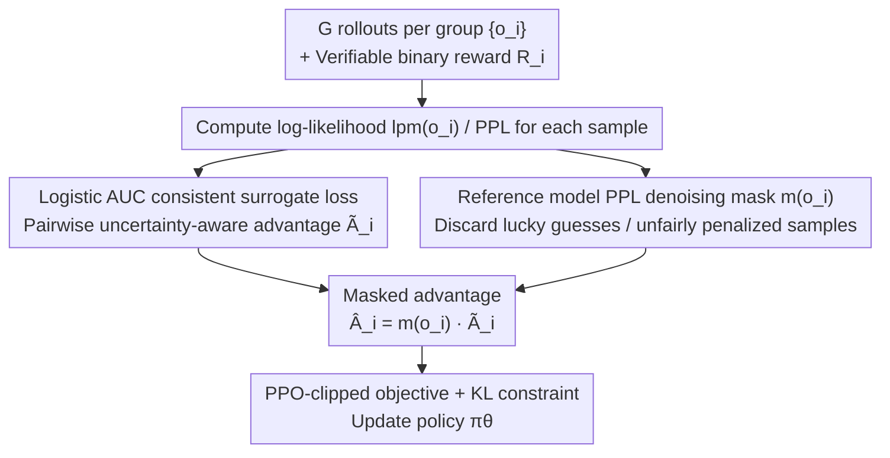

# Calibration-Aware Policy Optimization for Reasoning LLMs

**Conference**: ACL 2026  
**arXiv**: [2604.12632](https://arxiv.org/abs/2604.12632)  
**Code**: TBD  
**Area**: LLM Reasoning / RL / Calibration  
**Keywords**: GRPO, Calibration, AUC consistency, advantage estimation, Inference-time scaling

## TL;DR
The authors first demonstrate that the "reward-only" advantage estimation in GRPO-like algorithms is equivalent to an AUC-inconsistent surrogate ($\phi(t)=-t$, breaking scale invariance), which causes relative calibration (perplexity AUC) to continuously degrade while accuracy increases. Consequently, CAPO is proposed: the advantage is replaced with a "pairwise, uncertainty-aware" form based on a logistic AUC consistent surrogate, combined with denoising masking using reference-model PPL. On Qwen2.5-Math 1.5B/7B, this achieves +15~25% calibration with comparable or superior accuracy to GRPO, further increasing AIME inference-time scaling by 5%.

## Background & Motivation

**Background**: RLVR (Reinforcement Learning from Verifiable Rewards) methods like GRPO/GSPO have pushed the accuracy of mathematical reasoning models significantly. However, several works (Liu 2025, Kalai 2025, Bereket 2025) note that the resulting models become "overconfident"—the perplexity of incorrect answers becomes lower than that of correct ones, leading to degraded relative calibration (AUC).

**Limitations of Prior Work**: Calibration is of great practical importance: (1) deciding whether to dispatch fallback models in multi-agent collaboration based on confidence; (2) picking candidates for inference-time scaling based on confidence; (3) suppressing hallucinations via abstention. If the PPL of the model trained via RM no longer reflects correctness, all downstream tasks are affected. Existing remedies like CoDaPO, CDE (reward/advantage shaping), and SimKO (label smoothing) are largely heuristic and lack theoretical guarantees, resulting in limited calibration improvement or sacrificed accuracy.

**Key Challenge**: The GRPO objective solely focuses on rewards without considering sample uncertainty/PPL. This "reward-only" signal is mathematically misaligned with "calibration"—the optimizer can lower the PPL of all samples (including incorrect ones) to increase reward, causing accuracy to rise while AUC falls.

**Goal**: (1) Provide a rigorous mathematical explanation for why "GRPO degrades calibration"; (2) Design a theoretically guaranteed (AUC consistent) advantage estimation to jointly optimize calibration and accuracy; (3) Stabilize training—since the new advantage is non-linear (logistic) and sensitive to noisy samples.

**Key Insight**: The authors analyze AUC optimization theory (Gao & Zhou 2012). By rewriting the GRPO REINFORCE gradient as pairwise differences (U-statistic), they find the implicit surrogate is $\phi(t)=-t$. Through a scale invariance counterexample ($\mathrm{AUC}(\alpha f) = \mathrm{AUC}(f)$ but $\mathcal{L}_{-t}(\alpha f) = \alpha \mathcal{L}_{-t}(f)$), they prove it is not AUC consistent. A natural alternative is the logistic surrogate $\phi_\tau(t)=\log(1+\exp(-t/\tau))$.

**Core Idea**: Replace the "reward-only" advantage $A_i = R_i - \bar R$ with an "uncertainty-aware" pairwise advantage $\tilde A_i = \sum_j \phi'(lpm(o_i) - lpm(o_j))$, determined by the derivative of the logistic surrogate (sigmoid), and use the reference-model PPL to mask extreme noise for each sample.

## Method

### Overall Architecture
CAPO is a "local surgery" on the GRPO framework—retaining the PPO-clipped objective and KL constraints while only replacing the advantage $\hat A_i$ with $\hat A_i^{CAPO} = m(o_i)\,\tilde A_i$:
- $\tilde A_i$ is derived from the gradient of the logistic AUC surrogate, depending on the PPL of **all other samples in the group**, amplifying weights for "correct but high PPL" and "incorrect but low PPL" misranked samples.
- $m(o_i)$ is an indicator mask based on reference-model (base model) PPL: correct samples with ref-PPL > ref-high are discarded as "lucky guesses"; incorrect samples with ref-PPL < ref-low are discarded as "unfairly penalized."
- The final objective: $J_{CAPO}(\theta) = \mathbb{E}[\sum_i \min(r_i \hat A_i^{CAPO}, \mathrm{clip}(r_i,1\pm\epsilon)\hat A_i^{CAPO})]$.

### Key Designs

**1. Logistic AUC consistent surrogate: Replacing "reward-only" advantage with a pairwise form consistent with AUC**

Standard GRPO advantage focuses only on reward error; the optimizer can suppress the PPL of all samples (including incorrect ones) to increase reward, improving accuracy but destroying relative calibration. The authors rewrite the GRPO REINFORCE gradient $\nabla J_{GRPO} = \mathbb{E}[\sum_i (R_i - \bar R)\nabla_\theta lpm(o_i)]$ into pairwise differences $\nabla \mathbb{E}[(lpm(o_1)-lpm(o_2))(R_1-R_2)]$ using U-statistic invariance, identifying the implicit ranking surrogate as $\phi(t)=-t$. This surrogate is scale-sensitive: scaling score functions by $\alpha$ leaves AUC unchanged ($\mathrm{AUC}(\alpha f)=\mathrm{AUC}(f)$) but changes the loss ($\mathcal{L}_{-t}(\alpha f)=\alpha\mathcal{L}_{-t}(f)$), meaning loss can be lowered indefinitely without improving AUC. Thus, it is AUC inconsistent (Theorem 3).

The replacement is the logistic surrogate $\phi_\tau(t)=\log(1+e^{-t/\tau})$, which satisfies the requirements of Theorem 1 (convex + non-increasing + $\phi'(0)<0$). Theorem 2's regret bound $L(f)-L^* \le \tfrac{1}{\ln 2}(L_\phi(f)-L_\phi^*)$ ensures that "optimizing the surrogate optimizes AUC." In terms of advantage, for correct samples: $\tilde A_i = -\sum_{j:R_j=0}\phi'(lpm(o_i)-lpm(o_j))$, symmetrically for incorrect ones. Its derivative $\phi'(t)=-\sigma(-t)$ follows a sigmoid shape. For $t<0$, the gradient magnitude is largest: when the PPL gap between correct/incorrect samples is already wide, $|\phi'|\to 0$ and the gradient is suppressed. Large gradients are only assigned to "near-boundary" samples—those that are "correct with high PPL" or "incorrect with low PPL." Unlike GRPO, which treats all correct samples as $+|\bar R|$ regardless of uncertainty, CAPO focuses on these informative, misranked samples. This is the paper's primary contribution: shifting from empirical observation to mathematical necessity for "why GRPO degrades calibration."

**2. Reference-model PPL denoising masking: Filtering noisy samples misjudged by binary rewards using base model PPL**

Pairwise advantages are sensitive to extreme samples (the sigmoid gradient peaks at boundaries). If a "lucky guess" correct sample is treated as a strong positive signal, it drags the policy toward incorrect distributions. Since base models are generally well-calibrated (Kalai 2025), their PPL is a reliable indicator of sample quality. An indicator mask $m(o) = \mathbb{I}[PPL_{ref}(o) \le \text{ref-high}]$ (for $R=1$) or $\mathbb{I}[PPL_{ref}(o) \ge \text{ref-low}]$ (for $R=0$) is applied. Thresholds are set using the interquartile range (2.5 / 1.05) of the reference model's PPL distribution on correct/incorrect answers. This stabilizer is essential: removing the mask leads to increasing entropy and plateauing or declining accuracy (Fig 9).

### Loss & Training
- Models: Qwen2.5-Math-1.5B / 7B; Trained on 20k DeepScaler problems, validated on 240.
- Framework: verl + 8× A100; 1.5B trained for 600 steps (~24h), 7B for 400 steps (~48h).
- Hyperparameters: lr 1e-6, batch 128, PPO mini-batch 64, rollout n=8 (val 16), $\epsilon=0.2$, KL/entropy coef = 0, temperature 1.0.
- CAPO-specific: $\tau=0.6$ (1.5B) / 0.5 (7B), ref-high=2.5, ref-low=1.05.
- Metrics: 6 benchmarks (AIME24/25, MATH500, AMC23, Minerva, OlympiadBench); mean@16 + AUC-mean + Precision-Coverage + inference-time scaling (Perplexity Consistency, N=16).

## Key Experimental Results

### Main Results
Comparison of calibration (AUC-mean) and accuracy (mean@16) on 6 benchmarks (average for Qwen2.5-Math-7B, representative numbers from Fig 1/3):

| Method | AIME25 AUC | AIME25 Gain | AIME24+25 Inference Scaling acc (1.5B) | (7B) |
|------|------|------|------|------|
| GRPO | 0.54 | – | 20.33% | 33.33% |
| GSPO | – | – | 20.00% | 32.21% |
| CoDaPO | – | – | 21.67% | 31.66% |
| CDE | – | – | 16.67% | 31.66% |
| SimKO | – | – | 11.67% | 23.33% |
| **CAPO (Ours)** | **0.79** | **+25%** | **25.33%** | **38.33%** |

On 1.5B, AIME25 AUC increased from 0.63 (GRPO) to 0.78 (+15%); on 7B, it rose from 0.54 to 0.79 (+25%). Accuracy (mean@8) was comparable to or higher than GRPO, achieving the best results on AIME24/25/Minerva.

### Ablation Study

| Configuration | Observation |
|------|------|
| Full CAPO | Steady improvement in calibration + steady accuracy rise + stable entropy |
| w/o noise mask | Entropy keeps rising; accuracy plateaus early or declines |
| GRPO + only mask | AUC does not improve (confirming surrogate is the key, not the mask) |
| $\tau \in \{0.4, 0.6, 1.0\}$ | acc / AUC variations < 1 point (robust) |
| ref-high/low tightened [1.25, 2.1] vs [1.05, 2.5] | Performance almost unchanged |

### Key Findings
- **GRPO calibration degradation is a mathematical necessity**: Theorem 3 proves the reward-only advantage surrogate $\phi(t)=-t$ is not AUC consistent, meaning hyperparameter tuning cannot solve it. This also applies to GSPO.
- **CAPO achieves "steady training dynamics"**: Fig 1b/c shows GRPO/GSPO AUC monotonically decreases while CAPO AUC monotonically increases during training, proving that with the right surrogate, calibration and accuracy are no longer a trade-off.
- **Suppressing noise is vital for stability**: Removing the mask causes entropy to spike and the policy to become random, dropping accuracy. Noise in binary verifier rewards is amplified in pairwise advantages; masks are necessary.
- **Inference-time scaling gains are amplified**: On AIME, CAPO outperforms GRPO by 5% (absolute) because inference-time algorithms (like Perplexity Consistency) rely on PPL ranking, which benefits directly from better calibration.
- **Other calibration methods carry high costs**: SimKO drops 12 points on AMC and 7.7 points on AIME24, proving that hard measures like label smoothing sacrifice accuracy. CAPO is among the few with "zero accuracy cost."

## Highlights & Insights
- Connecting "overconfidence" in RLHF to AUC consistency theory transforms a vague heuristic into a rigorous mathematical proposition, which is a clean theoretical contribution.
- The implicit "hard sample mining" of $\phi'(t)=-\sigma(-t)$ is elegant; it concentrates gradients on misranked samples without needing an explicit difficulty estimator.
- Using reference model PPL as a sample quality proxy is cheap and accurate, complementing critic-free RL frameworks without adding trainable parameters.
- Linking calibration improvement to a 5% gain in inference-time scaling creates a compelling causal chain between abstract metrics and benchmark performance.

## Limitations & Future Work
- Evaluation is limited to mathematical reasoning; it is unknown if GRPO's degradation pattern remains identical for logic, common sense, or open-domain QA.
- Mask thresholds rely on the assumption that the base model is well-calibrated; if the base was previously "damaged" (e.g., long SFT), the mask might fail.
- Pairwise advantages require both positive and negative samples in a group; difficulty must be calibrated to ensure a mix of results.
- Optimal $\tau$ varies across model sizes (0.6 for 1.5B, 0.5 for 7B), suggesting some scaling adjustment is needed.
- Future directions: (1) Generalize to stochastic rewards; (2) Use EMA reference instead of fixed base to avoid drift; (3) Joint training with abstention for hallucination mitigation.

## Related Work & Insights
- **vs CoDaPO / CDE (reward shaping)**: These try to save calibration via reward shapes but lack theoretical guarantees. This paper proves reward-only advantages are systematically misaligned with AUC.
- **vs SimKO (label smoothing)**: SimKO suppresses overconfidence with label smoothing but sacrifices significant accuracy; CAPO achieves both with zero accuracy cost.
- **vs J1 / Think-RM (reasoning RM)**: Those focus on preference accuracy rather than calibration. CAPO provides a drop-in solution to obtain calibration within GRPO.
- **Insights**: (1) Any RL algorithm with group-level comparison implies a pairwise surrogate; evaluating it for consistency avoids "mathematical non-convergence" traps. (2) "Reference model self-calibration" as a quality proxy is a versatile trick for SFT data selection and RM quality assessment.

## Rating
- Novelty: ⭐⭐⭐⭐⭐ Links "overconfidence" to AUC consistency theory with rigorous counterexamples.
- Experimental Thoroughness: ⭐⭐⭐⭐ Extensive benchmarks and baselines, though limited to the math domain.
- Writing Quality: ⭐⭐⭐⭐ Clean narrative from empirical observation to theoretical explanation.
- Value: ⭐⭐⭐⭐ Provides a drop-in replacement for advantage estimation for teams using GRPO for reasoning.

<!-- RELATED:START -->

## Related Papers

- [\[ACL 2026\] Think Outside the Policy: In-Context Steered Policy Optimization](think_outside_the_policy_in-context_steered_policy_optimization.md)
- [\[ACL 2026\] Adapt to Thrive! Adaptive Power-Mean Policy Optimization for Improved LLM Reasoning](adapt_to_thrive_adaptive_power-mean_policy_optimization_for_improved_llm_reasoni.md)
- [\[ICLR 2026\] DRPO: Efficient Reasoning via Decoupled Reward Policy Optimization](../../ICLR2026/llm_reasoning/drpo_efficient_reasoning_via_decoupled_reward_policy_optimization.md)
- [\[ICLR 2026\] FastGRPO: Accelerating Policy Optimization via Concurrency-aware Speculative Decoding and Online Draft Learning](../../ICLR2026/llm_reasoning/fastgrpo_accelerating_policy_optimization_via_concurrency-aware_speculative_deco.md)
- [\[ACL 2026\] ChAIRO: Contextual Hierarchical Analogical Induction and Reasoning Optimization for LLMs](chairo_contextual_hierarchical_analogical_induction_and_reasoning_optimization_f.md)

<!-- RELATED:END -->
