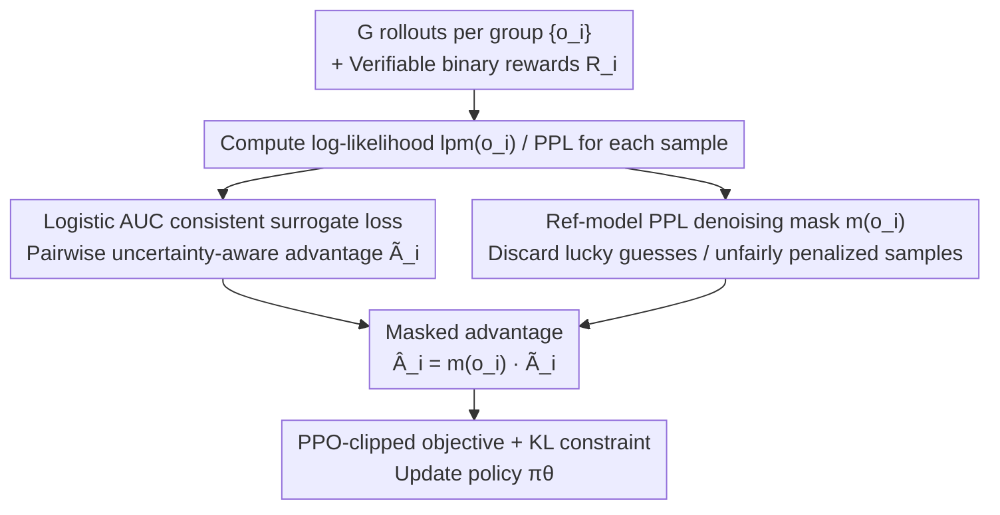

# Calibration-Aware Policy Optimization for Reasoning LLMs

**Conference**: ACL 2026  
**arXiv**: [2604.12632](https://arxiv.org/abs/2604.12632)  
**Code**: TBD  
**Area**: LLM Reasoning / RL / Calibration  
**Keywords**: GRPO, Calibration, AUC consistency, advantage estimation, inference-time scaling  

## TL;DR
The authors first prove that the "reward-only" advantage estimation in GRPO-like algorithms is equivalent to an AUC-inconsistent surrogate ($\phi(t)=-t$, violating scale-invariance), which leads to a continuous degradation of relative calibration (perplexity AUC) even as accuracy increases. Accordingly, they propose CAPO: replacing the advantage with a "pairwise, uncertainty-aware" form based on a logistic AUC consistent surrogate, further enhanced by denoising masking using reference-model PPL. On Qwen2.5-Math 1.5B/7B, CAPO achieves +15~25% calibration improvements with comparable or superior accuracy to GRPO, and an additional 5% gain in AIME inference-time scaling.

## Background & Motivation

**Background**: RLVR (Reinforcement Learning from Verifiable Rewards) using algorithms like GRPO/GSPO has pushed the accuracy of mathematical reasoning models to high levels. However, recent studies (Liu 2025, Kalai 2025, Bereket 2025) note that the resulting models become "overconfident"—wrong answers may have even lower perplexity than correct ones, leading to degraded relative calibration (AUC).

**Limitations of Prior Work**: Calibration is of great practical significance: (1) in multi-agent collaboration, confidence determines the dispatch of backup models; (2) in inference-time scaling, confidence is used to select candidates; (3) for abstention to suppress hallucination. If the PPL of trained models no longer reflects correctness, all downstream tasks are affected. Existing remedies like CoDaPO, CDE (reward/advantage shaping), and SimKO (label smoothing) are mostly heuristic, lack theoretical guarantees, and often show limited calibration improvement or sacrifice accuracy.

**Key Challenge**: The GRPO objective only considers reward, ignoring sample uncertainty/PPL. This "reward-only" signal is mathematically misaligned with calibration—the optimizer can lower the PPL of all samples (including incorrect ones) to increase reward, causing accuracy to rise while AUC drops.

**Goal**: (1) Provide a rigorous mathematical explanation for why GRPO degrades calibration; (2) Design a theoretically grounded (AUC consistent) advantage estimation to optimize calibration and accuracy jointly; (3) Stabilize training, as the new advantage is non-linear (logistic) and sensitive to noisy samples.

**Key Insight**: Starting from AUC optimization theory (Gao & Zhou 2012), the authors rewrite the GRPO REINFORCE gradient as a pairwise difference (U-statistic) and find its implicit surrogate is $\phi(t)=-t$. Using a scale-invariance counterexample ($\mathrm{AUC}(\alpha f) = \mathrm{AUC}(f)$ but $\mathcal{L}_{-t}(\alpha f) = \alpha \mathcal{L}_{-t}(f)$), they prove it is not AUC consistent. A natural alternative is the logistic surrogate $\phi_\tau(t)=\log(1+\exp(-t/\tau))$.

**Core Idea**: Replace the "reward-only" advantage $A_i = R_i - \bar R$ with an "uncertainty-aware" pairwise advantage $\tilde A_i = \sum_j \phi'(lpm(o_i) - lpm(o_j))$, determined by the derivative of the logistic surrogate (sigmoid), and apply an indicator mask based on reference-model PPL to remove extreme noise.

## Method

### Overall Architecture
CAPO is a "local surgical modification" to the GRPO framework—it retains the PPO-clipped objective and KL constraints, only replacing the advantage $\hat A_i$ with $\hat A_i^{CAPO} = m(o_i)\,\tilde A_i$:
- $\tilde A_i$ is derived from the gradient of the logistic AUC surrogate, depending on the PPL of **all other samples in the group**. It amplifies the weight of misranked samples: "correct but high PPL" and "incorrect but low PPL."
- $m(o_i)$ is an indicator mask based on the reference-model (base model) PPL: correct samples with ref-PPL > ref-high are discarded as "lucky guesses"; incorrect samples with ref-PPL < ref-low are discarded as "unfairly penalized" (reasoning steps close to correct).
- Final objective: $J_{CAPO}(\theta) = \mathbb{E}[\sum_i \min(r_i \hat A_i^{CAPO}, \mathrm{clip}(r_i,1\pm\epsilon)\hat A_i^{CAPO})]$.

### Key Designs

**1. Logistic AUC consistent surrogate: Replacing "reward-only" advantage with a pairwise AUC-consistent form**

Since the GRPO advantage only focuses on reward error, the optimizer can lower the PPL of all samples (including wrong ones) to increase reward, improving accuracy while ruining relative calibration. The authors rewrite the GRPO REINFORCE gradient $\nabla J_{GRPO} = \mathbb{E}[\sum_i (R_i - \bar R)\nabla_\theta lpm(o_i)]$ using U-statistic invariance as a pairwise difference $\nabla \mathbb{E}[(lpm(o_1)-lpm(o_2))(R_1-R_2)]$, revealing the implicit ranking surrogate $\phi(t)=-t$. This surrogate is scale-sensitive: magnifying the scoring function by $\alpha$ leaves the AUC unchanged ($\mathrm{AUC}(\alpha f)=\mathrm{AUC}(f)$) but changes the loss ($\mathcal{L}_{-t}(\alpha f)=\alpha\mathcal{L}_{-t}(f)$), meaning the loss can be reduced indefinitely without improving AUC. Thus, it is not AUC consistent (Theorem 3).

The solution is the logistic surrogate $\phi_\tau(t)=\log(1+e^{-t/\tau})$, which satisfies the conditions in Theorem 1 (convex + non-increasing + $\phi'(0)<0$) and possesses a regret bound per Theorem 2: $L(f)-L^* \le \tfrac{1}{\ln 2}(L_\phi(f)-L_\phi^*)$, ensuring that optimizing the surrogate effectively optimizes the AUC. For the advantage, the correct sample form is $\tilde A_i = -\sum_{j:R_j=0}\phi'(lpm(o_i)-lpm(o_j))$, with a symmetric form for incorrect samples. Its derivative $\phi'(t)=-\sigma(-t)$ follows a sigmoid shape. For $t<0$, when the PPL gap between correct and incorrect samples is already large, $|\phi'|\to 0$, automatically suppressing the gradient. Large gradients are only assigned to "near-misranked" boundary samples—the informative "correct but high PPL" or "incorrect but low PPL" cases. In contrast, GRPO gives all correct samples a flat $+|\bar R|$ and incorrect samples $-|\bar R|$, ignoring uncertainty.

**2. Reference-model PPL denoising masking: Filtering noisy samples misjudged by binary rewards**

Pairwise advantages are sensitive to extreme samples. If a "lucky guess" is treated as a strong positive signal, it can distort the token distribution. The authors leverage the fact that the base model is well-calibrated before RL (Kalai 2025), making its PPL a reliable quality indicator. A mask $m(o) = \mathbb{I}[PPL_{ref}(o) \le \text{ref-high}]$ for $R=1$ and $\mathbb{I}[PPL_{ref}(o) \ge \text{ref-low}]$ for $R=0$ is applied. Correct samples with ref-PPL above ref-high are discarded as lucky guesses, and incorrect samples with ref-PPL below ref-low are discarded as nearly correct. Thresholds are set to the upper/lower quartiles of the ref-model's distribution (2.5 / 1.05).

### Loss & Training
- Models: Qwen2.5-Math-1.5B / 7B; Training on 20k DeepScaler problems, validation on 240.
- Framework: verl + 8× A100; 1.5B for 600 steps (~24h), 7B for 400 steps (~48h).
- Hyperparams: lr 1e-6, batch 128, PPO mini-batch 64, rollout n=8, $\epsilon=0.2$, KL/entropy coef = 0; temperature 1.0.
- CAPO-only: $\tau=0.6$ (1.5B) / 0.5 (7B), ref-high=2.5, ref-low=1.05.
- Evaluation: 6 benchmarks (AIME24/25, MATH500, AMC23, Minerva, OlympiadBench); Metrics: mean@16, AUC-mean, Precision-Coverage, and Perplexity Consistency for inference-time scaling.

## Key Experimental Results

### Main Results
Comparison of calibration (AUC-mean) and accuracy (mean@16) on 6 benchmarks (AIME average for 7B):

| Method | AIME25 AUC | AIME25 Gain | AIME24+25 Scaling Acc (1.5B) | (7B) |
|------|------|------|------|------|
| GRPO | 0.54 | – | 20.33% | 33.33% |
| GSPO | – | – | 20.00% | 32.21% |
| CoDaPO | – | – | 21.67% | 31.66% |
| CDE | – | – | 16.67% | 31.66% |
| SimKO | – | – | 11.67% | 23.33% |
| **CAPO (Ours)** | **0.79** | **+25%** | **25.33%** | **38.33%** |

AUC on AIME25 improved from 0.63 (GRPO) to 0.78 (+15%) on 1.5B, and from 0.54 to 0.79 (+25%) on 7B. Accuracy remains comparable or superior to GRPO, peaking on AIME24/25 and Minerva.

### Ablation Study

| Configuration | Observation |
|------|------|
| Full CAPO | Steady improvement in calibration + rising accuracy + stable entropy |
| w/o noise mask | Continuous entropy rise, accuracy plateaus or drops early |
| GRPO + only mask | No improvement in AUC (confirms surrogate is key, not the mask) |
| $\tau \in \{0.4, 0.6, 1.0\}$ | Accuracy/AUC variation < 1 point (robust) |
| ref-high/low tightening | Performance remains largely unchanged |

### Key Findings
- **Degraded GRPO calibration is a mathematical necessity**: Theorem 3 proves the reward-only surrogate $\phi(t)=-t$ is not AUC consistent; tuning cannot fix this.
- **CAPO achieves a stable training state**: While GRPO/GSPO AUC monotonically decreases during training, CAPO's AUC monotonically increases, showing accuracy and calibration are no longer in a trade-off.
- **Denoising is vital**: Without the mask, entropy surges and the policy becomes random, dropping accuracy. The noise in binary rewards is amplified by pairwise advantages; masking is essential.
- **Inference-time scaling benefits**: CAPO outperforms GRPO by 5% on AIME under scaling, as perplexity-based selection algorithms rely heavily on correct PPL ranking.
- **Low cost of calibration**: Unlike SimKO, which drops 7-12 points on AMC/AIME due to hard label smoothing, CAPO achieves calibration with zero accuracy penalty.

## Highlights & Insights
- Connects the "overconfidence" phenomenon in RLHF to AUC consistency theory with rigorous proofs—the cleanest theoretical contribution in this line of work.
- The implicit "hard sample mining" of $\phi'(t)=-\sigma(-t)$ is elegant, focusing gradients on misranked samples without an external difficulty estimator.
- Using reference-model PPL as a quality proxy is cheap and accurate, complementing critic-free RL frameworks without additional parameters.
- Direct conversion of calibration into inference-time scaling gains (+5%) provides a compelling deployment argument.

## Limitations & Future Work
- Evaluation is limited to mathematical reasoning; unknown if GRPO's degradation patterns hold for logic, common sense, or open-domain QA.
- Mask thresholds rely on the base model being well-calibrated; if the base model is "corrupted" by previous tricks, the mask may fail.
- Pairwise advantages require mixed correct/incorrect samples within a group.
- Future directions: (1) Generalize to stochastic rewards; (2) Use an EMA reference to avoid distribution drift; (3) Jointly train with abstention for hallucination mitigation.

## Related Work & Insights
- **vs CoDaPO / CDE**: Both reshape rewards but lack theoretical consistency; this paper shows reward shaping is insufficient if reward-only advantages persist.
- **vs SimKO**: SimKO suppresses overconfidence via label smoothing but sacrifices significant accuracy; CAPO achieves both via surrogate consistency and masking.
- **vs reasoning RMs**: While typically focused only on preference accuracy, CAPO provides a general scheme to integrate calibration into GRPO-trained models.

## Rating
- Novelty: ⭐⭐⭐⭐⭐ Ties overconfidence to AUC theory rigorously.
- Experimental Thoroughness: ⭐⭐⭐⭐ High benchmark coverage and scaling tests; domain limited to math.
- Writing Quality: ⭐⭐⭐⭐ Clean progression from observation to theory.
- Value: ⭐⭐⭐⭐ A drop-in replacement for advantage estimation in GRPO.

<!-- RELATED:START -->

## Related Papers

- [\[ACL 2026\] Think Outside the Policy: In-Context Steered Policy Optimization](think_outside_the_policy_in-context_steered_policy_optimization.md)
- [\[ACL 2026\] Adapt to Thrive! Adaptive Power-Mean Policy Optimization for Improved LLM Reasoning](adapt_to_thrive_adaptive_power-mean_policy_optimization_for_improved_llm_reasoni.md)
- [\[ACL 2026\] ChAIRO: Contextual Hierarchical Analogical Induction and Reasoning Optimization for LLMs](chairo_contextual_hierarchical_analogical_induction_and_reasoning_optimization_f.md)
- [\[ICLR 2026\] FastGRPO: Accelerating Policy Optimization via Concurrency-aware Speculative Decoding and Online Draft Learning](../../ICLR2026/llm_reasoning/fastgrpo_accelerating_policy_optimization_via_concurrency-aware_speculative_deco.md)
- [\[ICLR 2026\] DRPO: Efficient Reasoning via Decoupled Reward Policy Optimization](../../ICLR2026/llm_reasoning/drpo_efficient_reasoning_via_decoupled_reward_policy_optimization.md)

<!-- RELATED:END -->
