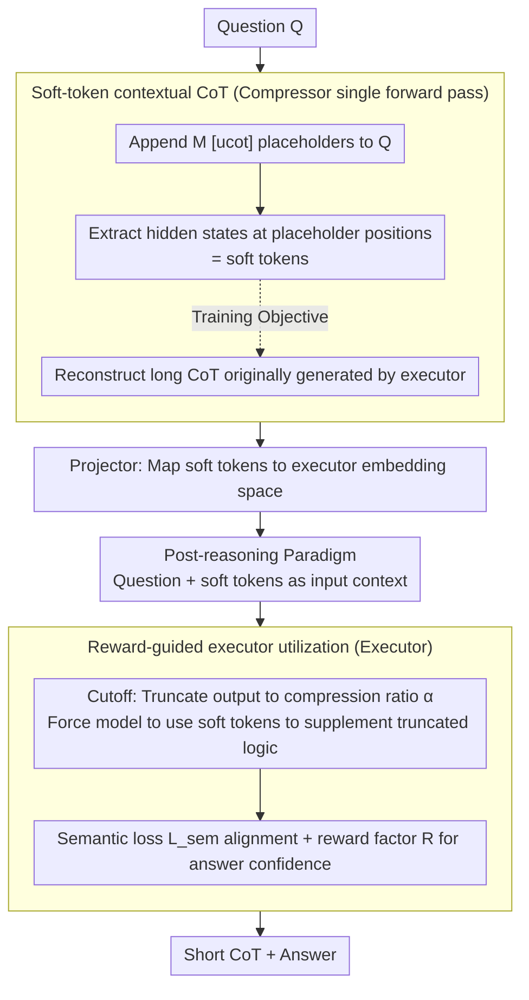

# Can Reasoning Path still be Effective as Input? Bridging Post-Reasoning to Chain-of-Thought Compression

**Conference**: ACL2026  
**arXiv**: [2510.08647](https://arxiv.org/abs/2510.08647)  
**Code**: No public code link found in cache  
**Area**: LLM Reasoning / CoT Compression / Inference Acceleration  
**Keywords**: post-reasoning, CoT compression, soft tokens, inference latency, UCoT

## TL;DR
This paper proposes post-reasoning and UCoT: a lightweight compressor first generates soft tokens representing the reasoning path in a single forward pass, and then an executor uses these soft tokens as input context to conduct short-output reasoning, significantly reducing CoT tokens and latency while maintaining reasoning accuracy.

## Background & Motivation
**Background**: Long Chain-of-Thought (CoT) has become a vital means to enhance LLM capabilities in mathematics, scientific QA, and code reasoning. Models like DeepSeek-R1 and the OpenAI o1 series demonstrate that test-time computation scaling yields stronger reasoning.

**Limitations of Prior Work**: The core cost of long CoT stems from autoregressive output. The model must generate intermediate reasoning token-by-token, leading to high latency and token costs for complex problems. Existing CoT compression methods mostly focus on the output side—such as prompting the model to write less, truncating reasoning, or training on short CoT—but these often result in the loss of critical reasoning information.

**Key Challenge**: CoT is both an output and a "self-generated context" constructed by the model for the final answer. If the reasoning path is provided as input in advance, the output could theoretically be shortened. However, generating explicit textual CoT is still expensive, and poor-quality external CoT can hurt accuracy.

**Goal**: To verify whether "reasoning paths as input remain effective" and design an efficient framework that avoids autoregressive generation of long contextual CoT, ensuring reasoning information is supplemented at the input while shortening the output.

**Key Insight**: The authors first define post-reasoning: the executor receives a question and an external contextual CoT, then continues reasoning to output an answer. A pilot study shows that output tokens can be reduced by over 80%, but performance depends on the length and quality of the contextual CoT. Consequently, they further compress explicit CoT into soft tokens.

**Core Idea**: Instead of strictly limiting the model's thinking, high-quality reasoning priors are compressed into input-side soft tokens, allowing the executor to access missing reasoning information even under a limited output budget.

## Method
UCoT consists of three components: a compressor, a projector, and an executor. The compressor learns to compact the long CoT (which the executor would have originally generated) into a sequence of hidden states at placeholder positions; the projector maps these hidden states into the executor's embedding space; the executor then utilizes these soft tokens to provide shorter but accurate reasoning and answers within a constrained output budget.

### Overall Architecture
In the training phase, the executor first generates high-quality CoT for each question to obtain `(Q, C, A)` data. Then, a lightweight compressor is trained to produce soft tokens from the question and `[ucot]` placeholders, with a requirement to reconstruct the original CoT. Finally, the executor is trained to recover the original reasoning semantics and maintain answer confidence using the soft tokens under a truncated output budget. In the inference phase, the compressor generates soft tokens in a single forward pass, and the executor outputs a shorter answer based on these soft tokens.

### Key Designs

**1. Post-reasoning Paradigm: Moving CoT from output to input to shorten the length needed for autoregressive generation by the executor.**

The cost of long CoT is almost entirely due to autoregressive output—the model must write out intermediate reasoning token-by-token. The authors ask: if the reasoning path is already present in the input context, does the model still need to generate the full CoT from scratch? While vanilla reasoning is $\{C,A\}=\mathrm{LLM}(Q)$, post-reasoning is defined as $\{\hat C,\hat A\}=\mathrm{LLM}(Q \oplus C')$, where $C'$ is an externally provided contextual CoT. A pilot study provided strong preliminary evidence: on GSM8K and MATH-500, feeding the reasoning path into the input reduced output tokens by over 80%. This proves that "reasoning paths as input remain effective," making room for cheaper alternatives.

**2. Soft-token Contextual CoT: Replacing expensive explicit textual CoT with single-forward-pass soft tokens.**

While post-reasoning is effective, explicit text $C'$ still requires autoregressive generation and provides no savings. Thus, the compressor appends `[ucot]` placeholders of length $M$ to the input. After a single forward pass, the hidden states $H_n$ at these positions are extracted as soft tokens. The training objective requires the compressor to reconstruct the original CoT $C_n$ using only $H_n$. By compressing reasoning semantics into a continuous space obtainable in one pass, the latency of long text output is bypassed.

**3. Reward-guided Executor Utilization: Using output budgets + semantic/confidence constraints to force the executor to utilize soft tokens.**

The biggest risk of continuous prompts is being ignored—the model might treat soft tokens as decorations and generate long CoT anyway. To address this, the projector first maps the compressor's soft tokens into the executor's embedding space. During executor training, a "Cutoff" mechanism truncates the explicit CoT to a compression ratio $\alpha$, forcing the model to rely on soft tokens to fill in missing logic. Simultaneously, two constraints ensure quality: a semantic loss aligns UCoT reasoning representations with original long CoT representations, and a reward factor penalizes differences in answer confidence between compressed and original reasoning. The output budget ensures "utilization," while semantic/confidence constraints ensure "correctness."

### Loss & Training
In the compressor stage, a reconstruction objective is minimized: $L_c=E_D[-\log P_{M_c}(C_n|H_n)]$, embedding long CoT information into soft tokens. In the executor stage, the output CoT is truncated to $\bar C_n$ based on ratio $\alpha$. A semantic loss $L_{sem}=E_D[Dist(H_{UCoT},H_{CoT})]$ aligns the final hidden states of compressed and original reasoning, while a reward factor $R=E_D[(r_{UCoT}-r_{CoT})^2]$ maintains answer confidence. The final executor objective is $L_e=L_{sem}\cdot R$. The main experiments use Qwen2.5-1.5B-Instruct as the compressor, with Qwen2.5-7B-Instruct and Llama-3.1-8B-Instruct as executors.

## Key Experimental Results

### Main Results

| Backbone / Dataset | Method | Ratio | Acc. | Tokens | Latency | Description |
|--------------------|--------|-------|------|--------|---------|-------------|
| Qwen2.5-7B / GSM8K | Original | - | 92.17 | 298.63 | 3.83s | Original long CoT |
| Qwen2.5-7B / GSM8K | UCoT | 0.5 | 86.55 | 140.36 | 1.86s | Tokens nearly halved, outperforms CoD/Tokenskip |
| Qwen2.5-7B / MATH-500 | Original | - | 61.60 | 571.64 | 6.35s | Original long CoT |
| Qwen2.5-7B / MATH-500 | UCoT | 0.5 | 53.70 | 280.10 | 3.17s | Significantly higher than Tokenskip (47.10) |
| Llama3.1-8B / GSM8K | Original | - | 87.26 | 212.13 | 2.44s | Original long CoT |
| Llama3.1-8B / GSM8K | UCoT | 0.5 | 83.62 | 101.82 | 1.26s | Maintains high accuracy with nearly half latency |

| Long CoT Scenario | Method | Ratio | Acc. | Tokens | vs. Tokenskip |
|-------------------|--------|-------|------|--------|----------------|
| Qwen3-8B / GPQA | Tokenskip | 0.5 | 54.23 | 4388.54 | Baseline |
| Qwen3-8B / GPQA | UCoT | 0.5 | 56.86 | 4065.58 | Higher accuracy, fewer tokens |
| Qwen3-8B / HumanEval | Tokenskip | 0.5 | 42.52 | 1025.00 | Baseline |
| Qwen3-8B / HumanEval | UCoT | 0.5 | 46.55 | 1021.93 | 4.03 accuracy gain |
| DeepSeek-R1-Distill-Qwen-7B / HumanEval | Tokenskip | 0.5 | 43.79 | 900.04 | Baseline |
| DeepSeek-R1-Distill-Qwen-7B / HumanEval | UCoT | 0.5 | 43.96 | 870.68 | ~50.67% token reduction, slightly higher acc. |

### Ablation Study

| Config | Qwen2.5 GSM8K Acc. / Tokens | Qwen2.5 MATH Acc. / Tokens | Description |
|--------|-----------------------------|-----------------------------|-------------|
| UCoT full | 87.98 / 194.63 | 58.80 / 388.72 | Full model, ratio 0.7 |
| w/o ST | 73.23 / 220.99 | 47.50 / 390.84 | Significant accuracy drop without soft tokens |
| w/o $L_{sem}$ | 87.32 / 274.74 | 59.70 / 554.49 | Accuracy maintained, but compression task fails |
| w/o R | 71.53 / 206.05 | 44.90 / 417.30 | Reward factor is critical for answer capability |

### Key Findings
- It is difficult to force models to reach a target compression ratio via prompting alone; direct truncation leads to massive performance collapse. UCoT’s advantage lies in supplementing information at the input rather than brute-force output compression.
- Soft tokens are the core of performance. Removing them dropped Qwen2.5 GSM8K accuracy from 87.98 to 73.23, proving that the continuous reasoning context provided by the compressor is indeed utilized by the executor.
- $L_{sem}$ acts as a "compression constraint": without it, accuracy may not collapse immediately, but token counts remain close to original lengths, indicating the model has not learned to complete tasks with shorter outputs.

## Highlights & Insights
- Viewing CoT as "input context the model generates for itself" is insightful. it shifts the CoT compression problem from "outputting less" to "providing sufficient reasoning priors at the input."
- The compressor-executor division of labor in UCoT is natural: a small model handles low-latency soft context generation while a large model handles final reasoning, which is compatible with small-model routing or preprocessing strategies in deployment.
- The paper reminds us that long reasoning compression cannot just rely on deleting text. What truly needs compression is the reasoning information, and soft tokens provide a channel for representation that does not need to be fully discretized.

## Limitations & Future Work
- UCoT requires training a compressor, projector, and executor, leading to higher deployment complexity than pure prompt or training-free methods; availability for closed-source models is also limited.
- The interpretability of soft tokens is weak. Although the authors attempted analysis via information gain and decoded soft tokens, they remain less auditable than textual CoT.
- Training data depends on the executor first generating high-quality CoT; if the original long CoT contains bias or hallucinations, the compressor might learn these issues.
- Future work could explore universal soft reasoning caches across tasks or executors, or combine UCoT with system-level accelerations like speculative decoding, KV cache reuse, or routers.

## Related Work & Insights
- **vs Prompt / CoD**: Prompt and CoD attempt to constrain output form to make the model write shorter. UCoT supplements continuous reasoning context at the input, resulting in more stable accuracy at identical compression ratios.
- **vs Tokenskip**: Tokenskip reduces output by training on short CoT but may lose reasoning information. UCoT uses soft tokens to preserve omitted logic, outperforming Tokenskip by over 3.08 points on GSM8K at a 0.5 ratio.
- **vs latent CoT / continuous reasoning**: Related methods also compress intermediate reasoning into continuous representations, but this work emphasizes the post-reasoning input paradigm and utilizes semantic loss and reward factors to ensure the executor effectively leverages these representations.

## Rating
- Novelty: ⭐⭐⭐⭐⭐ The problem reformulation into post-reasoning + soft contextual CoT is very clear.
- Experimental Thoroughness: ⭐⭐⭐⭐☆ Main experiments, ablations, and long CoT generalization are solid, though system costs and cross-model generalization could be further explored.
- Writing Quality: ⭐⭐⭐⭐☆ Diagrams and training procedures are clear, though some formulas are dense.
- Value: ⭐⭐⭐⭐⭐ Direct reference value for LLM reasoning acceleration, CoT compression, and continuous reasoning representations.

<!-- RELATED:START -->

## Related Papers

- [\[ACL 2026\] Is Chain-of-Thought Really Not Explainability? Chain-of-Thought Can Be Faithful without Hint Verbalization](is_chain-of-thought_really_not_explainability_chain-of-thought_can_be_faithful_w.md)
- [\[ICLR 2026\] When Reasoning Meets Compression: Understanding the Effects of LLMs Compression on Large Reasoning Models](../../ICLR2026/llm_reasoning/when_reasoning_meets_compression_understanding_the_effects_of_pruning_and_quant.md)
- [\[NeurIPS 2025\] Mind the Gap: Bridging Thought Leap for Improved Chain-of-Thought Tuning](../../NeurIPS2025/llm_reasoning/mind_the_gap_bridging_thought_leap_for_improved_chain-of-thought_tuning.md)
- [\[ACL 2026\] Long-Context Reasoning Through Proxy-Based Chain-of-Thought Tuning](long-context_reasoning_through_proxy-based_chain-of-thought_tuning.md)
- [\[ACL 2025\] Can Large Language Models Detect Errors in Long Chain-of-Thought Reasoning?](../../ACL2025/llm_reasoning/can_large_language_models_detect_errors_in_long_chain-of-thought_reasoning.md)

<!-- RELATED:END -->
