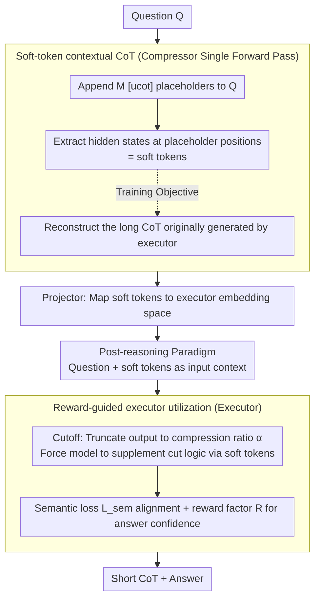

# Can Reasoning Path still be Effective as Input? Bridging Post-Reasoning to Chain-of-Thought Compression

**Conference**: ACL2026  
**arXiv**: [2510.08647](https://arxiv.org/abs/2510.08647)  
**Code**: No public code link found in cache  
**Area**: LLM Reasoning / CoT Compression / Inference Acceleration  
**Keywords**: post-reasoning, CoT compression, soft tokens, inference latency, UCoT

## TL;DR
This paper proposes post-reasoning and UCoT: a lightweight compressor first generates soft tokens representing the reasoning path via a single forward pass, and then an executor uses these soft tokens as input context to perform short-output reasoning, significantly reducing CoT tokens and latency while maintaining reasoning accuracy.

## Background & Motivation
**Background**: Long Chain-of-Thought (CoT) has become an essential means to enhance LLM capabilities in mathematics, science QA, and code reasoning. Models such as DeepSeek-R1 and the o-series also demonstrate that test-time computation scaling can yield stronger reasoning.

**Limitations of Prior Work**: The core cost of long CoT stems from autoregressive output. The model must generate intermediate reasoning token by token, resulting in high latency and token costs for complex problems. Existing CoT compression methods mostly focus on the output side—such as prompting the model to write less, truncating reasoning, or training short CoTs—but these methods often lose critical reasoning information.

**Key Challenge**: CoT is both an output and a "self-generated context" constructed by the model for the final answer. If the reasoning path is provided to the model in advance as input, the output can theoretically be shortened; however, the generation of explicit text CoT itself remains expensive, and poor-quality external CoTs can harm accuracy.

**Goal**: To verify whether "reasoning paths as input can still be effective" and design an efficient framework that does not require autoregressive generation of long context CoTs, allowing reasoning information to be supplemented at the input side while shortening the output side.

**Key Insight**: The authors first define post-reasoning: an executor receives the question and an external contextual CoT, then continues reasoning to output the answer. A pilot study shows that output tokens can be reduced by over 80%, though the effectiveness depends on the length and quality of the contextual CoT. Consequently, they further compress explicit CoTs into soft tokens.

**Core Idea**: Instead of rigidly restricting the model to "think less," high-quality reasoning priors are compressed into input-side soft tokens, enabling the executor to access missing reasoning information even under a short output budget.

## Method
UCoT consists of three components: a compressor, a projector, and an executor. The compressor learns to compress the long CoT that the executor would originally generate into hidden states at placeholder positions; the projector maps these hidden states into the executor's embedding space; the executor utilizes the soft tokens under a restricted output budget to provide shorter but accurate reasoning and answers.

### Overall Architecture
The training phase first uses the executor to generate high-quality CoT for each question, obtaining $(Q, C, A)$ data. Then, a lightweight compressor is trained to produce soft tokens from the question and `[ucot]` placeholders, with the objective of reconstructing the original CoT. Finally, the executor is trained to recover original reasoning semantics and maintain answer confidence using the soft tokens and a truncated output budget. During the inference phase, the compressor only needs one forward pass to generate soft tokens, and the executor then outputs a shorter answer based on these soft tokens.

### Key Designs

**1. Post-reasoning paradigm: Moving CoT from output to input to shorten the executor's autoregressive generation length.**

The cost of long CoT is almost entirely concentrated on the autoregressive output—the model must write out intermediate reasoning token by token. The authors ask: if the reasoning path is already present in the input as context, does the model still need to generate a full CoT from scratch? While vanilla reasoning is $\{C,A\}=\mathrm{LLM}(Q)$, post-reasoning is modified to $\{\hat C,\hat A\}=\mathrm{LLM}(Q \oplus C')$, where $C'$ is the externally provided contextual CoT. A pilot study provided strong preliminary evidence: on GSM8K and MATH-500, output tokens can be reduced by over 80% if the reasoning path is fed into the input. This indicates that "reasoning paths as input are still effective," creating space to replace them with more efficient forms.

**2. Soft-token contextual CoT: Replacing expensive explicit text CoT with single-forward-pass soft tokens.**

Although post-reasoning is effective, the explicit text $C'$ itself still requires autoregressive generation and provides no savings. Therefore, the compressor appends `[ucot]` placeholders of length $M$ to the end of the input and takes the hidden states $H_n$ at these placeholder positions after a single forward pass as soft tokens. The training objective requires the compressor to reconstruct the original CoT $C_n$ using only $H_n$. In this way, reasoning semantics are compressed into a continuous space and obtained in a single pass, bypassing the latency of long text output.

**3. Reward-guided executor utilization: Using output budgets + semantic/confidence constraints to force the executor to utilize soft tokens.**

The greatest risk of continuous prompts is being ignored by the model—it might treat soft tokens as decorations and generate a long CoT regardless. To address this, the projector first maps the compressor's soft tokens into the executor's embedding space. During executor training, a "Cutoff" is used to truncate the explicit CoT to a compression ratio $\alpha$, forcing the model to rely on soft tokens to supplement the missing logic. Simultaneously, two constraints ensure quality: the semantic loss aligns the UCoT reasoning representation with the original long CoT representation, and a reward factor penalizes the difference in answer confidence between compressed and original reasoning. The output budget ensures "usage," while the semantic/confidence constraints ensure "correct usage."

### Loss & Training
The compressor stage minimizes the reconstructive objective $L_c=E_D[-\log P_{M_c}(C_n|H_n)]$ to pack long CoT information into soft tokens. For the executor stage, the output CoT is first truncated to $\bar C_n$ under compression ratio $\alpha$, then a semantic loss $L_{sem}=E_D[Dist(H_{UCoT},H_{CoT})]$ is used to align the final hidden states of the compressed reasoning and the original long reasoning. A reward factor $R=E_D[(r_{UCoT}-r_{CoT})^2]$ is employed to maintain answer confidence. The final executor objective is $L_e=L_{sem}\cdot R$. The main experiments use Qwen2.5-1.5B-Instruct as the compressor and Qwen2.5-7B-Instruct or Llama-3.1-8B-Instruct as executors.

## Key Experimental Results

### Main Results

| Backbone / Dataset | Method | Comp. Ratio | Acc. | Tokens | Latency | Description |
|--------------------|--------|-------------|------|--------|---------|-------------|
| Qwen2.5-7B / GSM8K | Original | - | 92.17 | 298.63 | 3.83s | Original long CoT |
| Qwen2.5-7B / GSM8K | Ours (UCoT) | 0.5 | 86.55 | 140.36 | 1.86s | Tokens halved, superior to CoD/Tokenskip |
| Qwen2.5-7B / MATH-500 | Original | - | 61.60 | 571.64 | 6.35s | Original long CoT |
| Qwen2.5-7B / MATH-500 | Ours (UCoT) | 0.5 | 53.70 | 280.10 | 3.17s | Significantly higher than Tokenskip (47.10) |
| Llama3.1-8B / GSM8K | Original | - | 87.26 | 212.13 | 2.44s | Original long CoT |
| Llama3.1-8B / GSM8K | Ours (UCoT) | 0.5 | 83.62 | 101.82 | 1.26s | Maintains high accuracy with near half latency |

| Long CoT Scenario | Method | Comp. Ratio | Acc. | Tokens | vs. Tokenskip |
|-------------------|--------|-------------|------|--------|----------------|
| Qwen3-8B / GPQA | Tokenskip | 0.5 | 54.23 | 4388.54 | Baseline |
| Qwen3-8B / GPQA | Ours (UCoT) | 0.5 | 56.86 | 4065.58 | Higher accuracy, fewer tokens |
| Qwen3-8B / HumanEval | Tokenskip | 0.5 | 42.52 | 1025.00 | Baseline |
| Qwen3-8B / HumanEval | Ours (UCoT) | 0.5 | 46.55 | 1021.93 | Accuracy Gain +4.03 |
| DeepSeek-R1-Distill-Qwen-7B / HumanEval | Tokenskip | 0.5 | 43.79 | 900.04 | Baseline |
| DeepSeek-R1-Distill-Qwen-7B / HumanEval | Ours (UCoT) | 0.5 | 43.96 | 870.68 | ~50.67% token reduction, slightly higher acc. |

### Ablation Study

| Configuration | Qwen2.5 GSM8K Acc. / Tokens | Qwen2.5 MATH Acc. / Tokens | Description |
|---------------|-----------------------------|-----------------------------|-------------|
| UCoT full | 87.98 / 194.63 | 58.80 / 388.72 | Full model, compression ratio 0.7 |
| w/o ST | 73.23 / 220.99 | 47.50 / 390.84 | Significant drop without soft tokens |
| w/o $L_{sem}$ | 87.32 / 274.74 | 59.70 / 554.49 | Accuracy maintained, but compression task fails |
| w/o R | 71.53 / 206.05 | 44.90 / 417.30 | Reward factor critical for answer capability |

### Key Findings
- Relying solely on prompts makes it difficult to force the model to reach the target compression ratio; direct truncation leads to a severe performance collapse. The advantage of UCoT lies in supplementing information at the input side rather than purely forcing compression at the output side.
- Soft tokens are the core of performance. Removing soft tokens drops Qwen2.5 GSM8K from 87.98 to 73.23, indicating that the continuous reasoning context provided by the compressor is indeed utilized by the executor.
- $L_{sem}$ acts more like a "compression constraint": without it, accuracy may not drop immediately, but the token count stays near the original length, showing the model has not learned to complete tasks with short outputs.

## Highlights & Insights
- Viewing CoT as "input context the model generates for itself" is insightful; it shifts the CoT compression problem from "how to output less" to "how to provide sufficient reasoning priors on the input side."
- The compressor-executor division of labor in UCoT is natural: a small model produces soft context with low latency, and a large model handles final reasoning. This is compatible with small-model routing or preprocessing strategies in practical deployment.
- The paper reminds us that compression of long reasoning shouldn't just be about deleting words. What truly needs compression is reasoning information, and soft tokens provide a channel for representation that does not need to be entirely discrete.

## Limitations & Future Work
- UCoT requires training a compressor, projector, and executor, making deployment more complex than pure prompt-based or training-free methods; availability for closed-source models is also limited.
- Soft tokens have weak interpretability. Although the authors attempted analysis from information gain and decoded soft tokens, they are still less audit-friendly than text CoTs.
- Training data depends on the executor first generating high-quality CoT; if the original long CoT has biases or hallucinations, the compressor may learn these issues.
- Future research could explore universal soft reasoning caches across tasks or executors, or combine UCoT with system-level accelerations like speculative decoding, KV cache reuse, or routers.

## Related Work & Insights
- **vs Prompt / CoD**: Prompt and CoD attempt to constrain output form for brevity; UCoT supplements continuous reasoning context at the input, achieving more stable accuracy at the same compression ratio.
- **vs Tokenskip**: Tokenskip reduces output by training short CoTs but may lose reasoning information; UCoT uses soft tokens to retain omitted logic, outperforming Tokenskip by over 3.08 points on GSM8K at 0.5 compression.
- **vs Latent CoT / Continuous Reasoning**: Related methods also compress intermediate reasoning into continuous representations, but this paper emphasizes the post-reasoning input paradigm and enforces utilization via semantic loss and reward factors.

## Rating
- Novelty: ⭐⭐⭐⭐⭐ The problem reformulation into post-reasoning + soft contextual CoT is very clear.
- Experimental Thoroughness: ⭐⭐⭐⭐☆ Main experiments, ablations, and long CoT generalization are solid, though system costs and cross-model generalization could be deeper.
- Writing Quality: ⭐⭐⭐⭐☆ Diagrams and training processes are clear; some math formatting is dense but logically complete.
- Value: ⭐⭐⭐⭐⭐ Directly valuable for LLM reasoning acceleration, CoT compression, and continuous reasoning representations.

<!-- RELATED:START -->

## Related Papers

- [\[ACL 2026\] Is Chain-of-Thought Really Not Explainability? Chain-of-Thought Can Be Faithful without Hint Verbalization](is_chain-of-thought_really_not_explainability_chain-of-thought_can_be_faithful_w.md)
- [\[ICLR 2026\] When Reasoning Meets Compression: Understanding the Effects of LLMs Compression on Large Reasoning Models](../../ICLR2026/llm_reasoning/when_reasoning_meets_compression_understanding_the_effects_of_pruning_and_quant.md)
- [\[NeurIPS 2025\] Mind the Gap: Bridging Thought Leap for Improved Chain-of-Thought Tuning](../../NeurIPS2025/llm_reasoning/mind_the_gap_bridging_thought_leap_for_improved_chain-of-thought_tuning.md)
- [\[ACL 2026\] Long-Context Reasoning Through Proxy-Based Chain-of-Thought Tuning](long-context_reasoning_through_proxy-based_chain-of-thought_tuning.md)
- [\[ACL 2025\] Can Large Language Models Detect Errors in Long Chain-of-Thought Reasoning?](../../ACL2025/llm_reasoning/can_large_language_models_detect_errors_in_long_chain-of-thought_reasoning.md)

<!-- RELATED:END -->
