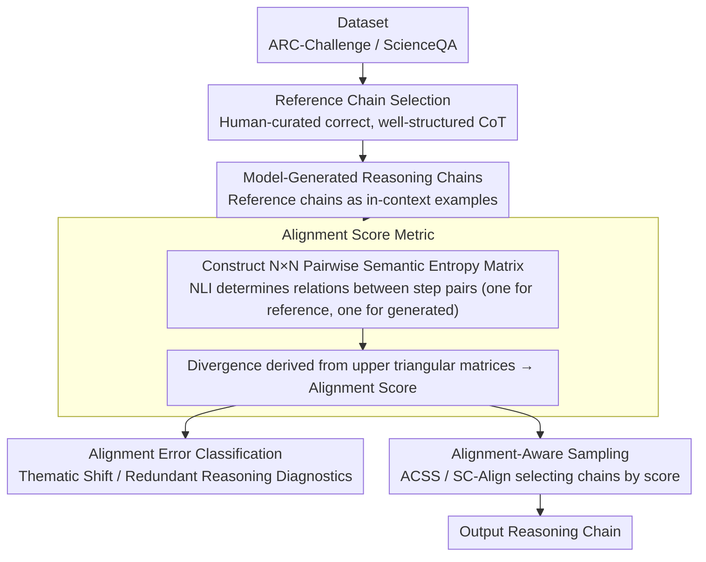

# Chain-of-Thought as a Lens: Evaluating Structured Reasoning Alignment between Human Preferences and Large Language Models

**Conference**: ACL 2026  
**arXiv**: [2511.06168](https://arxiv.org/abs/2511.06168)  
**Code**: [https://github.com/boxuanwang28/CoT-Lens](https://github.com/boxuanwang28/CoT-Lens)  
**Area**: LLM Reasoning  
**Keywords**: Chain-of-Thought Alignment, Alignment Score, Semantic Entropy, Reasoning Quality, Structured Reasoning

## TL;DR

This paper proposes Alignment Score—a semantic-level metric based on a semantic entropy matrix—to quantify reasoning alignment by comparing intermediate steps of model-generated chains-of-thought with human-preferred reference chains. The study finds that Alignment Score is highly correlated with task accuracy, readability, and coherence, identifying 2-hop reasoning as the peak depth for alignment.

## Background & Motivation

**Background**: Chain-of-Thought (CoT) prompting significantly enhances LLM performance on complex reasoning tasks. However, even if the final answer is correct, the quality of reasoning trajectories can vary drastically, often containing semantically incoherent, logically inconsistent, or thematically shifted steps.

**Limitations of Prior Work**: (1) Existing evaluation metrics (e.g., MMLU, ARC) focus only on final answer correctness, ignoring the quality of the reasoning process itself; (2) Multi-step reasoning often exhibits semantic incoherence or thematic shifts, even when the final answer is correct; (3) There is a lack of evaluation metrics that go beyond answer correctness to capture the quality of the reasoning process.

**Key Challenge**: Answer correctness does not equate to reasoning quality, but tools to quantify the degree of alignment between reasoning processes and human-preferred reasoning chains are currently lacking.

**Goal**: (1) Propose a metric to quantify reasoning alignment; (2) Analyze how reasoning depth affects alignment; (3) Verify the correlation between alignment scores, task performance, and reasoning quality.

**Key Insight**: By using CoT as the primary lens, the study utilizes semantic entropy in the latent space to measure the structural divergence between model reasoning chains and reference chains.

**Core Idea**: Quantify reasoning alignment by constructing pairwise semantic entropy matrices of reasoning steps and comparing the divergence between these matrices, thereby capturing consistency in logical structure rather than surface-level text.

## Method

### Overall Architecture

(1) Prepare the dataset and select reference chains (human-curated correct, well-structured CoT explanations); (2) Use reference chains as in-context examples to prompt the model to generate reasoning chains; (3) Use an NLI model to calculate pairwise semantic entropy matrices for both reference and generated chains; (4) Compare the two matrices to obtain the Alignment Score. The resulting score is used for diagnosing alignment errors and is integrated into sampling strategies to identify superior reasoning chains.

### Key Designs

**1. Alignment Score Metric: Quantifying structural alignment between reasoning chains and human reference chains using semantic entropy matrix divergence**

Direct sentence-by-sentence comparison of reasoning text is easily disrupted by variations in expression—the same logic can be written in many ways. This method instead captures the logical relationship structure between steps: for an $N$-step reasoning chain, an NLI model is used to determine the semantic relationship between every pair of steps, constructing an $N \times N$ pairwise semantic entropy matrix. Matrices are calculated for both the reference chain and the generated chain, and the divergence of their upper triangular elements serves as the Alignment Score. A higher score indicates that the generated chain's reasoning style and logical structure are closer to the reference. This metric ignores specific word choices and focuses on "how steps support each other," making it more reflective of intrinsic reasoning quality than surface phrasing.

**2. Alignment Error Classification (Thematic Shift and Redundant Reasoning): Diagnostic failure modes for low scores**

A single score indicates "poor alignment" but does not specify why. The authors categorize alignment errors into two types: Thematic Shift (reasoning steps deviate from the core problem topic) and Redundant Reasoning (repeating existing information without advancing the logical chain). By tracking the frequency of these errors as reasoning depth (hop count) increases, the "score drop" is mapped to specific observable behaviors—providing a mechanistic explanation for the conclusion that "2-hop is the sweet spot, while deeper reasoning is hampered by noise."

**3. Alignment-Aware Sampling (ACSS and SC-Align): Using Alignment Score as a diagnostic signal for chain selection**

If the Alignment Score correlates with reasoning quality, it should help identify better chains under a fixed budget. Two applications are designed: ACSS (Alignment-based Chain Selection Strategy) samples multiple CoTs and directly selects the one with the highest Alignment Score; SC-Align integrates the Alignment Score into a self-consistency framework as a selection criterion alongside voting. This step serves as both an application and a validation—if chains selected by score yield higher accuracy, it proves the metric captures meaningful signals without requiring additional human evaluation.

### Loss & Training

No model training is involved. The Alignment Score calculation utilizes a pre-trained NLI model to extract semantic entropy.

## Key Experimental Results

### Main Results

Evaluations on ARC-Challenge and ScienceQA datasets demonstrate:

- A strong positive correlation exists between Alignment Score and task accuracy.
- Alignment reaches its peak at 2-hop reasoning; beyond 2-hop, it declines due to thematic shifts and redundant reasoning.
- Chains selected via ACSS and SC-Align strategies using Alignment Score outperform random selection in accuracy, readability, and coherence.

### Ablation Study

- Thematic shifts and redundant reasoning are the dominant alignment errors as reasoning depth increases.
- LLM-as-Judge evaluation confirms the Alignment Score's strong correlation with readability and coherence ratings.
- Stronger models (e.g., Qwen2.5-7B) achieve higher overall Alignment Scores than weaker models.

### Key Findings

- Alignment Score serves as an effective proxy for reasoning quality, validated across accuracy, readability, and coherence.
- 2-hop is the "sweet spot" for reasoning alignment—shallower reasoning lacks sufficient information, while deeper reasoning introduces noise.
- Thematic shifts have a more significant negative impact on performance than redundant reasoning.
- Using alignment as a selection criterion improves the quality of reasoning outputs without additional training.

## Highlights & Insights

- The semantic entropy matrix approach is innovative—comparing reasoning structures in latent space rather than surface text.
- Decouples reasoning process quality from answer correctness, filling a significant evaluation gap.
- Error classification (Thematic Shift vs. Redundant Reasoning) provides actionable diagnostic information.
- ACSS and SC-Align demonstrate the practical utility of the metric.

## Limitations & Future Work

- Reference chains require human curation, which limits scalability.
- Calculation of semantic entropy depends on the quality of the NLI model.
- Validation is currently limited to science QA datasets, without extension to mathematical or code reasoning.
- Future work could explore incorporating Alignment Score into training objectives to optimize the reasoning process.

## Related Work & Insights

- Complementary to Self-Consistency (Wang et al., 2023)—where SC focuses on answer consistency, this work focuses on process consistency.
- Provides a new measurement tool for process-level evaluation of CoT reasoning.
- The semantic entropy matrix method can be generalized to other generative tasks requiring evaluation of process quality.

## Rating

- Novelty: ⭐⭐⭐⭐ The semantic entropy matrix for measuring reasoning alignment is a novel methodological contribution.
- Experimental Thoroughness: ⭐⭐⭐⭐ Multi-dimensional validation (accuracy, readability, coherence) is substantial.
- Writing Quality: ⭐⭐⭐⭐ The framework description is clear, and illustrations are intuitive.

<!-- RELATED:START -->

## Related Papers

- [\[ACL 2026\] TrigReason: Trigger-Based Collaboration between Small and Large Reasoning Models](trigreason_trigger-based_collaboration_between_small_and_large_reasoning_models.md)
- [\[ICML 2026\] A Formal Comparison Between Chain of Thought and Latent Thought](../../ICML2026/llm_reasoning/a_formal_comparison_between_chain_of_thought_and_latent_thought.md)
- [\[ACL 2026\] Decoupling the Effect of Chain-of-Thought Reasoning: A Human Label Variation Perspective](decoupling_the_effect_of_chain-of-thought_reasoning_a_human_label_variation_pers.md)
- [\[ACL 2026\] SeLaR: Selective Latent Reasoning in Large Language Models](selar_selective_latent_reasoning_in_large_language_models.md)
- [\[ACL 2026\] Foresight Optimization for Strategic Reasoning in Large Language Models](foresight_optimization_for_strategic_reasoning_in_large_language_models.md)

<!-- RELATED:END -->
