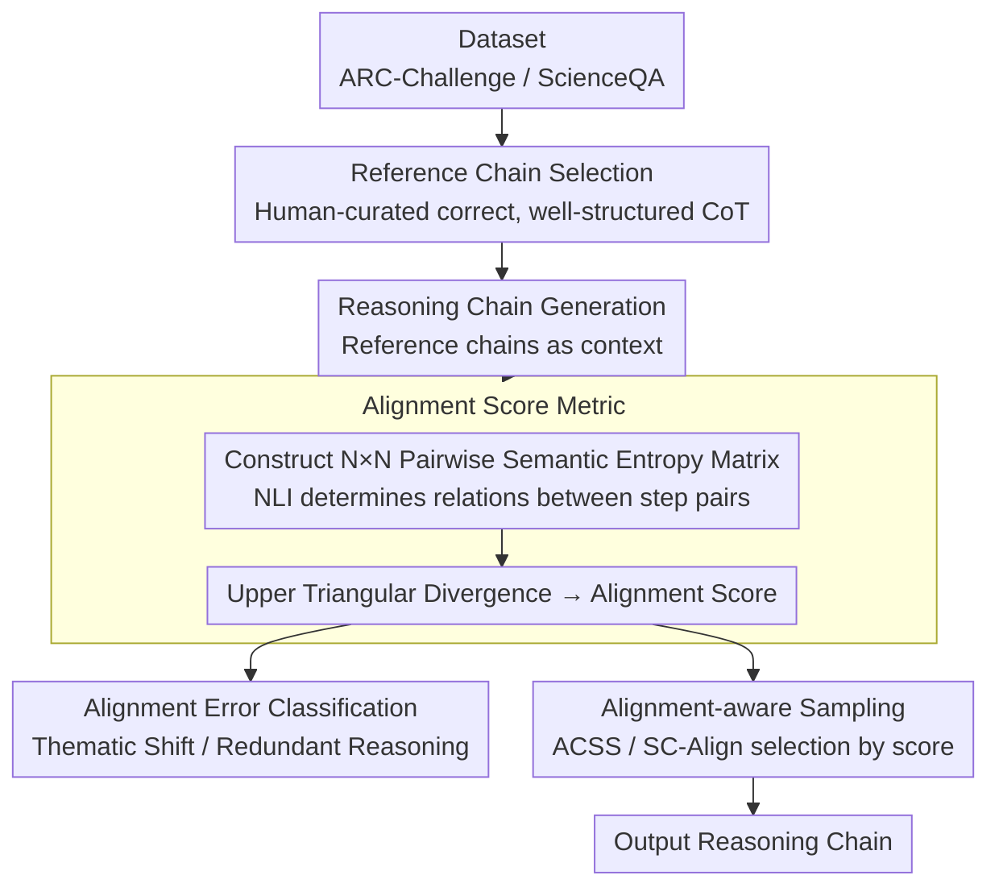

# Chain-of-Thought as a Lens: Evaluating Structured Reasoning Alignment between Human Preferences and Large Language Models

**Conference**: ACL 2026  
**arXiv**: [2511.06168](https://arxiv.org/abs/2511.06168)  
**Code**: [https://github.com/boxuanwang28/CoT-Lens](https://github.com/boxuanwang28/CoT-Lens)  
**Area**: LLM Reasoning  
**Keywords**: CoT Alignment, Alignment Score, Semantic Entropy, Reasoning Quality, Structured Reasoning

## TL;DR

This paper proposes Alignment Score—a semantic-level metric based on a semantic entropy matrix—to quantify reasoning alignment by comparing model-generated Chain-of-Thought (CoT) with human-preferred reference chains. The study finds that Alignment Score is highly correlated with task accuracy, readability, and coherence, identifying 2-hop reasoning as the peak depth for alignment.

## Background & Motivation

**Background**: Chain-of-Thought (CoT) prompting significantly enhances LLM performance on complex reasoning tasks. However, even when the final answer is correct, the quality of reasoning trajectories can vary significantly, often containing semantically incoherent, logically inconsistent, or irrelevant steps.

**Limitations of Prior Work**: (1) Existing evaluation metrics (e.g., MMLU, ARC) focus solely on final answer correctness, ignoring the quality of the reasoning process; (2) Multi-step reasoning often exhibits semantic incoherence or thematic shifts, even if the final result is correct; (3) There is a lack of metrics that go beyond answer correctness to capture the quality of the reasoning process.

**Key Challenge**: Answer correctness does not equate to reasoning quality, but there is currently a lack of tools to quantify the degree of alignment between reasoning processes and human-preferred reasoning chains.

**Goal**: (1) Propose a metric to quantify reasoning alignment; (2) Analyze how reasoning depth affects alignment; (3) Validate the correlation between the alignment score and task performance/reasoning quality.

**Key Insight**: Treat CoT as a primary lens and leverage semantic entropy in the latent space to measure the structural divergence between model reasoning chains and reference chains.

**Core Idea**: Quantify reasoning alignment by constructing pairwise semantic entropy matrices of reasoning steps and comparing the divergence between these matrices, thereby capturing consistency in logical structure rather than surface-level text.

## Method

### Overall Architecture

(1) Prepare the dataset and select reference chains (human-curated correct, well-structured CoT explanations); (2) Use reference chains as in-context examples to prompt the model to generate reasoning chains; (3) Use an NLI model to compute pairwise semantic entropy matrices for both the reference and generated chains; (4) Compare the two matrices to derive the Alignment Score. The resulting score is used both to diagnose alignment errors and to feed into sampling strategies to select superior reasoning chains.

### Key Designs

**1. Alignment Score Metric: Quantifying structural alignment between reasoning chains and human references using semantic entropy matrix divergence**

Direct sentence-by-sentence comparison of reasoning text is often distracted by variations in expression—the same logic can be written in many ways. This method instead captures the structure of logical relationships between steps: for an $N$-step reasoning chain, an NLI model is used to judge the semantic relationship between every pair of steps, constructing an $N \times N$ pairwise semantic entropy matrix. Matrices are computed for both the reference chain and the model-generated chain, and the divergence of the upper triangular elements yields the Alignment Score. A higher score indicates that the generation's reasoning style and logical structure are closer to the reference. This metric reflects the core quality of reasoning rather than surface wording.

**2. Alignment Error Classification (Thematic Shift and Redundant Reasoning): Diagnosing fail modes for low scores**

A single score indicates poor alignment but does not explain why. The authors categorize alignment errors into: Thematic Shift (reasoning steps deviate from the core problem) and Redundant Reasoning (repeating existing information without advancing the logic). By analyzing the frequency of these errors relative to reasoning depth (hop count), the study provides a mechanism for why scores drop—explaining why 2-hop is the "sweet spot" before performance is degraded by noise.

**3. Alignment-aware Sampling (ACSS and SC-Align): Using Alignment Score as a diagnostic signal for chain selection**

If Alignment Score correlates with reasoning quality, it should help identify better chains under a fixed budget. Two strategies are designed: ACSS samples multiple CoTs and selects the one with the highest Alignment Score; SC-Align integrates the score into a self-consistency framework as a selection criterion beyond simple voting. This serves as both an application and validation—if chains selected by the score yield higher accuracy, it proves the metric captures essential quality without requiring additional human evaluation.

### Loss & Training

No model training is involved. Alignment Score calculation utilizes a pre-trained NLI model to extract semantic entropy.

## Key Experimental Results

### Main Results

Validation on ARC-Challenge and ScienceQA datasets shows:

- A strong positive correlation between Alignment Score and task accuracy.
- Alignment peaks at 2-hop reasoning and declines beyond 2-hop due to thematic shifts and redundant reasoning.
- Chains selected via ACSS and SC-Align outperform random selection in terms of accuracy, readability, and coherence.

### Ablation Study

- Thematic shifts and redundant reasoning are the dominant alignment errors as reasoning depth increases.
- LLM-as-Judge evaluation confirms the Alignment Score's strong correlation with readability and coherence ratings.
- Stronger models (e.g., Qwen2.5-7B) generally achieve higher Alignment Scores than weaker models.

### Key Findings

- Alignment Score is an effective proxy for reasoning quality, validated against accuracy, readability, and coherence.
- 2-hop is the "sweet spot" for reasoning alignment—shallower reasoning lacks sufficient information, while deeper reasoning introduces noise.
- Thematic shifts have a more significant negative impact on performance than redundant reasoning.
- Using alignment as a selection criterion improves the quality of reasoning output without additional training.

## Highlights & Insights

- The semantic entropy matrix approach is ingenious—comparing reasoning structures in latent space rather than surface text.
- Decouples reasoning process quality from answer correctness, filling an evaluation gap.
- Error classification (Thematic Shift vs. Redundant Reasoning) provides actionable diagnostic information.
- ACSS and SC-Align demonstrate the practical utility of the metric.

## Limitations & Future Work

- Reference chains require human curation, limiting scalability.
- Computation of semantic entropy depends on the quality of the underlying NLI model.
- Validation is currently limited to scientific QA datasets and has not been extended to mathematics or code reasoning.
- Future work could explore incorporating Alignment Score into training objectives to optimize the reasoning process.

## Related Work & Insights

- Complements Self-Consistency (Wang et al., 2023)—where SC focuses on answer consistency, this work focuses on reasoning process alignment.
- Provides a new measurement tool for the process-level evaluation of CoT reasoning.
- The semantic entropy matrix method could be generalized to other generative tasks requiring process quality evaluation.

## Rating

- **Novelty**: ⭐⭐⭐⭐ Measuring reasoning alignment via semantic entropy matrices is a novel methodological contribution.
- **Experimental Thoroughness**: ⭐⭐⭐⭐ Multi-dimensional validation (accuracy, readability, coherence) is comprehensive.
- **Writing Quality**: ⭐⭐⭐⭐ The framework description is clear and the diagrams are intuitive.

<!-- RELATED:START -->

## Related Papers

- [\[ACL 2026\] TrigReason: Trigger-Based Collaboration between Small and Large Reasoning Models](trigreason_trigger-based_collaboration_between_small_and_large_reasoning_models.md)
- [\[ICML 2026\] A Formal Comparison Between Chain of Thought and Latent Thought](../../ICML2026/llm_reasoning/a_formal_comparison_between_chain_of_thought_and_latent_thought.md)
- [\[ACL 2026\] SeLaR: Selective Latent Reasoning in Large Language Models](selar_selective_latent_reasoning_in_large_language_models.md)
- [\[ACL 2026\] Foresight Optimization for Strategic Reasoning in Large Language Models](foresight_optimization_for_strategic_reasoning_in_large_language_models.md)
- [\[ACL 2026\] Decoupling the Effect of Chain-of-Thought Reasoning: A Human Label Variation Perspective](decoupling_the_effect_of_chain-of-thought_reasoning_a_human_label_variation_pers.md)

<!-- RELATED:END -->
