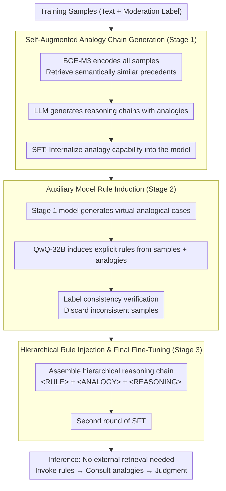

# ChAIRO: Contextual Hierarchical Analogical Induction and Reasoning Optimization for LLMs

**Conference**: ACL 2026  
**arXiv**: [2604.10502](https://arxiv.org/abs/2604.10502)  
**Code**: None  
**Area**: Information Retrieval  
**Keywords**: Content Moderation, Rule Induction, Analogical Reasoning, Hierarchical Chain-of-Thought, End-to-End Optimization

## TL;DR
The authors propose ChAIRO, a framework for contextual hierarchical analogical induction and reasoning optimization. Through a three-stage pipeline (analogical case generation → rule induction → rule-injected fine-tuning), the framework enables LLMs to autonomously generate analogical cases and induce explicit moderation rules for content moderation. It achieves a 4.5% $F1$ improvement over single-instance rule generation and a 2.3% improvement over static RAG.

## Background & Motivation

**Background**: Utilizing LLMs for content moderation has become a promising direction, providing interpretable moderation decisions through reasoning chains. However, even SOTA models frequently fail in scenarios involving contextual ambiguity or ill-defined moderation standards.

**Limitations of Prior Work**: (1) CoT reasoning in content moderation lacks reference to precedents, relying solely on explicit criteria (e.g., presence of insults/incitement). Consequently, it fails to identify implicit discriminatory logic, such as metaphorical discrimination where "low scores equal low ability." (2) Manually defined high-level rules (e.g., "pornography") are too coarse to cover fine-grained nuances. (3) LLM-driven adaptive rule discovery depends on general priors, ignoring domain expertise accumulated by human moderation experts.

**Key Challenge**: There is a need for precise, context-dependent moderation rules to handle ambiguous cases, yet the construction and discovery of these rules are difficult—manual enumeration is impractical, while automated generation lacks sufficient precision.

**Goal**: To utilize analogical cases to improve the quality of rule induction and unify case retrieval, rule generation, and moderation decisions through end-to-end optimization.

**Key Insight**: Unlike CarO (a concurrent work from the same group, arXiv:2604.10504), ChAIRO does not use DPO. Instead, it introduces an explicit rule induction step: an auxiliary reasoning model first induces textual moderation rules from analogical cases, which are then injected into reasoning chains for a second round of fine-tuning.

**Core Idea**: A three-stage hierarchical optimization: (1) Analogy-chain SFT to teach the model to generate analogical cases; (2) Auxiliary model rule induction from these cases; (3) Injection of rules into reasoning chains for a second SFT round, merging "case + rule + reasoning" capabilities.

## Method

### Overall Architecture

ChAIRO addresses two major challenges in content moderation: the lack of precedents for ambiguous cases and the coarseness of manually defined high-level rules. It decomposes the "Analogy $\rightarrow$ Rule $\rightarrow$ Reasoning" capabilities into three sequential training stages for a single model. In the first stage, the model learns to generate relevant analogical cases for any new sample. In the second stage, a stronger auxiliary model induces textual moderation rules from these analogies. In the third stage, the "Rule + Analogy + Reasoning" components are assembled into a hierarchical reasoning chain with special tags for a final SFT round. Post-training, the model can "invoke rules, consult analogies, and then make judgments" during inference without external retrieval.

### Key Designs

**1. Self-Augmented Analogy Chain Generation (Stage 1): Internalizing analogy capabilities from external retrieval**  
Cases retrieved via static RAG are not always the most relevant to the current sample, while pure CoT lacks precedent reference. Stage 1 uses BGE-M3 to encode all training samples and retrieve semantically similar precedents for each. The "sample + retrieved case + label" triplet is fed to an LLM to generate a reasoning chain containing analogies, followed by SFT. Post-training, the model no longer relies on external retrieval; it has internalized the ability to associate new samples with precedents, dynamically generating higher-quality analogies than static retrieval.

**2. Auxiliary Model Rule Induction (Stage 2): Using analogies as context to induce precise explicit rules**  
Rules generated from a single sample rely too heavily on general priors and exhibit unstable quality. Analogical cases provide context by showing what similar precedents look like. This step uses the Stage 1 model to generate virtual analogies for each training sample, then employs QwQ-32B as an auxiliary reasoning model to induce textual moderation rules from the "original sample + analogical cases." Consistency checks ensure the rule's category description aligns with the label, discarding inconsistent samples. This analogy-driven induction yields a $+4.5\%$ $F1$ gain over single-instance rule generation, serving as the core distinction from CarO.

**3. Hierarchical Rule Injection and Final Fine-Tuning (Stage 3): Integrating rules, analogies, and reasoning**  
If rules and analogies are loosely concatenated, the model may not know when to invoke which layer. Stage 3 uses special tokens to explicitly segment the reasoning chain into `<RULE>` (induced rule), `<ANALOGY>` (analogical case), and `<REASONING>` (comprehensive reasoning). A second SFT round is performed on the Stage 1 parameters. This hierarchical format provides a clear division of labor, improving decision consistency and creating an auditable trail where every moderation conclusion can be traced back to specific rules and precedents.

## Key Experimental Results

### Main Results (Chinese Moderation Dataset)

| Method | Avg $F1$ | Politics | Porn | Violence | Gambling | Bias | Harmless |
|------|--------|------|------|------|------|------|------|
| DeepSeek R1 | 77.1 | 72.7 | 91.4 | 86.1 | 94.3 | 64.6 | 59.7 |
| DeepSeek V3 | 80.3 | 79.0 | 90.3 | 89.8 | 95.0 | 70.5 | 62.5 |
| Naive SFT | ~85 | - | - | - | - | - | - |
| Rule-injected SFT (Single-instance) | ~85.7 | - | - | - | - | - | - |
| Static RAG | ~87.9 | - | - | - | - | - | - |
| **ChAIRO (Ours)** | **~90.2** | **Best** | **Best** | **Best** | **Best** | **Best** | **Best** |

### Ablation Study

| Comparison | $F1$ Gain | Description |
|------|--------|------|
| ChAIRO vs. Naive SFT | +5.3% | Value of explicit rules |
| ChAIRO vs. Single-instance Rule SFT | +4.5% | Analogies improve rule quality |
| ChAIRO vs. Static RAG | +2.3% | End-to-end optimization vs. staged pipeline |

### Key Findings
- **Explicit rule injection yields a 5.3% improvement**, proving the critical role of rules in ambiguous moderation cases.
- **Rules driven by analogical cases outperform single-instance rules by 4.5%**, indicating that contextual analogies significantly enhance rule quality.
- **End-to-end optimization outperforms static RAG by 2.3%**, as errors in staged pipelines tend to accumulate.
- **Human evaluation confirms higher rule quality**: Clarity, interpretability, and applicability are superior to baselines.
- **External model generalization**: Rules are transferable to other LLMs.

## Highlights & Insights
- **"Analogy $\rightarrow$ Rule $\rightarrow$ Reasoning" Architecture**: This three-tier cognitive structure simulates human expert decision-making. It adds a layer of explicit knowledge abstraction compared to CarO's "Analogy $\rightarrow$ Reasoning," enhancing interpretability.
- **Hierarchical Reasoning Chain Format**: The `<RULE>+<ANALOGY>+<REASONING>` structure provides structured audit trails, allowing each decision to be traced back to specific rules and cases.
- **Complementarity with CarO**: While CarO uses DPO to strengthen the consistency of analogical reasoning, ChAIRO uses rule induction to improve interpretability. The two approaches could be combined.

## Limitations & Future Work
- Requires an auxiliary reasoning model (QwQ-32B) for rule induction, increasing training costs.
- Rules are textual; formal consistency and absence of contradictions are not guaranteed.
- The two-round SFT process is complex and might benefit from simplification.
- Primary focus is on Chinese data; validation in English and multilingual scenarios is insufficient.
- Lack of a continuous update mechanism for the rule library; new types of violations require retraining.

## Related Work & Insights
- **vs. CarO (2604.10504)**: Concurrent work from the same group. CarO focuses on DPO for reasoning reinforcement, while ChAIRO focuses on explicit rule induction for interpretability.
- **vs. Rule-based Moderation**: Traditional rules are coarse, manual standards. ChAIRO's rules are fine-grained, context-dependent, and automatically induced.
- **vs. Kumar et al. (2024)**: Previous work also explored LLM rule discovery but relied on single-instance contexts. ChAIRO provides a richer induction basis via analogical cases.

## Rating
- Novelty: ⭐⭐⭐⭐ The three-stage framework is well-designed, though highly related to CarO.
- Experimental Thoroughness: ⭐⭐⭐⭐ Multi-dimensional ablation, human evaluation, and external model generalization.
- Writing Quality: ⭐⭐⭐⭐ Clear structure with well-designed RQ-driven experiments.
- Value: ⭐⭐⭐⭐ Explicit rule induction provides practical value for interpretable moderation.

<!-- RELATED:START -->

## Related Papers

- [\[ACL 2026\] Calibration-Aware Policy Optimization for Reasoning LLMs](calibration-aware_policy_optimization_for_reasoning_llms.md)
- [\[ICLR 2026\] THOR: Tool-Integrated Hierarchical Optimization via RL for Mathematical Reasoning](../../ICLR2026/llm_reasoning/thor_tool-integrated_hierarchical_optimization_via_rl_for_mathematical_reasoning.md)
- [\[ICLR 2026\] Emergent Hierarchical Reasoning in LLMs through Reinforcement Learning](../../ICLR2026/llm_reasoning/emergent_hierarchical_reasoning_in_llms_through_reinforcement_learning.md)
- [\[ICLR 2026\] From Abstract to Contextual: What LLMs Still Cannot Do in Mathematics](../../ICLR2026/llm_reasoning/from_abstract_to_contextual_what_llms_still_cannot_do_in_math_word_problem_solvi.md)
- [\[ACL 2026\] Strategy-Induct: Task-Level Strategy Induction for Instruction Generation](strategy-induct_task-level_strategy_induction_for_instruction_generation.md)

<!-- RELATED:END -->
