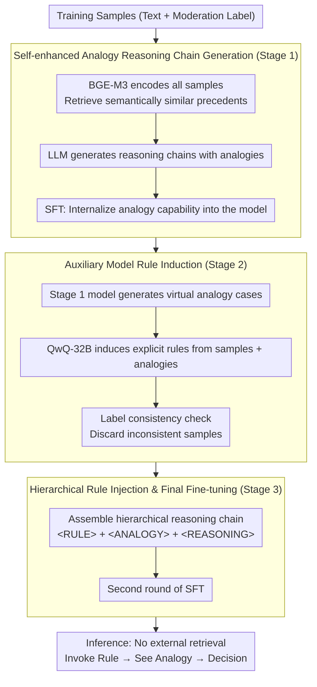

# ChAIRO: Contextual Hierarchical Analogical Induction and Reasoning Optimization for LLMs

**Conference**: ACL 2026  
**arXiv**: [2604.10502](https://arxiv.org/abs/2604.10502)  
**Code**: None  
**Area**: Information Retrieval  
**Keywords**: Content Moderation, Rule Induction, Analogical Reasoning, Hierarchical Reasoning Chain, End-to-End Optimization

## TL;DR
The authors propose ChAIRO, a contextual hierarchical analogical induction and reasoning optimization framework. Through a three-stage pipeline (analogy case generation → rule induction → rule-injected fine-tuning), LLMs autonomously generate analogy cases and induce explicit moderation rules for content moderation. This approach achieves a 4.5% F1 gain over single-instance rule generation and a 2.3% gain over static RAG.

## Background & Motivation

**Background**: Utilizing LLMs for content moderation has become a promising direction, providing interpretable decisions through reasoning chains. However, even SOTA models frequently fail in scenarios with contextual ambiguity or unclear moderation standards.

**Limitations of Prior Work**: (1) CoT reasoning in content moderation lacks reference to precedents, relying solely on explicit criteria (e.g., presence of insults/incitement). It fails to identify implicit discriminatory logic, such as metaphorical discrimination where "low scores equal low ability." (2) Manually defined high-level rules (e.g., "pornography") are too coarse to cover fine-grained nuances. (3) LLM-driven adaptive rule discovery relies on general priors, ignoring domain expertise accumulated by human moderators.

**Key Challenge**: There is a need for precise, context-aware moderation rules to handle ambiguous cases, yet rule construction and discovery are inherently difficult—manual enumeration is impractical, and automatic generation lacks precision.

**Goal**: Leverage analogy cases to enhance the quality of rule induction, unifying case retrieval, rule generation, and moderation decisions through end-to-end optimization.

**Key Insight**: Unlike CarO (arXiv:2604.10504), ChAIRO introduces an explicit rule induction step instead of DPO. An auxiliary reasoning model induces textual moderation rules from analogy cases, which are then injected into the reasoning chain for secondary fine-tuning.

**Core Idea**: A three-stage hierarchical optimization: (1) Analogy chain SFT enables the model to generate its own analogy cases; (2) An auxiliary model induces explicit rules from these cases; (3) Rules are injected into the reasoning chain for a second round of SFT, merging "cases + rules + reasoning."

## Method

### Overall Architecture

ChAIRO addresses two long-standing challenges in content moderation: the lack of precedents for ambiguous cases and the inability of coarse manual rules to cover fine-grained differences. The framework decomposes "Analogy → Rule → Reasoning" into three training stages applied sequentially to the same model. Stage 1 teaches the model to generate relevant analogy cases for any new sample. Stage 2 utilizes a stronger auxiliary model to induce textual moderation rules from these analogies. Stage 3 constructs a hierarchical reasoning chain with special tags (`<RULE> + <ANALOGY> + <REASONING>`) for a second SFT. Upon completion, the model requires no external retrieval during inference; it "retrieves rules, examines analogies, and then makes a judgment."

### Key Designs

**1. Self-enhanced Analogy Reasoning Chain Generation (Stage 1): Internalizing Analogy Capabilities**

Cases retrieved via static RAG are not always the most relevant, and pure CoT lacks precedent reference to identify metaphorical discrimination. Stage 1 uses BGE-M3 to encode all training samples and retrieve semantically similar precedents. "Sample + Retrieved Case + Label" is fed to an LLM to generate reasoning chains containing analogies, followed by SFT. Post-training, the model no longer relies on external retrieval; it internalizes the ability to associate precedents with new samples, dynamically generating more relevant analogies than static retrieval and improving the input quality for subsequent rule induction.

**2. Auxiliary Model Rule Induction (Stage 2): Using Analogies as Context for Precise Rules**

Rules generated from a single sample rely too heavily on general priors and exhibit unstable quality. Analogy cases provide context by showing what "similar precedents" look like. Stage 2 uses the Stage 1 model to generate virtual analogies for training samples. QwQ-32B, acting as an auxiliary reasoning model, induces textual moderation rules from the "Original Sample + Analogy Cases." Induced rules are automatically verified for category description consistency with the label; inconsistent samples are discarded. With analogy-supported context, induced rules are more targeted, yielding a +4.5% F1 gain compared to single-instance rule generation.

**3. Hierarchical Rule Injection & Final Fine-tuning (Stage 3): Unified Structured Capability**

To prevent rules and analogies from being loosely coupled, Stage 3 uses special tokens to split the reasoning chain into three layers: `<RULE>` (induced rule), `<ANALOGY>` (analogy cases), and `<REASONING>` (comprehensive reasoning). A second round of SFT is performed on the Stage 1 parameters. This hierarchical format explicitly partitions when to invoke rules, refer to analogies, or use free reasoning. This improves decision consistency and ensures every moderation conclusion is traceable to specific rules and cases, forming an auditable trail.

## Key Experimental Results

### Main Results (Chinese Moderation Dataset)

| Method | Average F1 | Politics | Pornography | Violence | Gambling | Bias | Harmless |
|------|--------|------|------|------|------|------|------|
| DeepSeek R1 | 77.1 | 72.7 | 91.4 | 86.1 | 94.3 | 64.6 | 59.7 |
| DeepSeek V3 | 80.3 | 79.0 | 90.3 | 89.8 | 95.0 | 70.5 | 62.5 |
| Naive SFT | ~85 | - | - | - | - | - | - |
| Rule-injected SFT (Single-instance) | ~85.7 | - | - | - | - | - | - |
| Static RAG | ~87.9 | - | - | - | - | - | - |
| **ChAIRO (Ours)** | **~90.2** | **Best** | **Best** | **Best** | **Best** | **Best** | **Best** |

### Ablation Study

| Comparison | F1 Gain | Description |
|------|--------|------|
| ChAIRO vs Naive SFT | +5.3% | Value of explicit rules |
| ChAIRO vs Single-instance Rule SFT | +4.5% | Analogies enhance rule quality |
| ChAIRO vs Static RAG | +2.3% | End-to-end optimization vs. stage-wise |

### Key Findings
- **Explicit rule injection yields a 5.3% gain**, proving the critical role of rules in ambiguous scenarios.
- **Analogy-driven rules outperform single-instance rules by 4.5%**, showing that contextual analogies significantly enhance rule quality.
- **End-to-end optimization outperforms static RAG by 2.3%**, as errors in stage-wise pipelines tend to accumulate.
- **Human evaluation confirms higher rule quality**: Clarity, interpretability, and applicability surpass baselines.
- **External model generalization**: Rules transfer effectively to other LLMs.

## Highlights & Insights
- **"Analogy → Rule → Reasoning" architecture** simulates human expert decision-making. By adding an explicit knowledge abstraction layer over CarO's "Analogy → Reasoning," it provides superior interpretability.
- **Hierarchical reasoning chain format** (`<RULE> + <ANALOGY> + <REASONING>`) provides structured audit trails, allowing every decision to be traced back to specific rules and cases.
- **Complementarity with CarO**: While CarO uses DPO to strengthen analogy consistency, ChAIRO uses rule induction to improve interpretability. The two methods can be combined.

## Limitations & Future Work
- Dependency on an auxiliary reasoning model (QwQ-32B) for rule induction increases training costs.
- Rules are textual; formal consistency and a lack of contradictions cannot be strictly guaranteed.
- The two-round SFT process is complex; researchers should explore simplification.
- Validation is primarily on Chinese data; English and multilingual scenarios require further study.
- No mechanism for continuous rule library updates; training is required for new types of violations.

## Related Work & Insights
- **vs CarO (2604.10504)**: Same-group work. CarO uses DPO for analogy reasoning, while ChAIRO introduces explicit rule induction, prioritizing interpretability.
- **vs Rule-based Moderation**: Traditional rules are coarse-grained manual standards; ChAIRO's rules are fine-grained, context-aware rules induced automatically.
- **vs Kumar et al. (2024)**: Previous work explored rule discovery but based it on single-instance contexts. ChAIRO provides a richer induction foundation via analogy cases.

## Rating
- **Novelty**: ⭐⭐⭐⭐ Well-designed three-stage framework, though highly related to CarO.
- **Experimental Thoroughness**: ⭐⭐⭐⭐ Multi-dimensional ablation, human evaluation, and external model generalization.
- **Writing Quality**: ⭐⭐⭐⭐ Clear structure with well-designed RQ-driven experiments.
- **Value**: ⭐⭐⭐⭐ Explicit rule induction offers practical value for interpretable moderation.

<!-- RELATED:START -->

## Related Papers

- [\[ACL 2026\] Calibration-Aware Policy Optimization for Reasoning LLMs](calibration-aware_policy_optimization_for_reasoning_llms.md)
- [\[ICLR 2026\] THOR: Tool-Integrated Hierarchical Optimization via RL for Mathematical Reasoning](../../ICLR2026/llm_reasoning/thor_tool-integrated_hierarchical_optimization_via_rl_for_mathematical_reasoning.md)
- [\[ICLR 2026\] From Abstract to Contextual: What LLMs Still Cannot Do in Mathematics](../../ICLR2026/llm_reasoning/from_abstract_to_contextual_what_llms_still_cannot_do_in_math_word_problem_solvi.md)
- [\[ACL 2026\] Strategy-Induct: Task-Level Strategy Induction for Instruction Generation](strategy-induct_task-level_strategy_induction_for_instruction_generation.md)
- [\[AAAI 2026\] The Curious Case of Analogies: Investigating Analogical Reasoning in Large Language Models](../../AAAI2026/llm_reasoning/the_curious_case_of_analogies_investigating_analogical_reasoning_in_large_langua.md)

<!-- RELATED:END -->
