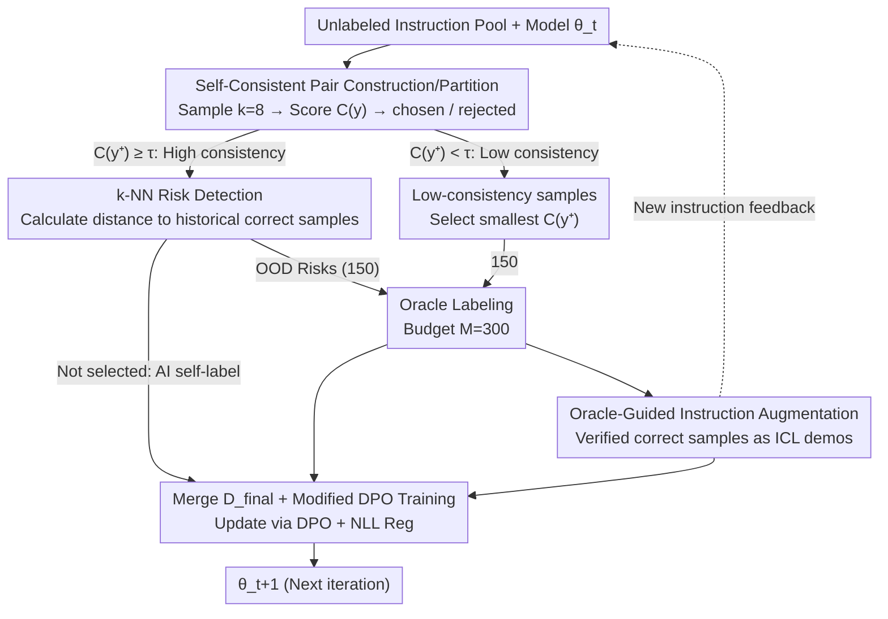

# CoAct: Co-Active LLM Preference Learning with Human-AI Synergy

**Conference**: ACL 2026  
**arXiv**: [2604.17501](https://arxiv.org/abs/2604.17501)  
**Code**: https://github.com/rux001/CoAct (Available)  
**Area**: LLM Alignment / RLHF  
**Keywords**: Preference Learning, Self-Rewarding, Active Learning, Human-AI Synergy, DPO

## TL;DR
CoAct utilizes self-consistency during preference alignment to partition unlabeled samples into "high-consistency" and "low-consistency" sets. It then employs k-NN distance to identify "self-consistent yet potentially incorrect" risky samples from the high-consistency set for Oracle labeling, while the remaining high-consistency samples are treated as AI self-labeled data. Finally, Oracle-verified samples are used as in-context demos to generate new instructions. By integrating human and AI supervision into a single DPO loop, CoAct achieves a 4–8 percentage point improvement over state-of-the-art baselines on GSM8K, MATH, and WebInstruct.

## Background & Motivation

**Background**: Preference alignment (RLHF / DPO and its variants) has become the mainstream method for aligning LLMs with human preferences. However, the high-quality preference pairs required for training have long relied on human labeling, which limits scalability. The academic community has split into two paths: (1) Self-Rewarding / RLAIF — letting the model act as its own judge to generate preference pairs; (2) Active Preference Learning (APO, ActiveDPO, etc.) — selecting the most informative samples for manual labeling under a limited budget.

**Limitations of Prior Work**: Both paths have critical drawbacks. Self-Rewarding treats the model as a judge without external verification, which easily amplifies internal biases into self-bias, causing the model to deviate during training. Conversely, Active Learning relies on an Oracle to guarantee quality, but the budget is tight, and many samples in the unlabeled pool are wasted, resulting in low data utilization.

**Key Challenge**: Under a fixed manual labeling budget, "data scale (Self-Rewarding)" and "data quality (Active Learning)" form a trade-off that few methods have successfully balanced.

**Goal**: (1) Utilize "safe samples" from the unlabeled pool without increasing the Oracle budget; (2) Identify "self-consistent but incorrect" risks within high-consistency samples to avoid bias amplification in Self-Rewarding; (3) Use Oracle feedback not just for labels, but also to guide new instruction generation to enhance data diversity.

**Key Insight**: The authors observe that "it is easy for a model to occasionally answer incorrectly, but much harder to consistently provide the same incorrect answer across multiple independent samplings." Thus, self-consistency can serve as both a reliability proxy for AI self-labeling and a divider between samples the model is "sure about" versus those it is not.

**Core Idea**: Integrate self-rewarding and active learning into a closed loop based on self-consistency signals. High-consistency samples are used for AI self-labeling; low-consistency samples and high-consistency risky samples (detected via k-NN OOD) are sent to the Oracle. Oracle-verified samples then facilitate new instruction generation, and all data are co-trained using a modified DPO objective.

## Method

### Overall Architecture
CoAct is an iterative "human-AI synergistic preference learning" framework. In each iteration $t$, the input consists of the current model $\theta_t$ and a batch $\mathcal{B}_t$ from an unlabeled instruction pool, and the output is the updated model $\theta_{t+1}$. The process follows three steps:

1. **Self-Consistent Preference Pair Construction**: For each instruction $x$, $k=8$ responses are generated via temperature sampling. A consistency score $C(y)$ is calculated based on the relative frequency of extracted answers. The most and least consistent responses are denoted as $y^+$ and $y^-$, respectively. Samples are partitioned into high-consistency $\mathcal{D}_{high}$ and low-consistency $\mathcal{D}_{low}$ using a threshold $\tau$ (4/8 for GSM8K/MATH, 5/8 for WebInstruct).
2. **Oracle Budget Allocation + k-NN Risk Detection**: With a fixed budget $M=300$, $M_{low}=M_{high}=150$ labels are allocated to both sets. In $\mathcal{D}_{low}$, samples with the smallest $C(y^+)$ are selected. In $\mathcal{D}_{high}$, hidden states are compared to historical Oracle-verified correct samples using k-NN distance to identify samples furthest from the in-distribution (viewed as "self-consistent but OOD errors"). These are sent to the Oracle.
3. **Oracle-Guided Instruction Augmentation + Co-training**: Oracle-verified correct samples from $\mathcal{D}_{high}$ serve as ICL demos to generate $N_{new}$ new instructions. Preference pairs are constructed for these new instructions using the same self-consistency process. Finally, Oracle-labeled and AI-labeled data are merged into $\mathcal{D}_{final}^{(t)}$ to update the model using a DPO objective with NLL regularization.

### Key Designs

**1. Self-Consistency Based Preference Construction and Partitioning: Using a single score for both labeling and reliability.**

Self-rewarding methods often use "LLM-as-Judge," which is expensive and introduces self-bias. CoAct uses a statistical proxy: $k$ responses are sampled for each instruction $x$, and the consistency score $C(y)=\frac{1}{k}\sum_m \mathbf{1}\{\text{ans}(y_m)=\text{ans}(y)\}$ is calculated. The most consistent is $y^+$, and the least is $y^-$. This score splits the batch: $C(y^+)\geq\tau$ samples are AI self-labeled, and $C(y^+)<\tau$ are sent to the Oracle. This unifies AI self-labeling and Oracle selection under a single metric.

**2. k-NN Distance-Driven Risk Detection in High-Consistency Samples: Identifying "self-consistent errors" to prevent self-bias amplification.**

Relying solely on consistency misses the most dangerous case: the model being overconfident in a wrong answer. CoAct adds a validation step: the normalized hidden states $\phi(x)/\|\phi(x)\|_2$ of previously Oracle-verified correct samples form the in-distribution set $\mathcal{Z}_{ID}^{(t)}$. For current high-consistency samples, the k-NN distance $r_k(z_i)=\min_{z\in\mathcal{Z}_{ID}^{(t)}}\|z_i-z\|_2$ is calculated. Top-$M_{high}$ samples with the largest distances are treated as OOD and prioritized for human labeling. This effectively applies OOD detection to preference learning, hitting error rates of 82.56% / 87.32% / 84.17% on GSM8K, MATH, and WebInstruct, respectively.

**3. Oracle-Guided Instruction Augmentation + Modified DPO Objective: Using Oracle feedback as a difficulty filter.**

Synthetic data like MetaMath often exceed the base model's solvability, causing training to fail due to noise. CoAct uses Oracle-verified correct samples $\mathcal{D}_{correct}^{(t)}$ as ICL demos to generate $N_{new}$ new instructions. This caps the "difficulty ceiling" within the model's current solvable range. The optimization goal adds an NLL regularization to the standard DPO to prevent the likelihood of the chosen sequence from collapsing during iterations:

$$\mathcal{L}(\theta_t)=-\mathbb{E}\Big[\log\sigma\big(\beta\log\tfrac{\theta_t(y^+|x)}{\theta_0(y^+|x)}-\beta\log\tfrac{\theta_t(y^-|x)}{\theta_0(y^-|x)}\big)-\alpha|y^+|\log\theta_t(y^+|x)\Big]$$

where $\beta=0.5, \alpha=1$. Experiments show that for weaker base models, capping difficulty is more valuable than simply increasing data volume.

### Loss & Training
The final training set $\mathcal{D}_{final}^{(t)}=\mathcal{D}_{oracle}^{(t)}\cup\mathcal{D}_{AI}^{(t)}$ is trained for 10 epochs using the NLL-augmented DPO. Hyperparameters: lr $5\times10^{-6}$, batch size 16, LoRA rank 8 / alpha 16. Sampling temperature is drawn from $\{0.35, 0.4, \ldots, 0.7\}$. Four active learning iterations are performed with a fixed Oracle budget of 300 per round.

## Key Experimental Results

### Main Results
Accuracy (%) at Iteration 4 comparing Llama3-8B and Qwen3-4B against four active learning baselines:

| Dataset (Backbone) | Random | Entropy | Pref Cert. | Pref+Ent | **CoAct**| Gain vs Base |
|--------------------|--------|---------|------------|----------|----------|--------------|
| GSM8K (Llama3-8B)  | 34.57  | 36.56   | 37.28      | 39.41    | **43.58**| +20.05       |
| MATH (Llama3-8B)   | 12.07  | 12.94   | 11.08      | 13.07    | **14.46**| +9.84        |
| WebInstruct (L8B)  | 9.62   | 10.11   | 14.53      | 14.87    | **15.97**| +8.28        |
| GSM8K (Qwen3-4B)   | 93.57  | 94.02   | 94.03      | 94.58    | **94.84**| +6.45        |
| MATH (Qwen3-4B)    | 70.89  | 70.14   | 70.52      | 70.21    | **75.71**| +6.54        |
| WebInstruct (Q4B)  | 44.12  | 47.83   | 51.25      | 52.48    | **53.96**| +18.04       |

Average gains over four rounds: GSM8K +13.25%, MATH +8.19%, WebInstruct +13.16%.

### Ablation Study

| Config (Llama3-8B, iter 4) | GSM8K | MATH | WebInstruct | Description |
|---|---|---|---|---|
| Oracle-only | 36.38 | 11.95 | 13.53 | Oracle data from active selection only |
| +Aug (No Self-label) | 39.85 | 13.34 | 13.89 | Adds Oracle-guided instructions |
| +Self (No Aug) | 41.23 | 12.12 | 15.21 | Adds self-consistent AI labels |
| **Full (Aug + Self)** | **43.58** | **14.46** | **15.97** | Complete CoAct |

### Key Findings
- **k-NN risk detection is crucial for high-consistency samples**: Without it, the "true error" rate hit by the Oracle drops from ~84% to ~70%, increasing self-bias risk.
- **Strong backbones reduce strategy impact**: On Qwen3-4B (GSM8K), the gap between baselines is only 1.27%, while on Llama3-8B, it is 9.01%, suggestng active learning is most valuable when the base model is not saturated.
- **Consistency correlates highly with accuracy**: Pearson coefficients reached 0.95–0.97, proving $C(y)$'s validity as a reliability proxy strengthens with training.
- **OOD Generalization**: CoAct leads on GPQA and MMLU-Pro, indicating Oracle-guided augmentation provides diversity gains beyond in-domain fitting.

## Highlights & Insights
- **Dual-purpose signal**: Self-consistency serves both for internal label construction and external Oracle selection, unifying two pipelines.
- **Elegant k-NN migration**: Successfully applies OOD detection tools to the "high confidence error" problem in preference learning.
- **Oracle's dual role**: Decouples the Oracle into "pair verification" and "anchor instruction generation."
- **GPT-5 as Oracle**: Shows performance comparable to human ground truth, providing empirical support for using strong LLMs as Oracles to reduce costs.

## Limitations & Future Work
- Sampling $k=8$ responses increases training-side inference overhead significantly.
- Evaluation is limited to objective reasoning tasks; applicability to open-ended generation remains unverified.
- Consistency thresholds $\tau$ still require manual tuning per dataset.
- The initial ID set for k-NN is small in round 1, leading to weaker detection capability at the start.

## Related Work & Insights
- **vs Self-Rewarding (Yuan et al. 2024)**: CoAct adds external verification via the Oracle and k-NN to mitigate self-bias.
- **vs Active Preference Learning (Lin et al. 2026)**: CoAct utilizes the unlabeled pool for AI self-labeling rather than wasting it, increasing data efficiency under the same budget.
- **vs SCPO (Prasad et al. 2025)**: SCPO lacks human-AI synergy and cannot handle self-consistent errors, which CoAct addresses via the Oracle path.

## Rating
- Novelty: ⭐⭐⭐⭐ Merging self-rewarding and active learning via self-consistency is clever, though individual components are existing techniques.
- Experimental Thoroughness: ⭐⭐⭐⭐ Comprehensive coverage across backbones, domains, OOD benchmarks, and ablation studies.
- Writing Quality: ⭐⭐⭐⭐ Clear motivation for combining self-consistency and k-NN; good alignment between equations and diagrams.
- Value: ⭐⭐⭐⭐ Provides a practical recipe for reducing annotation costs in the data-constrained era of preference alignment.

<!-- RELATED:START -->

## Related Papers

- [\[ICLR 2026\] Toward Effective Tool-Integrated Reasoning via Self-Evolved Preference Learning](../../ICLR2026/llm_reasoning/toward_effective_tool-integrated_reasoning_via_self-evolved_preference_learning.md)
- [\[ICML 2025\] Ad-Hoc Human-AI Coordination Challenge (AH2AC2)](../../ICML2025/llm_reasoning/ad-hoc_human-ai_coordination_challenge.md)
- [\[ACL 2026\] Budget-Aware Anytime Reasoning with LLM-Synthesized Preference Data](budget-aware_anytime_reasoning_with_llm-synthesized_preference_data.md)
- [\[ACL 2026\] AIM-CoT: Active Information-driven Multimodal Chain-of-Thought for Vision-Language Reasoning](aim-cot_active_information-driven_multimodal_chain-of-thought_for_vision-languag.md)
- [\[ACL 2026\] TemplateRL: Structured Template-Guided Reinforcement Learning for LLM Reasoning](templaterl_structured_template-guided_reinforcement_learning_for_llm_reasoning.md)

<!-- RELATED:END -->
