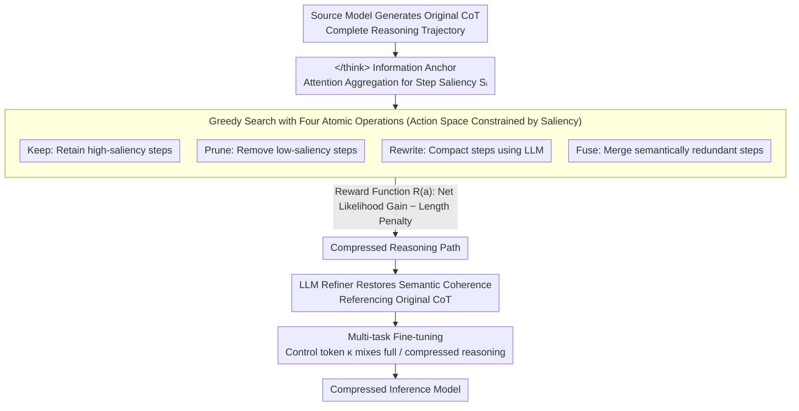

# CRISP: Compressing Redundancy in Chain-of-Thought via Intrinsic Saliency Pruning

**Conference**: ACL 2026 Findings  
**arXiv**: [2604.17297](https://arxiv.org/abs/2604.17297)  
**Code**: [GitHub](https://github.com/)  
**Area**: LLM Reasoning Efficiency  
**Keywords**: Chain-of-Thought Compression, Attention Saliency, Inference Redundancy, Greedy Search, Efficient Inference

## TL;DR

This paper proposes the CRISP framework, discovering that the attention patterns of the `</think>` token can reliably distinguish between critical and redundant steps in a reasoning chain. Based on this, a greedy search compression pipeline with four atomic operations is designed, reducing token usage by 50-60% while maintaining accuracy.

## Background & Motivation

**Background**: Reasoning LLMs (e.g., DeepSeek-R1, OpenAI o1) achieve strong reasoning capabilities by generating long Chain-of-Thought (CoT), but this introduces significant computational overhead and latency. CoT compression has become essential for practical deployment.

**Limitations of Prior Work**: Existing CoT compression methods often rely on external proxy models (such as an independent LLM) to evaluate and prune reasoning steps. However, external compressors are often misaligned with the source model's intrinsic reasoning dynamics—they frequently misidentify critical intermediate steps, such as self-correction, as redundant, thereby breaking the logical coherence of the reasoning chain.

**Key Challenge**: There is a need to identify a signal that distinguishes "critical logical steps" from "redundant steps" without relying on external models (which introduces misalignment), but rather by leveraging the model's own internal mechanisms.

**Goal**: To guide CoT compression using the model's own intrinsic signals instead of external proxies.

**Key Insight**: It is observed that the `</think>` token acts as an "information anchor" in deep attention layers—the model primarily focuses on the `</think>` position rather than intermediate reasoning steps when generating the final answer. The attention distribution of `</think>` accurately reflects the contribution of each reasoning step to the final answer.

**Core Idea**: The framework utilizes the attention patterns of the `</think>` token as an intrinsic indicator of step saliency. It constructs a compressed reasoning path through a greedy search involving four atomic operations (Keep, Prune, Rewrite, Fuse), followed by an LLM refiner to restore grammatical coherence.

## Method

### Overall Architecture

CRISP consists of three stages: (1) Original CoT Generation—obtaining the full reasoning trajectory from the source model; (2) Key Reasoning Path Search—evaluating step saliency using `</think>` attention and compressing the chain via dynamic operators; (3) Refinement and Fine-tuning—restoring semantic coherence with an LLM refiner and fine-tuning the target model with a multi-task objective.

### Key Designs

**1. Discovery of `</think>` as an Information Anchor: Using intrinsic attention as a saliency signal to bypass external proxies**

Existing CoT compression typically relies on an external LLM to judge which steps to delete. However, misalignment between external compressors and source models often leads to the misjudgment of critical steps like self-correction as redundant. CRISP utilizes the source model's own signals: attention visualization shows that in deeper layers, the `</think>` token gradually aggregates information from the entire preceding reasoning chain. When generating the final answer, the model focuses on the `</think>` position rather than the intermediate steps. Thus, step saliency $S_i$ is defined as the normalized sum of attention weights from `</think>` to tokens within step $r_i$ across all layers and heads. This signal is validated—pruning high-attention steps causes PPL to spike, while pruning low-attention steps leaves PPL largely unchanged, indicating it directly reflects what the source model "considers important."

**2. Greedy Search with Four Atomic Operations: Continuous granularity compression guided by saliency instead of a fixed threshold**

Simple threshold filtering is often too coarse, either breaking logical dependencies or leaving redundancies. CRISP defines four atomic operations covering a continuous spectrum from "full retention" to "complete removal": Keep (retain high-saliency steps), Prune (remove low-saliency steps), Rewrite (compact steps via LLM), and Fuse (merge semantically repetitive steps). The action space is dynamic—constrained by saliency scores and semantic similarity between steps. The choice of each candidate operation $a$ is determined by a reward function:

$$R(a) = \log P_\theta(y\,|\,x, \mathcal{C} \oplus a(r_i)) - \log P_\theta(y\,|\,x, \mathcal{C}) - \beta \cdot \text{Len}(a(r_i))$$

The first two terms measure the net gain in the likelihood of the correct answer, while the last term penalizes length, naturally guiding the search toward paths that are shorter without sacrificing accuracy.

**3. Compressed Path Refinement and Multi-task Fine-tuning: Restoring coherence and integrating compression capabilities**

Discrete search (especially Prune and Fuse) can leave grammatical breaks and logical gaps in the skeleton. Training directly on this would introduce noise. CRISP first uses a stronger LLM refiner, referencing the original CoT to restore fluency, before fine-tuning. Fine-tuning employs a multi-task strategy with a control token $\kappa$: inputs with $\kappa$ prompt the model to generate compressed reasoning, while those without generate full reasoning. Training on a mix of both paths enables the model to learn short-chain compression while avoiding catastrophic forgetting of its original reasoning capabilities.

### Loss & Training

A standard autoregressive negative log-likelihood loss is used, training on a mixture of original and compressed trajectories. Training involves 3 epochs with a learning rate of $1 \times 10^{-5}$, based on 2,500 samples from the MATH dataset. Attention thresholds $\tau_{\text{high}}$ and $\tau_{\text{low}}$ are set to the top 30% and bottom 20% quantiles, respectively.

## Key Experimental Results

### Main Results

| Method | Model | GSM8K Acc | GSM8K Tok | MATH-500 Acc | MATH-500 TE |
|------|------|----------|----------|-------------|------------|
| Original | 1.5B | 81.6 | 1669 | 78.2 | 2.22 |
| CRISP | 1.5B | **80.6** | **587** | **75.0** | **4.14** |
| Original | 7B | 90.8 | 1376 | 87.4 | 2.86 |
| CRISP | 7B | **90.1** | **374** | **84.2** | **7.35** |

### Ablation Study

| Method | 1.5B Avg TE | 7B Avg TE | Description |
|------|------------|----------|------|
| Original | 2.10 | 2.81 | Baseline |
| CoD (Prompting) | 2.61 | 4.31 | Insufficient granularity control |
| TALE (Ext. Compression) | 2.31 | 3.15 | External misalignment |
| A*-Thought | 2.99 | 4.04 | Search without intrinsic signals |
| CRISP | **4.31** | **6.80** | Optimal efficiency-accuracy trade-off |

### Key Findings

- CRISP significantly outperforms all baselines in Token Efficiency (TE) (6.80 vs. 4.31 for the second-best on the 7B model).
- On the 7B model, GSM8K uses only 374 tokens (compared to the original 1376), with only a 0.7% drop in accuracy.
- Validation of `</think>` attention is clear: removing high-attention steps leads to a PPL surge, while removing low-attention steps has almost no impact.
- Saliency scores exhibit a non-uniform distribution, indicating only a few steps contribute significantly to the final answer.

## Highlights & Insights

- **The discovery of `</think>` as an information anchor is highly insightful**: It reveals how the intrinsic attention mechanism of reasoning models "summarizes" the entire reasoning process. This finding has independent value for understanding how reasoning models work.
- **The four atomic operations provide flexible compression granularity**: This is finer than simple keep/delete methods; Fuse and Rewrite allow for the preservation of information during compression.
- **Adoption of the Token Efficiency metric**: This allows for a quantifiable comparison of the efficiency-accuracy trade-off.

## Limitations & Future Work

- The computational overhead of greedy search (evaluating multiple operations per step) may become a bottleneck for extremely long CoT.
- The refinement step depends on an external LLM, introducing additional costs.
- Validation was limited to mathematical reasoning datasets; generalization to code and logical reasoning has not been tested.
- The multi-task training strategy with a control token is relatively simple; more advanced training schemes may exist.

## Related Work & Insights

- **vs. CoD/TALE (Prompting/External Compression)**: CoD limits length via prompting but lacks fine-grained control; TALE uses external models for compression but suffers from misalignment. CRISP avoids misalignment by utilizing the model's own attention signals.
- **vs. RL Methods (e.g., Length Penalty)**: RL methods have high computational costs and are sensitive to reward design. CRISP avoids the instability of RL through post-processing compression.

## Rating

- Novelty: ⭐⭐⭐⭐⭐ The discovery of `</think>` as an information anchor is original, and the greedy search design with four operations is sophisticated.
- Experimental Thoroughness: ⭐⭐⭐⭐ Covers two model scales and three benchmarks, though domain coverage is limited.
- Writing Quality: ⭐⭐⭐⭐⭐ Motivation is clear, findings are compelling, and experiments are well-organized.

<!-- RELATED:START -->

## Related Papers

- [\[NeurIPS 2025\] Inference-Time Chain-of-Thought Pruning with Latent Informativeness Signals](../../NeurIPS2025/llm_reasoning/inference-time_chain-of-thought_pruning_with_latent_informativeness_signals.md)
- [\[ACL 2026\] Decoupling the Effect of Chain-of-Thought Reasoning: A Human Label Variation Perspective](decoupling_the_effect_of_chain-of-thought_reasoning_a_human_label_variation_pers.md)
- [\[ACL 2026\] DRP: Distilled Reasoning Pruning with Skill-aware Step Decomposition for Efficient Large Reasoning Models](drp_distilled_reasoning_pruning_with_skill-aware_step_decomposition_for_efficien.md)
- [\[ACL 2026\] Is Chain-of-Thought Really Not Explainability? Chain-of-Thought Can Be Faithful without Hint Verbalization](is_chain-of-thought_really_not_explainability_chain-of-thought_can_be_faithful_w.md)
- [\[ACL 2026\] Render-of-Thought: Rendering Textual Chain-of-Thought as Images for Visual Latent Reasoning](render-of-thought_rendering_textual_chain-of-thought_as_images_for_visual_latent.md)

<!-- RELATED:END -->
