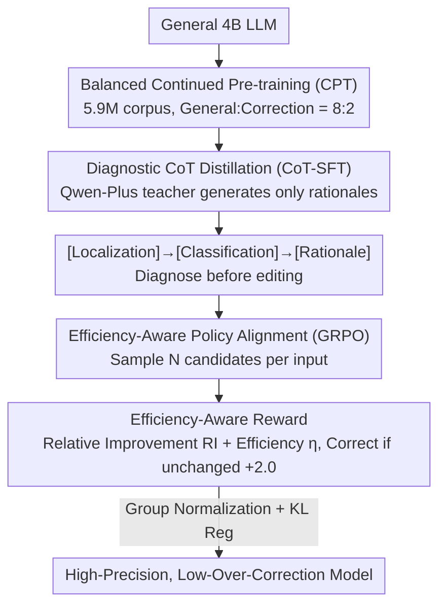

# CSRP: Chain-of-Thought Reasoning for Chinese Text Correction via Reinforcement Learning with Efficiency-Aware Rewards

**Conference**: ACL2026  
**arXiv**: [2606.00020](https://arxiv.org/abs/2606.00020)  
**Code**: https://github.com/TW-NLP/ChineseErrorCorrector  
**Area**: LLM Reasoning / Chinese Text Correction  
**Keywords**: Chinese Grammatical Error Correction (CGEC), Reinforcement Learning, CoT Distillation, Over-correction Suppression, Efficiency-Aware Reward  

## TL;DR
CSRP trains a Chinese text correction model using a three-stage pipeline consisting of CPT, SFT with CoT rationales, and GRPO with Efficiency-Aware Rewards. It achieves $50.99$ $F_{0.5}$ on NACGEC and $59.61$ F1 on CSCD, significantly mitigating the over-correction problem in LLMs through explicit editing efficiency rewards.

## Background & Motivation
**Background**: Chinese text correction encompasses Chinese Grammatical Error Correction (CGEC) and Chinese Spelling Check (CSC). While LLMs possess strong generative capabilities, correction tasks demand adherence to the "minimal edit" principle, ensuring modifications are restricted to actual errors rather than stylistic rewriting.

**Limitations of Prior Work**: General LLMs lack specific priors for learner-specific error distributions, homophones, visually similar characters, and redundancy in function words. Traditional SFT using MLE to learn source-to-target mappings tends to rewrite correct or slightly unconventional sentences into higher-probability expressions, causing systematic over-correction.

**Key Challenge**: A correction model must possess sufficient linguistic knowledge to identify errors while remaining conservative enough to avoid erroneous modifications. Simply scaling models or data improves rewriting capabilities but does not necessarily calibrate the decision boundary of "whether to edit."

**Goal**: The authors aim to train a high-precision, low-over-correction Chinese correction model. The model should internalize Chinese linguistic priors first, then learn to explicitly diagnose errors, and finally optimize editing efficiency via reinforcement learning.

**Key Insight**: Capability building is decomposed into three stages: CPT for knowledge internalization, CoT-SFT for diagnostic transparency, and GRPO + Efficiency-Aware Reward for policy alignment and minimal editing.

**Core Idea**: Use Continued Pre-training to solve "knowing what is wrong," CoT-SFT to solve "why it should be changed," and efficiency-aware rewards to solve "when not to change."

## Method
CSRP is a CPT-SFT-RL three-stage pipeline designed to transform a general 4B LLM into a high-precision Chinese correction model. Compared to SFT-only approaches, CSRP emphasizes two aspects: first, establishing priors for Chinese error distributions and linguistic constraints before correction; second, using reinforcement learning rewards that penalize unnecessary edits in addition to measuring similarity to the ground truth.

### Overall Architecture
Phase I performs Balanced Continued Pre-training using 5.9M samples, mixing general data and correction-related data in an 8:2 ratio. Phase II utilizes Qwen-Plus as a teacher to distill structural rationales between fixed source and gold targets in the format of [Localization] → [Classification] → [Rationale], requiring student models to diagnose errors before outputting corrections. Phase III runs GRPO on held-out RL data, introducing Efficiency-Aware Reward to bias the model toward "minimal yet accurate" edits. These stages sequentially address "knowing what is wrong," "why to change," and "when not to change," with each stage's output serving as the initial policy for the next.

### Key Designs

**1. Balanced Continued Pre-training: Feeding linguistic norms and error distributions into parameters first.**

Direct SFT fails because general 4B models lack priors for non-standard Chinese errors—homophones, visually similar characters, function word redundancy, and learner-specific patterns. Stage I addresses this by aggregating raw corpora from sources like wiki-zh-25, wiki-zh-23, cci2, and lang8+HSK. After MinHash deduplication and heuristic filtering, 5,901,700 high-quality samples are used, mixing approximately 4.72M general samples with 1.18M correction samples (8:2 ratio). This maintains general linguistic ability while providing the model with statistical intuition regarding error distributions.

**2. Rationale-Augmented SFT: Diagnosing before editing instead of treating correction as black-box translation.**

Standard SFT treats correction as one-pass translation, where the model only learns to map one sentence to another without "why" constraints, leading to over-correction of correct sentences. CSRP adopts diagnostic CoT: Qwen-Plus acts as a teacher generating intermediate rationales between source and gold target. The format [Localization] → [Classification] → [Rationale] is enforced within `<think>...</think>` structures. The student learns to "locate the error, categorize it, and explain the edit" before outputting the correction. Restricting the teacher to rationales rather than corrections prevents direct contamination from the teacher's own over-correction tendencies. Human evaluation of 1,000 random rationales showed 95.2% were linguistically faithful (Cohen's $\kappa=0.81$).

**3. Efficiency-Aware Policy Alignment: Calibrating the "to-edit-or-not" boundary via RL.**

CSRP redefines over-correction as a policy alignment problem. Since the GEC metric $F_{0.5}$ favors precision, rewards cannot solely rely on similarity to gold targets. The GRPO stage introduces Relative Improvement $RI=\frac{d(S,G)-d(P,G)}{d(S,G)+\epsilon}$, measuring how much closer the prediction $P$ is to gold $G$ compared to source $S$, and Editing Efficiency $\eta=\frac{d(S,G)-d(P,G)}{d(S,P)+\epsilon}$, measuring the "cost-effectiveness" of each edit, where $d$ is Levenshtein distance. Rewards favor efficient edits and penalize invalid edits or null outputs. Crucially, if the original sentence is correct, staying unchanged yields $+2.0$, while any modification yields $-2.0$, explicitly making "doing nothing" a high-reward choice when appropriate.

### Loss & Training
CPT uses the standard negative log-likelihood $\mathcal{L}_{CPT}(\theta)=-\mathbb{E}_{x\sim\mathcal{D}_{CPT}}[\sum_t \log P_{\theta}(x_t|x_{<t})]$. SFT uses autoregressive cross-entropy $\mathcal{L}_{SFT}$ on the concatenated rationale and correction. The RL stage employs GRPO, sampling $N$ candidates per input to optimize $\log \pi_{\theta}(P_i|S)$ via group-normalized rewards and KL regularization against the SFT reference policy.

In terms of data, a total of 336K filtered correction samples are used, with 269K for SFT and 67K held out for RL. Evaluation is conducted on NACGEC (5.8K) and CSCD-test (5.0K).

## Key Experimental Results

### Main Results

| Model | NACGEC P | NACGEC R | NACGEC $F_{0.5}$ | Description |
|------|----------|----------|------------------|------|
| BART | 34.67 | 41.88 | 35.91 | seq2seq baseline |
| HW-CGEC | 50.95 | 32.29 | 45.26 | Strong specialized system |
| ScholarGEC 14B | 45.08 | 59.33 | 47.35 | Large model, high recall |
| CEC3 4B | 54.20 | 34.75 | 48.74 | Previous 4B SOTA |
| Ours (CSRP 4B) | 57.17 | 35.60 | 50.99 | This method |

Ours improves over CEC3 by $+2.25$ $F_{0.5}$ and over ScholarGEC 14B by $+3.64$, despite having less than one-third of the parameters. Its precision (57.17) is the highest in the main table, proving the model is more conservative and less prone to erroneous edits.

| Model | CSCD F1 | Description |
|------|---------|------|
| BERT | 25.49 | Basic PLM |
| SoftMask | 44.48 | Specialized CSC model |
| SMBERT | 44.67 | Specialized CSC model |
| MDCSpell+ARM | 48.93 | Strong discriminative baseline |
| PGT (BERT) | 48.57 | BERT-based method |
| GPT-4 | 54.41 | General LLM |
| Ours (CSRP 4B) | 59.61 | This method |

Ours outperforms GPT-4 by $+5.20$ F1 and MDCSpell+ARM by $+10.68$ F1 on CSCD, demonstrating that correction-oriented curriculum and RL alignment are more effective than simple general-purpose scale.

### Ablation Study

| Configuration | NACGEC P | NACGEC R | NACGEC $F_{0.5}$ | CSCD F1 | Explanation |
|------|----------|----------|------------------|---------|------|
| SFT only | 42.13 | 34.02 | 40.21 | 49.71 | Simple merged supervised data |
| SFT + GRPO, w/o CPT | 50.54 | 33.75 | 45.97 | 52.96 | RL improves precision independently |
| CPT + SFT, no CoT | 44.90 | 35.50 | 42.64 | 52.01 | No diagnostic rationale |
| CPT + SFT | 48.73 | 35.80 | 45.45 | 56.28 | Added CoT rationale |
| CPT + SFT, w/ RL data | 52.20 | 36.00 | 47.21 | 57.92 | Equal data volume SFT control |
| Full CSRP | 57.17 | 35.60 | 50.99 | 59.61 | Complete CPT-SFT-RL |

### Key Findings
- CPT cannot be replaced by simply merging supervised data. Moving from SFT-only to CPT+SFT increases $F_{0.5}$ from 40.21 to 45.45 and CSCD F1 from 49.71 to 56.28.
- CoT rationale is significantly beneficial. Transitioning from CPT+SFT (no CoT) to CPT+SFT brings $+2.81$ $F_{0.5}$ and $+4.27$ CSCD F1.
- The role of RL is primarily to improve precision rather than blindly reducing all edits. CPT+SFT to Full CSRP shows precision $+8.44$ on NACGEC with only $-0.20$ recall ($+5.54$ $F_{0.5}$); CSCD shows precision $+7.37$ and F1 $+3.33$.
- GRPO and CPT contributions are orthogonal. The $F_{0.5}$ of SFT+GRPO (w/o CPT) is 45.97, close to CPT+SFT's 45.45, but still 5.02 lower than Full CSRP, meaning both "knowing what is wrong" and "when to edit" are essential.

## Highlights & Insights
- The strongest insight of the paper is decomposing Chinese correction into knowledge, diagnosis, and policy. While most works focus on SFT, CSRP identifies over-correction as a policy alignment problem.
- Efficiency-Aware Reward is perfectly suited for GEC. Instead of just rewarding proximity to gold targets, it combines edit distance and improvement magnitude to explicitly encourage "surgical" modifications.
- The use of Teacher CoT is restrained. Qwen-Plus does not serve as a direct corrector but generates explanations for the source-gold gap, reducing the direct transfer of the teacher's over-correction habits to the student.
- Experiments clearly distinguish between gains from data volume and gains from RL. Full CSRP outperforms the equal-data SFT control by $+3.78$ $F_{0.5}$, proving benefits beyond just exposure to more data.

## Limitations & Future Work
- CoT rationale depends on a Qwen-Plus teacher. Despite filtering and verification, teacher explanation biases may propagate.
- GRPO training cost is high due to multiple candidate sampling. The paper notes that reducing $N$ from 8 to 4 halves sampling costs with a marginal $F_{0.5}$ drop (50.99 to 50.61).
- Current validation focuses on sentence-level correction; document-level correction, interactive refinement, and cross-lingual transfer remain for future work.
- Low recall remains a point of discussion. CSRP is intentionally conservative to favor precision and $F_{0.5}$. For applications like educational feedback requiring high recall, adjustable editing intensity may be needed.

## Related Work & Insights
- **vs. BERT/SoftMask/SMBERT**: Early CSC methods relied on local characters and discriminative modeling. CSRP leverages LLM generation and curriculum learning for stronger contextual correction.
- **vs. ScholarGEC**: ScholarGEC 14B has high recall but lower precision than CSRP. CSRP aligns better with the precision-focused $F_{0.5}$ metric in NACGEC.
- **vs. GPT-4 prompting**: While GPT-4 has strong general capabilities, it lacks specialized minimal-edit alignment, scoring 5.20 F1 lower than CSRP on CSCD.
- **Related Work & Insights**: RL rewards for text correction should not just simulate final scores; they must explicitly incorporate editing efficiency, preservation of original text, and over-correction penalties.

## Rating
- Novelty: ⭐⭐⭐⭐ While CPT, CoT-SFT, and GRPO are existing components, the Efficiency-Aware Reward is highly tailored to the specific challenges of Chinese text correction.
- Experimental Thoroughness: ⭐⭐⭐⭐⭐ Comprehensive coverage includes main results, CSCD, stage-wise ablation, precision-recall analysis, and validation of teacher rationales.
- Writing Quality: ⭐⭐⭐⭐ Clear motivation and detailed experimental explanations, though the complexity of the reward formulas and stage relationships requires careful reading.
- Value: ⭐⭐⭐⭐⭐ High practical value for deployment, especially in educational and writing assistance systems requiring low false-positive rates and high precision.

<!-- RELATED:START -->

## Related Papers

- [\[ACL 2026\] HISR: Hindsight Information Modulated Segmental Process Rewards for Multi-turn Agentic Reinforcement Learning](hisr_hindsight_information_modulated_segmental_process_rewards_for_multi-turn_ag.md)
- [\[NeurIPS 2025\] SQL-of-Thought: Multi-agentic Text-to-SQL with Guided Error Correction](../../NeurIPS2025/llm_reasoning/sql-of-thought_multi-agentic_text-to-sql_with_guided_error_correction.md)
- [\[ACL 2026\] TemplateRL: Structured Template-Guided Reinforcement Learning for LLM Reasoning](templaterl_structured_template-guided_reinforcement_learning_for_llm_reasoning.md)
- [\[NeurIPS 2025\] SRPO: Enhancing Multimodal LLM Reasoning via Reflection-Aware Reinforcement Learning](../../NeurIPS2025/llm_reasoning/srpo_enhancing_multimodal_llm_reasoning_via_reflection-aware_reinforcement_learn.md)
- [\[ICLR 2026\] Uni-CoT: Towards Unified Chain-of-Thought Reasoning Across Text and Vision](../../ICLR2026/llm_reasoning/uni-cot_towards_unified_chain-of-thought_reasoning_across_text_and_vision.md)

<!-- RELATED:END -->
