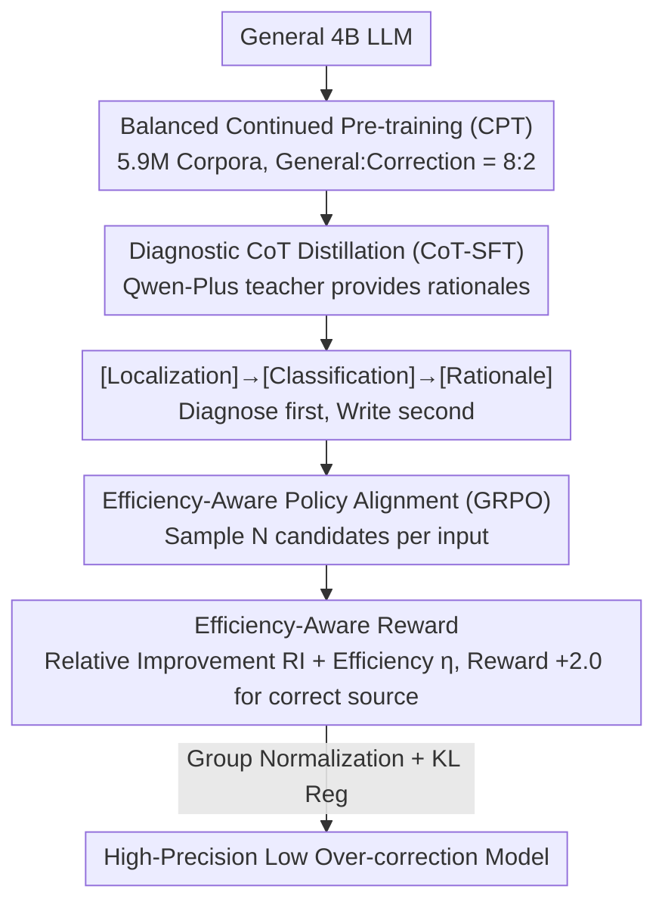

# CSRP: Chain-of-Thought Reasoning for Chinese Text Correction via Reinforcement Learning with Efficiency-Aware Rewards

**Conference**: ACL2026  
**arXiv**: [2606.00020](https://arxiv.org/abs/2606.00020)  
**Code**: https://github.com/TW-NLP/ChineseErrorCorrector  
**Area**: LLM Reasoning / Chinese Text Correction  
**Keywords**: Chinese Grammar Error Correction, Reinforcement Learning, CoT Distillation, Over-correction Suppression, Efficiency-Aware Reward  

## TL;DR
CSRP employs a three-stage training pipeline—CPT, SFT with CoT rationales, and GRPO with Efficiency-Aware Rewards—to train a Chinese text correction model. It achieves 50.99 $F_{0.5}$ on NACGEC and 59.61 F1 on CSCD, significantly mitigating over-correction issues in LLM-based correction through explicit rewards for editing efficiency.

## Background & Motivation
**Background**: Chinese text correction encompasses both Chinese Grammar Error Correction (CGEC) and Chinese Spelling Check (CSC). While LLMs possess robust generation capabilities, correction tasks require not only fluent rewriting but also adherence to the "minimal edit" principle, ensuring changes are made only where errors truly exist.

**Limitations of Prior Work**: General LLMs lack specific priors for learner error distributions, homophones/visually similar characters, and function word redundancies. Traditional SFT using MLE learns the mapping from source to target but tends to rewrite correct or slightly atypical sentences into higher-probability expressions, leading to systemic over-correction.

**Key Challenge**: The correction model must possess sufficient linguistic knowledge to identify errors while remaining conservative enough to avoid erroneous modifications. Simply scaling models or data improves rewriting capabilities but does not necessarily calibrate the decision boundary for "whether to edit."

**Goal**: The authors aim to train a high-precision Chinese correction model with low over-correction. This involves internalizing Chinese linguistic priors, learning explicit error diagnosis, and optimizing editing efficiency via reinforcement learning.

**Key Insight**: The capability construction is decomposed into three stages: CPT for knowledge internalization, CoT-SFT for diagnostic transparency, and GRPO with Efficiency-Aware Reward for policy alignment and minimal editing.

**Core Idea**: Utilize continued pre-training to address "understanding what is wrong," CoT-SFT to address "why to change," and efficiency-aware rewards to address "when not to change."

## Method
CSRP is a three-stage CPT-SFT-RL pipeline designed to transform a general 4B LLM into a high-precision Chinese correction model. Compared to standard SFT, CSRP emphasizes two additional aspects: first, establishing priors for Chinese error distributions and linguistic constraints before correction; second, using RL rewards that penalize unnecessary edits rather than just measuring similarity to the ground truth.

### Overall Architecture
Phase I involves Balanced Continued Pre-training using 5.9M samples, mixing general data and correction-related data at an 8:2 ratio. Phase II utilizes Qwen-Plus as a teacher to distill structured rationales between fixed source and gold targets in the format [Localization] → [Classification] → [Rationale], forcing the student model to diagnose errors before generating corrections. Phase III runs GRPO on held-out RL data, introducing Efficiency-Aware Reward to prefer "accurate yet minimal" edits. These stages sequentially answer "what is wrong," "why to change," and "when not to change," with each stage's output serving as the initial policy for the next.

### Key Designs

**1. Balanced Continued Pre-training: Internalizing Chinese Norms and Error Distributions**

The dilemma of direct SFT is that a general 4B model has minimal priors for non-standard Chinese errors—homophones, visually similar characters, redundant function words, or learner-specific patterns. Stage I addresses this by aggregating raw corpora from wiki-zh, cci2, and lang8+HSK. After MinHash deduplication and heuristic filtering, 5.9M high-quality samples remain. Training uses an 8:2 mix of general and correction-related samples to preserve general linguistic capability while providing the model with a statistical intuition for "what is wrong and how it deviates."

**2. Rationale-Augmented SFT: Transparent Diagnosis Before Execution**

Standard SFT treats correction as one-pass translation, where the model learns to change one sentence into another without constraints, often leading to over-smooth rewriting of correct sentences. CSRP adopts diagnostic CoT: Qwen-Plus acts as a teacher to generate intermediate rationales between source and gold target sentences in the format [Localization] → [Classification] → [Rationale], structured within `<think>...</think>` tags. This forces the student to "locate the error, categorize it, and explain the change" before outputting the result. Using the teacher for rationales rather than direct corrections prevents the teacher's own over-correction bias from polluting the student.

**3. Efficiency-Aware Policy Alignment: Calibrating the Decision Boundary via Reinforcement Learning**

CSRP reframes over-correction as a policy alignment problem. Since the $F_{0.5}$ metric prioritizes precision, rewards should not solely rely on ground-truth similarity. In the GRPO stage, two explicit metrics are introduced: Relative Improvement $RI=\frac{d(S,G)-d(P,G)}{d(S,G)+\epsilon}$ (how much closer the prediction $P$ is to gold $G$ compared to source $S$) and Efficiency Ratio $\eta=\frac{d(S,G)-d(P,G)}{d(S,P)+\epsilon}$ (the "cost-performance" of edits), where $d$ is Levenshtein distance. The reward favors efficient edits and penalizes invalid ones. Crucially, if the original sentence is correct, staying unchanged yields +2.0, while any modification yields -2.0, explicitly rewarding the model for "doing nothing."

### Loss & Training
CPT uses a standard Negative Log-Likelihood loss $\mathcal{L}_{CPT}(\theta)=-\mathbb{E}_{x\sim\mathcal{D}_{CPT}}[\sum_t \log P_{\theta}(x_t|x_{<t})]$. SFT utilizes autoregressive cross-entropy $\mathcal{L}_{SFT}$ on the concatenated rationale and correction. The RL stage employs GRPO, sampling $N$ candidates per input, optimizing $\log \pi_{\theta}(P_i|S)$ through group-normalized rewards and KL regularization against the SFT reference policy.

The data consists of 336K filtered correction samples, with 269K for SFT and 67K for RL. Evaluation is conducted on NACGEC (5.8K) and CSCD-test (5.0K).

## Key Experimental Results

### Main Results

| Model | NACGEC P | NACGEC R | NACGEC $F_{0.5}$ | Description |
|------|----------|----------|------------------|------|
| BART | 34.67 | 41.88 | 35.91 | seq2seq baseline |
| HW-CGEC | 50.95 | 32.29 | 45.26 | Strong specialized system |
| ScholarGEC 14B | 45.08 | 59.33 | 47.35 | Large model, high recall |
| CEC3 4B | 54.20 | 34.75 | 48.74 | Prev. 4B SOTA |
| CSRP 4B | 57.17 | 35.60 | 50.99 | Ours |

CSRP improves by +2.25 $F_{0.5}$ over CEC3 and +3.64 over ScholarGEC 14B, despite having fewer than one-third of the parameters. Its precision (57.17) is the highest, indicating a more conservative and accurate model.

| Model | CSCD F1 | Description |
|------|---------|------|
| BERT | 25.49 | Basic PLM |
| SoftMask | 44.48 | Specialized CSC model |
| SMBERT | 44.67 | Specialized CSC model |
| MDCSpell+ARM | 48.93 | Strong discriminative baseline |
| PGT (BERT) | 48.57 | BERT-based method |
| GPT-4 | 54.41 | General LLM |
| CSRP 4B | 59.61 | Ours |

CSRP outperforms GPT-4 by +5.20 F1 and MDCSpell+ARM by +10.68 F1, demonstrating that correction-oriented curriculum and RL alignment are more effective than general scale.

### Ablation Study

| Configuration | NACGEC P | NACGEC R | NACGEC $F_{0.5}$ | CSCD F1 | Explanation |
|------|----------|----------|------------------|---------|------|
| SFT only | 42.13 | 34.02 | 40.21 | 49.71 | Simple supervised data merge |
| SFT + GRPO, w/o CPT | 50.54 | 33.75 | 45.97 | 52.96 | RL improves precision independently |
| CPT + SFT, no CoT | 44.90 | 35.50 | 42.64 | 52.01 | No diagnostic rationale |
| CPT + SFT | 48.73 | 35.80 | 45.45 | 56.28 | Added CoT rationale |
| CPT + SFT, w/ RL data | 52.20 | 36.00 | 47.21 | 57.92 | SFT comparison with equal data |
| Full CSRP | 57.17 | 35.60 | 50.99 | 59.61 | Full CPT-SFT-RL |

### Key Findings
- CPT cannot be replaced by simply merging supervised data. Moving from SFT-only to CPT+SFT increases $F_{0.5}$ from 40.21 to 45.45 and CSCD F1 from 49.71 to 56.28.
- CoT rationale is significantly beneficial. CPT+SFT (no CoT) to CPT+SFT yields +2.81 $F_{0.5}$ and +4.27 CSCD F1.
- The primary role of RL is boosting precision rather than reducing all edits. CPT+SFT to Full CSRP shows a precision gain of +8.44 in NACGEC with a recall drop of only -0.20.
- GRPO and CPT contributions are orthogonal. SFT+GRPO (w/o CPT) achieves 45.97 $F_{0.5}$, which is 5.02 points lower than Full CSRP, indicating both "what is wrong" and "when to change" are essential.

## Highlights & Insights
- The strongest insight is decomposing Chinese correction into knowledge, diagnosis, and policy. While many works focus solely on SFT, CSRP identifies over-correction as a policy alignment problem.
- The Efficiency-Aware Reward is highly tailored for GEC. Instead of just rewarding ground-truth similarity, it links edit distance with improvement magnitude to encourage "surgical" modifications.
- The use of the Teacher CoT is restrained. Qwen-Plus provides rationales between source and gold targets rather than the corrections themselves, minimizing the direct transfer of the teacher's potential over-correction bias.
- The experiments clearly differentiate between data-volume gains and RL gains. Full CSRP outperforms CPT+SFT (w/ RL data) by +3.78 $F_{0.5}$ using equivalent data, proving the mechanism matters.

## Limitations & Future Work
- CoT rationales depend on a teacher model (Qwen-Plus). Despite filtering, teacher diagnostic biases may persist.
- GRPO is computationally expensive due to multi-candidate sampling. The paper notes that reducing $N=8$ to $N=4$ halves sampling costs with a minimal $F_{0.5}$ drop (50.99 to 50.61).
- Current validation is at the sentence level; future work should explore document-level correction and interactive refinement.
- Low recall remains a topic for discussion. CSRP prioritizes precision (conservatism), but scenarios like educational grading might require adjustable edit aggressiveness.

## Related Work & Insights
- **vs BERT/SoftMask/SMBERT**: Early CSC methods relied on local character discriminate modeling. CSRP leverages generative LLMs and curriculum learning for stronger contextual correction.
- **vs ScholarGEC**: ScholarGEC 14B has higher recall but lower precision than CSRP; CSRP better fits the precision-focused $F_{0.5}$ metric in NACGEC.
- **vs GPT-4 prompting**: GPT-4 lacks specialized minimal-edit alignment, scoring 5.20 F1 lower than CSRP on CSCD.
- **Inspiration**: RL rewards for text correction should not just simulate final sores but explicitly incorporate edit efficiency and over-correction penalties.

## Rating
- Novelty: ⭐⭐⭐⭐ CPT, CoT-SFT, and GRPO are existing components, but the Efficiency-Aware Reward is uniquely suited for the Chinese correction problem.
- Experimental Thoroughness: ⭐⭐⭐⭐⭐ Comprehensive results across NACGEC, CSCD, stage-wise ablations, and precision-recall analysis.
- Writing Quality: ⭐⭐⭐⭐ Clear motivation and explanation, though the reward formulas and stage relationships require careful reading.
- Value: ⭐⭐⭐⭐⭐ Highly applicable for real-world Chinese correction systems requiring low over-correction and high precision.

<!-- RELATED:START -->

## Related Papers

- [\[ACL 2026\] HISR: Hindsight Information Modulated Segmental Process Rewards for Multi-turn Agentic Reinforcement Learning](hisr_hindsight_information_modulated_segmental_process_rewards_for_multi-turn_ag.md)
- [\[NeurIPS 2025\] SQL-of-Thought: Multi-agentic Text-to-SQL with Guided Error Correction](../../NeurIPS2025/llm_reasoning/sql-of-thought_multi-agentic_text-to-sql_with_guided_error_correction.md)
- [\[ACL 2026\] TemplateRL: Structured Template-Guided Reinforcement Learning for LLM Reasoning](templaterl_structured_template-guided_reinforcement_learning_for_llm_reasoning.md)
- [\[NeurIPS 2025\] SRPO: Enhancing Multimodal LLM Reasoning via Reflection-Aware Reinforcement Learning](../../NeurIPS2025/llm_reasoning/srpo_enhancing_multimodal_llm_reasoning_via_reflection-aware_reinforcement_learn.md)
- [\[ACL 2026\] Revisiting Entropy in Reinforcement Learning for Large Reasoning Models](revisiting_entropy_in_reinforcement_learning_for_large_reasoning_models.md)

<!-- RELATED:END -->
