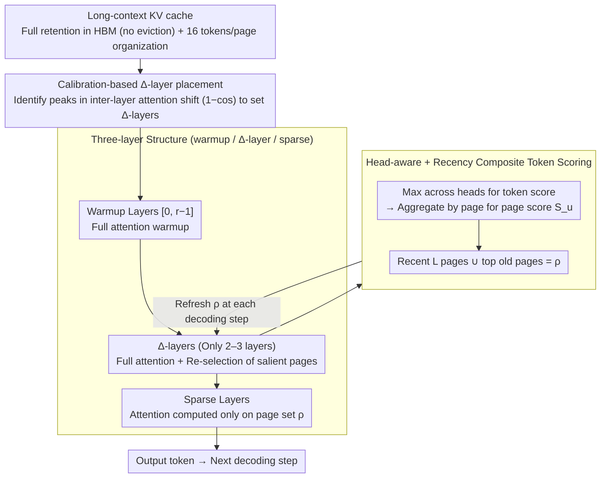

# DELTA: Dynamic Layer-Aware Token Attention for Efficient Long-Context Reasoning

**Conference**: ACL 2026 Findings  
**arXiv**: [2510.09883](https://arxiv.org/abs/2510.09883)  
**Code**: https://github.com/hoenza/DELTA (Available)  
**Area**: LLM Inference / Long Context / Efficient Inference  
**Keywords**: Sparse attention, KV cache, reasoning, Δ-layer, page-based selection

## TL;DR
DELTA is a **training-free hierarchical sparse attention** mechanism. It categorizes Transformer layers into three groups: "initial full attention layers + a few Δ-layers for re-selecting salient pages + subsequent sparse attention layers." It achieves comparable or superior accuracy to full attention on AIME / GPQA-Diamond, while reducing the number of attended tokens by $4.25\times$ and achieving a $1.54\times$ end-to-end inference speedup.

## Background & Motivation
**Background**: Large Reasoning Models (LRMs) such as DeepSeek-R1 / o3 / Qwen3 / GPT-OSS achieve high scores on benchmarks like AIME through "long Chain-of-Thought (CoT) test-time scaling." However, during the decoding stage, every token generation requires scanning the entire KV cache. In long-context scenarios, throughput is bottlenecked by memory bandwidth (e.g., Llama-3-8B with 32K context + bs128 exceeds 500GB).

**Limitations of Prior Work**: ① **Eviction-based** methods (H2O / SnapKV / StreamingLLM / RaaS) permanently discard tokens. However, in reasoning chains, "seemingly useless early tokens" often become critical later; once discarded, accuracy drops significantly. ② **Selection-based** methods (Quest / TidalDecode) retain the full cache and select top-k for computation, but performing selection at every layer introduces cumulative selection errors, and single-layer scores are not always accurate. At a 1k token budget, Quest and RaaS accuracy on AIME-2024 + DS-Qwen-14B is $< 20\%$ (compared to $60\%$ for full attention).

**Key Challenge**: Reasoning tasks require "long-chain consistency"—if any segment of important tokens is misidentified or lost, subsequent reasoning deviates. Meanwhile, full attention is strictly bottlenecked by bandwidth. The challenge is achieving high-recall sparsity without retraining, without losing tokens, and without per-layer computation.

**Goal**: Design a training-free module that (1) maintains the KV cache (no token loss for future use); (2) avoids full attention at every layer (reducing bandwidth overhead); and (3) maintains high recall in token selection to preserve reasoning accuracy.

**Key Insight**: The authors empirically observe two statistical properties: ① **Inter-layer correlation**: Attention maps of adjacent Transformer layers are almost identical; deeper layers refine rather than reconstruct. ② **Sequential drift**: As decoding progresses, attention focus gradually drifts, necessitating query-adaptive selection. Combining these leads to the idea: "perform full attention and token selection only in a few layers, while other layers reuse the selected pages."

**Core Idea**: Partition the Transformer into three groups: "warmup layers → Δ-layers (selection layers) → sparse layers." Δ-layers re-select pages at every decoding step to handle drift, but only a few Δ-layers exist across the network to minimize bandwidth usage.

## Method

### Overall Architecture
Pipeline: ① **Three-layer grouping**—layers $[0, r-1]$ perform full attention for warmup (early attention is too scattered for stable page selection); layers $\mathcal{D}$ (e.g., $[2, 14, 23]$, only 2–3) serve as Δ-layers, executing full attention at each decoding step to refresh page selection; other layers use sparse attention, computing only on the salient page set $\rho$ selected by the most recent Δ-layer. ② **KV retention**—the full cache remains in HBM; only the "subset of pages to read" per layer is restricted. ③ **Page-based implementation**—KV is organized into pages of $P=16$ tokens. Token scores are aggregated into page scores for GPU coalesced access. ④ **Δ-layer calibration**—full attention is run on a small calibration set. The $1-\cos$ distance between attention maps of adjacent layers is calculated, and layers with the largest distances are selected as Δ-layers (indicating a significant shift in attention behavior where previous selection becomes unreliable).

### Key Designs

**1. Three-layer structure (warmup / Δ-layer / sparse): Concentrating selection overhead on 2–3 critical layers**

Full attention is bandwidth-limited, but per-layer selection accumulates errors. DELTA breaks this by partitioning $N$ layers into functional segments, allowing most layers to "piggyback." Layers $[0, 1]$ perform full attention to stabilize representations, as early-layer attention is too diffuse for reliable top-k selection. Layer 2 is the first Δ-layer, establishing the initial salient page set. Mid-to-late Δ-layers are chosen to handle sequential drift. All other layers remain sparse, computing only on the set $\rho$ from the last Δ-layer. Crucially, Δ-layers re-run full attention and re-select at every decoding step (query-adaptive) rather than caching old results.

**2. Head-aware + recency composite token scoring: Preserving strong head signals and local context**

Two pitfalls exist when aggregating multi-head attention into page scores. First, using the mean dilutes signals where a specific head strongly locks onto a critical token. DELTA takes the maximum across heads for token $t$: $s_t = \max_{j=1,\ldots,m} \alpha_j^i(t)$, preserving "expert opinions." Page scores are then $S_u = \sum_{t:p(t)=u} s_t$. Second, pure top-score selection may discard newly generated tokens whose attention hasn't converged, breaking reasoning continuity. DELTA enforces retention of the last $L$ pages, taking top $K-L$ from the rest. Thus, $\rho$ = recency pages ∪ top-score old pages.

**3. Page-based KV management + Calibration-based Δ-layer placement: Efficient implementation and automated layout**

Inspired by PagedAttention, KV cache is organized into pages ($P=16$ tokens). Budget $k = K \cdot P$ and recency $\ell = L \cdot P$. While scoring is token-granular, selection is page-granular to ensure coalesced GPU access. Δ-layer positions are determined by running full attention on a calibration set and calculating $d_{\ell-1, \ell} = 1 - \cos(a_{\ell-1}, a_\ell)$ for adjacent layers. Peaks in shift (e.g., 0.953 between layers 4-5 in DS-Qwen-14B) signify where attention behavior changes drastically, requiring a refresh. A "uniform distribution" constraint is added to prevent Δ-layer clustering.

### Loss & Training
**Completely training-free**. Δ-layer calibration requires one full-attention pass on a small set to compute inter-layer shifts. Inference uses FlashInfer JIT + PyTorch topk. Default config: $P=16$, budget $K=64$ pages (1k tokens), and $L=8$ recency pages.

## Key Experimental Results

### Main Results

DELTA vs. Full vs. Quest vs. RaaS (1k-token budget, accuracy %):

| Model / Dataset | Full | DELTA-1k | DELTA-2k | Quest-1k | RaaS-1k |
|-----------------|------|----------|----------|----------|---------|
| DS-Qwen-14B / AIME-2024 | ~60 | ~50 | ~60 | <20 | <20 |
| DS-Qwen-7B / GPQA | base | base | **+30** | < base | < base |
| Majority of model × dataset | 100% | ≥100% | ≥ Full | Significant drop | Significant drop |

→ DELTA matches Full attention even at a strict 1k budget and often surpasses it at 2k (e.g., +30% on GPQA + DS-Qwen-7B), whereas Quest/RaaS collapse at 1k.

Throughput and Latency (DS-Qwen-1.5B, bs=64, 18k decoding length):

| Metric | Full | DELTA (K=64) | Gain |
|------|------|--------------|------|
| Total Decoding Time | 403 s | 261 s | **1.54× speedup** |
| Throughput | 2921 tok/s | 4517 tok/s | +55% |
| Step Latency (long ctx) | 30 ms | 13 ms | ~2.3× |
| Attended Token Count | All | 1/4.25 | **4.25× reduction** |

### Ablation Study

#Δ-layers vs. Step Forward Time (DS-Qwen-7B, bs=64, TP=2, 16k tokens):

| #Δ-layers | Step Forward (Relative) | Notes |
|-----------|---------------------|------|
| 1 | Lowest | Highest sparsity, but prone to staleness |
| 3 (Default) | Low | Accuracy sweet spot |
| 5 | Medium | Diminishing returns |
| All (=Full) | Highest | Degenerates to Full attention |

Recency window $L$ vs. Accuracy (DS-Qwen-7B, Mixed120):

| Budget $K$ | Best $L$ | Accuracy Range |
|-----------|----------|--------------|
| 64 (1k tokens) | Large $L$ | Low budget requires more recency protection |
| 256 (4k) | $L=8$ | Large budget favors broader coverage |
| 512 (8k) | $L=8$ | Same as above |

Difference can reach 10 points, indicating $L$ should be budget-aware.

### Key Findings
- **DELTA-2k frequently surpasses Full attention**: This counter-intuitive result is explained by sparse attention filtering noise tokens, allowing the model to focus on reasoning (similar to a dropout effect).
- **Δ-layer placement is driven by inter-layer attention shift**: The high shift at layer (4,5) in DS-Qwen-14B justifies the Δ-layer placement $[2,6,42]$. This calibration generalizes well across model sizes (1.5B/7B).
- **Quest and RaaS fail on long reasoning**: At 1k budget, both score $<20\%$, proving reasoning tasks are sensitive to permanent token loss or per-layer selection errors.
- **Overhead concentration**: At 1k context, page-selection overhead is $154\%$ of the FlashInfer baseline, but it drops to $25\%$ at 32k. As context grows, DELTA becomes significantly more efficient.

## Highlights & Insights
- The **"inter-layer correlation + inter-step drift"** dual observation is the core insight—turning a well-known fact (sparsity) into a temporal refresh and spatial reuse design.
- **Retaining the full KV cache** is the fundamental difference from eviction methods like RaaS and the key to maintaining reasoning stability. Computing is compressed; memory is not.
- **Inter-layer cosine shift selection** provides a transferable diagnostic tool for future work in layer-skipping or Mixture-of-Depth.
- **Max-over-heads scoring** is a critical detail; averaging heads often silences specific "expert" heads that lock onto key tokens.

## Limitations & Future Work
- **Compute-only savings**: Full KV cache still occupies HBM, leading to potential OOM for extremely long context ($>200K$) on small GPUs. Hybridization with quantization or guaranteed eviction is suggested.
- **Limited evaluation scope**: Only DeepSeek-R1 distilled series and Math/Science QA were tested. Performance on dialogue or agents remains to be verified.
- **Manual/Semi-automated tuning**: While calibration exists, $(K, L)$ are still per-model settings. Future work could pursue per-sample adaptive routers.
- **Max-head scoring lag**: In scenarios with extremely fast attention drift, max-scoring might lag, requiring more frequent Δ-layers.

## Related Work & Insights
- **vs. Quest (ICLR 2025)**: Quest selects at every layer; DELTA selects at 2–3 layers and reuses, avoiding cumulative per-layer error.
- **vs. RaaS / SnapKV / H2O**: These evict tokens to save memory but suffer catastrophic failure in reasoning. DELTA preserves all tokens to avoid accuracy drops.
- **vs. TidalDecode**: Similar in reusing selections, but DELTA introduces calibration-based placement, page-based optimization, and composite scoring tailored for reasoning.
- **vs. SeerAttention-R**: DELTA is training-free and easier to deploy compared to methods requiring self-distillation.
- **Inspiration**: The hierarchical sparsity + periodic refresh approach could extend to multimodal models, hybrid attention modules, or chunk-level RAG.

## Rating
- Novelty: ⭐⭐⭐⭐ The three-layer structure derived from the "correlation + drift" observation is an elegant insight.
- Experimental Thoroughness: ⭐⭐⭐⭐ Extensive benchmarks (4 models, 4 benchmarks) and detailed overhead analysis.
- Writing Quality: ⭐⭐⭐⭐⭐ Logical flow from observation to design and implementation.
- Value: ⭐⭐⭐⭐⭐ $1.54\times$ speedup without accuracy loss; training-free and open-sourced for immediate production use.

<!-- RELATED:START -->

## Related Papers

- [\[ICLR 2026\] PERK: Long-Context Reasoning as Parameter-Efficient Test-Time Learning](../../ICLR2026/llm_reasoning/perk_long-context_reasoning_as_parameter-efficient_test-time_learning.md)
- [\[ACL 2026\] Long-Context Reasoning Through Proxy-Based Chain-of-Thought Tuning](long-context_reasoning_through_proxy-based_chain-of-thought_tuning.md)
- [\[ACL 2026\] Step-GRPO: Internalizing Dynamic Early Exit for Efficient Reasoning](step-grpo_internalizing_dynamic_early_exit_for_efficient_reasoning.md)
- [\[ACL 2026\] PPA-Plan: Proactive Pitfall Avoidance for Reliable Planning in Long-Context LLM Reasoning](ppa-plan_proactive_pitfall_avoidance_for_reliable_planning_in_long-context_llm_r.md)
- [\[ICLR 2026\] FROST: Filtering Reasoning Outliers with Attention for Efficient Reasoning](../../ICLR2026/llm_reasoning/frost_filtering_reasoning_outliers_with_attention_for_efficient_reasoning.md)

<!-- RELATED:END -->
