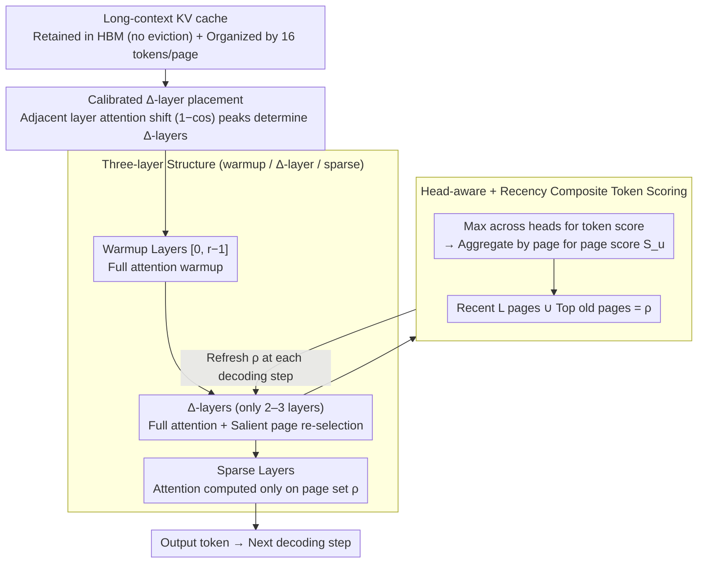

# DELTA: Dynamic Layer-Aware Token Attention for Efficient Long-Context Reasoning

**Conference**: ACL 2026 Findings  
**arXiv**: [2510.09883](https://arxiv.org/abs/2510.09883)  
**Code**: https://github.com/hoenza/DELTA (Available)  
**Area**: LLM Inference / Long Context / Efficient Inference  
**Keywords**: Sparse attention, KV cache, reasoning, Δ-layer, page-based selection

## TL;DR
DELTA is a **training-free hierarchical sparse attention** mechanism. It partitions the transformer into three groups: "initial full attention layers + a few Δ-layers to re-select salient pages + subsequent sparse attention layers." It achieves accuracy levels comparable to or higher than full attention on AIME / GPQA-Diamond while reducing the number of attended tokens by $4.25\times$ and accelerating end-to-end inference by $1.54\times$.

## Background & Motivation
**Background**: Large Reasoning Models (LRMs) such as DeepSeek-R1 / o3 / Qwen3 / GPT-OSS achieve high scores on benchmarks like AIME through "long CoT test-time scaling." However, during the decoding stage, every generated token requires scanning the entire KV cache. In long-sequence scenarios, throughput is bottlenecked by memory bandwidth (e.g., Llama-3-8B with a 32K context and bs128 exceeds 500GB).

**Limitations of Prior Work**: ① **Eviction-based** methods (H2O / SnapKV / StreamingLLM / RaaS) permanently discard tokens, but "seemingly useless early tokens" in a reasoning chain often become critical later; discarding them leads to a sharp drop in accuracy. ② **Selection-based** methods (Quest / TidalDecode) retain the full cache but select only top-k for computation; however, performing selection at every layer introduces cumulative errors, and single-layer scores are not always accurate. With a 1k token budget, Quest and RaaS achieve < 20% accuracy on AIME-2024 + DS-Qwen-14B (vs. 60% for full attention).

**Key Challenge**: Reasoning tasks require "long-chain consistency"—if any segment of important tokens is misselected or lost, subsequent reasoning will deviate. Meanwhile, full attention is strictly limited by bandwidth. How can high-recall sparsity be achieved without retraining, discarding tokens, or computing every layer?

**Goal**: Design a training-free module that (1) leaves the KV cache intact (no discarded tokens, reserved for potential future use), (2) avoids full attention in every layer (to bypass main bandwidth overhead), and (3) maintains high recall in token selection to sustain reasoning accuracy.

**Key Insight**: The authors empirically discovered two statistical properties: ① **Inter-layer correlation**: Attention maps of adjacent transformer layers are nearly identical, with deeper layers refining rather than reconstructing scores. ② **Sequential drift**: As decoding progresses, the attention focus shifts slowly, requiring query-adaptive selection. Combining these leads to: "Perform full attention and token selection only in a few layers, and reuse the selected pages in remaining layers."

**Core Idea**: Partition the transformer into three groups: "warmup layers → Δ-layer selection layers → sparse layers." Δ-layers are re-selected at every decoding step to handle drift, but only a few Δ-layers exist across the network to minimize bandwidth usage.

## Method

### Overall Architecture
Pipeline: ① **Three-layer grouping**—layers [0, r-1] perform full attention for warmup (early attention is too scattered for stable page selection); layers $\mathcal{D}$ (e.g., [2, 14, 23], only 2–3 layers) serve as Δ-layers, re-running full attention and refreshing page selection at every decoding step; other layers use sparse attention, computing only on the salient page set $\rho$ selected by the most recent Δ-layer. ② **No KV loss**—the full cache remains in HBM; only the "read pages" per layer are restricted. ③ **Page-based implementation**—KV pairs are organized into pages of $P=16$ tokens. Token scores are aggregated into page scores to facilitate GPU coalesced access. ④ **Δ-layer calibration**—Run full attention on a small calibration set and calculate the $1-\cos$ distance between attention maps of adjacent layers. Layers with the largest distances are chosen as Δ-layers (representing points where attention behavior changes significantly and prior selection is no longer reliable).

### Key Designs

**1. Three-layer structure (warmup / Δ-layer / sparse): Minimizing "re-selection" overhead to 2–3 critical layers**

While full attention is bandwidth-bound, performing token selection at every layer causes single-layer selection errors to accumulate. DELTA solves this by partitioning N layers into three functional segments, allowing most layers to "hitchhike." Layers [0, 1] perform full attention for warmup because early-layer attention is too diffuse for reliable top-k selection. Layer 2 serves as the first Δ-layer to establish the initial salient page set. Another 1–2 Δ-layers are placed in the middle and late stages to handle sequential drift. All other layers are sparse, computing only on the page set $\rho$ from the last Δ-layer. Crucially, Δ-layers re-run full attention at every decoding step to ensure the selection is query-adaptive.

**2. Head-aware + recency composite token scoring: Preserving strong signals from individual heads and preventing loss of new tokens**

Aggregating multi-head attention into a single page score presents two pitfalls. First, using the mean across heads dilutes signals where a specific head strongly locks onto a critical token. DELTA addresses this by taking the maximum across heads for each token $t$, $s_t = \max_{j=1,\ldots,m} \alpha_j^i(t)$, preserving "expert opinions." These are summed into page scores $S_u = \sum_{t:p(t)=u} s_t$. Second, pure top-scoring selection might exclude newly generated tokens, which have naturally lower scores before attention converges. DELTA compensates by mandatorily retaining the last $L$ pages and selecting the top $K-L$ pages from the remainder based on $S_u$.

**3. Page-based KV management + Calibrated Δ-layer placement: Efficient implementation via paged KV and automated Δ-layer positioning**

This design addresses efficient deployment and Δ-layer positioning. Drawing from PagedAttention, the KV cache is organized into pages of $P=16$ tokens. Selection occurs at the page level to ensure coalesced GPU access. For Δ-layer placement, a small calibration set is used to run full attention once. The distance $d_{\ell-1, \ell} = 1 - \cos(a_{\ell-1}, a_\ell)$ is calculated for each pair of adjacent layers. Peaks in this shift indicate where attention behavior changes drastically, necessitating a refresh of the selected pages (e.g., DS-Qwen-14B shows a shift as high as 0.953 between layers 4 and 5).

### Loss & Training
**Entirely training-free**. Δ-layer calibration requires a single full-attention pass on a small calibration set to calculate inter-layer shifts. All subsequent inference uses FlashInfer JIT + PyTorch top-k. Default settings are page size $P=16$, budget $K=64$ pages (1k tokens), and $L=8$ recency pages.

## Key Experimental Results

### Main Results

DELTA vs. Full vs. Quest vs. RaaS (1k-token budget, accuracy %):

| Model / Dataset | Full | DELTA-1k | DELTA-2k | Quest-1k | RaaS-1k |
|-----------------|------|----------|----------|----------|---------|
| DS-Qwen-14B / AIME-2024 | ~60 | ~50 | ~60 | <20 | <20 |
| DS-Qwen-7B / GPQA | base | base | **+30** | < base | < base |
| Most models × datasets | 100% | ≥100% | ≥ Full | Significant Drop | Significant Drop |

→ DELTA matches Full attention even under a strict 1k budget and often outperforms Full attention at a 2k budget (e.g., +30% on GPQA + DS-Qwen-7B), whereas Quest/RaaS collapse at a 1k budget.

Throughput and Latency (DS-Qwen-1.5B, bs=64, 18k decoding length):

| Metric | Full | DELTA (K=64) | Gain |
|------|------|--------------|------|
| Total Decoding Time | 403 s | 261 s | **1.54× speedup** |
| Throughput | 2921 tok/s | 4517 tok/s | +55% |
| Step Latency (long ctx) | 30 ms | 13 ms | ~2.3× |
| Attended Token Count | Full | 1/4.25 | **4.25× reduction** |

### Ablation Study

Number of Δ-layers vs. Single-step forward time (DS-Qwen-7B, bs=64, TP=2, 16k tokens):

| #Δ-layers | Single-step forward (relative) | Remark |
|-----------|---------------------|------|
| 1 | Lowest | Highest sparsity, but prone to staleness |
| 3 (Default) | Low | Sweet spot for optimal accuracy |
| 5 | Medium | Diminishing returns |
| All (=Full) | Highest | Degenerates to Full attention |

Recency window $L$ vs. Accuracy (DS-Qwen-7B, Mixed120, 5 budgets):
- At lower budgets (e.g., 64 pages/1k tokens), a larger $L$ is required for protection.
- At larger budgets (e.g., 256 pages/4k tokens), broader coverage becomes more important than recency, and $L=8$ is sufficient.

### Key Findings
- **DELTA-2k frequently outperforms Full attention**: This counter-intuitive result suggests that sparse attention filters out noise tokens, allowing for more focused reasoning, similar to a dropout-like regularization effect.
- **Δ-layer positions are determined by inter-layer attention shifts**: The peak shift in DS-Qwen-14B at layer 4-5 informs its Δ-layer configuration; this calibration method transfers effectively to 1.5B/7B models.
- **Quest and RaaS fail on long-context reasoning**: Their accuracy drops to < 20% under a 1k budget, proving that reasoning tasks are extremely sensitive to any form of permanent token loss or cumulative selection error.
- **DELTA overhead is concentrated in short contexts**: While page-selection overhead is visible at 1k context, it drops significantly to 25% of the baseline at 32k context, making DELTA highly efficient for its target long-context reasoning range.

## Highlights & Insights
- The **"inter-layer correlation + inter-step drift" dual observation** is the core insight of the paper—upgrading a well-known fact (attention sparsity) into a specific design principle that allows for spatial reuse with temporal refreshing.
- **Retaining the full KV cache without discarding tokens** is the fundamental difference from eviction methods like RaaS and is key to maintaining reasoning performance.
- **Inter-layer cosine shift for choosing Δ-layers** is a transferable diagnostic method valuable for future works involving per-layer budget allocation.
- **Max-over-heads scoring** is a critical detail; because key tokens are often locked by only 1–2 heads, averaging would dilute this signal, whereas max-pooling preserves the "expert opinions" of all heads.

## Limitations & Future Work
- **Saves compute, not memory**: The full KV cache still occupies HBM, meaning OOM is still a risk for extremely long contexts (>200K) or small GPUs.
- **Validation limited to DeepSeek-R1 distilled series + Math/Science QA**: Transferability to dialogue, code generation, or agent workloads remains unverified.
- **Δ-layer and $(K, L)$ still require manual/calibration selection**: While the shift-based method is effective, it is currently done per-model rather than per-sample.
- **Max-head scoring may lag during rapid attention drift**: High-frequency Δ-layers or adaptive scheduling might be needed for such scenarios.

## Related Work & Insights
- **vs. Quest (ICLR 2025)**: Quest performs selection at every layer using page representatives; DELTA performs it at only 2–3 Δ-layers and reuses the result, avoiding cumulative selection errors.
- **vs. RaaS / SnapKV / H2O**: These eviction methods save memory but cause catastrophic failure in reasoning. DELTA preserves accuracy by not discarding tokens.
- **vs. TidalDecode**: Similar in spirit (few layers full + most reuse), but DELTA adds calibration-based Δ-layer selection, efficient page-based implementation, and composite scoring optimizations.
- **Insight**: The "hierarchical sparsity + periodic refresh" logic could be extended to multimodal domains (visual token sparsity), hybrid attention modules in Mamba/SSM architectures, or chunk-level relevance refreshes in RAG.

## Rating
- Novelty: ⭐⭐⭐⭐ The three-layer structure derived from the dual observation is a simple yet elegant combination of insights.
- Experimental Thoroughness: ⭐⭐⭐⭐ Comprehensive evaluation across 4 models, 4 benchmarks, and multiple configurations.
- Writing Quality: ⭐⭐⭐⭐⭐ Clear progression from observations to design and engineering details.
- Value: ⭐⭐⭐⭐⭐ 1.54× end-to-end speedup with zero accuracy loss and training-free deployment makes this work highly practical for industrial LRM serving.

<!-- RELATED:START -->

## Related Papers

- [\[ACL 2026\] Long-Context Reasoning Through Proxy-Based Chain-of-Thought Tuning](long-context_reasoning_through_proxy-based_chain-of-thought_tuning.md)
- [\[ACL 2026\] Step-GRPO: Internalizing Dynamic Early Exit for Efficient Reasoning](step-grpo_internalizing_dynamic_early_exit_for_efficient_reasoning.md)
- [\[ACL 2026\] PPA-Plan: Proactive Pitfall Avoidance for Reliable Planning in Long-Context LLM Reasoning](ppa-plan_proactive_pitfall_avoidance_for_reliable_planning_in_long-context_llm_r.md)
- [\[ACL 2026\] Reliability-Aware Adaptive Self-Consistency for Efficient Sampling in LLM Reasoning](reliability-aware_adaptive_self-consistency_for_efficient_sampling_in_llm_reason.md)
- [\[ICLR 2026\] InftyThink: Breaking the Length Limits of Long-Context Reasoning in Large Language Models](../../ICLR2026/llm_reasoning/inftythink_breaking_the_length_limits_of_long-context_reasoning_in_large_languag.md)

<!-- RELATED:END -->
