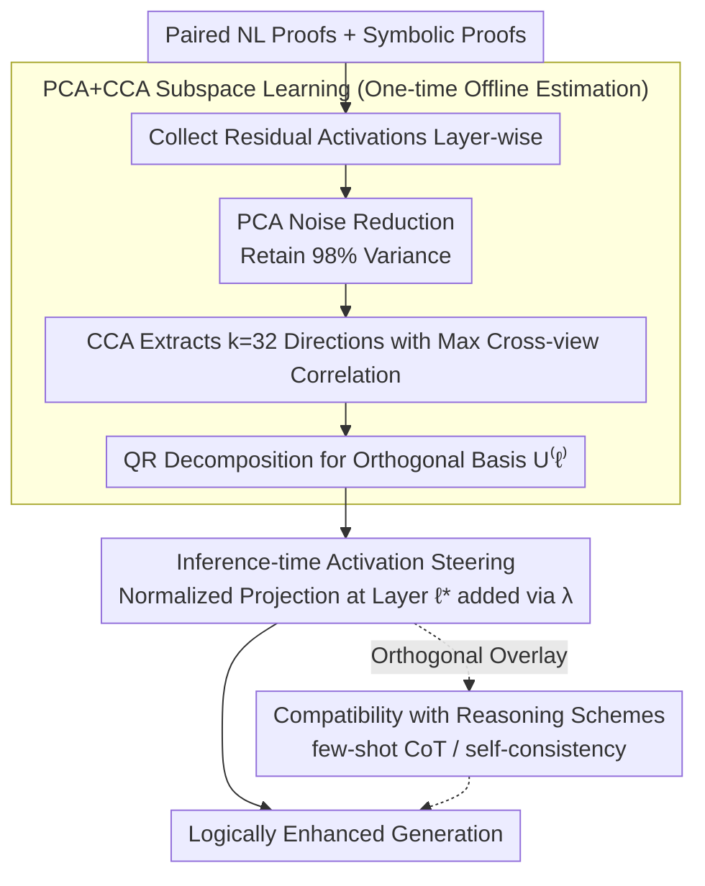

# Discovering a Shared Logical Subspace: Steering LLM Logical Reasoning via Alignment of Natural-Language and Symbolic Views

**Conference**: ACL 2026  
**arXiv**: [2604.19716](https://arxiv.org/abs/2604.19716)  
**Code**: [https://github.com/lei-nlp-lab/logical_subspace_acl_2026](https://github.com/lei-nlp-lab/logical_subspace_acl_2026)  
**Area**: Human Understanding / LLM Reasoning  
**Keywords**: Logical Reasoning, Multi-view Subspace, Activation Steering, CCA Alignment, Training-free Inference

## TL;DR

Ours discovers a shared logical subspace within LLMs that aligns both natural language and symbolic logic reasoning representations. By steering activations along this subspace during inference, logical reasoning accuracy is improved by up to 11 percentage points without any training.

## Background & Motivation

**Background**: LLMs still perform poorly on complex multi-step logical reasoning. Existing methods fall into two categories: (1) natural language-dependent methods—optimizing Chain-of-Thought reasoning through prompting or training; (2) neuro-symbolic methods—attaching external symbolic solvers or verifiers.

**Limitations of Prior Work**: The first category only optimizes reasoning chains in natural language form, failing to utilize the structured information of symbolic logic. The second category depends on external symbolic components, increasing system complexity and maintenance costs. Neither explores whether a unified representation of logical reasoning capability exists within LLMs.

**Key Challenge**: The same logical reasoning problem can be described via two complementary representations—natural language proofs and symbolic proofs. However, existing methods either focus on only one representation or require external tools to bridge the two.

**Goal**: To discover whether a shared logical subspace that aligns both natural language (NL) and symbolic views exists within LLMs, and to utilize it to enhance reasoning capabilities.

**Key Insight**: Utilize the residual activations of paired natural language proofs and symbolic proofs to learn a low-dimensional shared subspace via Canonical Correlation Analysis (CCA).

**Core Idea**: A low-dimensional logical subspace exists within the residual flow of LLMs, capturing logical reasoning abilities shared across NL and symbolic representations. Amplifying activation projections along this subspace during inference enhances reasoning without modifying model weights.

## Method

### Overall Architecture

The framework consists of two phases: (1) Multi-view logical subspace learning—collecting residual activations from paired NL/symbolic reasoning chains and learning a low-dimensional subspace that maximizes cross-view correlation via PCA+CCA; (2) Inference-time steering—amplifying the activation projection of each token along the learned subspace during the model forward pass to steer generation toward logical reasoning. This steering scheme, termed LSS (Logical Subspace Steering), occurs at the activation level and is orthogonal to prompting or sampling-level reasoning techniques.

### Key Designs

**1. PCA+CCA Subspace Learning: Extracting a shared logical skeleton from different surface forms**

The challenge lies in the fact that NL and symbolic proofs of the same logical problem have residual activations in high-dimensional spaces contaminated by their respective linguistic styles. Direct alignment would be dominated by surface noise. Ours first performs PCA on each layer's activations for noise reduction, retaining 98% of the variance. Then, CCA is used to find $k=32$ directions with maximum correlation between the compressed NL and symbolic spaces. Finally, orthogonal bases $U^{(\ell)} \in \mathbb{R}^{D \times k}$ are obtained via QR decomposition. Since CCA maximizes cross-view correlation, the selected directions represent logical structures shared across surface forms rather than style information unique to one language format, ensuring stable steering.

**2. Inference-time Activation Steering: Correcting reasoning by amplifying projections without weight changes**

After learning the subspace, the second problem is influencing generation. A steering layer $\ell^*$ is selected, and the residual vector of each token at this layer is replaced:

$$\tilde{h}^{(\ell^*)}_t = h^{(\ell^*)}_t + \lambda \frac{P^{(\ell^*)} h^{(\ell^*)}_t}{\|P^{(\ell^*)} h^{(\ell^*)}_t\|_2} \|h^{(\ell^*)}_t\|_2$$

The projection $P^{(\ell^*)} h^{(\ell^*)}_t$ on the subspace is normalized and added back according to the original vector norm and intensity $\lambda$. This applies a controllable perturbation along the logical direction. The intervention requires only a one-time subspace estimation and one matrix-vector multiplication per token. Inference throughput remains almost constant (179 → 176 tok/s) while shifting generation toward being "more logical."

**3. Compatibility: Orthogonal to prompting and sampling techniques**

LSS intervention occurs at the activation level, while few-shot CoT modifies prompts and self-consistency (SC) modifies sampling/voting. Since they act at different levels, LSS can be applied on top of 3-shot CoT or SC-3. Experimental results show that the accuracy gains from LSS persist on top of these methods (approx. 2% additional gain), indicating that the benefits of these three classes of methods do not cancel out.

### Loss & Training

Ours is a training-free method. Subspace learning requires only a one-time PCA+CCA estimation on gold-standard proofs. The steering intensity $\lambda$ and steering layer $\ell^*$ are selected using a validation set.

## Key Experimental Results

### Main Results

| Model | Benchmark | Greedy-CoT | LSS-CoT | Gain |
|------|------|-----------|---------|------|
| Llama-3.1-8B | FOLIO | 51.7% | 61.1% | +9.4 |
| Llama-3.1-8B | PrOntoQA (5-hop) | 70.6% | 75.4% | +4.8 |
| Phi-3-Mini | PrOntoQA (5-hop) | 59.6% | 70.6% | +11.0 |
| Gemma-2-9B | PrOntoQA (5-hop) | 87.4% | 90.2% | +2.8 |
| Gemma-2-9B | PW-CWA (3-hop) | 71.4% | 73.8% | +2.4 |

### Compatibility with Reasoning Schemes (Llama-3.1-8B, PrOntoQA)

| Method | Accuracy |
|------|--------|
| Greedy-CoT | 70.6% |
| 3-shot-CoT + LSS | 74.6% (+2.2 over 3-shot) |
| SC-3 + LSS | 81.0% (+2.0 over SC-3) |

### Ablation Study

| Configuration | Key Metric | Description |
|------|---------|------|
| Random Orthogonal Steering | No Gain/Degradation | Improvement comes from learned subspace, not arbitrary amplification. |
| $\lambda$ Sensitivity | Optimal $\lambda$ varies | Logical subspace direction provides robust gains; random directions do not. |
| Qwen3-4B (Reasoning-specialized) | 87.2 → 93.2 (+6.0) | Strong base models also benefit from LSS. |

### Key Findings
- The logical subspace encodes both semantic and logical structural information.
- Alignment between NL and symbolic views is stronger in higher LLM layers.
- Projection energy $E^{(\ell)}(r)$ correlates positively with reasoning correctness.
- Steering leads the model to use more logical connectors (*since*, *so*) and fewer vague reasoning verbs (*think*, *know*, *assume*).
- LSS acts as a stabilizer for small models: on Llama-3.2-3B, SC-3 sometimes degrades performance, but LSS provides a steady gain.

## Highlights & Insights
- First discovery of a shared logical subspace within LLMs for NL and symbolic logic, providing important insight into the internal mechanisms of LLM reasoning.
- Highly lightweight: No training, no external tools, and negligible inference overhead (one matrix-vector multiplication per token).
- Proposes a third path for enhancing LLM reasoning: Instead of extending context length or sampling budgets, it directly aligns internal representations at the activation level.
- Orthogonal and additive with few-shot CoT and self-consistency, demonstrating excellent compatibility.

## Limitations & Future Work
- Requires paired NL and symbolic proofs for subspace learning; limited applicability to tasks without symbolic formalization (though FOLIO utilized NL and FOL alignment).
- Optimal steering layers and intensities vary by model-task pairs, requiring validation set tuning.
- Subspace dimension $k=32$ is fixed; adaptive dimension selection was not explored.
- Future work could explore cross-task transfer, integration with reasoning training, and broader reasoning types.

## Related Work & Insights
- **vs RepE/Activation Engineering**: While these are general activation steering methods, ours specifically targets logical reasoning by leveraging NL-symbolic alignment for more precise steering directions.
- **vs Neuro-Symbolic Methods**: Traditional methods attach external symbolic solvers; ours fuses the two views directly within internal representations.
- **vs Self-Consistency**: SC improves reasoning via multiple sampling/voting; ours achieves similar effects via single-pass steering with lower computational cost.

## Rating
- Novelty: ⭐⭐⭐⭐⭐ First discovery and utilization of internal multi-view logical subspaces in LLMs.
- Experimental Thoroughness: ⭐⭐⭐⭐ Tested on 4 benchmarks and 5 models with extensive ablation and analysis.
- Writing Quality: ⭐⭐⭐⭐⭐ Clear motivation, rigorous mathematical derivation, and in-depth analysis.
- Value: ⭐⭐⭐⭐ Provides a new paradigm for enhancing LLM reasoning with theoretical and practical significance.

<!-- RELATED:START -->

## Related Papers

- [\[ACL 2026\] Logical Phase Transitions: Understanding Collapse in LLM Logical Reasoning](logical_phase_transitions_understanding_collapse_in_llm_logical_reasoning.md)
- [\[ACL 2026\] Semantic-Aware Logical Reasoning via a Semiotic Framework](semantic-aware_logical_reasoning_via_a_semiotic_framework.md)
- [\[NeurIPS 2025\] MuSLR: Multimodal Symbolic Logical Reasoning](../../NeurIPS2025/llm_reasoning/muslr_multimodal_symbolic_logical_reasoning.md)
- [\[ICLR 2026\] LogicReward: Incentivizing LLM Reasoning via Step-Wise Logical Supervision](../../ICLR2026/llm_reasoning/logicreward_incentivizing_llm_reasoning_via_step-wise_logical_supervision.md)
- [\[ICLR 2026\] ActivationReasoning: Logical Reasoning in Latent Activation Spaces](../../ICLR2026/llm_reasoning/activationreasoning_logical_reasoning_in_latent_activation_spaces.md)

<!-- RELATED:END -->
