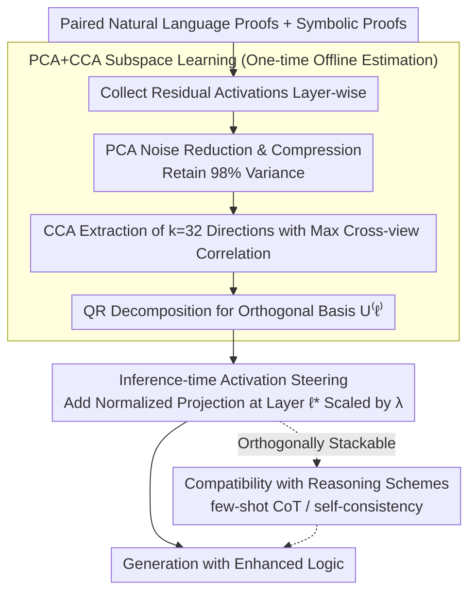

# Discovering a Shared Logical Subspace: Steering LLM Logical Reasoning via Alignment of Natural-Language and Symbolic Views

**Conference**: ACL 2026  
**arXiv**: [2604.19716](https://arxiv.org/abs/2604.19716)  
**Code**: [https://github.com/lei-nlp-lab/logical_subspace_acl_2026](https://github.com/lei-nlp-lab/logical_subspace_acl_2026)  
**Area**: Human Understanding / LLM Reasoning  
**Keywords**: Logical Reasoning, Multi-view Subspace, Activation Steering, CCA Alignment, Training-free Inference

## TL;DR

This paper discovers a shared logical subspace within LLMs that aligns natural language and symbolic logic representations. By steering activations along this subspace during inference, logical reasoning accuracy is improved by up to 11 percentage points without requiring training.

## Background & Motivation

**Background**: LLMs still perform poorly on complex multi-step logical reasoning. Existing methods are divided into two categories: (1) natural language-dependent methods—optimizing Chain-of-Thought reasoning through prompting or training; (2) neuro-symbolic methods—attaching external symbolic solvers or verifiers.

**Limitations of Prior Work**: The first category only optimizes reasoning chains in natural language form, failing to utilize the structured information of symbolic logic; the second category relies on external symbolic components, increasing system complexity and maintenance costs. Neither explores whether a unified representation of logical reasoning capability exists within LLMs.

**Key Challenge**: The same logical reasoning problem can be described by two complementary representations—natural language proofs and symbolic proofs—but existing methods either focus on a single representation or require external tools to bridge the two.

**Goal**: To discover whether a shared logical subspace exists within LLMs that aligns natural language and symbolic views, and to utilize it to enhance reasoning capabilities.

**Key Insight**: Leveraging the residual activations of paired natural language proofs and symbolic proofs to learn a low-dimensional shared subspace via Canonical Correlation Analysis (CCA).

**Core Idea**: A low-dimensional logical subspace exists in the residual stream of LLMs, capturing logical reasoning capabilities shared across natural language and symbolic representations. Amplifying the projection of activations along this subspace during inference enhances reasoning without modifying model weights.

## Method

### Overall Architecture

The method consists of two stages: (1) Learning the multi-view logical subspace—collecting residual activations from paired NL/symbolic reasoning chains and learning a low-dimensional subspace that maximizes cross-view correlation via PCA+CCA; (2) Inference-time steering—amplifying the projection of activations for each token along the learned subspace during the model's forward pass. This steering scheme, termed LSS (Logical Subspace Steering), occurs at the activation level and is thus orthogonal to reasoning techniques at the prompting or sampling levels.

### Key Designs

**1. PCA+CCA Subspace Learning: Extracting a shared logical backbone from two different surface forms**

The challenge lies in the fact that natural language and symbolic proofs for the same logic problem have residual activations in high-dimensional spaces contaminated by their respective linguistic styles. Direct alignment would be dominated by surface noise. The authors first apply PCA for noise reduction, retaining 98% of the variance to remove minor perturbations. Then, Canonical Correlation Analysis (CCA) is used to find $k=32$ directions with the highest correlation between the compressed NL and symbolic spaces. Finally, orthogonal bases $U^{(\ell)} \in \mathbb{R}^{D \times k}$ are obtained via QR decomposition. Since CCA maximizes cross-view correlation, the selected directions represent logical structures shared across representations rather than style information inherent to a specific language form, ensuring the stability of subsequent steering.

**2. Inference-time Activation Steering: Correcting reasoning by amplifying projections without weight updates**

Once the subspace is learned, the second challenge is ensuring it influences generation. The authors select a steering layer $\ell^*$ and transform the residual vector of each token at that layer:

$$\tilde{h}^{(\ell^*)}_t = h^{(\ell^*)}_t + \lambda \frac{P^{(\ell^*)} h^{(\ell^*)}_t}{\|P^{(\ell^*)} h^{(\ell^*)}_t\|_2} \|h^{(\ell^*)}_t\|_2$$

This involves normalizing the projection $P^{(\ell^*)} h^{(\ell^*)}_t$ of the activation onto the subspace and adding it back scaled by the original vector's magnitude and an intensity $\lambda$. This applies a controllable perturbation along the logical direction. The intervention requires only a one-time subspace estimation and one matrix-vector multiplication per token. Inference throughput remains largely unaffected (179 → 176 tok/s) while consistently pushing the generation toward more logical outcomes.

**3. Compatibility with Reasoning Schemes: Orthogonal and stackable with prompt and sampling techniques**

LSS intervention occurs at the activation level, while few-shot CoT modifies prompts and self-consistency modifies sampling/voting. These operate at entirely different levels. Consequently, steering does not require parameter re-searching for new scenarios; the same subspace, steering layer, and $\lambda$ can be reused. Applying LSS on top of 3-shot CoT or SC-3 yields approximately 2 additional percentage points in gain, indicating that the benefits of these methods do not cancel each other out.

### Loss & Training

A training-free method. Subspace learning only requires a one-time PCA+CCA estimation on gold-standard proofs. The steering intensity $\lambda$ and steering layer $\ell^*$ are selected using a validation set.

## Key Experimental Results

### Main Results

| Model | Benchmark | Greedy-CoT | LSS-CoT | Gain |
|------|------|-----------|---------|------|
| Llama-3.1-8B | FOLIO | 51.7% | 61.1% | +9.4 |
| Llama-3.1-8B | PrOntoQA (5-hop) | 70.6% | 75.4% | +4.8 |
| Phi-3-Mini | PrOntoQA (5-hop) | 59.6% | 70.6% | +11.0 |
| Gemma-2-9B | PrOntoQA (5-hop) | 87.4% | 90.2% | +2.8 |
| Gemma-2-9B | PW-CWA (3-hop) | 71.4% | 73.8% | +2.4 |

### Stacking with Reasoning Schemes (Llama-3.1-8B, PrOntoQA)

| Method | Accuracy |
|------|--------|
| Greedy-CoT | 70.6% |
| 3-shot-CoT + LSS | 74.6% (+2.2 over 3-shot) |
| SC-3 + LSS | 81.0% (+2.0 over SC-3) |

### Ablation Study

| Configuration | Key Metric | Description |
|------|---------|------|
| Random Orthogonal Steering | No gain/Performance drop | Improvement stems from learned logical subspace, not arbitrary amplification. |
| $\lambda$ Sensitivity | Optimal $\lambda$ varies by model | Improvement along logical subspace is robust; random directions show no stable gain. |
| Qwen3-4B (Reasoning-specialized) | 87.2 → 93.2 (+6.0) | Even strong base models benefit from LSS. |

### Key Findings
- The logical subspace encodes both semantic and logical structural information.
- Alignment between NL and symbolic views is stronger in the higher layers of LLMs.
- Projection energy $E^{(\ell)}(r)$ is positively correlated with reasoning correctness.
- Steering leads the model to use more logical connectors (*since*, *so*) and fewer vague reasoning verbs (*think*, *know*, *assume*).
- LSS acts as a stabilizer for weak models: SC-3 even reduced performance on Llama-3.2-3B, while LSS consistently provided gains.

## Highlights & Insights
- This is the first study to discover a shared logical subspace spanning natural language and symbolic language within LLMs, marking a significant exploration of internal reasoning mechanisms.
- The method is highly lightweight: no training, no external tools, and negligible inference overhead, requiring only one matrix-vector multiplication per token.
- A third pathway for enhancing LLM reasoning is proposed: instead of extending context length or sampling budgets, internal representations are aligned directly at the activation level.
- Orthogonality with few-shot CoT and self-consistency demonstrates excellent methodological compatibility.

## Limitations & Future Work
- Paired NL and symbolic proofs are required to learn the subspace, limiting applicability to tasks without symbolic formalization (though the authors used FOL to proxy this for FOLIO).
- The optimal steering layer and intensity vary across model-task pairs, necessitating validation set tuning.
- The subspace dimension $k=32$ is fixed; adaptive dimension selection was not explored.
- Future work could investigate cross-task transfer, integration with reasoning-focused training, and broader types of reasoning.

## Related Work & Insights
- **vs RepE/Activation Engineering**: While these are general activation steering methods, this work specifically targets logical reasoning by utilizing NL-symbolic alignment to learn more precise steering directions.
- **vs Neuro-Symbolic Methods**: Traditional methods attach external symbolic solvers, whereas this work merges the two views directly at the internal representation level.
- **vs Self-Consistency**: SC improves reasoning via multiple sampling votes; this work achieves similar effects via single-pass steering with much lower computational cost.

## Rating
- Novelty: ⭐⭐⭐⭐⭐ First discovery and utilization of an internal multi-view logical subspace in LLMs.
- Experimental Thoroughness: ⭐⭐⭐⭐ Evaluated across 4 benchmarks and 5 models with extensive ablation and analysis.
- Writing Quality: ⭐⭐⭐⭐⭐ Clear motivation, rigorous mathematical derivation, and in-depth analysis.
- Value: ⭐⭐⭐⭐ Provides a new paradigm for enhancing LLM reasoning with theoretical and practical significance.

<!-- RELATED:START -->

## Related Papers

- [\[ACL 2026\] Logical Phase Transitions: Understanding Collapse in LLM Logical Reasoning](logical_phase_transitions_understanding_collapse_in_llm_logical_reasoning.md)
- [\[ACL 2026\] Semantic-Aware Logical Reasoning via a Semiotic Framework](semantic-aware_logical_reasoning_via_a_semiotic_framework.md)
- [\[NeurIPS 2025\] MuSLR: Multimodal Symbolic Logical Reasoning](../../NeurIPS2025/llm_reasoning/muslr_multimodal_symbolic_logical_reasoning.md)
- [\[ACL 2026\] Self-Awareness before Action: Mitigating Logical Inertia via Proactive Cognitive Awareness](self-awareness_before_action_mitigating_logical_inertia_via_proactive_cognitive_.md)
- [\[ICLR 2026\] LogicReward: Incentivizing LLM Reasoning via Step-Wise Logical Supervision](../../ICLR2026/llm_reasoning/logicreward_incentivizing_llm_reasoning_via_step-wise_logical_supervision.md)

<!-- RELATED:END -->
