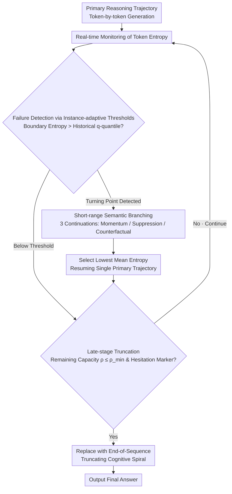

# Dissecting Failure Dynamics in Large Language Model Reasoning

**Conference**: ACL 2026  
**arXiv**: [2604.14528](https://arxiv.org/abs/2604.14528)  
**Code**: [GitHub](https://github.com/ZHUWEI-hub/GUARD)  
**Area**: LLM Reasoning / Inference-time Computation  
**Keywords**: Reasoning Failure Analysis, Entropy Signals, Failure Early-onset, Cognitive Spiral, Inference-time Intervention

## TL;DR
Analysis of LLM reasoning trajectories reveals that errors cluster at key early turning points, after which models enter a "cognitive spiral"—extending trajectories in a locally coherent but globally erroneous manner. Based on this, the GUARD framework is proposed to perform short-range branch repair at high-risk turning points detected via entropy signals.

## Background & Motivation

**Background**: Large Reasoning Models (LRMs) such as DeepSeek-R1 and OpenAI o1 improve performance by extending reasoning chains. Existing inference-time scaling strategies focus on "providing more computation"—generating longer chains, parallel sampling of multiple trajectories, or MCTS searches.

**Limitations of Prior Work**: Existing methods employ "blind scaling"—they are indifferent to when or where errors occur in a trajectory, allocating computation uniformly across all positions. Multi-path methods (e.g., Best-of-N) suffer from significant computational redundancy as they maintain multiple complete parallel trajectories.

**Key Challenge**: The benefit of inference-time scaling depends on whether "errors are repairable." However, existing methods do not distinguish between "repairable early deviations" and "irreversible late deviations," leading to computational waste on futile late-stage extensions.

**Goal**: To understand the temporal dynamics of reasoning failures within trajectories and design targeted intervention mechanisms accordingly.

**Key Insight**: A segment-by-segment analysis of failed trajectories is performed, revealing four key patterns that guide intervention.

**Core Idea**: Errors cluster early + error segments exhibit entropy spikes + some errors are recoverable from the same prefix → Perform short-range branching at entropy spikes and truncate hesitation behavior in late stages.

## Method

### Overall Architecture
GUARD maintains a single primary reasoning trajectory and monitors token-level entropy in real-time. When abnormally high entropy is detected at reasoning step boundaries, it triggers short-range branching: three brief alternative continuations (momentum, suppression, and counterfactual) are generated, and the one with the lowest mean entropy is selected to continue. In later stages, the reasoning is truncated upon detecting hesitation markers to prevent futile extensions.

### Key Designs

**1. Four Findings on Reasoning Failure Dynamics: Characterizing failures before intervention**

Before designing interventions, the authors dissected failed trajectories segment-by-segment, yielding four interlocking patterns. First is **Failure Early-onset**: over 85% of failure origins fall within the first 30% of the trajectory, and 43.5% of failed trajectories contain only a single error segment—errors are not distributed uniformly but erupt early at key turning points. Second is the **Cognitive Spiral**: after an error, trajectories actually become significantly longer while remaining locally coherent, creating a "seemingly plausible but globally wrong" sinkhole. Third is **Entropy Signals**: token-level entropy displays local spikes at failure origins, and the overall entropy of error segments is significantly higher than that of correct segments ($p<0.001$), providing a practical detection signal. Fourth is **Local Recoverability**: over 20% of failed trajectories can reach the correct answer if an alternative continuation is taken from the same prefix. Combined, these findings suggest that errors are local, detectable, and partially repairable, making "intervening only at critical points" more efficient than "global scaling."

**2. Instance-adaptive Threshold for Failure Detection: Using quantiles of historical entropy**

Given that entropy spikes signal failure, the challenge lies in determining what constitutes "high" entropy. The authors check entropy only at reasoning step boundaries (delimiters). The criterion is whether the current token entropy exceeds the $q$-quantile of the preceding historical entropy:

$$\mathbb{I}_{drift}(x_t) = \mathbb{I}[x_{t-1} \in \mathcal{T}_{delim} \land \mathcal{H}(x_t) > \text{Quantile}_q(\mathbf{H}_{<t})]$$

Quantiles are used instead of fixed absolute thresholds because "high entropy" for a simple problem might be "normal entropy" for a difficult one. By using quantiles relative to the current problem's historical entropy distribution, detection automatically adapts to the entropy scale of each specific problem.

**3. Short-range Semantic Branching and Late Truncation: Targeted surgery at deviation points**

Upon detecting a risk point, GUARD does not unfold multiple complete trajectories (the high-cost approach of Best-of-N). Instead, it generates only three **short-range** continuations: a momentum branch (standard greedy), a suppression branch (prefixed with "Wait," to break the current pattern), and a counterfactual branch (prefixed with "Let me reconsider:" to prompt rethinking). The continuation with the lowest mean entropy is selected to resume the single primary trajectory. Late in the reasoning process, when remaining capacity $\rho_t \leq \rho_{min}$, any hesitation marker encountered is replaced with a termination signal to cut off invalid tokens that only extend the cognitive spiral. The three branches share pre-computed KV caches to minimize latency.

### Loss & Training
GUARD is a pure inference-time framework and involves no training. All branches share pre-computed KV caches to minimize latency overhead.

## Key Experimental Results

### Main Results

| Method | AIME24 | AIME25 | AMC23 | MATH500 | Average Pass@1 |
|------|--------|--------|-------|---------|------------|
| BASE | 20.0 | 13.3 | 57.0 | 78.9 | 36.2 |
| Reflexion | 30.0 | 23.3 | 72.5 | 80.2 | - |
| α1 | 20.0 | 26.7 | 70.0 | 80.4 | 41.2 |
| GUARD | - | - | - | - | Significant Gain |

### Ablation Study

| Configuration | Key Metric | Description |
|------|---------|------|
| No Branching (Detection Only) | Limited Performance | Detection is insufficient; repair is needed |
| No Late Truncation | Increased Token Waste | Late-stage extension is wasted computation |
| Fixed Absolute Threshold | Unstable | Adaptive threshold is more robust |

### Key Findings
- Failed trajectories have significantly more segments than correct ones—extra segments are almost entirely invalid extensions after failure origins.
- Entropy signals are reliable indicators of failure—failed segments have significantly higher mean entropy than correct segments.
- Short-range branching (3 branches × short distance) is far more token-efficient than maintaining multiple complete parallel trajectories.
- GUARD's benefits are particularly pronounced on smaller models (1.5B), which are more susceptible to cognitive spirals.

## Highlights & Insights
- The **"Cognitive Spiral"** concept accurately describes the core pathology of LLM reasoning failure—errors do not lead to immediate collapse but rather a "seemingly plausible descent," explaining why longer reasoning chains are not always better.
- The philosophy of **"surgery at deviation points rather than systemic treatment"** is highly efficient—concentrating computation on the 20% of recoverable failures.
- The analysis provides guidance for reasoning RL training—if 85% of failures stem from the first 30% of the trajectory, training signals should also be concentrated on these early turning points.

## Limitations & Future Work
- Using Gemini 3 Pro as an external oracle to judge segment validity introduces evaluation bias.
- Validated only on math and competitive reasoning; failure dynamics in natural language reasoning and code generation may differ.
- The design of the three branches (momentum/suppression/counterfactual) is somewhat heuristic; better branching strategies warrant exploration.
- Late-stage truncation might "false kill" correct trajectories that eventually reach the answer after long-form thinking.

## Related Work & Insights
- **vs Best-of-N**: BoN generates $N$ complete parallel paths, whereas GUARD performs short-range exploration only at a few risk points on a single path.
- **vs DTS**: DTS triggers branching based on absolute entropy, while GUARD uses an adaptive threshold based on historical quantiles.
- **vs α1**: α1 dynamically adjusts depth via information-theoretic metrics but does not perform local repairs.

## Rating
- Novelty: ⭐⭐⭐⭐⭐ The systematic analysis of reasoning failure dynamics is a fresh perspective; the cognitive spiral concept offers profound insight.
- Experimental Thoroughness: ⭐⭐⭐⭐ Multiple competitive reasoning benchmarks and detailed statistical analysis.
- Writing Quality: ⭐⭐⭐⭐⭐ The logical chain from analysis to methodology is exceptionally fluid with excellent visualization.

<!-- RELATED:START -->

## Related Papers

- [\[ACL 2026\] Language Model as Planner and Formalizer under Constraints](language_model_as_planner_and_formalizer_under_constraints.md)
- [\[AAAI 2026\] Incorporating Self-Rewriting into Large Language Model Reasoning Reinforcement](../../AAAI2026/llm_reasoning/incorporating_self-rewriting_into_large_language_model_reasoning_reinforcement.md)
- [\[ACL 2026\] SeLaR: Selective Latent Reasoning in Large Language Models](selar_selective_latent_reasoning_in_large_language_models.md)
- [\[ACL 2026\] Foresight Optimization for Strategic Reasoning in Large Language Models](foresight_optimization_for_strategic_reasoning_in_large_language_models.md)
- [\[ACL 2026\] Failure Modes in Multi-Hop QA: The Weakest Link Effect and the Recognition Bottleneck](failure_modes_in_multi-hop_qa_the_weakest_link_effect_and_the_recognition_bottle.md)

<!-- RELATED:END -->
