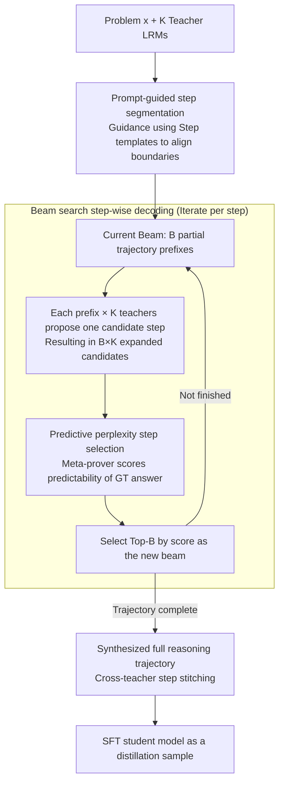

# Distilling Long-CoT Reasoning through Collaborative Step-wise Multi-Teacher Decoding (CoRD)

**Conference**: ACL 2026 Findings  
**arXiv**: [2605.02290](https://arxiv.org/abs/2605.02290)  
**Code**: To be confirmed (not directly provided in the paper)  
**Area**: Model Compression / Distillation / Long-CoT Reasoning  
**Keywords**: Multi-teacher distillation, Long-CoT, step-wise decoding, beam search, predictive perplexity

## TL;DR
The authors propose CoRD (Collaborative Reasoning Decoding), which transforms multi-teacher Long-CoT reasoning distillation from "generating full trajectories followed by post-hoc selection" into "step-wise collaborative decoding." In each step, multiple LRMs propose candidate steps, which are scored by the predictive perplexity of a meta-prover. Top-B partial trajectories are maintained via beam search. Consequently, a 32B student model surpasses all single teachers on AIME24/25 (79.6 / 70.2 vs 78.9 / 67.9).

## Background & Motivation

**Background**: Large Reasoning Models (LRMs) like DeepSeek-R1 have achieved breakthroughs through test-time scaling and Long-CoT, but deployment costs remain extremely high. Distilling LRM reasoning capabilities into smaller models has become a mainstream direction. Representative methods include "curation-based" approaches like S1 and LIMO, where multiple teachers generate full reasoning trajectories (thousands of tokens), and heuristics are used to select the best one as training data.

**Limitations of Prior Work**: Current paradigms suffer from three fundamental weaknesses:
1. **PRM / MCTS are unsuitable for Long-CoT**: Process reward models (PRM) may prematurely prune branches that appear sub-optimal but are essential paths to "Aha moments." MCTS faces an exponential search space explosion over long trajectories.
2. **Curation wastes compute**: Each teacher generates a complete long trace, but only one is eventually kept while others are discarded. Furthermore, post-hoc selection cannot dynamically adjust the exploration direction.
3. **Lack of teacher collaboration**: Multiple teachers are sampled independently and then max-indexed, failing to combine complementary strengths (e.g., R1-Qwen's proficiency in problem formulation and Phi4's synthesis skills) into a superior trajectory that no single teacher could achieve.

**Key Challenge**: The "Aha moments" in Long-CoT reasoning emerge dynamically. A weak step from one teacher at step $t$ might yield higher quality if combined with a strong reflection from another teacher at step $t+1$. Post-hoc curation eliminates the possibility of such cross-teacher temporal stitching.

**Goal**: To enable multiple teachers to make collaborative decisions at **every step**, treating the reasoning process itself (rather than the full trajectory) as the atomic unit of distillation.

**Key Insight**: Reasoning can be analogized to autoregressive decoding, where each step is a "token" and the set of teacher-proposed steps serves as the "decoding vocabulary." This allows for exploration at the step level using beam search.

**Core Idea**: Utilizing (i) prompt-guided step segmentation to align step boundaries across different LRMs, (ii) predictive perplexity to evaluate the "predictability of the ground-truth answer given the current prefix" as a short-term quality signal, and (iii) beam search to retain Top-B partial trajectories at the step level to avoid greedy myopia.

## Method

### Overall Architecture

Formalization: For a problem $x$ and $K$ teacher LRMs $\mathcal{T}$, traditional curation is defined as $\tau(x_i)^* = \arg\max_{\tau^{(k)}} Q(x_i, \tau^{(k)})$ (selecting the maximum among $K$ full trajectories). CoRD shifts this to a step-wise approach:

$$\tau(x_i)^* = \{(s_1^*, \dots, s_T^*) \mid s_t^* = \arg\max_{s_t \in \{s_t^{(1)}, \dots, s_t^{(K)}\}} S(\tau_{<t} \oplus s_t^{(k)})\}$$

At each step, every teacher proposes a candidate step $s_t^{(k)}$ conditioned on a shared prefix $\tau_{<t}$. The best candidate is selected based on a scoring function $S(\cdot)$. This constitutes "step-wise autoregressive decoding," where the decoding vocabulary is the set of teacher proposals.

### Key Designs

**1. Prompt-guided step segmentation: Aligning Long-CoT across different LRMs via templates for cross-model replacement.**

To enable multi-teacher collaboration at the step level, the unit "step" must be aligned. Different LRMs have varying newline habits and reflection cues (e.g., `wait`, `alternatively`). Standard physical markers would result in inconsistent step lengths. The authors embed a `<think> ### Step` template in the prompt to guide LRMs to output in a structured format (e.g., "### Step 1. Understanding... ### Step 2. Recalling..."). This shifts control of segmentation to the LRM during generation, forcing a "logical functional" division where each step corresponds to a sub-task. This ensures that steps at the same position across teachers are semantically comparable. Ablations show that prompt-guided segmentation achieves the highest fairness (PP 0.774, surpassing line-break at 0.734 and prefix at 0.747).

**2. Predictive perplexity step selection: Measuring how much a step makes the correct answer predictable rather than just "correctness."**

After segmentation, a scoring function is needed. PRM-based local correctness scoring has a vulnerability: it may prematurely prune branches that appear sub-optimal initially but are necessary for "Aha moments." The authors use an independent meta-prover (QwQ-32B) to calculate a forward-looking score for each candidate:

$$S(\tau_{<t} \oplus s_t^{(k)}) = \exp\!\Big(\tfrac{1}{M} \log p_{\text{meta}}(A \mid \tau_{<t} \oplus s_t^{(k)})\Big)$$

where $A$ is the ground-truth answer sequence and $M$ is the number of answer tokens. This represents the average conditional probability per answer token. It offers three benefits: it is a bounded continuous score capable of distinguishing subtle quality differences; it implicitly encodes a global judgment of "moving in the right direction" via answer likelihood; and it eliminates the need for extra reward model training by reusing the strongest teacher. Simply switching from PRM to predictive perplexity improved AIME24 scores from 75.0 to 79.6.

**3. Beam search step-wise decoding: Retaining Top-B partial trajectories at the step level to avoid greedy myopia and MCTS explosion.**

Strategic shifts and self-corrections in Long-CoT often appear sub-optimal in isolation. Greedy decoding ($B=1$) would discard them, while MCTS requires full trajectory rollouts for every step, leading to an exponential search space. Beam search provides a middle ground. At step $t$, starting from the previous beam $\mathcal{B}_{t-1} = \{\tau_{<t}^{(b)}\}_{b=1}^B$, each teacher proposes a step for each prefix, creating $B \times K$ candidates. Top-$B$ are selected via predictive perplexity to form $\mathcal{B}_t$. The complexity is $\mathcal{O}(TKMB)$, significantly lower than MCTS. Moreover, unlike MCTS which often collapses to the globally strongest teacher, beam search preserves diversity, allowing R1-Qwen-32B to dominate early phases (formulation) and Phi4 to dominate late phases (synthesis).

### Mechanism: Collaborative Solution of an AIME Problem

Given a teacher pool $K=3$ (R1-Qwen-32B / QwQ-32B / Phi4-Reasoning-Plus), meta-prover QwQ-32B, beam width $B=4$, and ground-truth answer $A$:

- **Step 1 (Problem Formulation)**: Start with 3 expanded candidates. Meta-prover calculates predictive perplexity—R1-Qwen-32B lists constraints most clearly, scoring 0.71, higher than QwQ (0.66) and Phi4 (0.59). All are kept in $\mathcal{B}_1$.
- **Step 2 (Theorem Recall / Case Split)**: 3 prefixes × 3 teachers = 9 candidates $\mathcal{C}_2$. The combination of "R1 prefix + QwQ continuation" achieves the highest score (0.78)—a synthesis no single teacher could produce. Top-4 are kept.
- **Progression**: Each step involves "$B \times K$ candidates → scoring → Top-B selection." The beam eventually converges on a trajectory where R1/QwQ leads the early phase and Phi4 leads the late phase.
- **Final Step (Conclusion Synthesis)**: Phi4's synthesis makes the answer highly predictable. the final trajectory exceeds the quality of any individual teacher (AIME24 79.6 vs Phi4 78.9).

The synthesized trajectory is then used for student SFT, allowing the student to learn a reasoning process superior to that of any single teacher.

### Loss & Training
The student model is trained via pure SFT. Teacher pool: QwQ-32B + R1-Distill-Qwen-32B + Phi4-Reasoning-Plus (heterogeneous) or QwQ-32B with temperature sampling (homogeneous). Meta-prover: QwQ-32B. Beam width $B = 4$. Datasets: LIMO-v1 (817), S1k-1.1 (1000), LIMO-v2 (800). Students: R1-Qwen-7B/14B/32B. Training: 8×H100, bs=8, 5 epochs, lr=5e-6, max seq=20480. Generation: max output=20,480 tokens.

## Key Experimental Results

### Main Results: AIME24/25 Student Pass@1 (Heterogeneous teachers)

| Model / Method | AIME24 | AIME25 |
| :--- | :--- | :--- |
| Teacher: R1-Qwen-32B | 71.6 | 53.8 |
| Teacher: QwQ-32B | 77.9 | 66.7 |
| Teacher: Phi4-Reasoning-Plus | 78.9 | 67.9 |
| Student R1-Qwen-32B w/o distill | 71.6 | 53.8 |
| Student 32B + Curation-Hetero | 75.0 | 62.1 |
| Student 32B + Integration-Hetero | 12.7 | 9.0 |
| **Student 32B + CoRD-Hetero** | **79.6** | **70.2** |
| Student 7B + Curation-Hetero | 56.6 | 42.1 |
| **Student 7B + CoRD-Hetero** | **60.8** | **45.6** |
| Student 14B + CoRD-Hetero | **74.8** | **62.3** |

The 32B student distilled via CoRD **surpasses** the strongest teacher (Phi4) on both benchmarks, proving that collaborative step-wise composition generates trajectories beyond the limits of individual teachers. The Integration baseline (merging trajectories via GPT-4o-mini) fails significantly as it compresses Long-CoT into short-form.

### Ablation Study

**(a) Step segmentation (Heterogeneous, R1-Qwen-32B student)**

| Method | Acc | PP | AIME24 | AIME25 |
| :--- | :--- | :--- | :--- | :--- |
| Line-break | 88.4 | 0.734 | 76.7 | 67.7 |
| Prefix | 91.3 | 0.747 | 77.1 | 67.3 |
| **Prompt-guide** | **93.1** | **0.774** | **79.6** | **70.2** |

**(b) Step selection criterion**

| Method | Acc | PP | AIME24 | AIME25 |
| :--- | :--- | :--- | :--- | :--- |
| Random | 80.4 | 0.494 | 69.0 | 61.9 |
| Max-length | 80.0 | 0.502 | 68.8 | 59.0 |
| PRM (Qwen2.5-Math-PRM-72B) | 82.6 | 0.591 | 75.0 | 64.6 |
| Binary Judgment (LLM) | 91.7 | 0.626 | 77.7 | 66.3 |
| **Predictive Perplexity** | **93.1** | **0.774** | **79.6** | **70.2** |

**(c) Decoding strategy**

| Method | Acc | PP | AIME24 | AIME25 | Time(s) |
| :--- | :--- | :--- | :--- | :--- | :--- |
| Greedy ($B=1$) | 81.6 | 0.719 | 76.7 | 66.5 | – |
| MCTS | 89.6 | 0.755 | 75.8 | 66.3 | 589.2 |
| **Beam Search ($B=4$)** | **93.1** | **0.774** | **79.6** | **70.2** | **288.7** |
| Curation Baseline | 84.8 | 0.652 | 75.0 | 62.1 | 168.3 |
| Curation×2 (Equal Compute) | 90.3 | 0.712 | 74.6 | 63.8 | 336.6 |

### Key Findings
- **CoRD 32B student exceeds all 32B teachers**: 79.6 vs 78.9 (AIME24); 70.2 vs 67.9 (AIME25).
- **Predictive perplexity correlates strongly with student performance**: The Integration baseline reached high answer accuracy (91.2) during reasoning generation but had low perplexity (0.223), leading to poor student performance (12.7). This confirms that "reasoning process" quality is the primary driver, and final answer correctness can be misleading.
- **Heterogeneous > Homogeneous**: Diverse teacher architectures improved results significantly over temperature-based sampling of a single model.
- **Automatic emergence of teacher specialization**: Beam search allows R1-Qwen / QwQ to dominate the early phase ($\leq 40\%$, formulation) and Phi4 to take over the late phase ($\geq 80\%$, synthesis).
- **Curation cannot match performance even with equal compute**: Curation×2 still lags significantly behind CoRD (74.6/63.8 vs 79.6/70.2), demonstrating that step-wise composition is irreplaceable.
- **Generalization**: Superior results on MATH500 (94.8), TaTQA (95.2), and PubMedQA (91.8).

## Highlights & Insights
- **Conceptual shift to "Reasoning as Decode-able Tokens"**: While traditional KD operates at the token level and curation at the trajectory level, CoRD operates at the step level—adjusting granularity to a level that allows for cross-model swapping and collaborative synthesis.
- **Predictive perplexity as a forward-looking reward**: It evaluates whether a step makes the final answer more predictable, naturally accommodating paths that appear incorrect initially but lead to better outcomes, thus avoiding the pitfalls of PRMs.
- **Transferable prompt-guided segmentation**: Using `### Step N.` templates is a zero-training standardization method applicable to any multi-model agent or step-level evaluation scenario.
- **Emergent specialization**: Teacher specialization at different phases emerges naturally from scoring and diversity preservation without manual prompting.
- **Degradation of MCTS on Long-CoT**: MCTS tends to converge to the globally strongest teacher, losing local complementarity. Granularity choice is critical for synergy.

## Limitations & Future Work
- **Domain/Language limitation**: Evaluated only on Math/English. Multi-lingual reasoning remains unexplored.
- **SFT only**: Preference learning (e.g., DPO) was not included, though CoRD’s beam candidates are ideal for step-level DPO.
- **Meta-prover bottleneck**: Performance drops significantly with a weak meta-prover, indicating dependency on at least one strong scoring model.
- **Efficiency**: CoRD is $\sim 70\%$ slower than Curation, which may be costly for large datasets (>10k problems).
- **No comparison to token-level KD**: The performance relative to traditional white-box KD on LRMs is unknown.

## Related Work & Insights
- **vs S1 / LIMO**: CoRD consistently outperforms the original versions of these curation-based datasets.
- **vs PRM-based RL**: Predictive perplexity is more suitable for the "self-correction" nature of Long-CoT compared to PRM's local correctness.
- **vs MCTS-based reasoning**: CoRD is twice as fast and more effective by using beam search and one-time perplexity instead of explicit rollouts.
- **vs Mixture-of-Agents (MoA)**: MoA fuses answers at the response level; CoRD fuses at the step level, providing finer granularity and trajectory-level supervision.

## Rating
- Novelty: ⭐⭐⭐⭐⭐ Redefining Long-CoT distillation as step-wise collaborative decoding is highly innovative.
- Experimental Thoroughness: ⭐⭐⭐⭐⭐ Extensive benchmarks, student/teacher configurations, and ablations.
- Writing Quality: ⭐⭐⭐⭐ Clear definitions and engineering references.
- Value: ⭐⭐⭐⭐⭐ Training-free method (no RM training required) with rare results where students surpass teachers.

<!-- RELATED:START -->

## Related Papers

- [\[ACL 2026\] Long-Context Reasoning Through Proxy-Based Chain-of-Thought Tuning](long-context_reasoning_through_proxy-based_chain-of-thought_tuning.md)
- [\[ICLR 2026\] LogicReward: Incentivizing LLM Reasoning via Step-Wise Logical Supervision](../../ICLR2026/llm_reasoning/logicreward_incentivizing_llm_reasoning_via_step-wise_logical_supervision.md)
- [\[CVPR 2026\] Rationale-Enhanced Decoding for Multi-modal Chain-of-Thought](../../CVPR2026/llm_reasoning/rationale-enhanced_decoding_for_multi-modal_chain-of-thought.md)
- [\[ACL 2026\] On the Step Length Confounding in LLM Reasoning Data Selection](on_the_step_length_confounding_in_llm_reasoning_data_selection.md)
- [\[ACL 2026\] ReProbe: Efficient Test-Time Scaling of Multi-Step Reasoning by Probing Internal States of Large Language Models](reprobe_efficient_test-time_scaling_of_multi-step_reasoning_by_probing_internal_.md)

<!-- RELATED:END -->
