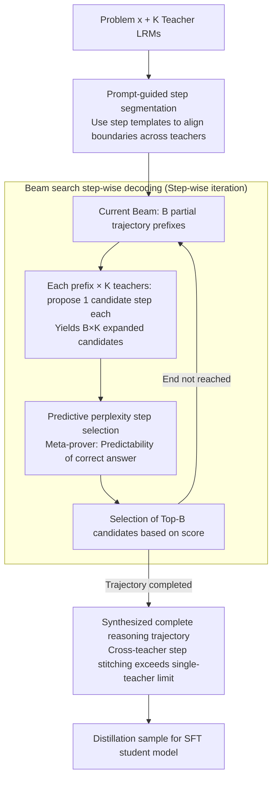

# Distilling Long-CoT Reasoning through Collaborative Step-wise Multi-Teacher Decoding (CoRD)

**Conference**: ACL 2026 Findings  
**arXiv**: [2605.02290](https://arxiv.org/abs/2605.02290)  
**Code**: TBD (not directly provided in the paper)  
**Area**: Model Compression / Distillation / Long-CoT Reasoning  
**Keywords**: Multi-teacher distillation, Long-CoT, step-wise decoding, beam search, predictive perplexity

## TL;DR
The authors propose CoRD (Collaborative Reasoning Decoding), transforming multi-teacher Long-CoT reasoning distillation from a "generate-then-select" paradigm into "step-wise collaborative decoding." In each step, multiple LRMs propose candidate steps, which are scored by a meta-prover's predictive perplexity. Top-B partial trajectories are maintained via beam search. Consequently, the 32B student surpasses all single teachers on AIME24/25 (79.6 / 70.2 vs. 78.9 / 67.9).

## Background & Motivation

**Background**: Large Reasoning Models (LRMs) like DeepSeek-R1 have achieved breakthroughs through test-time scaling and Long-CoT, but deployment costs remain high. Distilling LRM reasoning capabilities into smaller models is a mainstream direction. Representative "curation-based" methods, such as S1 and LIMO, involve multiple teachers generating complete reasoning trajectories (thousands of tokens), followed by selecting the highest-scoring one as training data using heuristics.

**Limitations of Prior Work**: Current paradigms suffer from three fundamental shortfalls:
1. **PRM / MCTS Incompatibility with Long-CoT**: Process reward models may prematurely prune branches that appear sub-optimal but are essential for an "Aha moment." MCTS faces exponential search space explosion on long trajectories.
2. **Computational Waste in Curation**: Each teacher generates a complete long trace, of which only one is typically retained. Post-hoc selection fails to dynamically adjust the direction of exploration.
3. **Lack of Teacher Collaboration**: Multiple teachers are sampled independently and maximized, failing to combine complementary strengths (e.g., R1-Qwen's problem formulation vs. Phi4's conclusion synthesis) into a superior trajectory that no single teacher could achieve alone.

**Key Challenge**: The "Aha moment" in long CoT reasoning emerges dynamically. A weak step from one teacher at step $t$ might yield high quality when combined with a strong reflection from another teacher at step $t+1$. Post-hoc curation eliminates the possibility of such cross-teacher temporal stitching.

**Goal**: To enable multiple teachers to collaborate on a **step-wise** basis, treating the reasoning process itself—rather than the complete trajectory—as the minimum unit of distillation.

**Key Insight**: Reasoning can be analogized to autoregressive decoding, where each step is a "token" and the set of teacher-proposed steps constitutes a "decoding vocabulary." Beam search can then be used to explore at the step level.

**Core Idea**: Utilizing (i) prompt-guided step segmentation to align step boundaries across different LRMs; (ii) predictive perplexity to evaluate the predictability of the correct answer given the current prefix as a short-term quality signal; and (iii) beam search to maintain Top-B partial trajectories at the step level to avoid greedy short-sightedness.

## Method

### Overall Architecture

Formalization: For a problem $x$ and $K$ teacher LRMs $\mathcal{T}$, traditional curation is $\tau(x_i)^* = \arg\max_{\tau^{(k)}} Q(x_i, \tau^{(k)})$ (maximizing over $K$ complete trajectories). CoRD shifts to step-wise:

$$\tau(x_i)^* = \{(s_1^*, \dots, s_T^*) \mid s_t^* = \arg\max_{s_t \in \{s_t^{(1)}, \dots, s_t^{(K)}\}} S(\tau_{<t} \oplus s_t^{(k)})\}$$

At each step, each teacher proposes a candidate step $s_t^{(k)}$ conditioned on a shared prefix $\tau_{<t}$, with the best selected by a scoring function $S(\cdot)$. This is "step-wise autoregressive decoding," where the decoding vocabulary is the set of teacher proposals.

### Key Designs

**1. Prompt-guided step segmentation: Aligning Long-CoT boundaries across LRMs for cross-model replacement**

Collaborating at the step level requires alignment of the "step" unit. LRMs differ significantly in line-break habits and reflection cues (e.g., `wait`, `alternatively`). Direct physical markup segmentation yields mismatched lengths, preventing horizontal comparison. The authors embed a `<think> ### Step` template in the prompt, guiding LRMs to output in a structured format (e.g., "### Step 1. Understanding... ### Step 2. Recalling..."). This shifts segmentation control to the LRM during generation, forcing a "logical functional" division where each step corresponds to a sub-task. This ensures steps at the same position are semantically comparable. Ablations show prompt-guided segmentation achieves the highest fairness (PP 0.774, vs. 0.734 for line-breaks and 0.747 for prefixes).

**2. Predictive perplexity step selection: Evaluating if a step makes the correct answer more predictable**

After segmentation, a scoring function is needed to select the optimal candidate. Local correctness scores like PRMs tend to prune "Aha moment" paths prematurely if they appear sub-optimal. The authors use an independent meta-prover (QwQ-32B) to calculate a forward-looking score:

$$S(\tau_{<t} \oplus s_t^{(k)}) = \exp\!\Big(\tfrac{1}{M} \log p_{\text{meta}}(A \mid \tau_{<t} \oplus s_t^{(k)})\Big)$$

where $A$ is the ground-truth answer sequence and $M$ is the number of tokens in the answer. This measures the average conditional probability per answer token. This approach provides bounded continuous scores to distinguish subtle quality differences and implicitly encodes global judgment via answer likelihood. It tolerates trajectories that "look wrong now but correct later" and removes the need for additional reward model training. Replacing PRM with predictive perplexity improved AIME24 performance from 75.0 to 79.6.

**3. Beam search step-wise decoding: Maintaining Top-B partial trajectories at the step level**

Strategic shifts and self-corrections in Long-CoT often appear sub-optimal initially. Greedy decoding ($B=1$) would discard these, while MCTS suffers from exponential search space explosion. Beam search provides a middle ground: at step $t$, it starts from the previous beam $\mathcal{B}_{t-1} = \{\tau_{<t}^{(b)}\}_{b=1}^B$. Each prefix is expanded by $K$ teachers, and Top-$B$ candidates are selected via predictive perplexity to form $\mathcal{B}_t$. Complexity is $\mathcal{O}(TKMB)$, significantly lower than MCTS. Moreover, unlike MCTS which often collapses to the globally strongest teacher, beam search preserves diversity, allowing specialized models like R1-Qwen-32B (formulation) and Phi4-Reasoning-Plus (synthesis) to contribute at different phases.

### Loss & Training
The student model is trained using pure SFT. Teacher pool: QwQ-32B + R1-Distill-Qwen-32B + Phi4-Reasoning-Plus (heterogeneous) or multiple QwQ-32B samplings at different temperatures (homogeneous). Meta-prover: QwQ-32B. Beam width $B = 4$. Datasets: LIMO-v1, S1k-1.1, LIMO-v2. Student: R1-Qwen-7B/14B/32B. Training: 8×H100, bs=8, 5 epochs, lr=5e-6, max seq=20480, DeepSpeed Stage-3. Max output: 20,480 tokens (reasoning 16,384 + answer 4,096).

## Key Experimental Results

### Main Results: AIME24/25 Student Pass@1 (Heterogeneous teachers)

| Model / Method | AIME24 | AIME25 |
| :--- | :--- | :--- |
| Teacher: R1-Qwen-32B | 71.6 | 53.8 |
| Teacher: QwQ-32B | 77.9 | 66.7 |
| Teacher: Phi4-Reasoning-Plus | 78.9 | 67.9 |
| Student R1-Qwen-32B w/o distill | 71.6 | 53.8 |
| Student 32B + Curation-Hetero | 75.0 | 62.1 |
| Student 32B + Integration-Hetero | 12.7 | 9.0 |
| **Student 32B + CoRD-Hetero** | **79.6** | **70.2** |
| Student 7B + Curation-Hetero | 56.6 | 42.1 |
| **Student 7B + CoRD-Hetero** | **60.8** | **45.6** |
| Student 14B + CoRD-Hetero | **74.8** | **62.3** |

CoRD-distilled 32B students **surpass** the strongest single teacher (Phi4-Reasoning-Plus) on both benchmarks. The Integration baseline (where GPT-4o-mini merges teacher trajectories) degraded significantly (9-12 points) as it compressed Long-CoT into short-form, losing supervision signals.

### Ablation Study

**(a) Step segmentation (Heterogeneous, R1-Qwen-32B student)**

| Method | Acc | PP | AIME24 | AIME25 |
| :--- | :--- | :--- | :--- | :--- |
| Line-break | 88.4 | 0.734 | 76.7 | 67.7 |
| Prefix | 91.3 | 0.747 | 77.1 | 67.3 |
| **Prompt-guide** | **93.1** | **0.774** | **79.6** | **70.2** |

**(b) Step selection criterion**

| Method | Acc | PP | AIME24 | AIME25 |
| :--- | :--- | :--- | :--- | :--- |
| Random | 80.4 | 0.494 | 69.0 | 61.9 |
| Max-length | 80.0 | 0.502 | 68.8 | 59.0 |
| PRM (Qwen2.5-Math-PRM-72B) | 82.6 | 0.591 | 75.0 | 64.6 |
| Binary Judgment (LLM) | 91.7 | 0.626 | 77.7 | 66.3 |
| **Predictive Perplexity** | **93.1** | **0.774** | **79.6** | **70.2** |

**(c) Decoding strategy**

| Method | Acc | PP | AIME24 | AIME25 | Time(s) |
| :--- | :--- | :--- | :--- | :--- | :--- |
| Greedy ($B=1$) | 81.6 | 0.719 | 76.7 | 66.5 | – |
| MCTS | 89.6 | 0.755 | 75.8 | 66.3 | 589.2 |
| **Beam Search ($B=4$)** | **93.1** | **0.774** | **79.6** | **70.2** | **288.7** |
| Curation Baseline | 84.8 | 0.652 | 75.0 | 62.1 | 168.3 |
| Curation×2 (Equiv. compute) | 90.3 | 0.712 | 74.6 | 63.8 | 336.6 |

### Key Findings
- **CoRD 32B Student Surpasses All 32B Teachers**: 79.6 vs. Phi4's 78.9 (AIME24); 70.2 vs. Phi4's 67.9 (AIME25). Distillation produces reasoning superior to individual teachers.
- **Predictive Perplexity Correlation**: Student performance correlates strongly with predictive perplexity rather than answer accuracy. Integration baselines had high accuracy (91.2) but low perplexity (0.223), resulting in poor student scores (12.7). The quality of the "reasoning process" is the critical supervising factor.
- **Heterogeneous > Homogeneous**: Diverse teacher architectures improved AIME25 scores from 64.4 to 70.2 compared to single-model sampling.
- **Automatic Teacher Specialization**: Under beam search, R1-Qwen-32B/QwQ-32B dominate the early phase (formulation), while Phi4-Reasoning-Plus leads the late phase (synthesis). MCTS collapses to the globally strongest model.
- **Curation Compute Gap**: Doubling curation compute (336.6s) still yielded lower results (74.6 / 63.8) compared to CoRD (288.7s), highlighting the necessity of step-wise composition.

## Highlights & Insights
- **Conceptual Shift**: Treating reasoning as tokens to be decoded is a paradigm shift. CoRD operates at the step level—the grain size where cross-model swapping is viable—enabling "teacher collaborative synthesis."
- **Predictive Perplexity as a Reward**: By focusing on how a step informs the final answer rather than local correctness, it accommodates non-linear "Aha" paths and avoids the pitfalls of traditional PRMs.
- **Transferable Segmentation Trick**: Using `### Step N.` to control LRM output boundaries is a zero-cost standardization technique applicable to any multi-model collaboration or step-level evaluation scenario.
- **Emergent Specialization**: Teacher roles during different reasoning phases emerge naturally from scoring and beam diversity without manual role-playing prompts, resembling inference-time MoE.
- **MCTS Limitations in Long-CoT**: MCTS favors globally strong teachers and loses local complementarity due to trajectory-level rewards. This serves as a warning for designing Long-CoT search methods.

## Limitations & Future Work
- **Domain/Language Scope**: Only tested on Mathematics and English; multilingual reasoning distillation remains unexplored.
- **SFT Only**: Preference learning (e.g., DPO) was not utilized. CoRD's step-level candidates naturally form data for step-DPO.
- **Meta-prover Dependency**: Performance drops significantly if a weak meta-prover is used (AIME25 fell to 53.2), implying CoRD requires at least one strong model for scoring.
- **Efficiency**: CoRD is ~70% slower than Curation, posing costs for large-scale datasets (>10k problems).
- **Token-level KD Comparison**: No comparison with traditional logit-matching distillation.

## Related Work & Insights
- **vs. S1 / LIMO**: CoRD consistently outperforms these curation-based datasets on AIME benchmarks, proving that step-wise generation has a higher quality ceiling than manual or post-hoc curation.
- **vs. PRM-based RL**: While PRMs evaluate local correctness, CoRD evaluates predictive power for the final answer, which is better suited for Long-CoT self-correction.
- **vs. MCTS-based Reasoning**: CoRD is twice as fast as MCTS+rollout methods and more effective because perplexity implicitly captures "future informativeness" without explicit rollouts.
- **vs. Mixture-of-Agents (MoA)**: MoA fuses answers at the response level; CoRD fuses at the step level, providing finer granularity and trajectory-level supervision.

## Rating
- Novelty: ⭐⭐⭐⭐⭐ Redefining Long-CoT distillation as "step-wise collaborative decoding" with predictive perplexity is highly original.
- Experimental Thoroughness: ⭐⭐⭐⭐⭐ 5 benchmarks, 3 student sizes, 2 teacher configurations, 4 baselines, and 5-dimensional ablation.
- Writing Quality: ⭐⭐⭐⭐ Clear formulas, thorough complexity analysis, and intuitive hit-rate visualizations.
- Value: ⭐⭐⭐⭐⭐ Exceptional results (student surpassing teachers) and training-free methodology make it highly valuable for LRM deployment.

<!-- RELATED:START -->

## Related Papers

- [\[ICLR 2026\] LogicReward: Incentivizing LLM Reasoning via Step-Wise Logical Supervision](../../ICLR2026/llm_reasoning/logicreward_incentivizing_llm_reasoning_via_step-wise_logical_supervision.md)
- [\[ACL 2026\] Long-Context Reasoning Through Proxy-Based Chain-of-Thought Tuning](long-context_reasoning_through_proxy-based_chain-of-thought_tuning.md)
- [\[CVPR 2026\] Rationale-Enhanced Decoding for Multi-modal Chain-of-Thought](../../CVPR2026/llm_reasoning/rationale-enhanced_decoding_for_multi-modal_chain-of-thought.md)
- [\[ACL 2026\] On the Step Length Confounding in LLM Reasoning Data Selection](on_the_step_length_confounding_in_llm_reasoning_data_selection.md)
- [\[ACL 2026\] ReProbe: Efficient Test-Time Scaling of Multi-Step Reasoning by Probing Internal States of Large Language Models](reprobe_efficient_test-time_scaling_of_multi-step_reasoning_by_probing_internal_.md)

<!-- RELATED:END -->
