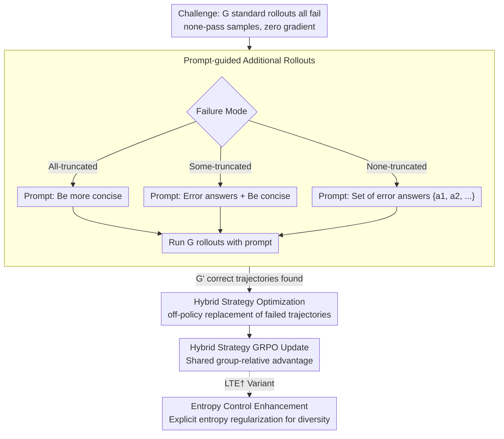

# Do Not Step Into the Same River Twice: Learning to Reason from Trial and Error

**Conference**: ACL 2026  
**arXiv**: [2510.26109](https://arxiv.org/abs/2510.26109)  
**Code**: [GitHub](https://github.com/JamyDon/LTE)  
**Area**: LLM Reasoning / Reinforcement Learning  
**Keywords**: Exploration Stagnation, Trial-and-Error Learning, Reinforcement Learning, Prompt-guided Exploration, Mathematical Reasoning

## TL;DR

Ours proposes LTE (Learning to reason from Trial and Error), which effectively mitigates the exploration stagnation problem in RLVR without relying on external experts by using the model's own incorrect answers as prompts to guide additional rollouts.

## Background & Motivation

**Background**: RLVR (Reinforcement Learning from Verifiable Rewards) is a core paradigm for improving the reasoning capabilities of LLMs, with GRPO serving as the de-facto standard algorithm. However, RLVR training suffers from a severe **exploration stagnation** problem—when training samples are too difficult for the model, all rollouts fail to generate the correct answer. This results in zero gradient signals from these samples, preventing the model from ever breaking through its own capability ceiling.

**Limitations of Prior Work**: Existing methods attempt to break exploration stagnation by introducing external guidance: (1) utilizing human-annotated standard solution processes, which is costly and non-scalable; (2) using reasoning chains generated by stronger LRMs (e.g., LUFFY), though stronger models are not always accessible (e.g., when training flagship models). These methods function more as temporary "symptomatic treatments."

**Key Challenge**: Under the 0/1 reward setting of standard GRPO, when all $G$ rollouts fail (none-pass samples), all group-relative advantages degrade to zero ($\hat{A}_{i,t}=0$), leading to zero gradients. Consequently, the strategy cannot learn from these samples at all. Simply increasing the number of rollouts (GRPOExtra) shows negligible effect, as repeated sampling under the same policy distribution does not yield fundamental breakthroughs.

**Goal**: Design a method that alleviates exploration stagnation in RLVR without any reliance on external expert guidance.

**Core Idea**: Analogous to human learning—when students are informed of their previous mistakes, they avoid them, thereby increasing the likelihood of finding the correct answer. LTE collects incorrect answers generated by the model in initial rollouts and uses them as "do not repeat these mistakes" prompts to guide the model toward exploring different solution paths in additional rollouts.

## Method

### Overall Architecture

LTE aims to solve the problem of "persistently incorrect" samples in RLVR training. Under standard GRPO, if all $G$ rollouts for a problem fail, the group-relative advantages and gradients become zero, preventing the model from learning anything and capping its performance. LTE provides these "none-pass" samples a second chance: it first runs $G$ standard rollouts; if all fail, it selects a prompt template based on the failure mode, informs the model of its recent mistakes, and runs $G$ "prompt-guided" additional rollouts. If any are correct, these correct trajectories replace the initial failed ones, and a final update is performed via hybrid strategy GRPO. The entire closed loop utilizes only the model's own behavior without touching external experts or stronger models.

### Key Designs

**1. Prompt-guided Additional Rollouts: Using Recent Errors as Signposts to Avoid Same Paths**

The zero gradients of none-pass samples occur because repeated sampling within the same policy distribution cannot escape the original error circle. The key to LTE is not "blind oversampling" but feeding failure information back to the model. It handles three failure modes: if all responses are truncated due to excessive length (all-truncated), the prompt instructs the model to "be more concise"; if only some are truncated (some-truncated), it extracts wrong answers from non-truncated responses as prompts while requesting conciseness; if none are truncated (none-truncated), it simply lists the incorrect answer set $\{a_1, a_2, \ldots\}$. The prompt also explicitly instructs the model not to mention or directly use these answers to avoid contaminating CoT "cleanliness." This essentially narrows the solution space—telling the model "these have been verified as wrong," encouraging it to try other paths, much like a person avoiding the same pitfall after being corrected.

**2. Hybrid Strategy Optimization: Off-policy Insertion of "Corrected" Trajectories**

A complication of prompt-guided correct answers is that they are generated under a different input condition (the added prompt). Direct gradient calculation as on-policy samples would introduce distribution bias. LTE handles this by taking $G'$ correct answers $\{o'_1, \ldots, o'_{G'}\}$ from additional rollouts and randomly replacing an equal number of initial failed trajectories, treating them as off-policy data. Specifically, defining the prompt policy as $\hat{\pi}(\cdot|\cdot) = \pi_{\mathrm{old}}(\cdot|\mathcal{H}_q, \cdot)$ (where $\mathcal{H}_q$ is the prompt context), the importance sampling ratio is rewritten as:

$$\hat{r}'_{i,t}(\theta) = \frac{\pi_\theta(o'_{i,t}|q, o_{i,<t})}{\pi_{\theta_{\mathrm{old}}}(o'_{i,t}|\mathcal{H}_q, q, o_{i,<t})}$$

The numerator is the current policy without the prompt, and the denominator is the old policy with the prompt, effectively canceling the conditional difference introduced by the "prompt." To prevent ratio explosion, a regularized importance sampling $f(r) = r/(r+\gamma)$ is applied to ensure stable updates. Consequently, all trajectories (original and replaced) can share the group-relative advantage calculation, providing learning signals to previously zero-gradient samples.

**3. Entropy Control Enhancement Variant LTE†: Explicit Entropy Regularization for Exploration**

While LTE implicitly encourages exploration through prompt guidance, the authors found further gains possible. LTE† adds an entropy loss term to the LTE objective, explicitly encouraging the policy to maintain output diversity and avoid premature convergence to a single mode. This variant also enables fair comparison: since baselines like DAPO and LUFFY include entropy control, LTE† competes on the same footing. In experiments, LTE† stands out particularly in Pass@k metrics, representing the exploration upper bound.

### Loss & Training

The objective function for LTE is a hybrid strategy version of GRPO: the on-policy portion follows the standard GRPO clip loss, while the off-policy portion uses the regularized importance sampling mentioned above for prompt-guided trajectories. Both share the same group-relative advantage set. Implementation is based on the verl framework, with 8 rollouts per prompt, temperature 1.0, maximum response length 8192, and training for 500 steps.

## Key Experimental Results

### Main Results (Pass@1)

| Model | Method | MATH-500 | AIME24 | AIME25 | Avg. |
|------|------|----------|--------|--------|------|
| Qwen3-8B-Base | GRPO | 77.70 | 22.08 | 15.83 | 43.99 |
| Qwen3-8B-Base | GRPOExtra | 75.75 | 22.29 | 14.79 | 41.72 |
| Qwen3-8B-Base | LTE | 78.85 | 30.62 | 27.29 | 49.01 |
| Qwen3-8B-Base | LUFFY | 80.20 | 29.17 | 21.25 | 47.15 |
| Qwen3-8B-Base | LTE† | 79.80 | 30.83 | 25.83 | 49.56 |

### Pass@k (Exploration Upper Bound)

| Model | Method | AIME24 | AIME25 | Avg. |
|------|------|--------|--------|------|
| Qwen3-8B-Base | GRPO | 43.33 | 30.00 | 56.82 |
| Qwen3-8B-Base | LTE | 70.00 | 46.67 | 66.78 |
| Qwen3-8B-Base | LUFFY | 60.00 | 33.33 | 61.55 |
| Qwen3-8B-Base | LTE† | 66.67 | 50.00 | 67.58 |

### Ablation Study

| Configuration | Key Metric | Description |
|------|---------|------|
| GRPOExtra vs LTE | -7.29 Pass@1, -10.04 Pass@k | Additional rollouts without prompts perform poorly |
| LTE vs LUFFY (No Entropy Control) | +1.86 Pass@1 | Ours outperforms LUFFY without expert reliance |
| LTE† vs LUFFY (With Entropy Control) | +2.41 Pass@1, +2.15 Pass@k | Advantages are more pronounced with entropy control |

### Key Findings
- LTE continuously reduces the number of none-pass samples during training, effectively mitigating exploration stagnation.
- LTE maintains higher long-tail entropy, encouraging deep thinking (longer response lengths) during testing.
- Simply increasing rollouts (GRPOExtra) may even perform worse than standard GRPO, validating that "quantity cannot replace quality."
- LTE† is particularly outstanding in Pass@k metrics, indicating that LTE effectively expands the exploration ceiling.

## Highlights & Insights
- **Elegant Analogy to "Trial-and-Error Learning"**: Transferring the human learning style of improvement through error feedback into RL training is intuitive, simple, and effective.
- **Zero External Dependency**: It fully utilizes the model's own behavioral information (incorrect answers) as guidance, presenting no barrier to practical deployment.
- **Mode-specific Failure Handling**: Designing prompt templates based on truncation status reflects a deep understanding of the problem.
- **Substantial Pass@k Gains**: Especially on AIME24, increasing Pass@k from 43.33 to 70.00 proves that LTE significantly expands the model's exploration upper bound.
- **Strong Comparison with LUFFY**: LTE†, which uses no external expert trajectories, surprisingly surpasses LUFFY, which relies on stronger models.

## Limitations & Future Work
- Additional rollouts introduce approximately 2x sampling overhead for none-pass samples; training efficiency requires further optimization.
- Validated only on mathematical reasoning tasks; applicability to other reasoning domains (code, logic) remains unknown.
- Prompt templates are manually designed; automated prompt generation strategies might bring further improvements.
- Some baselines (ReLIFT, EvoCoT) performed poorly on Qwen3, suggesting potential model compatibility issues.
- Future work could explore more dynamic prompt strategies (e.g., utilizing richer error pattern information instead of just error answers).

## Related Work & Insights
- **vs LUFFY**: LUFFY uses reasoning trajectories from stronger LRMs as off-policy samples. LTE uses its own error answers as prompts and surpasses LUFFY across two LMs.
- **vs GRPOExtra**: Simply increasing rollouts on Qwen3-8B-Base resulted in worse performance than GRPO (-2.27 Avg), proving the necessity of prompt guidance.
- **vs DAPO**: DAPO improves the optimization algorithm itself via techniques like clip-higher; LTE enhances exploration by improving the sampling strategy. The two are orthogonal and complementary.
- **vs EvoCoT**: EvoCoT uses ground truth answers as prompts. LTE uses its own error answers as "negative examples," representing a completely different and more effective approach.

## Rating
- Novelty: ⭐⭐⭐⭐⭐ The idea of using the model's own errors for exploration guidance is simple and novel; the "stepping into the same river" metaphor is apt.
- Experimental Thoroughness: ⭐⭐⭐⭐ Evaluation across multiple models and benchmarks, including Pass@1 and Pass@k, with comprehensive training dynamics analysis.
- Writing Quality: ⭐⭐⭐⭐ Clear structure, precise problem definition, and complete algorithm pseudocode.
- Value: ⭐⭐⭐⭐⭐ Provides a zero-external-dependency solution for exploration stagnation with high practical utility.

<!-- RELATED:START -->

## Related Papers

- [\[ICML 2026\] Hidden Error Awareness in Chain-of-Thought Reasoning: The Signal Is Diagnostic, Not Causal](../../ICML2026/llm_reasoning/hidden_error_awareness_in_chain-of-thought_reasoning_the_signal_is_diagnostic_no.md)
- [\[ACL 2026\] Reasoning Fails Where Step Flow Breaks](reasoning_fails_where_step_flow_breaks.md)
- [\[ACL 2026\] Which Reasoning Trajectories Teach Students to Reason Better? A Simple Metric of Informative Alignment](which_reasoning_trajectories_teach_students_to_reason_better_a_simple_metric_of_.md)
- [\[ACL 2026\] TemplateRL: Structured Template-Guided Reinforcement Learning for LLM Reasoning](templaterl_structured_template-guided_reinforcement_learning_for_llm_reasoning.md)
- [\[ACL 2026\] Is Chain-of-Thought Really Not Explainability? Chain-of-Thought Can Be Faithful without Hint Verbalization](is_chain-of-thought_really_not_explainability_chain-of-thought_can_be_faithful_w.md)

<!-- RELATED:END -->
