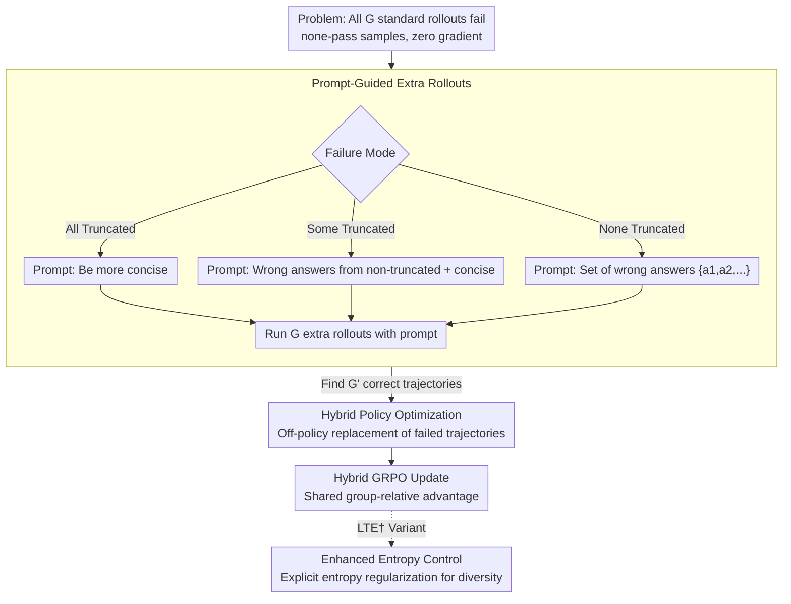

# Do Not Step Into the Same River Twice: Learning to Reason from Trial and Error

**Conference**: ACL 2026  
**arXiv**: [2510.26109](https://arxiv.org/abs/2510.26109)  
**Code**: [GitHub](https://github.com/JamyDon/LTE)  
**Area**: LLM Reasoning / Reinforcement Learning  
**Keywords**: Exploration Stagnation, Trial-and-Error Learning, Reinforcement Learning, Prompt-Guided Exploration, Mathematical Reasoning

## TL;DR

Ours proposes LTE (Learning to reason from Trial and Error), which effectively mitigates exploration stagnation in RLVR by using the model's own incorrect answers as prompts to guide extra rollouts without relying on external experts.

## Background & Motivation

**Background**: RLVR (Reinforcement Learning from Verifiable Rewards) is a core paradigm for enhancing LLM reasoning capabilities, with GRPO serving as the de-facto standard algorithm. However, RLVR training suffers from severe **exploration stagnation**—when training samples are too difficult for the model, all rollouts fail to generate correct answers, resulting in zero gradient signals and preventing the model from traversing its capability ceiling.

**Limitations of Prior Work**: Existing methods attempt to break exploration stagnation by introducing external guidance: (1) using human-annotated standard solutions, which are costly and non-scalable; (2) using reasoning chains generated by stronger LRMs (e.g., LUFFY), though stronger models are not always accessible (e.g., when training flagship models). These methods function more as "stopgap measures" rather than fundamental solutions.

**Key Challenge**: Under the 0/1 reward setting of standard GRPO, when all $G$ rollouts fail (none-pass samples), all group-relative advantages degrade to zero ($\hat{A}_{i,t}=0$). This leads to zero gradients, preventing the policy from learning from these samples. Simply increasing the number of rollouts (GRPOExtra) yields minimal improvement, as repeated sampling under the same policy distribution does not provide a fundamental breakthrough.

**Goal**: Design a method that mitigates exploration stagnation in RLVR without any dependence on external expert guidance.

**Key Insight**: Analogous to human learning—when students are informed of their previous mistakes, they avoid them and are more likely to find the correct answer. LTE collects incorrect answers generated by the model in initial rollouts and uses them as "do not repeat these mistakes" prompts to guide the model toward exploring different reasoning paths in extra rollouts.

## Method

### Overall Architecture

LTE aims to address difficult problems that the model consistently fails during RLVR training. In standard GRPO, if all $G$ rollouts for a problem fail, the group-relative advantages and gradients both become zero, meaning the model learns nothing. LTE provides these "none-pass samples" a second chance: it first runs $G$ standard rollouts; if all fail, it selects a prompt template based on the failure mode, informs the model of its recent errors, and runs $G$ "prompt-guided" extra rollouts. If successful trajectories are found, they replace the initial failed trajectories and are used for a hybrid policy GRPO update. This closed loop relies solely on the model's own behavior without external experts.

### Key Designs

**1. Prompt-guided extra rollouts: Using recent errors as signposts to avoid**

None-pass samples yield zero gradients because repeated sampling from the same policy distribution cannot escape the original error zone. The key to LTE is not "blind oversampling" but feeding back failure information. It handles three failure modes: if all responses are truncated due to length (all-truncated), the prompt asks for conciseness; if only some are truncated (some-truncated), wrong answers are extracted from non-truncated responses and conciseness is requested; if none are truncated (none-truncated), the set of wrong answers $\{a_1, a_2, \ldots\}$ is explicitly provided. The prompt also instructs the model not to mention or directly adopt these answers to maintain CoT "cleanliness." This technique narrows the search space by telling the model "these have been verified as wrong," encouraging it to explore alternative paths.

**2. Hybrid policy optimization: Safely integrating "prompt-guided successes" via off-policy updates**

Correct answers generated with prompts present a challenge: they are produced under different input conditions (the added prompt), so directly calculating gradients as on-policy samples would cause distribution shift. LTE addresses this by taking $G'$ correct answers $\{o'_1, \ldots, o'_{G'}\}$ from extra rollouts and randomly replacing an equal number of initial failed trajectories as off-policy data. Specifically, defining the prompted policy as $\hat{\pi}(\cdot|\cdot) = \pi_{\mathrm{old}}(\cdot|\mathcal{H}_q, \cdot)$ (where $\mathcal{H}_q$ is the prompt context), the importance sampling ratio is rewritten as:

$$\hat{r}'_{i,t}(\theta) = \frac{\pi_\theta(o'_{i,t}|q, o_{i,<t})}{\pi_{\theta_{\mathrm{old}}}(o'_{i,t}|\mathcal{H}_q, q, o_{i,<t})}$$

The numerator is the current policy without prompts, while the denominator is the old policy with prompts, effectively canceling out the conditional difference introduced by the prompt. To prevent ratio explosion, a regularized importance sampling $f(r) = r/(r+\gamma)$ is applied. Consequently, all trajectories (including replaced ones) can share the group-relative advantage calculation, providing learning signals for previously zero-gradient samples.

**3. Entropy control enhancement variant (LTE†): Maximizing exploration with explicit regularization**

While LTE implicitly encourages exploration via prompts, the authors found further gains possible. LTE† adds an entropy loss term to explicitly encourage output diversity and prevent premature convergence to a single mode. This variant also enables fair comparison with baselines like DAPO and LUFFY that use entropy control. In experiments, LTE† excels particularly in Pass@k, which measures the exploration upper bound.

### Loss & Training

The objective function of LTE is a hybrid policy version of GRPO: the on-policy part follows the standard clipped GRPO loss, while the off-policy part uses the aforementioned regularized importance sampling for prompt-guided trajectories. Both parts share the same group-relative advantage. Implemented on the verl framework, it uses 8 rollouts per prompt, temperature 1.0, maximum response length 8192, and 500 training steps.

## Key Experimental Results

### Main Results (Pass@1)

| Model | Method | MATH-500 | AIME24 | AIME25 | Avg. |
|------|------|----------|--------|--------|------|
| Qwen3-8B-Base | GRPO | 77.70 | 22.08 | 15.83 | 43.99 |
| Qwen3-8B-Base | GRPOExtra | 75.75 | 22.29 | 14.79 | 41.72 |
| Qwen3-8B-Base | LTE | 78.85 | 30.62 | 27.29 | 49.01 |
| Qwen3-8B-Base | LUFFY | 80.20 | 29.17 | 21.25 | 47.15 |
| Qwen3-8B-Base | LTE† | 79.80 | 30.83 | 25.83 | 49.56 |

### Pass@k (Exploration Upper Bound)

| Model | Method | AIME24 | AIME25 | Avg. |
|------|------|--------|--------|------|
| Qwen3-8B-Base | GRPO | 43.33 | 30.00 | 56.82 |
| Qwen3-8B-Base | LTE | 70.00 | 46.67 | 66.78 |
| Qwen3-8B-Base | LUFFY | 60.00 | 33.33 | 61.55 |
| Qwen3-8B-Base | LTE† | 66.67 | 50.00 | 67.58 |

### Ablation Study

| Configuration | Key Metric | Description |
|------|---------|------|
| GRPOExtra vs LTE | -7.29 Pass@1, -10.04 Pass@k | Extra rollouts without prompts are highly ineffective. |
| LTE vs LUFFY (No Entropy) | +1.86 Pass@1 | LTE outperforms LUFFY despite having no external experts. |
| LTE† vs LUFFY (With Entropy) | +2.41 Pass@1, +2.15 Pass@k | Superiority becomes more evident with entropy control. |

### Key Findings
- LTE consistently reduces the number of none-pass samples during training, effectively mitigating exploration stagnation.
- LTE maintains higher long-tail entropy, encouraging deep thinking at test time (longer response lengths).
- Simply increasing rollout count (GRPOExtra) can be worse than standard GRPO, verifying that "quantity does not lead to quality."
- LTE† is particularly outstanding in Pass@k, showing that LTE effectively extends the exploration upper bound.

## Highlights & Insights
- **Elegant Trial-and-Error Analogy**: It successfully transfers the human learning method of improving via error feedback to RL training, which is intuitive and effective.
- **Zero External Dependence**: It utilizes only the model's own behavioral information (wrong answers) as guidance, offering low deployment barriers.
- **Differentiated Failure Modes**: Designing specific prompt templates based on truncation status reflects a deep understanding of RL failures.
- **Substantial Pass@k Gains**: Especially on AIME24, increasing from 43.33 to 70.00 (Pass@k) proves that LTE significantly expands the exploration ceiling.
- **Strong Comparison with LUFFY**: LTE†, which uses no external expert trajectories, surprisingly outperforms LUFFY which relies on stronger models.

## Limitations & Future Work
- Extra rollouts introduce approximately 2x sampling overhead (for none-pass samples), necessitating training efficiency optimization.
- The method is only verified on math reasoning; applicability to other domains (code, logic) remains unknown.
- Prompt templates are manually designed; automated prompt generation might yield further improvements.
- Certain baselines (ReLIFT, EvoCoT) performed poorly on Qwen3, indicating potential model compatibility issues.
- Future work could explore more dynamic prompting strategies (e.g., utilizing richer error patterns beyond just the final answer).

## Related Work & Insights
- **vs LUFFY**: LUFFY uses reasoning trajectories from stronger LRMs as off-policy samples. LTE uses only self-errors as prompts and outperforms LUFFY on both tested LMs.
- **vs GRPOExtra**: Increasing rollout count alone was worse than GRPO on Qwen3-8B-Base (-2.27 Avg), proving the necessity of prompt guidance.
- **vs DAPO**: DAPO improves the optimization algorithm (e.g., clip-higher), while LTE enhances exploration via sampling strategies; the two are orthogonal and potentially complementary.
- **vs EvoCoT**: EvoCoT uses ground truth answers as prompts. LTE uses self-errors as "negative examples," representing a different and more effective strategy.

## Rating
- Novelty: ⭐⭐⭐⭐⭐ The idea of using self-errors as exploration guidance is concise and novel; the metaphor of "not stepping into the same river" is apt.
- Experimental Thoroughness: ⭐⭐⭐⭐ Multi-model and multi-benchmark evaluation, comprehensive analysis of training dynamics and Pass@k.
- Writing Quality: ⭐⭐⭐⭐ Clear structure, precise problem definition, and complete algorithm pseudo-code.
- Value: ⭐⭐⭐⭐⭐ Provides a zero-external-dependency solution to exploration stagnation with high practical utility.

<!-- RELATED:START -->

## Related Papers

- [\[ICML 2026\] Hidden Error Awareness in Chain-of-Thought Reasoning: The Signal Is Diagnostic, Not Causal](../../ICML2026/llm_reasoning/hidden_error_awareness_in_chain-of-thought_reasoning_the_signal_is_diagnostic_no.md)
- [\[ACL 2026\] Which Reasoning Trajectories Teach Students to Reason Better? A Simple Metric of Informative Alignment](which_reasoning_trajectories_teach_students_to_reason_better_a_simple_metric_of_.md)
- [\[ACL 2026\] Reasoning Fails Where Step Flow Breaks](reasoning_fails_where_step_flow_breaks.md)
- [\[ACL 2026\] TemplateRL: Structured Template-Guided Reinforcement Learning for LLM Reasoning](templaterl_structured_template-guided_reinforcement_learning_for_llm_reasoning.md)
- [\[ACL 2026\] Is Chain-of-Thought Really Not Explainability? Chain-of-Thought Can Be Faithful without Hint Verbalization](is_chain-of-thought_really_not_explainability_chain-of-thought_can_be_faithful_w.md)

<!-- RELATED:END -->
