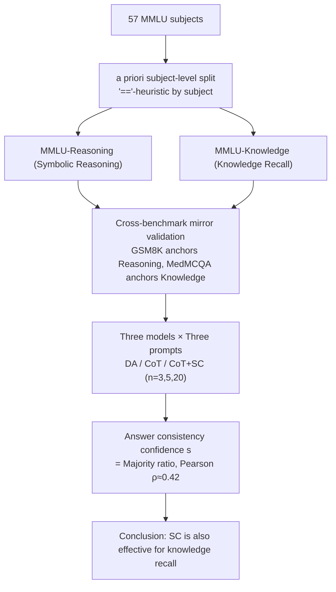

# Does Self-Consistency Improve the Recall of Encyclopedic Knowledge?

**Conference**: ACL 2026  
**arXiv**: [2604.19395](https://arxiv.org/abs/2604.19395)  
**Code**: None (Paper not yet released)  
**Area**: LLM Reasoning / Knowledge Recall / Evaluation  
**Keywords**: Self-Consistency, Chain-of-Thought, MMLU Split, Knowledge Recall, Symbolic Reasoning

## TL;DR
The authors split the 57 subjects of MMLU into two subsets—**symbolic reasoning** and **knowledge recall** (approx. 1:2)—using the "=="-heuristic from Sprague et al. based on academic disciplines. They empirically demonstrate that self-consistency (SC) is not only effective for symbolic reasoning—where CoT already excels—but also **consistently yields gains in knowledge recall** (+2.48 when $n=20$). This pushes the overall MMLU accuracy of GPT-4o to 88.93%. The mechanism is explained using the "majority answer ratio" as a confidence signal (Pearson $\rho \approx 0.42$).

## Background & Motivation

**Background**: Chain-of-Thought (CoT) has become the standard for LLM evaluation. However, Sprague et al. (2025) reported that 95% of CoT gains on MMLU originate from questions involving symbolic reasoning (formulas/numerics); questions relying purely on "encyclopedic knowledge recall" see almost no benefit. Self-Consistency (SC) involves sampling multiple reasoning paths and applying a majority vote on top of CoT, traditionally validated on arithmetic/common-sense reasoning.

**Limitations of Prior Work**: Since SC is built entirely on CoT, and CoT is largely ineffective for knowledge recall questions (e.g., "How high is Mount Fuji?"), is SC also useless for knowledge recall? Although Chung et al. (2024) tested SC on MMLU, they **did not report symbolic reasoning and knowledge recall separately**. These signals were conflated, masking the actual contribution of SC across different problem types.

**Key Challenge**: MMLU is a hybrid task. Its 57 subjects include both typical symbolic reasoning (Math/Physics/Econometrics) and pure knowledge recall (History/Law/Medical facts). However, the official supercategories (STEM/Humanities) are based on academic affiliation and are **not orthogonal to reasoning types** (e.g., Econometrics is under Humanities). Without a clean *a priori* split, the true utility of SC for knowledge recall remains unanswered.

**Goal**: (RQ1) Can knowledge recall questions benefit from multiple reasoning paths? (RQ2) If so, through what mechanism?

**Key Insight**: Instead of training a new task classifier, the authors reuse the "=="-heuristic by Sprague et al. (if "=" or other math symbols appear in the question or answer, it is classified as symbolic reasoning). However, they upgrade it from a **post-hoc, instance-level, model-dependent** metric to an **a priori, subject-level, model-agnostic** stable split.

**Core Idea**: Use a simple but stable *a priori* subject-level binary split to bifurcate MMLU into reasoning and knowledge subsets. Mirror validation is performed using GSM8K (pure symbolic reasoning) and MedMCQA (almost pure knowledge recall) as prototype benchmarks. Re-testing SC on this clean experimental setup proves its effectiveness for knowledge recall and formalizes the "majority answer ratio" as a confidence signal.

## Method

### Overall Architecture
This paper does not train any models. The entire work consists of zero-shot reasoning experiments designed to clarify a question previously glossed over: whether self-consistency (SC) is useful only for symbolic reasoning or also for pure knowledge recall. The experimental setup follows four steps: first, the 57 MMLU subjects are split into reasoning and knowledge subsets (ratio approx. 1:2) using the "=="-heuristic at the subject level. Second, cross-benchmark mirror validation is conducted using GSM8K (pure reasoning) and MedMCQA (pure knowledge) to ensure the split is clean. Third, Direct Answer (DA), CoT, and CoT+SC ($n \in \{3, 5, 20\}$, nucleus sampling top-$p=0.9$) are compared across GPT-4o (2024-08-06), GPT-4o-mini, and Qwen2.5-32B-Instruct. Finally, a confidence signal $s = \frac{|\text{majority answer}|}{|\text{valid answers}|}$ is introduced to provide a mechanistic explanation via Pearson correlation analysis with accuracy.

### Key Designs

**1. a priori subject-level split: Bifurcating MMLU into reasoning-clean subsets**

MMLU is a hybrid dataset where official STEM/Humanities splits do not align with reasoning types (e.g., Econometrics is Humanities but involves symbolic reasoning). The authors reuse the instance-level heuristic from Sprague et al. (2025)—classifying items with "=" symbols as reasoning—but upgrade it to a subject-level, *a priori*, model-agnostic version. If the "==" frequency in a subject exceeds a threshold, the entire subject is classified as reasoning, and this propagates within subject clusters (e.g., if College Math is included, Elementary Math is too). This results in a Reasoning:Knowledge ratio of approx. 1:2. This approach is stable and reproducible, unlike instance-level classification which varies by model. Appendix E validates this via CoT gain curves, achieving an AUC of 0.96, showing the split aligns closely with questions that actually benefit from CoT.

**2. Cross-benchmark mirror validation: Anchoring split credibility with prototype benchmarks**

To prove the sub-benchmark "purity," the authors introduce two external anchors. GSM8K represents pure arithmetic reasoning, while MedMCQA (medical MCQs) contains only 16 "==" instances out of 4,183 questions (≈0.4%), serving as pure knowledge recall. The logic is straightforward: if the MMLU split is correct, the CoT gain pattern for MMLU-Reasoning should match GSM8K, and MMLU-Knowledge should match MedMCQA. Table 1 confirms this—CoT provides +37.3 on GSM8K and +14.9 on MMLU-Reasoning (both "high benefit"), while providing only +1.69 on MedMCQA and +1.56 on MMLU-Knowledge (both "minimal benefit").

**3. Answer consistency as confidence signal $s$: Upgrading majority vote to a mechanistic explanation**

To counter the intuition that "knowledge recall is single-step and multiple paths are meaningless," the authors formalize the majority vote as a confidence signal: $s = \frac{\text{count of majority answer}}{\text{number of valid answers}}$. For example, for paths $\{A, A, C\}$, $s = 2/3$. The Pearson correlation $\rho$ between $s$ and accuracy on MMLU is 0.40 for $n=5$ and 0.42 for $n=20$. Specifically, $\rho$ is 0.46 for reasoning and 0.42 for knowledge, indicating that "majority ratio" is a reliable confidence signal across types. This clarifies the SC mechanism: it does not succeed by "exploring and synthesizing paths," but by "filtering out unstable paths that lead to different conclusions." Qualitative analysis shows that even for knowledge questions, LLMs can hallucinate multiple plausible but conflicting explanations; SC suppresses this instability.

### Loss & Training
Zero training; pure inference. Configuration: MMLU test set (14,042 items), GSM8K (1,319 items), MedMCQA validation set (4,183 items). GPT-4o-mini also used 285 dev items for 4-shot vs. zero-shot comparison. CoT max output 1000 tokens, DA 20 tokens. Significance tested via paired bootstrap resampling ($p < 0.05$).

## Key Experimental Results

### Main Results
**Accuracy (%) of GPT-4o on MMLU / GSM8K / MedMCQA**:

| Prompt / Sampling | MMLU All | MMLU Reasoning | MMLU Knowledge | GSM8K | MedMCQA |
|-------------------|----------|----------------|----------------|-------|---------|
| DA, nucleus | 83.26 | 75.45 | 85.56 | 46.93 | 75.07 |
| CoT, nucleus | 87.86 (+4.60) | 90.38 (+14.93) | 87.12 (+1.56) | 84.23 (+37.30) | 76.76 (+1.69) |
| CoT + SC ($n=5$) | 88.64 (+5.38) | 91.32 (+15.87) | 87.85 (+2.29) | 84.31 (+37.38) | 77.67 (+2.60) |
| CoT + SC ($n=20$) | **88.93 (+5.67)** | **91.94 (+16.49)** | **88.04 (+2.48)** | **84.46 (+37.53)** | 77.41 (+2.34) |

The bulk of CoT improvements comes from reasoning (+14.93 vs +1.56), consistent with Sprague et al. However, SC still adds +0.92 to knowledge (87.12 → 88.04), which is statistically significant ($p < 0.05$). MedMCQA shows a consistent SC gain of +0.6 to +0.9.

### Ablation Study

| Configuration | MMLU dev (GPT-4o-mini) All / Reasoning / Knowledge | Description |
|------|--------------------------------------------------|------|
| 0-shot CoT | 80.35 / 84.44 / 78.46 | Baseline |
| 0-shot CoT+SC ($n=5$) | 83.16 / 86.67 / 81.54 | 0-shot + SC overall +2.81 |
| 0-shot CoT+SC ($n=20$) | 82.81 / 88.89 / 80.00 | Reasoning subset +4.45 (max gain) |
| 4-shot CoT | 80.35 / 80.00 / 80.51 | Equal to 0-shot CoT |
| 4-shot CoT+SC ($n=20$) | 82.46 / 85.56 / 81.03 | Few-shot + SC overall +2.11 |
| Pearson ρ ($n=5$) | All 0.40 / Reasoning 0.43 / Knowledge 0.40 | Confidence signal effective |
| Pearson ρ ($n=20$) | All 0.42 / Reasoning 0.46 / Knowledge 0.42 | Correlation improves with more samples |

### Key Findings
- **SC is effective for knowledge recall**: On MMLU-Knowledge, $n=20$ SC outperforms vanilla CoT by +0.92 (statistically significant), challenging the common belief that SC only helps symbolic reasoning.
- **Majority ratio $s$ is a universal confidence signal**: With $\rho \approx 0.42$, it is more robust than logit-based confidence against first-token bias (e.g., the "My answer is C" phenomenon).
- **Zero-shot can outperform few-shot**: 0-shot CoT+SC on GPT-4o-mini is comparable to or better than 4-shot, suggesting that flexible answer extraction + SC is more effective than few-shot constraints.
- **GPT-4o reaches 88.93% on MMLU**: This was SOTA for models of its class at the time, indicating SC is a simple yet undervalued technique in the GPT-4 era.
- **Linear computational cost**: $n=5$ requires 5× the inference cost for a +0.7 gain in knowledge; industrial deployment requires careful cost-benefit analysis.
- **Qualitative Failure Analysis**: Even for knowledge questions, LLMs generate multiple "rational-sounding" but conflicting explanations. SC stabilizes output by filtering paths that lead to minority answers.

## Highlights & Insights
- **"a priori split" research paradigm**: By defining stable, model-independent task classifications before comparing technical utility, the authors provide a "reusable experimental workbench" for other researchers.
- **Cross-benchmark mirror validation**: Using GSM8K and MedMCQA as "anchors" to validate the purity of MMLU subsets is a low-cost, high-credibility validation technique.
- **Majority vote → Confidence signal**: Formalizing simple voting into $s$ and measuring its correlation with correctness provides a **mechanistic** rather than just an empirical explanation.
- **Debunking the "CoT no help → SC no help" chain**: The authors demonstrate that CoT and SC solve different problems—CoT upgrades "no reasoning" to "reasoning," while SC upgrades "unstable reasoning" to "stable reasoning." The latter is useful for all types, even 1-step deduction.

## Limitations & Future Work
- **Coarse granularity of subject splitting**: Subject-level splitting is a sub-optimal approximation; an instance-level classifier would be more precise.
- **Linear growth of SC cost with $n$**: A +0.7 accuracy gain for $n=5$ is often not commercially viable; the paper does not explore optimization (e.g., early stopping or adaptive $n$).
- **Task format restricted to MCQA/Open-ended numerical**: While universal SC should apply to any task, the paper does not test generative tasks like summarization or translation.
- **Lack of comparison with stronger reasoning paradigms**: No comparison with self-refine or tree-of-thought, making it difficult to judge marginal utility over stronger baselines.
- **GPT-4o as a black box**: The analysis cannot access internal representations; explanations remain at the prompt-output behavioral level.

## Related Work & Insights
- **vs Sprague et al. 2025 ("To CoT or not to CoT")**: They used instance-level post-hoc heuristics to argue CoT mainly helps symbolic reasoning; this paper extends the analysis to SC and finds it helps both.
- **vs Chung et al. 2024 (Flan-PaLM SC on MMLU)**: They ran SC on MMLU but did not decompose by subject; this paper is the first to explicitly quantify the contribution to the knowledge recall subset.
- **vs Wang et al. 2023 (Original SC paper)**: The original focused on arithmetic/common-sense; this paper extends applicability to knowledge recall.
- **vs MMLU-Pro / MMLU-CF / MMLU-Redux**: While those works correct data at the instance level, this paper focuses on subject-level categorization.

## Rating
- Novelty: ⭐⭐⭐ No new technology, but the research question is sharp and the approach ("a priori split + mirror validation") is a valuable methodological contribution.
- Experimental Thoroughness: ⭐⭐⭐⭐ 3 models × 3 benchmarks × multiple $n$ × 0-shot/4-shot × Pearson analysis + qualitative logs + bootstrap significance; high density for a short paper.
- Writing Quality: ⭐⭐⭐⭐⭐ Clear problem statement and a logical motivation chain (CoT → SC → Knowledge Recall). Excellent table designs.
- Value: ⭐⭐⭐⭐ Directly actionable—researchers should report knowledge subset performance as a separate dimension; $s$ is immediately applicable to calibration research.

<!-- RELATED:START -->

## Related Papers

- [\[ACL 2026\] Reliability-Aware Adaptive Self-Consistency for Efficient Sampling in LLM Reasoning](reliability-aware_adaptive_self-consistency_for_efficient_sampling_in_llm_reason.md)
- [\[ICML 2025\] Self-Consistency Preference Optimization](../../ICML2025/llm_reasoning/self-consistency_preference_optimization.md)
- [\[ACL 2025\] Ranked Voting based Self-Consistency of Large Language Models](../../ACL2025/llm_reasoning/ranked_voting_based_self-consistency_of_large_language_models.md)
- [\[ACL 2026\] Self-Consistency from Only Two Samples: CoT-PoT Ensembling for Efficient LLM Reasoning](self-consistency_from_only_two_samples_cot-pot_ensembling_for_efficient_llm_reas.md)
- [\[ACL 2026\] Learning to Edit Knowledge via Instruction-based Chain-of-Thought Prompting](learning_to_edit_knowledge_via_instruction-based_chain-of-thought_prompting.md)

<!-- RELATED:END -->
