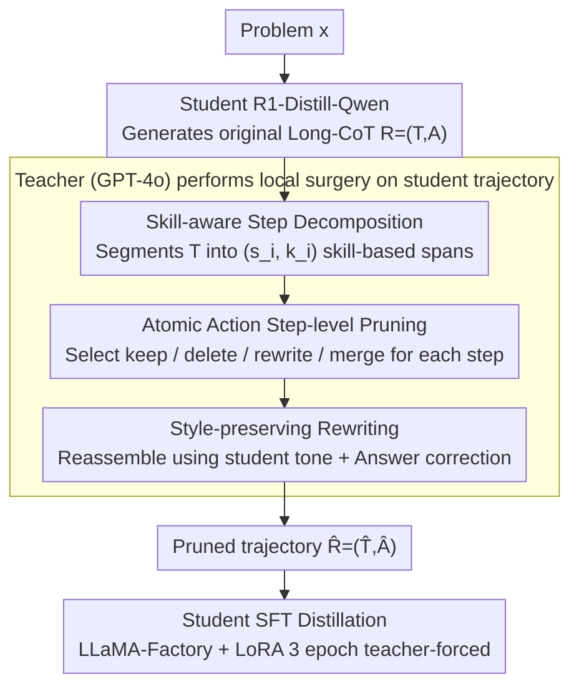

# DRP: Distilled Reasoning Pruning with Skill-aware Step Decomposition for Efficient Large Reasoning Models

**Conference**: ACL 2026  
**arXiv**: [2505.13975](https://arxiv.org/abs/2505.13975)  
**Code**: https://github.com/YuxuanJiang1/DRP (Available)  
**Area**: LLM Reasoning / Distillation / Efficient Inference  
**Keywords**: Long-CoT Pruning, Skill-aware Step Decomposition, Distillation, Overthinking, Short-CoT Teacher

## TL;DR
DRP allows a "Short-CoT teacher (GPT-4o)" to perform skill-level step decomposition and pruning/rewriting on the "Long-CoT student's (R1-Distill-Qwen)" own reasoning trajectories. By distilling these trajectories—which remove redundancy while preserving the student's speaking style—back into the student, DRP reduces the tokens of a 7B model on GSM8K from 917 to 328 (−64%) while increasing Pass@1 from 91.7% to 94.1%. It simultaneously reduces token counts and improves accuracy on OOD tasks like AIME/AMC/MATH500.

## Background & Motivation

**Background**: Large Reasoning Models (o1, DeepSeek-R1, and their distilled versions) have advanced the SOTA in mathematical and logical tasks via explicit Long-CoT. However, the cost is verbose output—a student model averages nearly a thousand tokens for a GSM8K problem and over 8k for AIME, causing inference costs and latency to increase significantly.

**Limitations of Prior Work**: Three main approaches for reducing token counts have drawbacks: (i) **prompt-based** (e.g., TALE) uses token budget constraints, which slightly drops performance on GSM8K and collapses on AIME; (ii) **SFT-based** (e.g., CoT-Valve) uses increasingly shorter CoTs for distillation, but accuracy regresses on MATH500/AMC; (iii) **RL-based** (e.g., ThinkPrune) uses length penalties for direct rewards, which works for 1.5B models but requires complex reward design and is unstable on OOD tasks.

**Key Challenge**: A **"learnability gap" exists between the student's Long-CoT style and the teacher's Short-CoT style**. Fine-tuning a student directly on 186-token concise answers distilled from GPT-4o fails because the student cannot learn how to compress its own unique reflection and backtracking structures. Consequently, accuracy on MATH500 drops to 88.6% and AIME performance decreases by 2 problems. In other words, both pruning and distillation paths can damage precision; the challenge is how to combine them effectively.

**Goal**: Maintain the student's original long-form reasoning structure while having a teacher prune only redundancies without rewriting the style, thereby achieving both token reduction and accuracy gains.

**Key Insight**: The authors observe that **student Long-CoTs are internal combinations of "functional skills"** (reading, equation formulation, arithmetic, comparison, verification). Therefore, a teacher can first segment the student's trajectory by skill and then perform "local surgeries" (keep / delete / rewrite / merge) on each segment rather than rewriting the entire trajectory.

**Core Idea**: Replace "teacher distillation" with "teacher skill-level pruning"—letting the teacher operate on the student's own trajectory to preserve the student's speaking style and structural backbone while removing redundant branches, then feeding this pruned trajectory back to the student via SFT.

## Method

### Overall Architecture
DRP addresses the "overthinking" in Large Reasoning Models—where students like R1-Distill-Qwen produce excessive tokens, increasing costs and latency. The Mechanism is unconventional: instead of having the teacher rewrite the answer, the teacher performs "local surgery" on the student's trajectory to prune redundancy without changing the style. The pipeline consists of three stages: First, generate original Long-CoTs $R=(T,A)$ using R1-Distill-Qwen-1.5B/7B on the GSM8K training set + PRM12K ($T$ is the reasoning chain in `<think>`, $A$ is the answer). Second, pass $T$ to the teacher (GPT-4o) for skill-aware step decomposition, step-level pruning, and stylistic rewriting, correcting the answer if necessary to produce the pruned version $\hat{R}=(\hat{T},\hat{A})$. Finally, use $(x,\hat{R})$ as training pairs for 3-epoch teacher-forced SFT using LLaMA-Factory + LoRA.

### Key Designs

**1. Skill-aware Step Decomposition: Segment by "functional skill" before pruning**
To judge if a step is redundant, the reasoning chain must be segmented into semantically coherent steps. Simple splits by periods or `\n\n` often cut through the middle of a logic unit. DRP has the teacher decompose $T$ into $\{(s_1,k_1),\dots,(s_m,k_m)\}$, where each $s_i$ is a token span and $k_i$ is a functional skill label (e.g., "Reading given quantity", "Algebraic representation", "Arithmetic", "Comparison"). Labeling "what it is doing" makes boundaries stable and semantics cohesive, allowing for consistent redundancy judgment. Empirical results (Tab.2) show that skill decomposition segments GSM8K into 12.6 steps on average compared to 8.3 via default splitting, yet leads to higher accuracy and fewer tokens on AMC, proving that granular, labeled segmentation is a better foundation for pruning.

**2. Atomic Action Step-level Pruning: Keep/delete/rewrite/merge for each segment**
After decomposition, the teacher selects an atomic action for each $(s_i,k_i)$ to produce $\hat{s}_i$: **Keep** (necessary and concise), **Delete** (redundant verbosity or backtracking), **Rewrite** (retain core logic with shorter phrasing), or **Merge** (combine adjacent operations). The preserved steps $\{\hat{s}_1,\dots,\hat{s}_{m'}\}$ are reassembled into $\hat{T}$ and checked for consistency with $A$, producing $\hat{A}$ if necessary. This addressed the pain point that "shorter is not always better": directly distilling 186-token answers from GPT-4o leads to poor OOD performance (Tab.4). Retaining the "long-chain + reflection" skeleton ensures the pruned trace remains learnable and transferable.

**3. Style-preserving Rewriting: Reassembling using student tone**
When reassembling pruned steps into a fluid text, teachers often inadvertently adopt their own concise mathematical style, effectively overwriting the student's reasoning style. DRP explicitly instructs the teacher to "preserve the tone and speaking style of the student model." This is the fundamental difference between DRP and direct distillation: the latter replaces the reasoning style entirely, while the former only removes redundancy. The Ours central argument is that effective training CoTs should be both informationally sufficient and structurally consistent with the student's own reasoning process.

### Loss & Training
- **Loss**: Standard NLL, $\mathcal{L}_{\text{SFT}} = -\sum_{i=1}^n \log P_\theta(y_i \mid x, y_{<i})$, where $y$ represents all tokens in $\hat{R} = (\hat{T}, \hat{A})$.
- **Training Data**: GSM8K training set + PRM12K, all pruned by the teacher.
- **Student Model**: R1-Distill-Qwen-1.5B / 7B.
- **Teacher Model**: GPT-4o (default), with Gemini 2.0 Flash / ChatGPT / DeepSeek-V3 for ablation.
- **Training Setup**: LLaMA-Factory + LoRA, 3 epochs, cosine LR; inference via vLLM with a 131,072 max length.
- **Evaluation**: lm-evaluation-harness for zero-shot, Pass@1 averaged over 5 runs; token counts measured by Qwen tokenizer with a 12k cutoff to exclude degenerate loops.

## Key Experimental Results

### Main Results
Tab.1: Comparison of DRP with three baselines (TALE prompt, CoT-Valve SFT, ThinkPrune RL) on R1-Distill-Qwen 7B/1.5B across 4 math benchmarks:

| Model | Method | GSM8K (Acc / Tok) | MATH500 OOD | AIME24 OOD | AMC OOD |
|------|------|-------------------|-------------|------------|---------|
| 7B Base | — | 91.7% / 917 | 92.4% / 2486 | 15/30 / 8674 | 31/40 / 4845 |
| 7B | +TALE | 91.0% / 522 | 91.6% / 2530 | 10/30 / 8602 | 31/40 / 3998 |
| 7B | +CoT-Valve | 90.8% / 364 | 89.4% / 1975 | 13/30 / 6315 | 30/40 / 3157 |
| 7B | **+DRP** | **94.1% / 328 (−64%)** | **93.0% / 1781 (−28%)** | **15/30 / 4966 (−43%)** | **33/40 / 3258 (−33%)** |
| 1.5B Base | — | 70.7% / 1443 | 80.4% / 3276 | 6/30 / 10484 | 23/40 / 6516 |
| 1.5B | +ThinkPrune | 80.0% / 712 | 79.2% / 2006 | 9/30 / 5745 | 25/40 / 3291 |
| 1.5B | **+DRP** | **83.4% / 721 (−50%)** | **82.0% / 2122 (−35%)** | **10/30 / 6135 (−42%)** | **27/40 / 3657 (−44%)** |

DRP is the only method to achieve simultaneous token reduction and accuracy Gain across all 4 benchmarks. Specifically, the 1.5B student gained +12.7 percentage points on GSM8K.

### Ablation Study
RQ1 (Tab.2) Skill-aware vs. default vs. no decomposition (7B student):

| Config | GSM8K (Acc / Tok) | MATH500 | AIME24 | AMC |
|------|-------------------|---------|--------|-----|
| 7B base | 91.7% / 917 | 92.4% / 2486 | 15/30 / 8674 | 31/40 / 4845 |
| No decomposing | 91.0% / 434 | 88.6% / 2102 | 13/30 / 6201 | 29/40 / 4028 |
| Default split | 92.7% / 350 | 92.0% / 1905 | 14/30 / 4678 | 31/40 / 4975 |
| **DRP (skill)** | **94.1% / 328** | **93.0% / 1781** | **15/30 / 4966** | **33/40 / 3258** |

RQ2 (Tab.4) DRP vs. Direct GPT-4o Distillation:

| Config | GSM8K | MATH500 | AIME24 | AMC |
|------|-------|---------|--------|-----|
| 7B base | 91.7% / 917 | 92.4% / 2486 | 15/30 / 8674 | 31/40 / 4845 |
| Distill (GPT-4o short, ~186 tok avg) | 90.7% / 425 | 88.6% / 2152 | 13/30 / 6417 | 28/40 / 4279 |
| **DRP (~330 tok avg)** | **94.1% / 328** | **93.0% / 1781** | **15/30 / 4966** | **33/40 / 3258** |

### Key Findings
- **Structure > Length**: Distilling 186-token concise answers reduced GSM8K tokens but hurt OOD accuracy. DRP, while slightly longer (~330 tokens), improved accuracy, validating that "preserving the native skeleton" is more important than "minimizing length."
- **Greater Benefits for Small Models**: The 1.5B student improved by +12.7 pts on GSM8K and solved 4 more problems on AIME/AMC. DRP is particularly effective for small models suffering from capacity-induced overthinking.
- **Skill Decomposition is Essential**: Pruning without decomposition led to performance drops (MATH500 dropped to 88.6%). Granularity and functional labeling together determine pruning quality.
- **Teacher Insensitivity**: All four tested teachers provided gains, with GPT-4o performing best in token compression.
- **Elimination of the Long Tail**: DRP removed the secondary peak in token distribution (degenerate loops) on AMC, proving it improves reasoning stability.

## Highlights & Insights
- **"Teacher prunes, teacher doesn't teach"**: Traditional distillation involves the teacher rewriting the answer, which students fail to replicate. DRP's local editing preserves learnability by ignoring the learnability gap.
- **Skill labels enable fine-grained operations**: Skill-aware segmentation transforms pruning into a traceable operation, a trick transferable to other Long-CoT editing or auditing tasks.
- **Evidence against "shorter is better"**: DRP identifies a "sweet spot" at 380 tokens, showing that over-compression damages OOD performance.
- **Quantifying the degenerate loop tail**: Using a 12k cutoff to quantify loop samples shows that DRP essentially eliminates the probability of model stall, which is critical for production deployment.

## Limitations & Future Work
- **Student Coverage**: Only validated on R1-Distill-Qwen 1.5B/7B; benefits for larger models (14B/32B or Llama-70B) are uncertain.
- **Closed-source Teacher Dependency**: Generating large-scale training data with GPT-4o is expensive.
- **Narrow Task Range**: Limited to mathematics; applicability to code, scientific reasoning, or agent planning requires further validation.
- **No RL Integration**: DRP is currently pure SFT. Combining it with RL methods (e.g., using DRP as a warm-start for GRPO) is a promising future direction.
- **No Cost-benefit Analysis**: Missing a curve comparing teacher API costs against student accuracy gains.

## Related Work & Insights
- **vs. CoT-Valve (Ma et al. 2025)**: CoT-Valve uses rounds of SFT on increasingly shorter CoTs, which hurts OOD precision. DRP's skill-aware editing replaces simple length sweeps.
- **vs. TALE (Han et al. 2024)**: TALE uses zero-shot token budgeting, whereas DRP modifies the training distribution for more robust results.
- **vs. ThinkPrune (Hou et al. 2025)**: ThinkPrune uses RL for 1.5B models; DRP provides a lightweight SFT alternative with even higher accuracy gains (+12.7 vs +9.3 on GSM8K).
- **Insight**: Local editing by a teacher can be extended to code (preserving student logic while pruning redundant branches) and agent traces (preserving action sequences while pruning failed backtracking).

## Rating
- Novelty: ⭐⭐⭐⭐ "Teacher prunes, doesn't rewrite" is a fresh perspective in Long-CoT distillation.
- Experimental Thoroughness: ⭐⭐⭐ Good coverage of benchmarks and teachers, but lacks RL head-to-head and larger student sizes.
- Writing Quality: ⭐⭐⭐⭐ Clear visualization and strong argumentation regarding structure vs. length.
- Value: ⭐⭐⭐⭐ Practical and lightweight solution for the critical problem of LRM inference efficiency.

<!-- RELATED:START -->

<!-- RELATED:END -->

## Related Papers

- [\[ACL 2026\] Step-GRPO: Internalizing Dynamic Early Exit for Efficient Reasoning](step-grpo_internalizing_dynamic_early_exit_for_efficient_reasoning.md)
- [\[ACL 2026\] ReProbe: Efficient Test-Time Scaling of Multi-Step Reasoning by Probing Internal States of Large Language Models](reprobe_efficient_test-time_scaling_of_multi-step_reasoning_by_probing_internal_.md)
- [\[ACL 2026\] Stabilizing Efficient Reasoning with Step-Level Advantage Selection](stabilizing_efficient_reasoning_with_step-level_advantage_selection.md)
- [\[ACL 2025\] Safe: Enhancing Mathematical Reasoning in Large Language Models via Retrospective Step-aware Formal Verification](../../ACL2025/llm_reasoning/safe_math_reasoning.md)
- [\[ACL 2026\] Reliability-Aware Adaptive Self-Consistency for Efficient Sampling in LLM Reasoning](reliability-aware_adaptive_self-consistency_for_efficient_sampling_in_llm_reason.md)

<!-- RELATED:END -->
