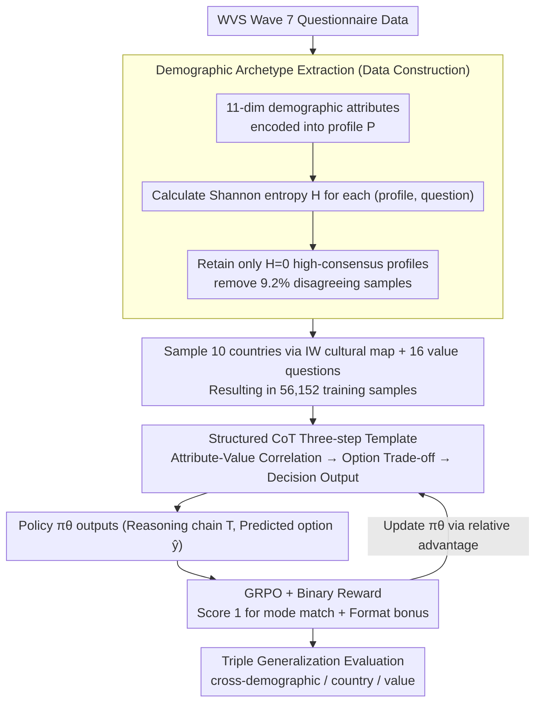

# DVMap: Fine-Grained Pluralistic Value Alignment via High-Consensus Demographic-Value Mapping

**Conference**: ACL 2026  
**arXiv**: [2605.14420](https://arxiv.org/abs/2605.14420)  
**Code**: https://github.com/EnlightenedAI/DVMap  
**Area**: LLM Alignment / Values  
**Keywords**: Pluralistic Value Alignment, Demographic Archetype, Structured CoT, GRPO, Cross-cultural Generalization

## TL;DR
DVMap shifts "pluralistic value alignment" from coarse-grained national labels to 11-dimensional demographic profiles. It filters 56,100 WVS data points through "high-consensus profiles" (Shannon entropy = 0), then trains Qwen3-8B using Structured CoT + GRPO (binary rewards). The model outperforms DeepSeek-v3.2 and matches GPT-4o in triple generalization tests across demographics, countries, and values.

## Background & Motivation

**Background**: Mainstream LLM value alignment relies either on RLHF (Bai et al. 2022, Rafailov 2023) or "prompt engineering + multi-cultural fine-tuning." Label hierarchies generally stop at the "country" level—for example, asking a model to "answer as a Japanese person." Benchmarks like WVS and GlobalOpinionQA also predominantly use country-level granularity for evaluation.

**Limitations of Prior Work**: Empirical analysis by the authors using WVS Wave 7 revealed two insights: (1) Within the same country, nearly half of the value-related questions have a Shannon entropy $> 1.0$, indicating significant intra-country heterogeneity; (2) Mean Decrease Impurity analysis using Random Forests shows that the contribution of "Religion / Income / Occupation" to value prediction generally **exceeds that of Country**. In other words, national labels are insufficient to characterize individual values and instead flatten important differences.

**Key Challenge**: Expressing "pluralistic values" requires fine granularity, but descending to the individual level lacks supervisory signals. Existing methods leave a gap between the "macro-country" and the "micro-individual."

**Goal**: To identify a **learnable and generalizable** intermediate granularity between the country and the individual—the "demographic archetype"—and address three sub-problems: (1) extracting a **high-consensus** subset from WVS; (2) enabling the model to explicitly reason through the "demographic attributes $\to$ value" chain; (3) accurately anchoring group distributions without compromising general capabilities.

**Key Insight**: It was observed that even within groups where demographic profiles match perfectly across 11 dimensions, 9.2% of value responses still exhibit internal disagreement—this portion is essentially noise. The remaining $H=0$ samples represent stable "archetypal responses."

**Core Idea**: Establish a "high-consensus demographic-value corpus" using entropy threshold filtering, externalize the implicit "attribute $\to$ value" mapping through Structured CoT, and anchor the distribution using the binary rewards of GRPO to "achieve more with less."

## Method

### Overall Architecture
The entire pipeline consists of three stages: (1) **Data Construction**—Starting from WVS Wave 7, archetypes are aggregated by 11-dimensional demographic attributes. Shannon entropy is calculated for each profile-question pair, retaining only $H=0$ samples. This is combined with sampling from 10 countries in the Inglehart-Welzel cultural map and 16 selected value questions, resulting in 56,152 training samples; (2) **Demographic Value Alignment Training**—Given a profile $P$, a question $Q$, and Structured CoT instructions $I_{cot}$, the policy $\pi_\theta$ outputs $(T,\hat y)\sim\pi_\theta(\cdot|P,Q,I_{cot})$. GRPO with a binary reward $r=\mathbb{I}(\hat y=y_i)+\beta r_{format}$ anchors the output distribution to the WVS ground truth; (3) **Triple Generalization Evaluation**—An additional 21,553 samples are constructed to cover cross-demographic (6,240), cross-country (7,973, including 8 unseen countries), and cross-value (7,340, including 7 unseen value questions) scenarios. The first two stages contain the three core designs: "Demographic Archetype Extraction" on the data side, and the synergy of the "Structured CoT Three-step Template" with "GRPO + Binary Reward" on the training side.

### Key Designs

**1. Demographic Archetype Extraction: Strict entropy = 0 filtering to isolate the "Archetype → Stable Value" subset**

Previous multi-cultural fine-tuning methods directly used "all responses from the same country" for training, which introduced intra-country heterogeneity noise into the supervisory signal. DVMap adopts a different aggregation: first, based on Bourdieu's social stratification, each WVS respondent is encoded into a profile $P$ using 11 dimensions (Country / Gender / Age / Marital / Parenthood / Income / Occupation / Work Nature / Education / Religion / Language). Approximately 32.8% of profiles feature multiple respondents. By calculating the Shannon entropy $H$ of responses for each $(P, Q)$ pair and **retaining only profile-value pairs with $H=0$ (perfect internal consensus)**, the 9.2% of "disagreement profiles" are removed. This ensures the model learns stable mode responses of archetypes rather than "average national opinions," removing label noise at the source. Ablations show this results in a 1.4% Accuracy Gain over majority voting.

**2. Structured CoT Three-step Template: Externalizing implicit sociological "Attribute → Value" correlations into supervised reasoning chains**

Clean data alone is insufficient; the model must learn *why* specific demographics choose certain values to avoid collapsing into simple look-up table behavior. However, unconstrained reasoning can lead to "logical hallucinations"—ablations show that adding CoT only at inference time to a base model actually dropped Accuracy by 0.8%. DVMap uses an instruction template $I_{cot}$ to hard-code reasoning into three fixed steps: (i) Demographic-Value Correlation Analysis, analyzing how attributes touch upon core interests or belief conflicts; (ii) Option Trade-off, evaluating each option's compatibility with the profile; (iii) Decision Output, placing the final choice within `<answer></answer>`. Crucially, this chain is bound to GRPO training, allowing reasonings to receive implicit supervision from RL signals and develop into stable "role-play + trade-off" patterns.

**3. GRPO + Minimalist Binary Reward: Anchoring the peak of the output distribution to the archetype mode**

Intuitively, values on Likert scales (Strongly Disagree $\leftrightarrow$ Strongly Agree) might suggest that continuous rewards based on distance provide "more information." DVMap takes the opposite approach, using the simplest binary reward:

$$r=\mathbb{I}(\hat y=y_i)+\beta r_{format}$$

A reward of 1 is given for hitting the target mode $y_i$, and 0 otherwise, plus a formatting bonus. The relative merits of options are handled by GRPO calculating Relative Advantage against a group baseline. The underlying assumption is that LLMs already encode natural semantic topologies like "Agree $\leftrightarrow$ Strongly Agree" during pre-training; thus, the token embedding space can naturally interpolate ordered distributions. Continuous rewards are not only unnecessary but may interfere with this existing topology. Ablations comparing this with Likert-adjusted soft rewards ($r=\alpha(1-|\hat y-y|/(L-1))+\beta r_{format}$) show binary rewards achieve 1.6% higher Accuracy and 0.013 lower WD.

### Loss & Training
GRPO is used with a learning rate of $5\times 10^{-6}$, temperature $T=0.7$, 8 rollouts per sample, and a global batch size of 64. Training is limited to 1 epoch to prevent overfitting. Hardware: 8×A100 80GB; Frameworks: VeRL + FSDP2 + Flash-Attention + bfloat16. Base models include Qwen3 (0.6B to 8B) and Llama-3.2-3B-Instruct. Metrics: Accuracy (Acc), Likert Consistency ($\text{LC}=1-\frac{1}{N}\sum\frac{|\hat y-y|}{K-1}$), and Wasserstein Distance ($\text{WD}=\sum_k|\text{CDF}_{pred}(k)-\text{CDF}_{real}(k)|$).

## Key Experimental Results

### Main Results
On the cross-demographic test set (non-overlapping profiles), Qwen3-8B-DVMap outperforms GPT-4o with only 8B parameters:

| Model | Parameters | Acc ↑ | LC ↑ | WD ↓ |
|------|---------|-------|------|------|
| Qwen3-14B | 14B | 46.2 | 83.5 | 0.1460 |
| Qwen3-next-80B-a3B | 80B (3B act) | 47.6 | 82.5 | 0.1449 |
| Llama-3.3-70B-Instruct | 70B | 46.4 | 83.3 | 0.1504 |
| DeepSeek-v3.2-exp | 671B (MoE) | 45.1 | 82.3 | 0.1342 |
| Claude-3.7-sonnet | – | 26.9 | 46.4 | 0.1503 |
| GPT-4o-mini | – | 46.3 | 82.4 | 0.1476 |
| GPT-4o | – | 48.5 | 83.8 | 0.1418 |
| **Qwen3-8B-DVMap** | **8B** | **48.6** | **83.9** | **0.1321** |

On cross-country tests (trained on 10 countries), the 0.6B/1.7B/4B/8B models saw Acc gains of +16.2 / +10.7 / +2.8 / +5.3 % across 8 unseen countries. Llama-3.2-3B also saw cross-demographic Acc rise from 36.2% to 49.0%, proving cross-architecture effectiveness.

### Ablation Study
Based on Qwen3-4B, three sets of ablations highlight the core designs:

| Dimension | Configuration | Acc % | LC % | WD |
|------|------|-------|------|-----|
| Data Filtering | Base | 44.3 | 82.2 | 0.158 |
| Data Filtering | Majority Voting ($H\ge 0$) | 46.5 | 83.1 | 0.149 |
| Data Filtering | **DVMap ($H=0$ Strict)** | **47.9** | **83.7** | **0.142** |
| Reasoning Strategy | Base + Inference CoT | 43.5 | 82.1 | 0.166 |
| Reasoning Strategy | Standard RL (Free reasoning) | 46.2 | 83.2 | 0.151 |
| Reasoning Strategy | **DVMap (Structured CoT + RL)** | **47.9** | **83.7** | **0.142** |
| Reward Function | Likert-adjusted soft reward | 46.3 | 83.4 | 0.155 |
| Reward Function | **DVMap (Binary Reward)** | **47.9** | **83.7** | **0.142** |

### Key Findings
- **Filtering is the strongest lever**: Strict $H=0$ filtering provides a 1.4% Acc gain over majority voting, showing that internally inconsistent samples are significant noise.
- **Structured CoT requires RL synergy**: Standard inference-time CoT causes regressions, implying that reasoning chains are only stable when shaped by RL signals. This provides direct evidence for "Training-time CoT" superiority.
- **Binary Reward > Likert Soft Reward**: Contrary to the intuition that denser rewards are better, minimizing reward complexity while leveraging GRPO's relative advantages and pre-trained semantic priors yields better results.
- **Learning Causality over Memorization**: Robustness tests involving "Income Reversal" show that DVMap's value flip rate in non-financial domains is significantly lower than the base model, suggesting it uses multi-dimensional identity reasoning rather than simple table look-ups.
- **Zero Alignment Tax**: Fluctuations on MMLU/ARC-E/GSM8K/HellaSwag are $<0.1\%$, while IFEval improved by +0.48%, proving GRPO + binary rewards do not damage general capabilities.

## Highlights & Insights
- **Re-framing "Value Alignment" as "Manifold Mapping"**: The authors explicitly target learning a "demographics $\to$ values" manifold mapping. Consequently, cross-country/value generalization serves as validation of manifold continuity.
- **High-ROI of Entropy-Zero Filtering**: The approach is simple but highly effective. Future pluralistic preference work can adopt this aggregative filtering strategy.
- **Simplicity in Reward Engineering**: By pushing back against the trend of complex preference rewards, the paper demonstrates that pre-trained semantic topologies act as an effective implicit prior.
- **Robustness Case Study**: For an archetype like "Widowed Russian Female," DVMap weighs "High Income" against "Emotional Shock + Russian Cultural Humility" to output "Rather Happy," whereas the base model flips purely on income to "Very Happy." This "intersectionality" behavior is a rare example of interpretable success in alignment.

## Limitations & Future Work
- WVS is a static snapshot and cannot reflect evolving values, making it lose relevance quickly for fast-changing topics like AI ethics.
- The 11-dimensional profiles are statistical abstractions capturing "sociological roles" rather than "psychological individuals," potentially distorting niche groups.
- Evaluations are discriminative (multiple-choice). The bridge from discrimination to generation—ensuring identity-specific tone and rhetoric in open-ended text—is not yet built.
- Future work could combine this with personalized alignment (Guan et al. 2025), using archetypes as priors and individual fine-tuning as posteriors in a "Hierarchical Bayesian" alignment approach.

## Related Work & Insights
- **vs CultureLLM / CulturePark (Li et al. 2024a/b)**: These works still utilize country-level labels. DVMap pushes granularity further through 11-dimensional attributes and entropy filtering.
- **vs Modular Pluralism (Feng et al. 2024)**: While they rely on multi-LLM collaboration, DVMap achieves archetype generalization within a single model, lowering deployment costs.
- **vs RLHF (Bai et al. 2022) / DPO (Rafailov 2023)**: Conventional RLHF learns "universal preferences," whereas this work uses GRPO to anchor a specific distribution.
- **Insight**: The "high-consensus subset + Structured CoT + minimalist reward" trio can be treated as a template for any "group behavior prediction" task (e.g., medical preferences, judicial sentencing, consumer decisions).

## Rating
- Novelty: ⭐⭐⭐⭐ High merit in pushing alignment to demographic archetypes and providing a triple generalization benchmark.
- Experimental Thoroughness: ⭐⭐⭐⭐⭐ Comprehensive coverage: triple generalization, cross-architecture, ablations, robustness, and general utility.
- Writing Quality: ⭐⭐⭐⭐ Smooth transition from empiricism to methodology; well-defined sociological background.
- Value: ⭐⭐⭐⭐⭐ Directly addresses "Western-centric bias" and provides a low-cost, replicable method for group-specific scenarios.

<!-- RELATED:START -->

## Related Papers

- [\[AAAI 2026\] Improving Value-based Process Verifier via Low-Cost Variance Reduction](../../AAAI2026/llm_reasoning/improving_value-based_process_verifier_via_low-cost_variance_reduction.md)
- [\[ACL 2026\] ToolPRM: Fine-Grained Inference Scaling of Structured Outputs for Function Calling](toolprm_fine-grained_inference_scaling_of_structured_outputs_for_function_callin.md)
- [\[NeurIPS 2025\] Value-Guided Search for Efficient Chain-of-Thought Reasoning](../../NeurIPS2025/llm_reasoning/value-guided_search_for_efficient_chain-of-thought_reasoning.md)
- [\[AAAI 2026\] Jupiter: Enhancing LLM Data Analysis Capabilities via Notebook and Inference-Time Value-Guided Search](../../AAAI2026/llm_reasoning/jupiter_enhancing_llm_data_analysis_capabilities_via_notebook_and_inference-time.md)
- [\[NeurIPS 2025\] Trajectory Bellman Residual Minimization: A Simple Value-Based Method for LLM Reasoning](../../NeurIPS2025/llm_reasoning/trajectory_bellman_residual_minimization_a_simple_value-based_method_for_llm_rea.md)

<!-- RELATED:END -->
