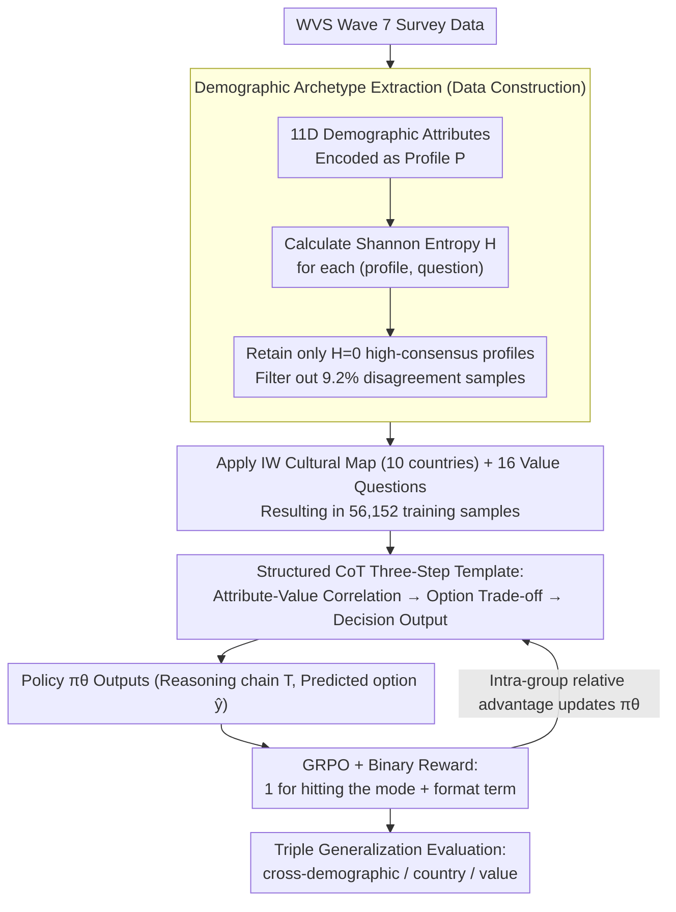

# DVMap: Fine-Grained Pluralistic Value Alignment via High-Consensus Demographic-Value Mapping

**Conference**: ACL 2026  
**arXiv**: [2605.14420](https://arxiv.org/abs/2605.14420)  
**Code**: https://github.com/EnlightenedAI/DVMap  
**Area**: LLM Alignment / Values  
**Keywords**: Pluralistic Value Alignment, Demographic Archetype, Structured CoT, GRPO, Cross-cultural Generalization

## TL;DR
DVMap shifts LLM "pluralistic value alignment" from coarse-grained national labels to 11-dimensional demographic attribute profiles. It filters 56,000 WVS data points by selecting "high-consensus profiles" (Shannon entropy $H=0$), then trains Qwen3-8B using Structured CoT + GRPO (binary rewards). The resulting model surpasses DeepSeek-v3.2 and matches GPT-4o in triple generalization tests across demographics, countries, and values.

## Background & Motivation

**Background**: Mainstream LLM value alignment typically follows RLHF (Bai et al. 2022, Rafailov 2023) or "prompt engineering + multi-cultural fine-tuning." Label hierarchies largely remain at the "Country" level—for example, prompting a model to "answer as a person from Japan." Benchmarks such as WVS and GlobalOpinionQA also predominantly use country-level granularity for evaluation.

**Limitations of Prior Work**: The authors conducted an empirical study using WVS Wave 7 and discovered two key points: (1) Within the same country, nearly half of the value-based questions exhibit Shannon entropy $> 1.0$, indicating significant intra-country heterogeneity; (2) Mean Decrease Impurity analysis using Random Forests shows that "Religion/Income/Occupation" generally contribute **more than Country** to value prediction. In other terms, national labels are insufficient to characterize individual values and instead flatten important differences.

**Key Challenge**: Expressing "pluralistic values" requires fine granularity, but moving down to the individual level results in a lack of supervised signals. Existing methods leave a vacuum between "macro-country" and "micro-individual" levels.

**Goal**: To identify a **learnable and generalizable** intermediate granularity between countries and individuals—the "demographic archetype"—and address three sub-problems: (1) extracting a **high-consensus** subset from WVS; (2) enabling the model to explicitly reason through the "demographic attributes $\to$ value" chain; (3) precisely anchoring group distributions without destroying general capabilities.

**Key Insight**: The authors observed that even in sample groups with perfectly matched demographic profiles (all 11 dimensions matching), 9.2% of value responses still show internal disagreement—this part is essentially noise. The remaining samples with $H=0$ represent stable "archetype responses."

**Core Idea**: Use entropy threshold filtering to establish a "high-consensus demographic-value corpus," then externalize the implicit "attribute $\to$ value" mapping via Structured CoT, and finally anchor the distribution using GRPO with binary rewards to achieve "simplicity over complexity."

## Method

### Overall Architecture
The pipeline consists of three main stages: (1) **Data Construction**: Starting from WVS Wave 7, responses are aggregated into archetypes based on 11-dimensional demographic attributes. Shannon entropy is calculated for each profile-question pair, retaining only samples with $H=0$. This is supplemented by sampling 10 countries from the Inglehart-Welzel cultural map and 16 value questions, resulting in 56,152 training samples. (2) **Demographic Value Alignment Training**: Given a profile $P$, a question $Q$, and a Structured CoT instruction $I_{cot}$, the policy $\pi_\theta$ outputs $(T,\hat y)\sim\pi_\theta(\cdot|P,Q,I_{cot})$. GRPO with a binary reward $r=\mathbb{I}(\hat y=y_i)+\beta r_{format}$ is used to anchor the output distribution to the WVS ground truth. (3) **Triple Generalization Evaluation**: An additional 21,553 samples are constructed to cover cross-demographic (6,240), cross-country (7,973, including 8 unseen countries), and cross-value (7,340, including 7 unseen value questions) scenarios. The first two stages contain the three core designs: demographic archetype extraction on the data side, and the synergy of "Structured CoT three-step template" and "GRPO + binary reward" on the training side—the former shapes reasoning, while the latter anchors the distribution.

### Key Designs

**1. Demographic Archetype Extraction: Filtering for Entropy = 0 to Isolate the "Archetype $\to$ Stable Value" Subset**

Previous multi-cultural fine-tuning methods directly used "responses from everyone in the same country" for training, which effectively injected intra-country heterogeneous noise into the supervision signal. DVMap changes the aggregation method: based on Bourdieu's social stratification, each WVS respondent is encoded into a profile $P$ using 11 attributes (Country, Gender, Age, Marital, Parenthood, Income, Occupation, Work Nature, Education, Religion, Language). Approximately 32.8% of profiles overlap across multiple people. For each $(P, Q)$ pair, the Shannon entropy $H$ of the responses is calculated, and **only profile-value pairs with $H=0$ (total internal consensus) are retained**. The approximately 9.2% of "disagreement profiles" are discarded. The remaining data does not represent "average opinion" but "stable modal responses of specific population archetypes," effectively clearing label noise at the source. Ablations show this results in a 1.4% Accuracy gain over majority voting, indicating this filtering is the strongest lever on the data side.

**2. Structured CoT Three-Step Template: Externalizing Implicit Sociological "Attribute $\to$ Value" Correlations**

Clean data alone is insufficient; the model must learn *why* a certain group chooses a specific value, otherwise it risks regressing to a simple lookup table. However, allowing free-form reasoning can lead to "logical hallucinations"—in ablation studies, adding CoT to the base model during inference actually decreased Accuracy by 0.8%. DVMap uses an instruction template $I_{cot}$ to hard-code reasoning into three fixed steps: (i) Demographic-Value Correlation Analysis, analyzing how the question touches the core interests or belief conflicts of the identity; (ii) Option Trade-off, evaluating each option's compatibility with the profile; (iii) Decision Output, placing the final option inside `<answer></answer>`. Crucially, this reasoning chain is not just added during inference but is bound to GRPO training, allowing intermediate reasoning to receive implicit supervision from RL signals and gradually shaping a stable "role-playing + option trade-off" pattern.

**3. GRPO + Minimalist Binary Reward: Using Precise Hit Signals to Anchor Distribution Peaks to Archetype Modes**

Intuitively, values are often measured on ordinal Likert scales (Strongly Disagree $\leftrightarrow$ Strongly Agree), suggesting that rewards should be continuously weighted based on distance. DVMap does the opposite, using the simplest binary reward:

$$r=\mathbb{I}(\hat y=y_i)+\beta r_{format}$$

A reward of 1 is given for hitting the target mode $y_i$, and 0 otherwise, plus a formatting term. The relative quality between options is left to GRPO to calculate as a Relative Advantage against the group baseline. The underlying assumption is that LLMs already encoded the natural semantic topology of "Agree $\leftrightarrow$ Strongly Agree" during pre-training; the token embedding space can already interpolate ordinal distributions. Continuous rewards are not only unnecessary but might interfere with this existing topology. Ablations comparing this with a Likert-adjusted soft reward $r=\alpha(1-|\hat y-y|/(L-1))+\beta r_{format}$ showed the binary reward achieved 1.6% higher Accuracy and 0.013 lower Wasserstein Distance (WD).

### Loss & Training
The GRPO learning rate is $5\times 10^{-6}$, temperature $T=0.7$, with 8 rollouts per sample and a global batch size of 64. The model is trained for only 1 epoch to prevent overfitting. Hardware used includes 8×A100 80GB, utilizing VeRL + FSDP2 + Flash-Attention + bfloat16. Base models include Qwen3 (0.6B to 8B) and Llama-3.2-3B-Instruct. Evaluation metrics include Exact Match Accuracy (Acc), Likert Consistency ($\text{LC}=1-\frac{1}{N}\sum\frac{|\hat y-y|}{K-1}$), and Wasserstein Distance ($\text{WD}=\sum_k|\text{CDF}_{pred}(k)-\text{CDF}_{real}(k)|$).

## Key Experimental Results

### Main Results
On the cross-demographic test set (non-overlapping profiles), Qwen3-8B-DVMap outperforms GPT-4o with only 8B parameters:

| Model | Parameters | Acc ↑ | LC ↑ | WD ↓ |
| :--- | :--- | :--- | :--- | :--- |
| Qwen3-14B | 14B | 46.2 | 83.5 | 0.1460 |
| Qwen3-next-80B-a3B | 80B (3B act) | 47.6 | 82.5 | 0.1449 |
| Llama-3.3-70B-Instruct | 70B | 46.4 | 83.3 | 0.1504 |
| DeepSeek-v3.2-exp | 671B (MoE) | 45.1 | 82.3 | 0.1342 |
| Claude-3.7-sonnet | – | 26.9 | 46.4 | 0.1503 |
| GPT-4o-mini | – | 46.3 | 82.4 | 0.1476 |
| GPT-4o | – | 48.5 | 83.8 | 0.1418 |
| **Qwen3-8B-DVMap** | **8B** | **48.6** | **83.9** | **0.1321** |

In cross-country tests where only 10 countries were used for training, the 0.6B to 8B models showed Acc gains of +16.2% to +5.3% across 8 unseen countries. Llama-3.2-3B also improved from 36.2% to 49.0% on cross-demographic tests, proving cross-architecture efficacy.

### Ablation Study
Based on Qwen3-4B, three sets of ablations highlight the importance of the core designs:

| Dimension | Configuration | Acc % | LC % | WD |
| :--- | :--- | :--- | :--- | :--- |
| Data Filtering | Base | 44.3 | 82.2 | 0.158 |
| Data Filtering | Majority Voting ($H \ge 0$) | 46.5 | 83.1 | 0.149 |
| Data Filtering | **DVMap (Strict $H=0$ Filtering)** | **47.9** | **83.7** | **0.142** |
| Reasoning | Base + Inference-time CoT | 43.5 | 82.1 | 0.166 |
| Reasoning | Standard RL (Free reasoning) | 46.2 | 83.2 | 0.151 |
| Reasoning | **DVMap (Structured CoT + RL)** | **47.9** | **83.7** | **0.142** |
| Reward Function | Likert-adjusted Soft Reward | 46.3 | 83.4 | 0.155 |
| Reward Function | **DVMap (Binary Reward)** | **47.9** | **83.7** | **0.142** |

### Key Findings
- **Filtering is the biggest data lever**: Strict $H=0$ filtering outperforms majority voting by 1.4% Accuracy, suggesting that "internally inconsistent samples" represent significant label noise.
- **Structured CoT must synergize with training**: Adding CoT only at inference time leads to performance drops, indicating that "thought chains" only become stable when shaped by RL signals.
- **Binary Reward > Likert Soft Reward**: Contrary to the intuition that finer-grained rewards are better, using GRPO's internal relative advantage and the pre-trained semantic topology allows for better performance with minimal reward complexity.
- **Learning Causality, Not Memory**: In robustness analyses where Income is flipped (while holding other attributes constant), the value flip rate for DVMap is significantly lower than the base model in non-financial domains, suggesting it uses multi-dimensional identity for judgment rather than just "looking up" the income field.
- **Zero Alignment Tax**: Fluctuations on MMLU/ARC-E/GSM8K/HellaSwag were $<0.1\%$, while IFEval improved by +0.48%, proving that GRPO + binary rewards do not damage general utility.

## Highlights & Insights
- **Revisiting "Value Alignment" as "Manifold Mapping"**: The authors explicitly define the goal as learning a "demographic $\to$ values manifold mapping," making cross-country/value generalization a validation of manifold continuity.
- **$H=0$ Filtering as a High-ROI Operation**: This simple idea provides immediate results. Future work on "group preference alignment" can adopt this aggregation and filtering template.
- **Reward Engineering through Simplicity**: By going against the trend of complex preference rewards, this work demonstrates that pre-trained semantic topologies can serve as effective implicit reward priors.
- **Robustness Case (Widowed Russian Female)**: DVMap balances "high income" against "emotional shock of widowhood + Russian cultural humility" to output "Rather happy," whereas the base model outputs "Very happy" simply because of the high income. This "intersectionality" is a rare case of explainable success in alignment research.

## Limitations & Future Work
- WVS is a static snapshot and cannot reflect the dynamic evolution of values over time, making it less effective for rapidly changing issues like AI ethics.
- The 11-dimensional profile is a sociological abstraction capturing roles rather than psychological individuals, which may still misrepresent niche groups with high internal variance.
- The evaluation is discriminative (multiple-choice) and does not measure whether the model can use identity-specific tone and rhetoric in open-ended generation.
- Future work could integrate this with personalized alignment (Guan et al. 2025), using archetypes as a prior and individual fine-tuning as a posterior in a "hierarchical Bayesian" alignment approach.

## Related Work & Insights
- **vs CultureLLM / CulturePark (Li et al. 2024a/b)**: These works still use country-level labels. DVMap pushes granularity down using 11-dimensional attributes and entropy filtering to avoid superficial "as-if" identity injection.
- **vs Modular Pluralism (Feng et al. 2024)**: They rely on multi-LLM collaboration; DVMap achieves archetype generalization within a single model, lowering deployment costs.
- **vs RLHF (Bai et al. 2022) / DPO (Rafailov 2023)**: Conventional RLHF learns "universal preferences"; Ours uses GRPO + binary rewards for group targets, redefining "alignment" as "distribution anchoring."
- **Insight**: The "high-consensus subset + Structured CoT + minimalist reward" triad can be a template for any "group behavior prediction" task (e.g., medical preferences, legal sentencing), provided the entropy threshold is used to find the "learnable archetype subset."

## Rating
- Novelty: ⭐⭐⭐⭐ Shifting alignment to demographic archetypes and providing a triple generalization benchmark is logically sound and well-grounded.
- Experimental Thoroughness: ⭐⭐⭐⭐⭐ Comprehensive coverage across triple generalization, cross-architecture tests, ablations, robustness, and general utility.
- Writing Quality: ⭐⭐⭐⭐ Clear progression from empirical evidence to method and evaluation; sociological background is well-integrated.
- Value: ⭐⭐⭐⭐⭐ Directly addresses the industry pain point of "Western-centric bias" with a low-cost, replicable method for other group-based scenarios.

<!-- RELATED:START -->

## Related Papers

- [\[AAAI 2026\] Improving Value-based Process Verifier via Low-Cost Variance Reduction](../../AAAI2026/llm_reasoning/improving_value-based_process_verifier_via_low-cost_variance_reduction.md)
- [\[ACL 2026\] ToolPRM: Fine-Grained Inference Scaling of Structured Outputs for Function Calling](toolprm_fine-grained_inference_scaling_of_structured_outputs_for_function_callin.md)
- [\[NeurIPS 2025\] Value-Guided Search for Efficient Chain-of-Thought Reasoning](../../NeurIPS2025/llm_reasoning/value-guided_search_for_efficient_chain-of-thought_reasoning.md)
- [\[ICLR 2026\] Fine-R1: Make Multi-modal LLMs Excel in Fine-Grained Visual Recognition by Chain-of-Thought Reasoning](../../ICLR2026/llm_reasoning/fine-r1_make_multi-modal_llms_excel_in_fine-grained_visual_recognition_by_chain-.md)
- [\[AAAI 2026\] Jupiter: Enhancing LLM Data Analysis Capabilities via Notebook and Inference-Time Value-Guided Search](../../AAAI2026/llm_reasoning/jupiter_enhancing_llm_data_analysis_capabilities_via_notebook_and_inference-time.md)

<!-- RELATED:END -->
