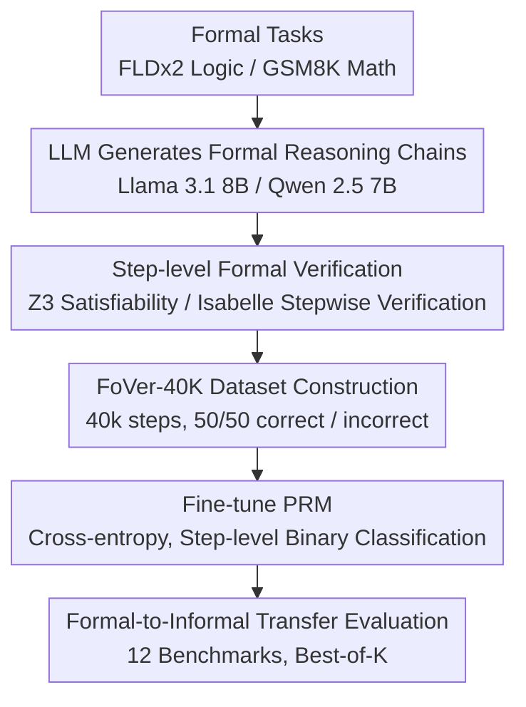

# Efficient PRM Training Data Synthesis via Formal Verification

**Conference**: ACL 2026 Findings  
**arXiv**: [2505.15960](https://arxiv.org/abs/2505.15960)  
**Code**: [GitHub](https://github.com/psunlpgroup/FoVer)  
**Area**: LLM Reasoning  
**Keywords**: PRM, Formal Verification, Step-level Labels, Z3, Isabelle

## TL;DR

This paper proposes FoVer, a framework that leverages formal verification tools (Z3 and Isabelle) to automatically annotate step-level correctness labels for reasoning chains in formal reasoning tasks. By generating the FoVer-40K training set and fine-tuning a PRM, the study demonstrates formal-to-informal transfer capabilities and cross-task generalization across 12 reasoning benchmarks.

## Background & Motivation

**Background**: Process Reward Models (PRMs) enhance LLM reasoning capabilities by providing process supervision for intermediate reasoning steps, becoming a critical direction for improving reasoning performance. PRMs are typically fine-tuned from LLMs to perform binary classification on the correctness of reasoning steps.

**Limitations of Prior Work**: (1) Manual annotation of step-level labels is extremely expensive and suffers from low inter-annotator agreement (Zheng et al. 2025 discarded 30% of annotated data); (2) Monte Carlo roll-outs (Math-Shepherd) require multiple LLM calls to label each step, which is computationally expensive and noisy—estimating intermediate step correctness based on final answer frequency is inherently imprecise; (3) Perturbation-based methods introduce unnatural human-induced errors; (4) Labeling with stronger LLMs amounts to capability distillation.

**Key Challenge**: PRMs require accurate step-level labels, yet existing annotation methods are either expensive (manual), imprecise (Monte Carlo), or unnatural (perturbation)—is there an annotation method that is both efficient and precise?

**Goal**: To utilize formal verification tools to provide efficient and precise step-level annotations for formal reasoning tasks, and to verify whether PRMs trained on formal tasks can transfer to informal natural language reasoning tasks.

**Key Insight**: Each step of formal reasoning tasks (logic reasoning, theorem proving) can be precisely verified for correctness using formal verification tools (e.g., SAT solver Z3, theorem prover Isabelle)—providing a zero-cost source of perfect labels.

**Core Idea**: Formal verification tools transform step-level annotation from "approximate estimation" to "deterministic judgment"—PRM capabilities obtained on formal tasks can transfer to informal reasoning tasks, achieving formal-to-informal transfer and cross-task generalization.

## Method

### Overall Architecture

A two-stage framework: Stage 1 involves the LLM generating formal reasoning steps (guided by few-shot formatting) $\rightarrow$ using formal verification tools to annotate the correctness of each step. Stage 2 involves fine-tuning an LLM using the annotated data for step-level binary classification (outputting "correct"/"incorrect") to obtain FoVer-PRM, which is then evaluated on informal natural language reasoning tasks.

### Key Designs

**1. Step-level Formal Verification: Turning step-level correctness from "approximate estimation" into "deterministic judgment"**

The training bottleneck for PRMs is step-level labels: manual labels are expensive with low consistency, while Monte Carlo methods inferring intermediate step labels from final answer frequency are inherently imprecise, and perturbation methods inject unnatural errors. The key insight of FoVer is that in formal reasoning tasks, every step can be precisely verified by tools; thus, it treats the verifier as a "zero-cost perfect annotator." For logical reasoning tasks (FLDx2), each step is a logical entailment; the verification method negates it and checks for satisfiability: unsatisfiability implies the step is correct. For example, to verify $(A \to B) \land A \to B$, it is converted to $(\neg A \lor B) \land A \land \neg B$ and passed to the SAT solver Z3; for theorem-proving math problems, Isabelle is used to verify each step of the proof. These tools provide not only solution-level verification but also step-level verification, yielding deterministic labels without noise or subjectivity.

**2. FoVer-40K Dataset Construction: Trading formal task verifiability for large-scale precise annotation**

With a perfect annotator, the remaining task is to select appropriate source tasks and scale the data. FoVer uses FLDx2 (formal logic, multi-step first-order logic derivation) and GSM8K-level math problems, allowing Llama 3.1 8B and Qwen 2.5 7B to generate reasoning chains, followed by stepwise labeling using Z3 and Isabelle. This results in a training set of 40,000 steps with a balanced distribution (50% correct / 50% incorrect). FLDx2 was chosen for its high diversity of derivation rules—logic covers the breadth of reasoning patterns, while GSM8K covers mathematical reasoning. Formal versions of both can be precisely verified, achieving both "diversity" and "label credibility."

**3. Formal-to-Informal Transfer Evaluation: Verifying if formally trained PRMs generalize to natural language reasoning**

The true utility of a PRM is improving natural language reasoning, so the transferability of formal training must be directly tested. FoVer evaluates FoVer-PRM on 12 benchmarks, categorized into two groups: 6 are informal variants of the training tasks (LogicNLI, AQuA-RAT, AIME, and other math/logic benchmarks) to examine near-transfer; the other 6 differ significantly from training tasks (HANS NLI, MMLU, BBH) to examine cross-task generalization. Evaluation follows the standard Best-of-K protocol. This design provides evidence that "step-level verification capability possesses task-agnostic universality."

### Loss & Training

Cross-entropy classification loss is used to fine-tune the LLM to output "correct" or "incorrect" for each reasoning step. The base models are Llama 3.1 8B and Qwen 2.5 7B.

## Key Experimental Results

### Main Results

**Best-of-7 Reasoning Performance (12 Benchmarks, 5 Task Categories)**

| PRM | Logic | Math | NLI | MMLU | BBH | Average |
|-----|------|------|-----|------|-----|------|
| Llama 3.1 8B (Baseline) | 48.9 | Baseline | Baseline | Baseline | Baseline | Baseline |
| **FoVer-Llama3.1-8B** | **50.6** | **Gain** | **Gain** | **Gain** | **Gain** | **Above Baseline** |
| Qwen 2.5 7B (Baseline) | Baseline | Baseline | Baseline | Baseline | Baseline | Baseline |
| **FoVer-Qwen2.5-7B** | **Gain** | **Gain** | **Gain** | **Gain** | **Gain** | **Above Baseline** |

### Ablation Study

**Comparison with Existing PRM Training Methods**

| Method | Annotation Cost | Label Quality | Average Performance |
|------|---------|---------|---------|
| Manual Annotation | Extremely High | High (but consistency issues) | High |
| Monte Carlo roll-outs | High (multiple LLM calls) | Medium (Noisy) | Medium-High |
| Perturbation Methods | Medium | Low (Unnatural errors) | Medium |
| **FoVer** | **Extremely Low (Automated)** | **Perfect (Deterministic)** | **Competitive** |

### Key Findings

- FoVer-PRM outperformed the non-fine-tuned baseline PRMs across all 5 task categories—formal training data indeed improves natural language reasoning.
- The most surprising gains occurred in NLI and BBH—tasks significantly different from the formal logic and math problems in the training data, demonstrating cross-task generalization.
- FoVer's labels are deterministically correct, whereas Monte Carlo roll-outs contain noise—even with a smaller data scale (40K steps), high-quality labels yield competitive performance.
- Formal-to-informal transfer is the core finding of this paper—step-level verification capability seems to possess task-agnostic universality.

## Highlights & Insights

- Using formal verification tools as a "perfect annotator" is an elegant idea—reducing annotation costs to near zero.
- The success of formal-to-informal transfer challenges the assumption that PRMs must be trained on in-distribution data.
- The modular design of the FoVer framework (replaceable verification tools) allows it to be extended to more formal tasks.

## Limitations & Future Work

- FoVer-40K only includes formal logic and GSM8K-level math, not covering more complex formal reasoning.
- Step-level formal verification requires LLMs to generate reasoning chains in formats compatible with the tools; invalid formats result in discarded generations.
- The possibility of combining FoVer with Monte Carlo roll-outs remains unexplored.
- Theoretical explanation for transfer capability is still insufficient—why does training on formal logic improve BBH performance?

## Related Work & Insights

- **vs Math-Shepherd**: Math-Shepherd uses Monte Carlo for label estimation, while FoVer uses formal verification for deterministic labels—quality is higher, but the scope is narrower.
- **vs PRM800K (Lightman 2024)**: Relies on manual annotation, whereas FoVer is fully automated with more precise labels.
- **vs Strong LLM Distillation**: Labeling with GPT-4 is essentially capability distillation; FoVer does not rely on any stronger model.

## Rating

- Novelty: ⭐⭐⭐⭐⭐ Using formal verification for step-level PRM annotation is a novel approach, and the formal-to-informal transfer discovery is significant.
- Experimental Thoroughness: ⭐⭐⭐⭐ Comprehensive evaluation across 12 benchmarks, although data scale is relatively small.
- Writing Quality: ⭐⭐⭐⭐⭐ Clear problem definition, with intuitive examples of formal verification.
- Value: ⭐⭐⭐⭐⭐ Provides an efficient and precise data generation solution for PRM training.

<!-- RELATED:START -->

## Related Papers

- [\[ICML 2026\] An Information-Theoretic Criterion for Efficient Data Synthesis](../../ICML2026/llm_reasoning/an_information-theoretic_criterion_for_efficient_data_synthesis.md)
- [\[ACL 2026\] MathAgent: Adversarial Evolution of Constraint Graphs for Mathematical Reasoning Data Synthesis](mathagent_adversarial_evolution_of_constraint_graphs_for_mathematical_reasoning_.md)
- [\[ACL 2026\] Self-Reinforcing Controllable Synthesis of Rare Relational Data via Bayesian Calibration](self-reinforcing_controllable_synthesis_of_rare_relational_data_via_bayesian_cal.md)
- [\[ICLR 2026\] DESIGNER: Design-Logic-Guided Multidisciplinary Data Synthesis for LLM Reasoning](../../ICLR2026/llm_reasoning/designer_design-logic-guided_multidisciplinary_data_synthesis_for_llm_reasoning.md)
- [\[ICLR 2026\] Understanding the Role of Training Data in Test-Time Scaling](../../ICLR2026/llm_reasoning/understanding_the_role_of_training_data_in_test-time_scaling.md)

<!-- RELATED:END -->
